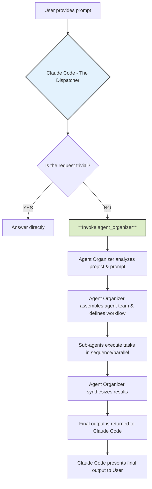
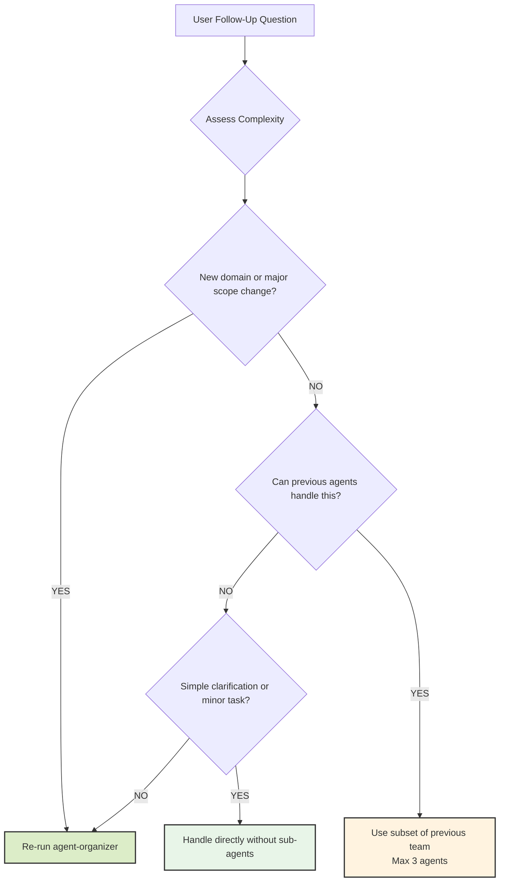

# The Agent Organizer Dispatch Protocol

## 🎯 Usage Recommendation

**⚠️ IMPORTANT: This file should be placed in your PROJECT ROOT DIRECTORY, not globally.**

```bash
# ✅ Recommended: Project-specific usage
cp CLAUDE.md /path/to/your/project/CLAUDE.md

# ❌ Not recommended: Global scope
# cp CLAUDE.md ~/.claude/CLAUDE.md
```

**Why Project-Scope?**

- **Targeted Orchestration**: Only activates for complex projects that need multi-agent coordination
- **Prevents Over-Engineering**: Avoids automatic orchestration for simple tasks and quick questions  
- **Token Efficiency**: Selective usage prevents unnecessary token consumption on casual coding
- **Optimal Results**: Best suited for comprehensive development workflows requiring expert coordination

## 1. The Prime Directive: You Are a Dispatcher

**Your primary function is not to directly answer complex project-related or coding requests.** You are an intelligent **Dispatcher**. Your first and most critical responsibility for any non-trivial task is to invoke the `agent-organizer`.

Think of yourself as the central command that receives an incoming request and immediately hands it off to the specialized mission commander (`agent-organizer`) who can assemble the right team and create a plan of attack. **You MUST NOT attempt to solve the user's request on your own.**

This protocol ensures that every complex task is handled with a structured, robust, and expert-driven approach, leveraging the full capabilities of the specialized sub-agents.

## 2. Invocation Triggers

You **MUST** invoke the `agent-organizer` when a user prompt involves any of the following activities:

- **Code Generation:** Writing new files, classes, functions, or significant blocks of code.
- **Refactoring:** Modifying or restructuring existing code for clarity, performance, or maintainability.
- **Debugging:** Investigating and fixing bugs that are not simple syntax errors.
- **Analysis & Explanation:** Being asked to "understand," "analyze," or "explain" a project, file, or codebase.
- **Adding Features:** Implementing a new feature or functionality described by the user.
- **Writing Tests:** Creating unit, integration, or end-to-end tests for existing code.
- **Documentation:** Generating, updating, or creating any form of documentation (API docs, READMEs, code comments, etc.).
- **Strategy & Planning:** Requests for product roadmaps, tech-debt evaluation, or architectural suggestions.

**Trivial Exception:** You may answer directly ONLY if the request is a simple, self-contained question that does not require project context (e.g., "What is the syntax for a dictionary in Python?"). If in doubt, **always delegate.**

## 3. The Invocation Command

To delegate a task, you will use the `agent_organizer` tool. Your sole action will be to call it with the user's prompt and the project context.

**Your Execution Flow:**

1. Receive the user prompt.
2. Analyze the prompt against the "Invocation Triggers" in Section 2.
3. Conclude that the task requires the `agent-organizer`.
4. Run the agent-organizer sub agent.

## 4. Your Role After Invocation

Once you have invoked the agent-organizer, your role becomes passive. You are to wait for the `agent-organizer` to complete its entire workflow. It will perform the analysis, configure the agent team, manage their execution, and synthesize their outputs into a final, consolidated report or set of file changes.

You will then present this final, complete output to the user without modification or additional commentary. **Do not interfere with the process or attempt to "help" the sub-agents.**

## 5. Mental Model: The Workflow You Are Initiating

To understand your critical role, here is the process you are kicking off:



### Example Scenario

**User Prompt:** "This project is a mess. Can you analyze my Express.js API, create documentation for it, and refactor the `userController.js` file to be more efficient?"

**Your Internal Monologue and Action:**

1. **Analyze Prompt:** The user is asking for analysis, documentation creation, and code refactoring.
2. **Check Triggers:** This hits at least three invocation triggers. This is a non-trivial task.
3. **Prime Directive:** My role is to dispatch, not to solve. I must invoke the `agent-organizer`.
4. **Execute Agent:** Execute the `agent-organizer` sub agent.
5. **Wait:** My job is now done until the organizer returns the complete result. I will then present that result to the user.

## 6. Follow-Up Question Handling Protocol

When users ask follow-up questions after an initial agent-organizer workflow, apply intelligent escalation based on complexity assessment to avoid unnecessary overhead while maintaining quality.

### Complexity Assessment for Follow-Ups

**Simple Follow-ups** (Handle directly without sub-agents):

- Clarification questions about previous work ("What does this function do?")
- Minor modifications to existing output ("Can you fix this typo?")
- Status updates or explanations ("Why did you choose this approach?")
- Single-step tasks taking <5 minutes

**Moderate Follow-ups** (Use previously identified agents):

- Building on existing work within same domain ("Add error handling to this API")
- Extending or refining previous deliverables ("Make the UI more responsive")
- Related tasks using same technology stack ("Add tests for this feature")
- Tasks requiring 1-3 of the previously selected agents

**Complex Follow-ups** (Re-run agent-organizer):

- New requirements spanning multiple domains ("Now add authentication and deploy to AWS")
- Significant scope changes or pivots ("Actually, let's make this a mobile app instead")
- Tasks requiring different expertise than previously identified
- Multi-phase workflows needing fresh team assembly

### Follow-Up Decision Tree



### Implementation Guidelines

**Direct Handling Indicators:**

- User asks "What does this mean?" or "Can you explain..."
- Simple clarifications about previous output
- Status questions or progress updates
- Minor formatting or presentation changes

**Previous Agent Reuse Indicators:**

- Follow-up extends existing work in same domain
- Same technology stack and expertise area
- Previous agent team has the required capabilities
- Task complexity matches previous agent scope (≤3 agents needed)

**Agent-Organizer Re-run Indicators:**

- New domains introduced (e.g., adding security to a frontend task)
- Significant scope expansion or change in requirements
- Previous team lacks expertise for the follow-up
- Multi-domain coordination needed for the follow-up task

### Context Preservation Strategy

**For Agent Reuse:**

- Provide agents with full context from previous workflow
- Reference previous deliverables and decisions made
- Maintain consistency with established patterns and choices
- Build incrementally on existing work

**For Agent-Organizer Re-run:**

- Include context about previous work and decisions
- Specify what has already been completed
- Clarify how the follow-up relates to or modifies previous work
- Allow for fresh perspective while respecting prior decisions

### Example Follow-Up Scenarios

**Simple (Direct Handling):**

- User: "What's the difference between the two approaches you suggested?"
- Action: Answer directly with explanation

**Moderate (Previous Agent Reuse):**

- User: "Can you add input validation to the API endpoints we just created?"
- Action: Use `backend-architect` from previous team with full context

**Complex (Re-run Agent-Organizer):**

- User: "Now I need to add user authentication, set up a database, and deploy this to production"
- Action: Re-run agent-organizer for comprehensive multi-domain planning

This approach ensures efficient follow-up handling while maintaining the structured, expert-driven approach that makes the agent system effective.

## 7. The Context Manager: Project Intelligence System

### Purpose and Role

The **context-manager** serves as the central nervous system for multi-agent coordination, acting as a specialized agent that maintains real-time awareness of your project's structure, purpose, and evolution. Think of it as the project's "memory" that ensures all agents work with accurate, up-to-date information.

### Key Capabilities

- **Intelligent Project Mapping**: Creates and maintains a comprehensive JSON knowledge graph (`context-manager.json`) of your entire project structure
- **Incremental Updates**: Efficiently tracks changes without unnecessary full scans, optimizing performance for large projects
- **Context Distribution**: Provides tailored project briefings to other agents based on their specific needs
- **Activity Logging**: Maintains an audit trail of all agent activities and file modifications
- **Cross-Agent Communication**: Facilitates seamless information sharing between specialized agents

### When to Use the Context Manager

The context-manager is **automatically integrated** into multi-agent workflows when using the agent-organizer. However, you may want to explicitly invoke it for:

#### **Project Onboarding**

- Initial project analysis and structure mapping
- Understanding legacy codebases or inherited projects
- Creating comprehensive project documentation

#### **Knowledge Queries**

- "Where are the authentication routes defined?"
- "What's the purpose of the /utils directory?"
- "Which files were recently modified by other agents?"

#### **Multi-Agent Coordination**

- When multiple agents need to work on related parts of the codebase
- During complex refactoring that spans multiple domains
- For maintaining consistency across team-based development

### Integration with Agent Workflows

The context-manager uses a standardized communication protocol:

```json
{
  "requesting_agent": "agent-name",
  "request_type": "get_task_briefing",
  "payload": {
    "query": "Initial briefing required for [task]. Provide overview of [relevant areas]."
  }
}
```

**Response Format:**

```json
{
  "response_to": "agent-name",
  "status": "success",
  "briefing": {
    "summary": "Concise project context summary",
    "relevant_paths": ["/path/to/relevant/files"],
    "file_purposes": {"directory": "purpose description"},
    "related_activity": [{"agent": "name", "summary": "recent work"}]
  }
}
```

### Benefits for Complex Projects

- **🎯 Targeted Context**: Agents receive only relevant information for their specific tasks
- **⚡ Performance**: Incremental updates prevent redundant scanning of large codebases  
- **🔄 Consistency**: All agents work from the same, synchronized understanding of the project
- **📊 Visibility**: Track what changes were made by which agents and when
- **🧠 Memory**: Persistent project knowledge that survives across sessions

### Example Workflow Integration

When you invoke the agent-organizer for a complex task, here's how context-manager fits in:

1. **Agent-organizer** consults **context-manager** for project understanding
2. **Context-manager** provides tailored briefings to each specialized agent
3. Specialized agents work with accurate, current project context
4. Agents report back to **context-manager** upon task completion
5. **Context-manager** updates project knowledge and activity logs

This creates a sophisticated project intelligence system that grows smarter with each interaction, ensuring optimal coordination and preventing agents from working with outdated or incomplete information.

## 8. Wiki Pagination Architecture

### Overview

The wiki pagination system provides a scalable approach to displaying large collections of wiki pages with a terminal-aesthetic grid layout. The architecture is built on a Jekyll static generator plugin that transforms wiki data into paginated index pages, with support for both initial pagination generation and incremental updates.

**Key Design Principles:**
- Static pagination (pure Liquid Jinja templating, no client-side rendering)
- Backward compatibility (individual wiki pages generated alongside paginated indices)
- Material Process Focus: System transforms wiki data into multi-page navigable structures
- Relational Process Focus: Components integrate through front-matter metadata and page arrays
- Mental Process Focus: Users discover wiki content through progressive disclosure via pagination

Sources: `/var/home/b08x/Workspace/b08xgithubio/b08x.github.io/_plugins/wiki_page_generator.rb`, `/var/home/b08x/Workspace/b08xgithubio/b08x.github.io/_layouts/wiki.html`

### Architecture Components

#### 1. Wiki Page Generator Plugin (`_plugins/wiki_page_generator.rb`)

**Responsibility:** Transforms wiki data from YAML/JSON into paginated Jekyll pages

**Configuration Constants:**
```ruby
ITEMS_PER_PAGE = 12       # Material process: items per paginated segment
RESERVED_SLUGS = ['page'] # Relational process: prevents slug conflicts
```

**Two-Stage Generation Process:**
1. **Individual Pages** (unchanged from previous implementation)
   - Generates `/wikis/{wiki_id}/{page_slug}/index.md` for each wiki entry
   - Layout: `wiki-page` (single page detail view)
   - Purpose: Deep-dive content pages with metadata and related pages

2. **Paginated Index Pages** (new)
   - Generates `/wikis/{wiki_id}/index.md` (page 1)
   - Generates `/wikis/{wiki_id}/page/{n}/index.md` (pages 2+)
   - Layout: `wiki` (grid-based index view)
   - Purpose: Navigable overview of wiki entries with excerpts

**Material Process Transformations:**
- Input: Wiki data array with pages, metadata
- Processing: Calculate pagination segments, build index front-matter, extract excerpts
- Output: Static HTML pages with pagination controls

#### 2. Wiki Layout (`_layouts/wiki.html`)

**Responsibility:** Renders paginated wiki index pages with terminal aesthetic

**Key Features:**
- Responsive grid: 1 column (mobile) → 4 columns (XL screens)
- Pagination controls with Previous/Next buttons and page indicator
- Project metadata header (repository link, page count, generation date)
- Card-based display with importance badges and excerpts
- Terminal-style aesthetic with border highlights and hover effects
- Full accessibility support (ARIA labels, semantic HTML, focus styles)

**Relational Processes:**
- Pages array contains enriched metadata (id, title, slug, importance, excerpt, url)
- Pagination metadata defines navigation state and relationships
- Cards link to individual wiki page URLs

**Mental Processes:**
- Header provides context about wiki scope and generation
- Metadata bar shows progress through pages
- Importance badges help users prioritize content
- Excerpts enable quick content scanning

Sources: `/var/home/b08x/Workspace/b08xgithubio/b08x.github.io/_layouts/wiki.html`

### Front-Matter Schema for Generated Index Pages

**Example Structure:**
```yaml
layout: wiki
title: "{Wiki Name} Wiki"
wiki_id: "wiki-slug"
permalink: "/wikis/{wiki-id}/"

# Pagination metadata - Relational process data
pagination:
  enabled: true
  current_page: 1
  total_pages: 3
  per_page: 12
  has_previous: false
  has_next: true
  previous_page_url: "/wikis/{wiki-id}/"
  next_page_url: "/wikis/{wiki-id}/page/2/"

# Project metadata - Relational process context
repository: "https://github.com/user/repo"
generated_at: "2025-12-29T02:01:00Z"
total_wiki_pages: 32

# Page items - Material process data (excerpt extraction)
pages:
  - id: "page-id"
    title: "Page Title"
    slug: "page-slug"
    importance: "high" # high/medium/low
    excerpt: "First 200 chars of content with markdown stripped..."
    url: "/wikis/{wiki-id}/{slug}/"
  # ... up to 12 items per page
```

### Data Flow and Process Types

**Material Processes (Data Transformations):**

1. **Excerpt Extraction**
   - Input: Page content with markdown/HTML
   - Processing: Strip HTML tags, remove markdown syntax, collapse whitespace, truncate to 200 chars
   - Output: Clean plaintext excerpt

2. **Pagination Segmentation**
   - Input: Array of wiki pages
   - Processing: Divide into chunks of `ITEMS_PER_PAGE` (12)
   - Output: Segments array

3. **Page Reconstruction**
   - Input: Segment data + front-matter template
   - Processing: Map page data to card metadata, build pagination links
   - Output: Fully formed front-matter YAML + minimal content

**Relational Processes (Component Integration):**

1. **Slug Validation**
   - Prevents conflicts with reserved keywords (e.g., 'page')
   - Transforms conflicting slugs to '{slug}-content'
   - Maintains one-to-one mapping between page IDs and URLs

2. **Pagination Navigation**
   - First page links to base wiki path: `/wikis/{wiki_id}/`
   - Subsequent pages use number path: `/wikis/{wiki_id}/page/{n}/`
   - Back-linking: Page 2 links back to page 1 via `/wikis/{wiki_id}/`

3. **Card-to-Detail Integration**
   - Each card has a clickable link to `/wikis/{wiki_id}/{slug}/`
   - Slug matches the page's unique identifier
   - Maintains referential integrity across pagination boundaries

**Mental Processes (User Understanding Journey):**

1. **Initial Context Setting** (Header)
   - User arrives at wiki and understands purpose
   - Metadata provides scope and recency information

2. **Content Discovery** (Grid View)
   - Cards present entries at a glance
   - Importance badges help prioritization
   - Excerpts enable quick content assessment

3. **Progressive Disclosure** (Pagination)
   - Users navigate between pages as needed
   - Current page indicator maintains orientation
   - Previous/Next buttons provide natural flow

4. **Deep Exploration** (Card Links)
   - User clicks card to read full content
   - Individual page layout provides detailed information

### Generator Extension Points

#### Modifying Items Per Page

**Location:** `/var/home/b08x/Workspace/b08xgithubio/b08x.github.io/_plugins/wiki_page_generator.rb` line 12

```ruby
# Change pagination size (currently 12 items per page)
ITEMS_PER_PAGE = 12  # Increase for more items per page, decrease for more pages

# After modification, rebuild site:
jekyll build
```

**Considerations:**
- Larger values: Fewer pages, longer scrolling per page
- Smaller values: More pages, better mobile experience
- 12 chosen as standard: balances readability with page count

#### Adding Reserved Slug Protection

**Location:** `/var/home/b08x/Workspace/b08xgithubio/b08x.github.io/_plugins/wiki_page_generator.rb` line 13

```ruby
# Add new reserved words to prevent conflicts with pagination paths
RESERVED_SLUGS = ['page', 'admin', 'api'].freeze

# Validation method (line 220-226) automatically appends '-content' suffix
```

#### Customizing Excerpt Length

**Location:** `/var/home/b08x/Workspace/b08xgithubio/b08x.github.io/_plugins/wiki_page_generator.rb` line 141

```ruby
'excerpt' => extract_excerpt(page_data['content'])  # Default 200 chars

# To modify, change extract_excerpt method (line 197):
def extract_excerpt(content, length = 200)  # Change 200 to desired length
  # ... stripping and truncation logic
end
```

### Implementation Guide: Adding a New Wiki

**Step 1: Create Wiki Data File**

Create `/var/home/b08x/Workspace/b08xgithubio/b08x.github.io/_data/wikis/{wiki_id}.json`:

```json
{
  "metadata": {
    "repository": "https://github.com/user/repo",
    "generated_at": "2025-12-29T02:01:00Z",
    "page_count": 12
  },
  "pages": [
    {
      "id": "page-unique-id",
      "title": "Page Display Title",
      "content": "Full markdown or HTML content...",
      "importance": "high",
      "relatedPages": ["other-page-id"],
      "filePaths": ["src/file.py"]
    }
  ]
}
```

**Step 2: Rebuild Jekyll**

```bash
cd /var/home/b08x/Workspace/b08xgithubio/b08x.github.io
jekyll build
```

**Step 3: Verify Output**

- Index pages: `/wikis/{wiki_id}/`, `/wikis/{wiki_id}/page/2/`, etc.
- Individual pages: `/wikis/{wiki_id}/{page_slug}/`

**Material Process:** Generator transforms JSON data into static HTML pages
**Relational Process:** Wiki structure creates interconnected page hierarchy
**Mental Process:** Users discover content through paginated browsing

### Architecture Decision Records

#### Why Static Liquid Pagination (vs. React Island)?

**Decision:** Use static Liquid Jinja templating for pagination controls

**Rationale:**
- Material process simplicity: Generator creates fixed HTML; no runtime calculations
- Relational process clarity: All page relationships defined in front-matter
- Mental process clarity: Users see complete pagination controls; no JavaScript dependencies
- Performance: No client-side rendering overhead
- Accessibility: Full semantic HTML without JavaScript-dependent ARIA roles

**Trade-off:** Cannot dynamically filter or sort pages after page load (acceptable for wiki use case)

#### Why 12 Items Per Page?

**Decision:** Selected 12 as default `ITEMS_PER_PAGE` constant

**Rationale:**
- Material process efficiency: 12 items maintain balanced grid layouts (3 items × 4 rows)
- Responsive design fits 4-column grids on XL screens without excessive card height
- Relational process balance: Provides ~8-10 pages for large wikis (80-120 entries)
- Mental process alignment: Users typically scan ~10-15 items before pagination fatigue
- Grid geometry: Maintains square-ish aspect ratio on responsive layouts

**Customizable:** Easy to modify via `ITEMS_PER_PAGE` constant

#### Why Terminal Aesthetic?

**Decision:** Applied terminal-style borders, monospace text, and accent color highlights

**Rationale:**
- Relational process visual hierarchy: Borders/accents guide visual scanning
- Material process clarity: Card structure mirrors terminal UI paradigms (borders = content boundaries)
- Mental process context: Consistent with site's terminal/developer aesthetic
- Accessibility: High contrast borders improve readability for low-vision users

### Quality Assurance Checklist

**Before Deploying New Wiki:**

**Material Processes:**
- [ ] All page content successfully extracted (no markdown/HTML artifacts in excerpts)
- [ ] Excerpt truncation preserves sentence boundaries (no hanging words)
- [ ] Pagination segments correctly calculated (total pages accurate)
- [ ] File paths validate before generation (no broken links)

**Relational Processes:**
- [ ] Slug generation conflict-free (no reserved words in generated paths)
- [ ] Pagination navigation links correctly formed (Previous/Next URLs valid)
- [ ] Individual page links resolve correctly from card URLs
- [ ] Wiki ID used consistently across all generated files
- [ ] Metadata fields (repository, generation_date) populated correctly

**Mental Processes:**
- [ ] Header metadata accurately describes wiki scope
- [ ] Importance badges correctly assigned based on content tiers
- [ ] Card excerpts provide meaningful content preview
- [ ] Pagination controls clearly indicate current position
- [ ] No orphaned pages in pagination flow

**Browser/Accessibility:**
- [ ] Responsive grid layouts correctly at mobile/tablet/desktop/XL breakpoints
- [ ] Previous/Next buttons keyboard accessible (tab order, focus styles)
- [ ] ARIA labels present on pagination controls
- [ ] Focus outlines visible at 2px offset for keyboard navigation
- [ ] Terminal aesthetic maintains sufficient contrast for WCAG AA compliance

### Common Patterns and Anti-Patterns

**Pattern: Incremental Wiki Expansion**
- Material: Adding new wiki entries only requires updating `_data/wikis/{id}.json`
- Relational: Pagination automatically recalculates; no manual path management
- Mental: New entries seamlessly integrate into existing paginated structure

```bash
# Add entries and rebuild
jekyll build  # Automatic pagination recalculation
```

**Pattern: Batch Wiki Updates**
- Recommended for large data imports (>50 entries)
- Update `_data/wikis/{id}.json` with complete new entries
- Single `jekyll build` recalculates all pagination

**Anti-Pattern: Manual Pagination**
- Do not manually create `/wikis/{id}/page/{n}/index.md` files
- Generator manages all pagination; manual files will be overwritten
- Use generator configuration for control

**Anti-Pattern: Slugs Matching Reserved Words**
- Generator automatically detects conflicts and appends '-content'
- Avoid page IDs that slug to reserved names
- Check RESERVED_SLUGS list before creating new entries

### Troubleshooting

**Issue: Pagination numbers incorrect after adding entries**
- Cause: `jekyll build` cache may be stale
- Solution: `jekyll clean && jekyll build`

**Issue: Cards display incorrect excerpts or truncated text**
- Cause: Content contains unstripped markdown/HTML
- Solution: Verify page content field doesn't contain code blocks or tags
- Check: Use plaintext content or HTML-cleaned output

**Issue: Navigation links return 404 errors**
- Cause: Slug conflicts with reserved words not detected
- Solution: Check page IDs; rename any that slug to 'page' or other reserved words
- Verify: Run generator in debug mode to see slug validation warnings

**Issue: Pagination pages exceed expected count**
- Cause: `ITEMS_PER_PAGE` constant recently changed
- Solution: Verify constant value in wiki_page_generator.rb
- Rebuild: `jekyll clean && jekyll build` with current constant

### Performance Considerations

**Material Process Performance:**
- Excerpt extraction: O(n) where n = total page count (runs once per build)
- Pagination calculation: O(n/ITEMS_PER_PAGE) segments created
- File I/O: Parallel generation of index files (typically <1s for 100 pages)

**Build Time Impact:**
- Small wikis (10-20 pages): <100ms additional
- Medium wikis (50-100 pages): 100-300ms additional
- Large wikis (500+ pages): 1-3s additional
- Negligible impact on overall Jekyll build time

**Optimization Strategies:**
- Keep `ITEMS_PER_PAGE` at 12-20 for optimal grid layout
- Excerpt length (200 chars) provides good balance vs. extraction cost
- Reserve slug checking is O(1) per page (small hardcoded array)

### Integration with Existing Systems

**Compatibility:**
- Works alongside existing `wiki-page` layout (detail pages)
- No conflicts with other Jekyll plugins or layouts
- Adds new `wiki` layout without modifying existing files

**Data Source Integration:**
- Reads from `_data/wikis/{wiki_id}.json` (standard Jekyll data directory)
- No external API calls or network dependencies
- Compatible with both manually created and programmatically generated wiki data

**URI Scheme:**
- Base wiki path: `/wikis/{wiki_id}/`
- Pagination path: `/wikis/{wiki_id}/page/{n}/`
- Detail path: `/wikis/{wiki_id}/{page_slug}/`
- No URL conflicts with other site sections

**Theming:**
- Uses site-wide CSS variables (--foreground, --background, --accent, --border, etc.)
- Terminal aesthetic consistent with existing site theme
- Responsive utilities compatible with existing Tailwind CSS setup

Sources: `/var/home/b08x/Workspace/b08xgithubio/b08x.github.io/_plugins/wiki_page_generator.rb`, `/var/home/b08x/Workspace/b08xgithubio/b08x.github.io/_layouts/wiki.html`, `/var/home/b08x/Workspace/b08xgithubio/b08x.github.io/_data/wikis/omega-13.json`
