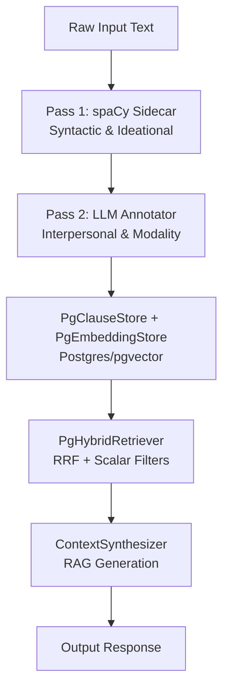
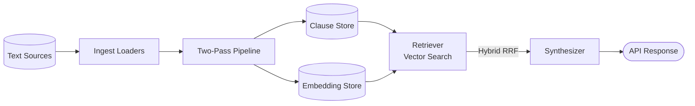
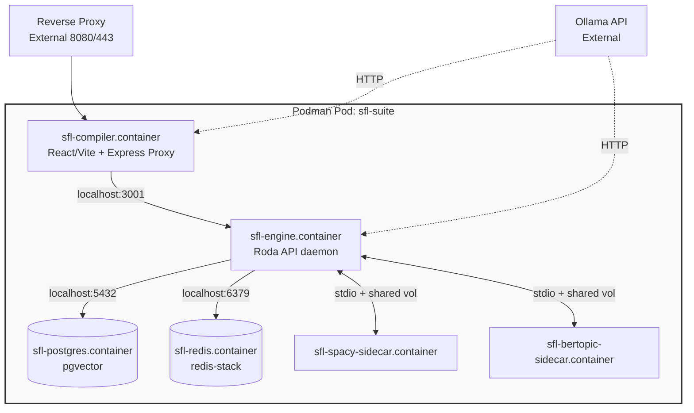

This document visualizes the core flows, component boundaries, and deployment topology of `sfl-engine`. It complements the textual architectural vision laid out in `README.md` and `ecosystem-architecture.md`. For the HTTP API surface, see [API Reference](/docs/sfl-engine/api-reference/). For the database schema, see [Data Model](/docs/sfl-engine/data-model/).

## 1. Two-Pass Pipeline Flow

The engine compiles text into Systemic Functional Linguistic (SFL) clauses using a deterministic two-pass pipeline, ensuring annotations are gathered before storage.



**Why this structure?** By separating *what was said* (Pass 1) from *how it was said* (Pass 2), the system guarantees that all vector embeddings are decorated with precise scalar modality, tenor, and mood filters before they hit the database.

## 2. Data Flow

This diagram shows how data moves from diverse source locations through the engine to answer user queries.



**Why this structure?** Hybrid Retrieval (RRF) relies on querying the Clause Store for keyword/scalar matches and the Embedding Store for dense vector matches, then merging the ranked results. The Synthesizer is only invoked once the final ranked context is assembled.

## 3. Component Dependency Graph

The Ruby codebase follows a strict Ports and Adapters (Hexagonal) architecture. Dependencies point inward toward the pure Ruby core.

```mermaid
flowchart BT
    subgraph "Driving Adapters (Periphery)"
        API[api/ HTTP Daemon]
        CLI[cli/ Command Line]
        TUI[tui/ Terminal UI]
    end

    subgraph "Use Cases / Domain Logic"
        Analysis[analysis/ (Engine, Sources)]
        Pipeline[core/pipeline/]
    end

    subgraph "Driven Adapters"
        LLM[llm/ (Annotators, Embedder)]
        Store[store/ (Sequel Repositories)]
    end

    subgraph "Core (No outward dependencies)"
        Ports[core/ports/]
        Types[core/types/]
    end

    API --> Analysis
    CLI --> Analysis
    TUI --> Analysis

    Analysis --> LLM
    Analysis --> Store
    Analysis --> Pipeline

    LLM --> Ports
    Store --> Ports
    Pipeline --> Ports

    Ports --> Types
```

**Why this structure?** The `core/types` and `core/ports` definitions are isolated from infrastructure. The `store/` and `llm/` directories contain concrete implementations of those ports (e.g., Postgres, dspy.rb) but do not dictate the domain types. Driving adapters translate HTTP, CLI arguments, or TUI interactions into generic use-case invocations.

## 4. Deployment Topology

The system deploys as a Podman pod, maintaining strict network isolation. The React frontend (`sfl-compiler`) is a driving adapter alongside the CLI, communicating strictly over HTTP.



**Why this structure?**
- **No published DB ports:** Postgres and Redis are only accessible to the engine container on the pod's shared `localhost`.
- **Sidecar communication:** Python NLP processes (spaCy, BERTopic) run in separate containers but share `stdio` streams and volume mounts, allowing massive throughput without the overhead of HTTP JSON serialization.
- **External LLMs:** The embedding/generative models (Ollama, Mistral, etc.) are explicitly external.
