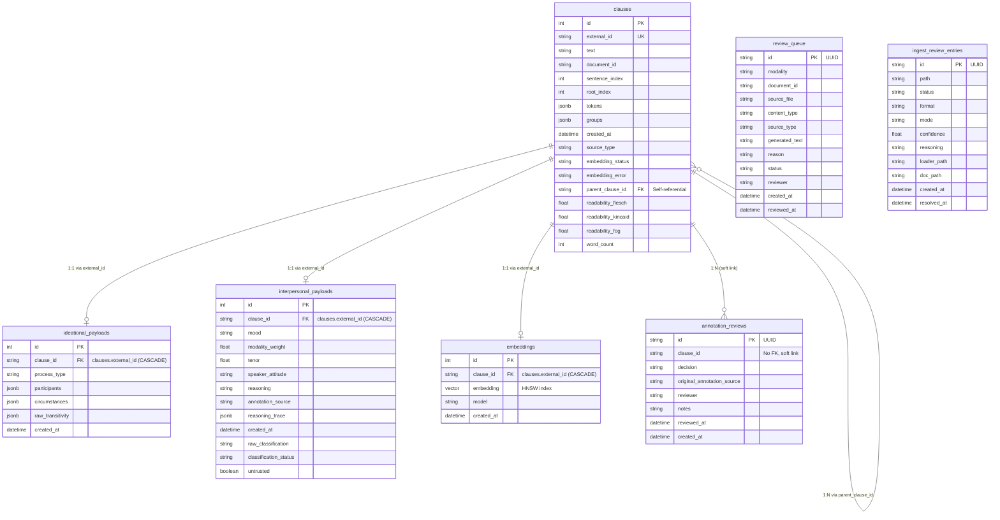

The `sfl-engine` persists clauses, annotations, embeddings, and human reviews in Postgres via Sequel. For the HTTP routes that read and write this data, see [API Reference](/docs/sfl-engine/api-reference/). For how these tables fit into the system architecture, see [Architecture Diagrams](/docs/sfl-engine/architecture-diagrams/).

## Entity-Relationship Diagram (ERD)

## Key Relationships

- **1:1 clause → payloads**: `ideational_payloads` and `interpersonal_payloads` share a strict 1:1 foreign key relationship (`clause_id` → `clauses.external_id`) with `ON DELETE CASCADE`. Deleting a clause automatically removes its annotations.
- **1:1 clause → embedding**: Similarly, vector embeddings are tied directly to the clause with a cascade delete.
- **1:N clause → annotation_reviews**: The `annotation_reviews` table provides an append-only audit trail. It intentionally uses a soft link (plain string `clause_id`) rather than a real foreign key, ensuring the history of human reviews is preserved even if the underlying clause is deleted.
- **Graph / Contextual Chunking**: The `clauses` table has a self-referential `parent_clause_id` foreign key. A "child chunk" simply points to another clause's `external_id`, representing structural or contextual nesting. A Postgres trigger prevents multi-level cyclic references.

## Table Reference

### `clauses`
The central table storing text and metadata.
- `external_id` (String): UUID matching the application's `AnnotatedClause#id`. Unique index.
- `text` (String): The raw text of the clause.
- `document_id` (String): Identifier tying clauses to their source document.
- `sentence_index`, `root_index` (Integer): Parse offsets from spaCy.
- `tokens`, `groups` (jsonb): Snapshots of the syntactic Pass 1 parse.
- `source_type` (String): Provenance tag (e.g., "chat_native", "api").
- `embedding_status`, `embedding_error` (String): Track vector generation state.
- `parent_clause_id` (String): Self-referential FK for structural chunking.
- `readability_*` (Float): Lingua::EN::Readability scores.

### `ideational_payloads`
Stores the results of Pass 1 (Transitivity).
- `clause_id` (String): FK to `clauses.external_id` (`ON DELETE CASCADE`).
- `process_type` (String): e.g., material, mental, relational.
- `participants`, `circumstances` (jsonb): Structured syntactic entities.
- `raw_transitivity` (jsonb): Complete Pass 1 payload.

### `interpersonal_payloads`
Stores the results of Pass 2 (LLM Annotation).
- `clause_id` (String): FK to `clauses.external_id` (`ON DELETE CASCADE`).
- `mood` (String): e.g., indicative, imperative.
- `modality_weight`, `tenor` (Float): Continuous confidence and relationship scores.
- `reasoning_trace` (jsonb): The raw LLM trace detailing how it reached the decision.
- `untrusted` (Boolean): Flag for quarantine.

### `embeddings`
Stores the pgvector embeddings.
- `clause_id` (String): FK to `clauses.external_id` (`ON DELETE CASCADE`).
- `embedding` (vector(768)): The vector embedding. Indexed using `HNSW` for scalable similarity search.
- `model` (String): Identifies the embedding model used (e.g., `embeddinggemma:latest`).

### `annotation_reviews`
Append-only audit trail for Pass 2 confidence reviews.
- `clause_id` (String): Soft link (no FK) to preserve history after clause deletion.
- `decision` (String): `accept`, `reject`, or `re_annotated`.
- `reviewer`, `notes` (String): Audit metadata.

### `review_queue`
Content review queue for untrusted generated text *before* permanent storage.
- `document_id`, `source_file` (String): Provenance of the content.
- `generated_text` (String): The content under review.
- `status` (String): `pending`, etc.
- `modality` (String): `image`, `text`, `audio`.

### `ingest_review_entries`
Ingest-time review queue when the orchestrator cannot confidently dispatch a file.
- `path` (String): The file path.
- `status` (String): Default `pending`.
- `confidence` (Float): Loader draft confidence score.
- `reasoning` (String): Why manual review is needed.

## Migration Timeline

The database schema has evolved through 11 migrations:

| Migration | Purpose |
|-----------|---------|
| `001_create_clauses.rb` | Base table for clauses with unique `external_id` and jsonb for tokens/groups. |
| `002_create_ideational_payloads.rb` | Transitivity data from Pass 1, with FK to `clauses`. |
| `003_create_interpersonal_payloads.rb` | LLM annotation data from Pass 2, including scalar filters. |
| `004_create_embeddings.rb` | pgvector table using `HNSW` index. |
| `005_add_source_type_to_clauses.rb` | Adds provenance tag (`source_type`) to clauses. |
| `006_create_annotation_reviews.rb` | Append-only human review audit log (soft link to clauses). |
| `007_create_review_queue.rb` | Content-review queue for raw untrusted generation. |
| `008_add_embedding_status_to_clauses.rb` | Tracks whether a clause is embedded, pending, or failed. |
| `009_create_ingest_review_entries.rb` | Ingest orchestration review queue. |
| `010_add_classification_metadata.rb` | Adds raw Pass 2 classification details and untrusted flag. |
| `011_add_parent_clause_id_to_clauses.rb` | Adds structural chunking via self-referential `parent_clause_id` and readability scores. |
