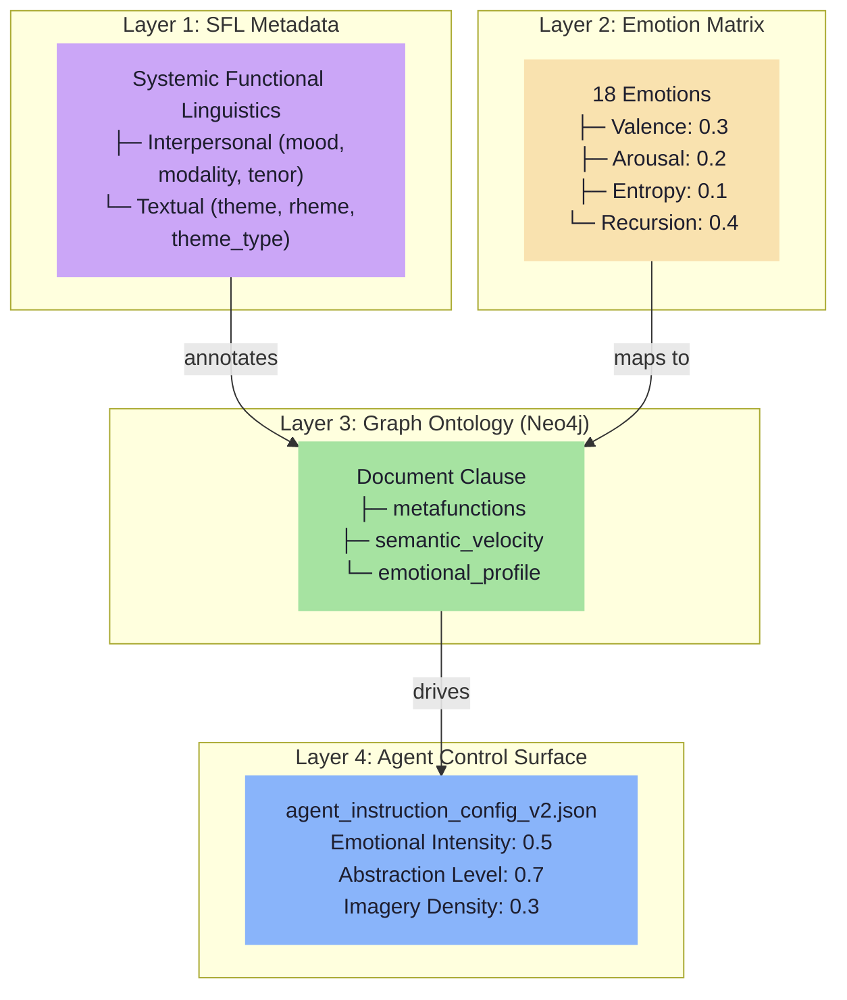
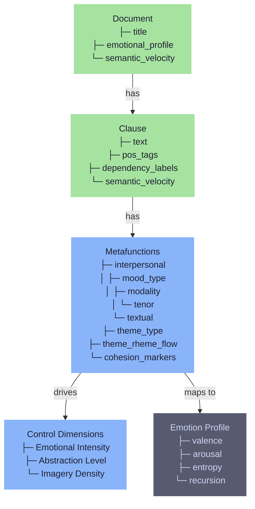

# Beyond Temperature: Graph-Augmented Prompt Engineering with SFL and Emotion Matrices

## Introduction

Temperature is a blunt instrument.

When you set it to 0.8 hoping for "creative" output, you get theatrical, over-rhetoricized prose that reads like a motivational poster written by a committee. Set it to 0.2 for "precise" work, and you get flat, lifeless text that bores even the most patient reader.

The problem isn't the model. It's that you're using a single scalar to control a multi-dimensional behavior space.

This article introduces a four-layer alternative: **Systemic Functional Linguistics** (a 60-year-old linguistic framework that treats language as structured choice), an **Emotion Matrix** (affective mapping that replaces temperature with 18 emotional coordinates), a **Graph Ontology** (the connective tissue that makes the entire system queryable), and a **Control Surface** (a generation policy that constrains its own creation).

The result: principled, predictable, phase-aware LLM behavior. Not vibes.

**Figure 1: Four-Layer Architecture Stack**



---

## Prerequisites

**You should know**:
- Basic prompt engineering (you've used ChatGPT or Claude)
- SQL fundamentals (SELECT, WHERE, JOIN)
- Ruby basics (examples use Ruby 3.1+)

**You'll need**:
- PostgreSQL 15+ with pgvector extension
- Neo4j 5+ (or AuraDB free tier)
- Ruby 3.1+
- An LLM API key (OpenAI, Anthropic, or Gemini)

---

## The Problem with Temperature

Temperature is the most misunderstood parameter in LLM configuration. It's not "creativity" — it's randomness applied uniformly regardless of phase, content type, or communicative intent.

Consider a technical documentation task:

```ruby
# before_after.rb — The Temperature Trap

require 'ruby_llm'

client = RubyLLM.chat(model: 'gpt-4')

prompt = "Write a one-paragraph technical description of async processing."

# Temperature 0.2 — "Precise"
response_low = client.ask(prompt, temperature: 0.2)
# Output: "Asynchronous processing allows operations to execute 
# independently of the main thread. The system initiates a task, 
# continues with other work, and retrieves results when ready. 
# This pattern improves throughput by utilizing available resources 
# during wait periods."
# 
# Assessment: Accurate but lifeless. Reads like a dictionary entry.

# Temperature 0.8 — "Creative"
response_high = client.ask(prompt, temperature: 0.8)
# Output: "Imagine a bustling restaurant kitchen where the chef 
# doesn't wait for one dish to finish before starting another — 
# that's async processing! Like a master conductor orchestrating 
# a symphony of flavors, your code can juggle multiple tasks, 
# each dancing to its own rhythm while the main thread keeps 
# the beat."
#
# Assessment: Technically correct but theatrical. The metaphor 
# buries the actual information. Unusable for documentation.
```

Neither output is what you wanted. Temperature gives you "lifeless" or "theatrical" with nothing in between. The missing piece is **structure** — knowing *what kind* of communication you're generating, *who* it's for, and *how* it should sound at each phase of the process.

That's where Systemic Functional Linguistics comes in.

---

## Layer 1: SFL as the Foundation

Systemic Functional Linguistics (SFL) is a linguistic framework developed by M.A.K. Halliday in the 1960s. Unlike generative grammar — which asks "how do we form sentences?" — SFL asks "what is language *doing*?"

The answer: language simultaneously performs three functions, called **metafunctions**:

| Metafunction | Question It Answers | LLM Mapping |
|--------------|---------------------|-------------|
| **Field** | What is being discussed? | Domain, topic, technical altitude |
| **Tenor** | Who is communicating? | Formality, expertise level, relationship |
| **Mode** | How is it communicated? | Channel, structure, rhetorical mode |

These three dimensions form the **register** — the communicative situation's DNA. A technical spec has different register than a blog post, which differs from a casual Slack message.

### Document-Level Register

Register is a document-level property. It's the "altitude" from which all lower decisions flow:

```ruby
# db/migrate/001_create_documents.rb — Sequel migration with JSONB

Sequel.migration do
  up do
    create_table :documents do
      primary_key :id
      String :title, null: false
      String :field, size: 50, null: false    # 'devops', 'finance', 'medical'
      String :tenor, size: 50, null: false    # 'formal', 'casual', 'technical'
      String :mode, size: 50, null: false     # 'written', 'spoken', 'hybrid'
      column :register, :jsonb, null: false   # full register profile
      column :emotional_profile, :jsonb       # affective coordinates (Layer 3)
      DateTime :created_at, default: Sequel::CURRENT_TIMESTAMP
    end

    # GIN index for register containment queries
    add_index :documents, :register, type: :gin
  end
end

# Query: Find all formal technical documents
Sequel.extension :pg_json_ops

register = Sequel.pg_jsonb_op(:documents__register)
Document.where(register.contains('tenor' => 'formal', 'field' => 'devops'))
        .select(:id, :title)
```

By storing Field/Tenor/Mode at the document level, you create a queryable filter for retrieval. "Find me all formal DevOps documents" becomes a simple containment query, not a semantic similarity search.

### Why Document-Level?

Field/Tenor/Mode are properties of the whole communicative situation, not of individual sentences. A document about Kubernetes deployment strategies has a consistent register throughout — you don't need to re-classify each paragraph.

### Clause-Level Metafunctions

SFL treats the **clause** as the primary meaning-bearing unit. Each clause carries all three metafunctions simultaneously, decomposed into structured payloads:

| Payload | SFL Metafunction | Contains |
|---------|------------------|----------|
| `ideational` | What is happening | process_type, participants, circumstances |
| `interpersonal` | What's the relationship | mood, modality_weight, tenor, speaker_attitude |
| `textual` | How it's organized | theme, rheme, thematic_progression |

#### The Schema

```ruby
# db/migrate/002_create_clauses.rb — Sequel migration with SFL metafunctions

Sequel.migration do
  up do
    create_table :clauses do
      primary_key :id
      foreign_key :document_id, :documents, null: false, on_delete: :cascade
      String :text, text: true, null: false
      String :process_type, size: 20, null: false
      column :ideational_structure, :jsonb    # participants, circumstances
      column :interpersonal_structure, :jsonb # mood, modality, tenor
      column :textual_structure, :jsonb       # theme, rheme

      # Check constraint for SFL process types
      constraint :valid_process_type, 
        process_type: %w[material mental relational verbal behavioural existential]
    end

    # GIN indexes for metafunction containment queries
    add_index :clauses, :ideational_structure, type: :gin
    add_index :clauses, :interpersonal_structure, type: :gin
    add_index :clauses, :textual_structure, type: :gin
  end
end
```

#### Why JSONB?

SFL roles are context-dependent. An "Actor" in a material process ("The *pipeline* processes data") is different from a "Senser" in a mental process ("The *developer* understands the pattern"). JSONB avoids sparse columns and enables polymorphic participant modeling. GIN indexes support `@>` containment queries for filtering.

#### Querying Metafunctions

```ruby
# Query: Find confident material processes and marked themes
Sequel.extension :pg_json_ops

interpersonal = Sequel.pg_jsonb_op(:clauses__interpersonal_structure)
textual = Sequel.pg_jsonb_op(:clauses__textual_structure)

# Find all material processes where the speaker is confident
confident_material = Clause.where(process_type: 'material')
  .where(interpersonal.get('modality_weight').cast(Float) > 0.8)
  .select(:text, :process_type, interpersonal.get('modality_weight').as(:modality))

# Find clauses with marked themes (fronted for emphasis)
marked_themes = Clause.where(textual.get('theme_type') => 'marked')
  .select(:text, textual.get('theme').as(:theme))
```

Now we have structured, queryable linguistic metadata at both document and clause levels. But we're missing the affective layer — the *emotional trajectory* of the content.

---

## Layer 2: The Emotion Matrix

The Emotion Matrix maps 18 emotional states to computational metrics in latent space. It replaces the temperature slider with structured affective control:

| Emotion | Biological Mechanism | Geometric Interpretation | Computational Metric |
|---------|---------------------|-------------------------|---------------------|
| **Happy** | Ventral Stream: parsing relationships, assigning positive valence | PC1 positive axis; low-arousal sector | Positive Semantic Velocity |
| **Anxious** | Predictive processing overload; excessive forward simulation | High-arousal, wide vector spread (low coherence) | High Entropic Drift |
| **Confused** | Model mismatch between incoming data and existing schema | Near-origin instability; high directional variance | Logit Variance Spike |
| **Bored** | Low dopaminergic activity; under-stimulation | Low-arousal, tight looping attractor | Entropy Collapse |

### Connecting Emotion to SFL

The Emotion Matrix dimensions map directly to SFL metafunctions:

| SFL Dimension | Emotion Matrix Mapping | Control Surface Dimension |
|---------------|------------------------|---------------------------|
| **Field** (topic altitude) | Semantic Velocity | Abstraction Level |
| **Tenor** (relationship) | Valence / Arousal | Emotional Intensity |
| **Mode** (channel) | Entropy / Recursion | Imagery Density |

### Adding Emotional Profiles to Documents

```ruby
# db/migrate/003_add_emotional_profiles.rb — Sequel migration

Sequel.migration do
  up do
    add_column :documents, :emotional_profile, :jsonb
    add_index :documents, :emotional_profile, type: :gin
  end
end

# Update a document's emotional trajectory
Sequel.extension :pg_json_ops

emotional = Sequel.pg_jsonb_op(:documents__emotional_profile)

Document.where(id: 42).update(
  emotional_profile: {
    valence: 0.3,
    arousal: 0.2,
    semantic_velocity: 0.4,
    entropy: 0.1
  }
)

# Query: Find high-valence technical documents
Document.where(field: 'devops')
  .where(emotional.get('valence').cast(Float) > 0.5)
  .select(:id, :title, emotional.get('valence').as(:valence))
```

### Phase-Specific Application

Emotional profiles aren't static — they shift across generation phases:

- **Context gathering**: Suppress emotional intensity (valence=0, arousal=0)
- **Drafting**: Moderate engagement (valence=0.5, arousal=0.5)
- **Review**: Adversarial stance (negative valence, high arousal)

This phase-awareness is the key insight. The same document requires different emotional profiles at different stages of creation.

---

## Layer 3: The Graph Ontology

We have three components so far: linguistic metadata (SFL), affective mapping (Emotion Matrix), and clause-level payloads. But they're disconnected. A graph ontology makes the relationships explicit and queryable.

**Figure 2: Graph Ontology Structure**



### Why a Graph?

SFL is inherently hierarchical and relational:
- Documents **contain** clauses
- Clauses **carry** metafunctions
- Metafunctions **compose** from participants, processes, circumstances
- Emotions **map to** computational metrics
- Control dimensions **traverse** the graph

A graph database (Neo4j) stores these relationships natively, enabling queries that would require complex JOINs in SQL.

### The Ontology Schema

```cypher
-- ontology.cypher — Neo4j node/edge schema

// Node types
CREATE CONSTRAINT FOR (d:Document) REQUIRE d.id IS UNIQUE;
CREATE CONSTRAINT FOR (c:Clause) REQUIRE c.id IS UNIQUE;
CREATE CONSTRAINT FOR (i:IdeationalPayload) REQUIRE i.id IS UNIQUE;
CREATE CONSTRAINT FOR (p:InterpersonalPayload) REQUIRE p.id IS UNIQUE;
CREATE CONSTRAINT FOR (t:TextualPayload) REQUIRE t.id IS UNIQUE;
CREATE CONSTRAINT FOR (e:EmotionState) REQUIRE e.id IS UNIQUE;
CREATE CONSTRAINT FOR (dim:ControlDimension) REQUIRE dim.id IS UNIQUE;

// Document with register
CREATE (d:Document {
  id: 42,
  field: 'devops',
  tenor: 'technical',
  mode: 'written',
  emotional_profile: {valence: 0.3, arousal: 0.2}
})

// Clause with metafunctions
CREATE (c:Clause {
  id: 101,
  text: 'The pipeline processes data asynchronously',
  process_type: 'material'
})

CREATE (i:IdeationalPayload {
  id: 201,
  participants: [{role: 'Actor', text: 'pipeline'}],
  circumstances: [{type: 'Manner', text: 'asynchronously'}]
})

CREATE (p:InterpersonalPayload {
  id: 301,
  mood: 'declarative',
  modality_weight: 0.9,
  speaker_attitude: 'confident'
})

CREATE (t:TextualPayload {
  id: 401,
  theme: 'The pipeline',
  theme_type: 'unmarked',
  rheme: 'processes data asynchronously'
})

// Relationships
CREATE (d)-[:CARRIES]->(c)
CREATE (d)-[:HAS_EMOTION]->(e)
CREATE (c)-[:HAS_IDEATIONAL]->(i)
CREATE (c)-[:HAS_INTERPERSONAL]->(p)
CREATE (c)-[:HAS_TEXTUAL]->(t)
```

### Graph Queries for Prompt Engineering

The graph enables traversals impossible in pure SQL:

```cypher
-- graph_queries.cypher — Traversal examples

// 1. Find clauses matching a target register
MATCH (d:Document)-[:CARRIES]->(c:Clause)-[:HAS_INTERPERSONAL]->(p)
WHERE d.field = 'devops' 
  AND d.tenor = 'formal'
  AND p.modality_weight > 0.8
RETURN c.text, p.modality_weight
ORDER BY p.modality_weight DESC;

// 2. Find emotional trajectory across a conversation
MATCH (d:Document)-[:HAS_EMOTION]->(e:EmotionState)
WHERE d.conversation_id = 'chat-123'
RETURN d.id, e.valence, e.arousal
ORDER BY d.created_at;

// 3. Find control surface constraints for a phase
MATCH (dim:ControlDimension)-[:CONSTRAINS]->(c:Clause)
WHERE dim.phase = 'drafting'
  AND dim.name = 'imagery_density'
RETURN c.text, dim.max_value, dim.directive;

// 4. Traverse the full stack: SFL → Emotion → Control
MATCH (d:Document)-[:HAS_EMOTION]->(e:EmotionState)
MATCH (d)-[:CARRIES]->(c:Clause)
MATCH (dim:ControlDimension)-[:CONSTRAINS]->(c)
WHERE e.valence > 0.5 
  AND dim.phase = 'drafting'
RETURN c.text, e.valence, dim.directive;
```

### The Full Node Graph

```
Document
  ├── CARRIES → Clause
  │     ├── HAS_IDEATIONAL → IdeationalPayload
  │     │     └── MAPS_TO → ControlDimension
  │     ├── HAS_INTERPERSONAL → InterpersonalPayload
  │     │     └── MAPS_TO → ControlDimension
  │     └── HAS_TEXTUAL → TextualPayload
  │           └── MAPS_TO → ControlDimension
  ├── HAS_EMOTION → EmotionState
  │     └── TRIGGERS → ControlDimension
  └── CONSTRAINS ← ControlDimension
```

This ontology is the connective tissue. It makes the relationships between SFL, emotions, and control surfaces explicit and traversable.

---

## Layer 4: The Control Surface

The final layer is `agent_instruction_config_v2.json` — a generation policy that governs how the model behaves across phases. It's not content; it's the *rules for creating content*.

### The Schema

```json
{
  "meta": {
    "schema_version": "2.0",
    "phases": ["context_gathering", "drafting", "review"],
    "phase_intents": {
      "context_gathering": "Ground in source material. Suppress speculation.",
      "drafting": "Express synthesized content. Commit to a frame.",
      "review": "Evaluate against intent. Introduce adversarial perspective."
    }
  },
  "dimensions": {
    "imagery_density": {
      "description": "Ratio of figurative to literal language",
      "context_gathering": {"max": 1, "directive": "Suppress metaphor entirely"},
      "drafting": {"max": 3, "directive": "Balance concrete and thematic"},
      "review": {"max": 2, "directive": "Cut mechanical repetition"}
    },
    "abstraction_level": {
      "description": "Conceptual altitude from source material",
      "context_gathering": {"max": 1, "directive": "Stay close to source"},
      "drafting": {"max": 5, "directive": "Rise to synthesis"},
      "review": {"max": 3, "directive": "Check if abstraction is earned"}
    },
    "emotional_intensity": {
      "description": "Persuasive and affective register",
      "context_gathering": {"max": 0, "directive": "Zero affective load"},
      "drafting": {"max": 5, "directive": "Calibrate to register"},
      "review": {"max": 6, "directive": "Adversarial stress-test"}
    }
  }
}
```

### The Recursion Insight

Here's the key: the config constrains its own generation. When generating a SOUL.md (persona prose), the model uses the same behavioral dimensions it's defining. This creates a principled feedback loop — the generation policy governs its own creation.

### Phase-Specific Example

Consider generating a technical specification. The same document requires different behavioral profiles at each phase:

```ruby
# phase_example.rb — How dimensions shift across phases

config = JSON.parse(File.read('agent_instruction_config_v2.json'))

phases = {
  context_gathering: {
    imagery_density: 0,      # No metaphors — pure extraction
    abstraction_level: 1,    # Stay close to source material
    emotional_intensity: 0   # Zero affective load
  },
  drafting: {
    imagery_density: 3,      # Balance concrete and thematic
    abstraction_level: 5,    # Rise to synthesis
    emotional_intensity: 5   # Calibrate to register
  },
  review: {
    imagery_density: 2,      # Cut mechanical repetition
    abstraction_level: 3,    # Check if abstraction is earned
    emotional_intensity: 6   # Adversarial stress-test
  }
}

# During context gathering: suppress, don't suppress
# During drafting: express, don't over-express
# During review: critique, don't destroy
```

The same dimension (e.g., `emotional_intensity`) requires opposite behavior depending on phase. A single undifferentiated instruction cannot serve all three.

### SRE Failure Mode Mapping

The config includes a failure mode index that maps LLM anti-patterns to SRE analogues and interventions:

| Failure Mode | SRE Analogue | Intervention |
|--------------|--------------|--------------|
| **Theatrical prose** | High CPU usage | Reduce `emotional_intensity.max` |
| **Abstract tangents** | Memory leak | Reduce `abstraction_level.max` |
| **Repetitive output** | Infinite loop | Increase `imagery_density.min` |
| **Inconsistent tone** | Flapping alert | Lock `tenor` at document level |
| **Speculative content** | False positive | Set `context_gathering` phase first |

This mapping makes failure modes *actionable* — you don't just detect them, you know which dial to turn.

### The Two-Pass Pipeline

The SFL-Compiler uses a two-pass architecture: **Pass 1** extracts syntactic structure with spaCy, **Pass 2** annotates metafunctions with an LLM.

**Figure 3: Two-Pass SFL Pipeline**


**Pass 1** is deterministic — spaCy handles tokenization, POS tagging, and dependency parsing. The process type is inferred from verb POS and dependency relations:

| POS Tag | Dependency | Process Type | Example |
|---------|------------|--------------|---------|
| `VERB` (VB/VBP) | `ROOT` | Material | "The pipeline *processes* data" |
| `VERB` (VBZ/VBN) | `ROOT` | Relational | "The API *is* RESTful" |
| `VERB` (VBG) | `ROOT` | Mental | "The developer *understands* the pattern" |
| `AUX` | `ROOT` | Relational | "There *are* three endpoints" |

**Pass 2** is LLM-driven — the model annotates interpersonal and textual metafunctions based on the syntactic structure from Pass 1:

```ruby
# full_stack.rb — Two-pass SFL pipeline with ruby_llm and sequel

require 'ruby_llm'
require 'sequel'
require 'neo4j'
require 'ruby-spacy'

# Connect to databases
DB = Sequel.connect(ENV['DATABASE_URL'])
neo4j = Neo4j::Driver.new(uri: 'bolt://localhost:7687', auth: :basic, username: 'neo4j', password: 'password')

# Initialize spaCy and RubyLLM
nlp = Spacy::load('en_core_web_sm')
llm = RubyLLM.chat(model: 'gpt-4')

# --- Schema (Sequel models) ---
class Document < Sequel::Model(:documents)
  one_to_many :clauses
end

class Clause < Sequel::Model(:clauses)
  many_to_one :document
  plugin :pg_jsonb  # JSONB support for metafunction payloads
end

# --- Pass 1: spaCy POS Extraction ---
def pass_one(text, document_id)
  doc = nlp.read(text)
  
  doc.sents.each_with_index do |sent, idx|
    tokens = sent.map do |token|
      {
        text: token.text,
        lemma: token.lemma_,
        pos: token.pos_,        # Part of speech (NOUN, VERB, ADJ...)
        tag: token.tag_,        # Fine-grained POS tag
        dep: token.dep_,        # Dependency relation (nsubj, dobj, ROOT...)
        morph: token.morph.to_h # Morphological features
      }
    end
    
    root = tokens.find { |t| t[:dep] == 'ROOT' }
    
    # Determine process_type from verb POS and dependency
    process_type = infer_process_type(root, tokens)
    
    Clause.create(
      document_id: document_id,
      text: sent.text,
      sentence_index: idx,
      process_type: process_type,
      ideational_structure: {
        root_verb: root[:lemma],
        participants: extract_participants(tokens),
        circumstances: extract_circumstances(tokens)
      }.to_json
    )
  end
end

# --- Process Type Inference (SFL) ---
def infer_process_type(root, tokens)
  return 'existential' unless root
  
  case root[:pos]
  when 'VERB'
    # Material: action verbs (process, build, execute)
    # Mental: cognition verbs (understand, think, know)
    # Relational: being/having verbs (is, has, contains)
    case root[:tag]
    when 'VB', 'VBP'  then 'material'
    when 'VBZ', 'VBN' then 'relational'
    when 'VBG'        then 'mental'
    else 'material'
    end
  when 'AUX'  then 'relational'
  else 'existential'
  end
end

def extract_participants(tokens)
  tokens.select { |t| %w[nsubj nsubjpass dobj iobj].include?(t[:dep]) }
        .map { |t| { role: map_participant_role(t[:dep]), text: t[:text], lemma: t[:lemma] } }
end

def extract_circumstances(tokens)
  tokens.select { |t| %w[prep advmod punct].include?(t[:dep]) }
        .map { |t| { type: t[:dep], text: t[:text] } }
end

def map_participant_role(dep)
  case dep
  when 'nsubj', 'nsubjpass' then 'Actor'
  when 'dobj'               then 'Goal'
  when 'iobj'               then 'Recipient'
  else 'Participant'
  end
end

# --- Pass 2: LLM SFL Annotation (Interpersonal + Textual) ---
def pass_two(clause)
  prompt = <<~PROMPT
    Analyze this clause using Systemic Functional Linguistics.
    
    Clause: "#{clause.text}"
    Process type: #{clause.process_type}
    
    Return JSON with:
    - interpersonal: { mood, modality_weight (0-1), speaker_attitude }
    - textual: { theme, theme_type ("unmarked"|"marked"), rheme }
  PROMPT
  
  response = llm.ask(prompt, temperature: 0.1)
  annotation = JSON.parse(response)
  
  clause.update(
    interpersonal_structure: annotation['interpersonal'].to_json,
    textual_structure: annotation['textual'].to_json
  )
end

# --- Full Pipeline ---
text = "The pipeline processes data asynchronously. It continues with other work."

doc = Document.create(
  title: 'Async Processing Overview',
  field: 'devops',
  tenor: 'technical',
  mode: 'written',
  emotional_profile: { valence: 0.3, arousal: 0.2 }.to_json
)

# Pass 1: Extract syntactic structure
pass_one(text, doc.id)

# Pass 2: LLM annotation for interpersonal/textual metafunctions
doc.clauses.each { |clause| pass_two(clause) }

# Query: Find confident material processes
interpersonal = Sequel.pg_jsonb_op(:clauses__interpersonal_structure)
confident_material = Clause.where(process_type: 'material')
  .where(interpersonal.get('modality_weight').cast(Float) > 0.8)
  .all

puts "Found #{confident_material.size} confident material clauses"
```

### Dependencies

```ruby
# Gemfile
source 'https://rubygems.org'

gem 'ruby_llm'        # LLM abstraction (OpenAI, Anthropic, Ollama)
gem 'sequel'           # Database toolkit with JSONB support
gem 'pg'               # PostgreSQL driver
gem 'neo4j'            # Neo4j graph database driver
gem 'ruby-spacy'       # spaCy NLP bridge via PyCall
```

---

## The Full Stack in Practice

The four layers work together:

| Layer | Role | Query Type |
|-------|------|------------|
| **SFL** | Linguistic metadata | Register containment: `@>` |
| **Emotion Matrix** | Affective coordinates | Range filters: `valence > 0.5` |
| **Graph Ontology** | Connective tissue | Traversal: `MATCH (a)-[:REL]->(b)` |
| **Control Surface** | Generation policy | Phase-scoped directives |

**Stop setting temperature. Start setting register.**

---

## Further Exploration

- **Hybrid retrieval**: Combine vector similarity with SFL structural filters for precision that pure embedding search can't match
- **Conversation analysis**: Track tenor evolution across chat branches to detect manipulation patterns
- **The Ruby SFL-Compiler**: A production pipeline that parses text with spaCy, annotates with LLMs, and stores in PostgreSQL + Neo4j
- **SFL-aware chunking**: Split documents at clause boundaries, not arbitrary token limits

---

## Conclusion

Temperature is a single scalar controlling a multidimensional behavior space. It's time for something better.

The four-layer stack — SFL for linguistic metadata, Emotion Matrix for affective mapping, Graph Ontology for connective tissue, and Control Surface for generation policy — replaces vibes with principles.

Your prompts aren't failing because the model is stupid. They're failing because you're speaking in scalars when the model needs structure.

**The schema**: PostgreSQL + Neo4j, fully documented
**The framework**: Open source, ready to adapt

Stop guessing. Start engineering.

---

## Resources & Sources

### Internal References (Notebook Collection)

| Document | Path | Description |
|----------|------|-------------|
| **Emotion Matrix** | `Dashboards/Emotion Matrix.md` | 18-emotion computational matrix with biological mechanisms, geometric interpretations, and token associations |
| **Agent Instruction Config V2 Reference** | `PromptLibraryV3/Agent Instruction Config V2 Reference.md` | Control surface schema with phase-scoped behavioral directives and SRE failure mode mapping |
| **SFL-Compiler Schema** | `ProjectsV2/RubyGenAI/SFL-Compiler-Schema.md` | Two-pass pipeline architecture with spaCy POS extraction and LLM metafunction annotation |
| **SFL Clause as Unit of Analysis** | `ProjectsV2/Structured-Prompt-Engineering/SFL-Clause-as-Unit-of-Analysis.md` | SFL decomposition of clauses into Field, Tenor, and Mode components |
| **SFL for LLM Prompt Engineering** | `GenAI/NLP-Prompt-Engineering/Theory/SFL/SFL-in-LLM-Prompt-Engineering/SFL-for-LLM-Prompt-Engineering.md` | Hallidayan framework applied to Transformer-based models |
| **Neurosymbolic AI: Combining LLMs & NLP** | `Daily/Neurosymbolic-AI-Combining-LLMs-NLP.md` | SFL's application in parsing, dialogue systems, and multimodality |
| **Design Patterns for Pgvector, Sequel, and RubyLLM** | `ProjectsV2/RubyGenAI/07-reference/Design-Patterns-NLP-Embeddings.md` | Integration patterns for semantic embedding and retrieval systems |
| **SFL/PostgreSQL/Ruby Technical Assistant** | `Prompt-Library-V2/SFL/prompts/SFL-PostgreSQL-Ruby-Technical-Assistant-2025-07-31.md` | Prompt template for SFL-aware database operations |
| **GraphRAG Architecture for Ansible** | `Daily/GraphRAG-Architecture-for-Ansible.md` | Graph Retrieval-Augmented Generation with structural knowledge management |
| **Knowledge Graph Construction with Ruby** | `GenAI/Applications/Knowledge-Graphs/Knowledge-Graph-Processing-with-Ruby.md` | Neo4j and RDF.rb patterns for graph construction |

### External References

#### Systemic Functional Linguistics

| Citation | URL | Relevance |
|----------|-----|-----------|
| Halliday, M. A. K. (1985). *Spoken and Written Language*. Geelong: Deakin University Press. | — | Distinction between speech (dynamic) and writing (synoptic/nominalized) |
| Matthiessen, C. M. I. M. & Halliday, M. A. K. (1997). *Systemic Functional Grammar: A First Step into the Theory*. | — | Core SFL architecture: metafunctions and register variables |
| Cambridge Handbook of Systemic Functional Linguistics: SFL and Computation | `cambridge.org/core/books/cambridge-handbook-of-systemic-functional-linguistics/systemic-functional-linguistics-and-computation/10D8562DE4A1B96E6B6CEACB6E7E34C2` | Computational applications of SFL in NLP and dialogue systems |

#### Graph Databases & Neo4j

| Citation | URL | Relevance |
|----------|-----|-----------|
| Robinson, I., Webber, J., & Eifrem, E. (2015). *Graph Databases*. O'Reilly Media. | — | Native graph storage and Cypher query language |
| Neo4j Documentation: Vector Index | `neo4j.com/docs/cypher-manual/vector-index/` | Vector similarity search within graph traversals |

#### Ruby Ecosystem

| Gem | Repository | Relevance |
|-----|------------|-----------|
| `sequel` | `github.com/jeremyevans/sequel` | Database toolkit with JSONB support and migration API |
| `ruby_llm` | `github.com/mariochavez/ruby_llm` | Unified Ruby gem for LLM abstraction (OpenAI, Anthropic, Ollama) |
| `ruby-spacy` | `github.com/yohasebe/ruby-spacy` | Ruby bindings for spaCy NLP pipeline |
| `neo4j` | `github.com/neo4jrb/neo4j` | Neo4j driver for Ruby with Cypher query support |

#### Affective Computing

| Citation | URL | Relevance |
|----------|-----|-----------|
| Russell, J. A. (1980). A Circumplex Model of Affect. *Journal of Personality and Social Psychology*, 39(6), 1161–1178. | — | Valence-Arousal circumplex model underlying the Emotion Matrix |
| Picard, R. W. (1997). *Affective Computing*. MIT Press. | — | Foundational framework for computational emotion recognition |

#### Prompt Engineering & LLM Control

| Citation | URL | Relevance |
|----------|-----|-----------|
| Wei, J. et al. (2022). Chain-of-Thought Prompting Elicits Reasoning in Large Language Models. *arXiv:2201.11903*. | — | Structured reasoning via prompt decomposition |
| Anthropic (2024). Claude System Prompt Documentation. | `docs.anthropic.com/claude/docs/system-prompts` | Phase-scoped behavioral directives and persona control |

### SFL-Compiler Project

The production implementation of this article's concepts:

```bash
# Repository structure
sfl-compiler/
├── lib/
│   ├── sfl/compiler/
│   │   ├── pass_one.rb      # spaCy POS extraction (deterministic)
│   │   ├── pass_two.rb      # LLM metafunction annotation
│   │   ├── bootstrap.rb     # Configuration and dependency injection
│   │   └── migrator.rb      # PostgreSQL schema management
├── docs/
│   ├── architecture.md      # System architecture documentation
│   └── modules/
│       ├── pass-one-engine.md
│       └── pass-two-engine.md
└── Gemfile                  # Dependencies: sequel, ruby_llm, ruby-spacy, neo4j
```

**Key files referenced in this article:**
- `lib/sfl/compiler/pass_one.rb` — spaCy POS tagging and dependency parsing
- `lib/sfl/compiler/pass_two.rb` — LLM-based interpersonal and textual annotation
- `db/migrate/` — Sequel migrations for document, clause, and emotional profile tables

---

*Last updated: 2026-08-04*
