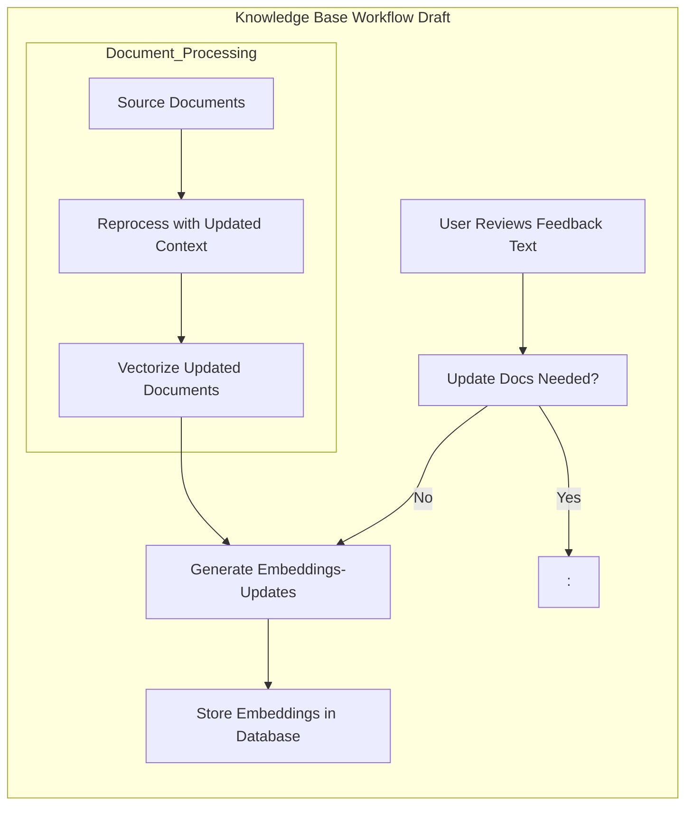

- **Process:**
    1. **Database Quiescing (Optional):** For consistency, you might freeze writes to the database momentarily. This isn't always strictly necessary.
    2. **File System Snapshot:** The snapshot tool takes a 'picture' of the data directory containing the database files.
- **Restoring:**
    - You need to stop the database process.
    - Restore the data files from the snapshot.
    - Start the database, and often it'll perform a crash recovery process to ensure consistency.

## Benefits of Btrfs Snapshots

Quick Rollbacks: If there's an accidental deletion in your knowledge base, or you need to undo changes (like a misguided update script), snapshots allow you to revert to a known good state with minimal hassle. The recovery process is practically instant.

"Freezing" the Knowledge Base: For some RAG applications, you might want to periodically "freeze" a copy of the knowledge base. Snapshots are a highly efficient way to do this. This enables you to:

- Test new embedding models or algorithms on a static knowledge base to get consistent results.
- Serve requests against a stable snapshot while potentially making updates to the main knowledge base.

Data Versioning: Over time, as you accumulate snapshots, you essentially have a versioning system for your knowledge base. This can be useful for:

- Auditing: Tracing how the data has changed.
- Debugging: If there's a sudden regression in output quality, you can compare with past snapshots to pinpoint when the issue was introduced.

Test out new embedding techniques, reorganize your knowledge base, or try out a risky import script. Snapshots let you create a sandboxed playground. Take a snapshot, go wild with your changes, and if things go sideways, rollback to the last working version. Your main knowledge base remains untouched, encouraging bold experimentation.

## Trade-offs to Consider:

Storage Consumption: While snapshots are space-efficient (thanks to the copy-on-write mechanism), they do consume additional storage. You'll need to find the right balance between how many snapshots you retain and how often you create them.

Management: With regular snapshots, you'll need some scripting or tooling to manage them. This means pruning older snapshots to avoid excessive space usage.

## How it could work

Regular Snapshots: Set up a script to take snapshots of your Btrfs volume holding the knowledge base (e.g., daily or weekly).

Before Major Updates: Always create a snapshot right before any significant updates to your knowledge base or changes to your embedding generation pipeline.

Evaluation: Create a snapshot before running experiments or evaluations, so you have a clean baseline to compare against.

Rollbacks: If needed, use Btrfs tooling to easily revert the entire volume to a previous snapshot state.

## Beyond Simple Snapshots

Btrfs also supports sending and receiving snapshots. This opens up possibilities:

Remote Backups: You could send incremental snapshots to a different Btrfs volume (even on another machine) for an off-site backup strategy.

Development/Testing: Developers could work with local snapshots of the knowledge base, then send changes back to a central location if everything works well.