```mermaid!
graph LR

subgraph N[Item]

subgraph E[Embedding]

  
  

subgraph Subject

subgraph Content

subgraph Page

subgraph Sections

A[Heading<br/>Paragraphs]

  

J[Subheading<br/>Paragraphs]

  

K[Lists<br/>Tables<br/>Figures]

end

end

end

end

A --- F[Sentences] --> U[Phrases] --> W[Words] ---> S[Tokens] ---> T[Subject]

  

J --- F[Sentences] --> U[Phrases] --> W[Words] --> S[Tokens] --> T[Subject]

  

K --- F[Sentences] --> U[Phrases] --> W[Words] ---> S[Tokens] ---> T[Subject]

end

  
  

end

style N fill:#1a1a1a,stroke:#333,stroke-width:4px

style E fill:#2a1a2a,stroke:#f66,stroke-width:2px,color:#fff,stroke-dasharray: 5 5

```

## Index
- [[Capturing Personality with Verb Phrase Extraction]]
- [[Chunking]]
- [[comparing and contrasting RAG and GAR]]
- [[Embedding]]
- [[keywords and abbreviations]]
- [[NLP Processing for Semantic Search]]
- [[Parts of a Document]]
- [[Document Processing]]
- [[Stop Words]]
- [[Unless]]

---

## scratch

https://github.com/MLRG-CEFET-RJ/ml-class/blob/master/DataMining_week08.ipynb

## SetFit

SetFit is an efficient and prompt-free framework for few-shot fine-tuning of [Sentence Transformers](https://sbert.net/).

https://github.com/huggingface/setfit
https://github.com/davidberenstein1957/spacy-setfit

