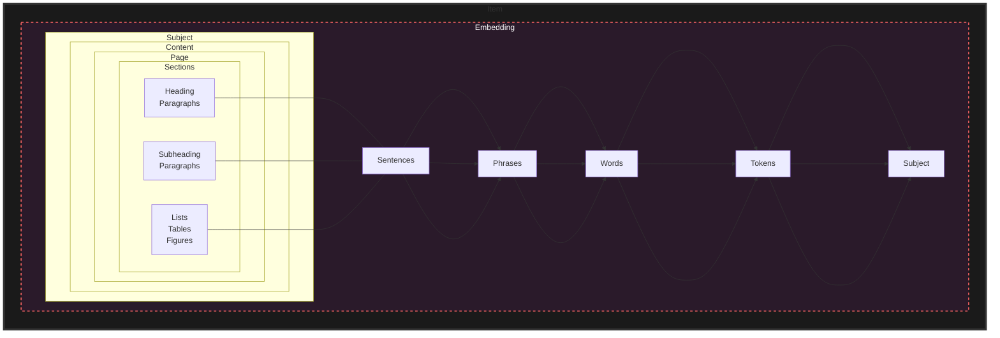

```mermaid!
graph LR

subgraph N[Item]

subgraph E[Embedding]

  
  

subgraph Subject

subgraph Content

subgraph Page

subgraph Sections

A[Heading<br/>Paragraphs]

  

J[Subheading<br/>Paragraphs]

  

K[Lists<br/>Tables<br/>Figures]

end

end

end

end

A --- F[Sentences] --> U[Phrases] --> W[Words] ---> S[Tokens] ---> T[Subject]

  

J --- F[Sentences] --> U[Phrases] --> W[Words] --> S[Tokens] --> T[Subject]

  

K --- F[Sentences] --> U[Phrases] --> W[Words] ---> S[Tokens] ---> T[Subject]

end

  
  

end

style N fill:#1a1a1a,stroke:#333,stroke-width:4px

style E fill:#2a1a2a,stroke:#f66,stroke-width:2px,color:#fff,stroke-dasharray: 5 5

```

[[NLP]]

[[Ruby]]

