 

> [!ai]+ AI
>
> The provided text does not contain any information about categories for marked regions or categories that are selected in the assessment. Therefore, I cannot extract the requested data from the provided context.

```mermaid!
graph LR

subgraph N[Item]

subgraph E[Embedding]

  
  

subgraph Subject

subgraph Content

subgraph Page

subgraph Sections

A[Heading<br/>Paragraphs]

  

J[Subheading<br/>Paragraphs]

  

K[Lists<br/>Tables<br/>Figures]

end

end

end

end

A --- F[Sentences] --> U[Phrases] --> W[Words] ---> S[Tokens] ---> T[Subject]

  

J --- F[Sentences] --> U[Phrases] --> W[Words] --> S[Tokens] --> T[Subject]

  

K --- F[Sentences] --> U[Phrases] --> W[Words] ---> S[Tokens] ---> T[Subject]

end

  
  

end

style N fill:#1a1a1a,stroke:#333,stroke-width:4px

style E fill:#2a1a2a,stroke:#f66,stroke-width:2px,color:#fff,stroke-dasharray: 5 5

```

[[NLP]]

[[Ruby]]

> [!ai]+ AI
>
> **Categories for all marked regions:**
> * **Background:** Regions that are not part of any object.
> * **Object:** Regions that are part of an object.
> **Categories that are selected in the assessment:**
> * **Relevant:** Regions that are relevant to the referring expression.
> * **Irrelevant:** Regions that are not relevant to the referring expression.
> The **Find_Center** function is used to find the center of a region. The center of a region is the point that is equidistant from all points in the region. The function takes a region definition (r) as input and returns the center of the region as an output.
> The **Mark_Allocation** function is used to mark the allocation of regions to categories. The function takes a list of regions (R) as input and returns a list of categories (C) as output. The function first sorts the regions in ascending order of areas. Then, for each region, the function checks if the region is not part of any of the previously marked regions. If the region is not part of any of the previously marked regions, the function marks the region as relevant and adds it to the list of categories.

---

Algorithm 1: The entity-aware dynamic selection algorithm 1 function EntityAwareDynamicSelection (x, B, E, k) → R; Input :User utterance x, sample bank B, list of associated ODSL entities E, and minimum number of samples to retrieve k Output :A set of retrieved samples R 2 Relevant samples B̄ ← {}; 3 List of samples and similarity scores pairs S ← []; 4 foreach bi ∈ B do 5 if entities(bi ) ⊂ E then 6 B̄.insert(b̄i ); 7 end 8 end 9 foreach b̄i ∈ B̄ do 10 si ← E(x)⊤ E(b̄i ); 11 S.append([si , bi ]); 12 end 13 S ← S.sortBy(si ); 14 Top matches by similarities α ← S[0 : k]; 15 Top matches by entities β ← []; 16 while length(β) ⩽ length(E) do 17 foreach {si , bi } ∈ S do 18 if entities(bi ) ̸⊂ entities(β) then 19 β.append([si , bi ]); 20 end 21 end 22 end 23 R ← β.concat(α).removeDuplicates(); 24 R ← R[0 : max (k, length(E))].sortBy(si , desc); 25 return R Entity-Aware Dynamic selection We select max (k, length(E)) samples from B such that each associated entities in E is represented at least once. The algorithm is described in Alg.1 and illustrated in Fig. 4.