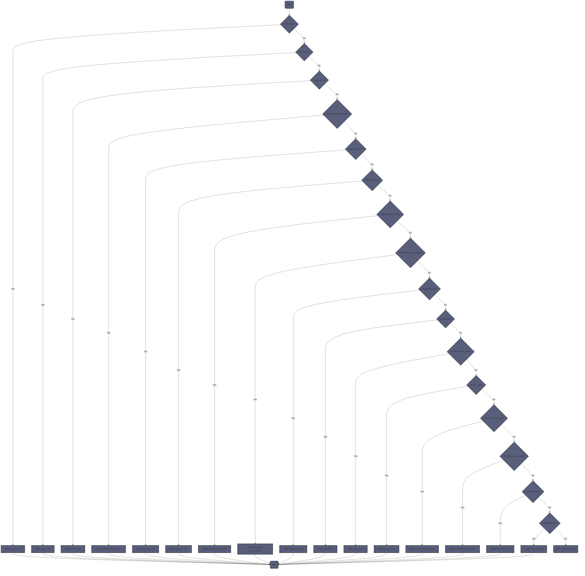

Variable precedence in Ansible is influenced by the scope and context in which the variables are defined. When a variable is defined at multiple levels, Ansible uses a merging strategy based on the variable's scope. 


## Group Vars and Host Vars
For testing purposes, it might be useful to know that variables *used* by a role, that are set in either group_vars/ or host_vars/ can be overwritten by:

* playbook vars
* playbook vars_files
* playbook pre_tasks and tasks using register
* playbook pre_tasks and tasks using set_fact
* role variables defined in vars/main.yml or included from vars/x.yml
* tasks using block vars, but only for that block
* roles task using set_fact or register, but only for that task


<ul class="chat-bubble">
  <li>
    <p><narration>Nihilistic & Existential Rants</narration></p>
    <p>Oh, the woes of Ansible's variable precedence! A cosmic joke, an existential crisis for the uninitiated. It's a labyrinth of scopes, contexts, and merging strategies that would make Kafka weep.</p>
    <p>For those who dare to venture into this realm, be warned: the rules are as fluid as the sands of time. <del>Variables dance and merge, their precedence a fickle mistress that changes with the wind.</del></p>
    <p>Group vars and host vars? <del>They're mere pawns in the grand scheme of things,</del> trampled upon by the mighty force of playbook vars. And don't forget those pesky roles, with their own little variables that can overthrow the established order.</p>
    <p>Block vars? Ha! <del>They're just a fleeting illusion, a momentary glimmer of control before the darkness consumes them</del>.</p>
    <p>Oh, the futility of it all! Why bother assigning variables when they're destined to be overwritten, trampled, and forgotten? In the grand tapestry of Ansible, variables are <del>but ephemeral specks, doomed to dance to the whims of the cosmic merge.</del></p>
  </li>
</ul>


## Role Variables and Role Defaults

* <font color="#548dd4">role defaults</font> 
	* are set in role/defaults/main.yml

* <font color="#938953">role variables</font> 
	* are set in role/vars/main.yml
	* take precedence over role defaults

A primary distinction here is that variables declared in `vars/main.yml` require user adjustment while the variables in `defaults/main.yml` do not. The needs of the environment as well as other specific context will determine the optimal placement of variables that define the behavior of a role. 

If a variable is defined both in role variables and for a specific host within host_vars, the role variable will take precedence over the host variable. Whereas the variable defined within host_vars will take precedence over the role defaults.

<span style="background:rgba(163, 67, 31, 0.2)">This is because the role variable is more specific to the role in context.</span>

This may or may not be desired behavior. If the requirement is to allow variables declared for a specific host or a group of hosts to overwrite default variables for a role, then declare the variable for the role in defaults/main.yml 


#### how would setting 'private role vars: true' change things?

<div class="figure right">
@startuml
start
:Extra Vars (Command Line);
:Task Vars (Specific Task);
:Block Vars (Within Block);
:Role and Include Vars;
:Set_fact Vars;
:Register Vars;
:Playbook VarsFiles;
:Playbook VarsPrompt;
:Playbook Vars;
:Host Facts;
:HostVars;
:GroupVars;
:Inventory Host Vars;
:Inventory Group Vars;
:Inventory Vars;
:Role Defaults;
stop
@enduml
</div>


---

## Precedence order

In Ansible, variable precedence determines which value a variable takes when it's defined in multiple places. This hierarchy helps Ansible decide which value "wins" when there are conflicts. Understanding this order is crucial for advanced Ansible use, especially when you're overriding variable values.

1. Extra `vars` (from command-line) always win.
2. Task `vars` (only for the specific task).
3. Block `vars` (only for the tasks within the block).
4. Role and include `vars`.
5. Vars created with `set_fact`.
6. Vars created with the `register` task directive.
7. Play `vars_files`.
8. Play `vars_prompt`.
9. Play `vars`.
10. Host facts.
11. Playbook `host_vars`.
12. Playbook `group_vars`.
13. Inventory `host_vars`.
14. Inventory `group_vars`.
15. Inventory `vars`.
16. Role defaults.

[source: Mastering Ansible - Second Edition](https://subscription.packtpub.com/book/cloud-and-networking/9781787125681/1/ch01lvl1sec13/variable-precedence)

### Merging hashes

In the previous section, we focused on the precedence in which variables will override each other. The default behavior of Ansible is that any overriding definition for a variable name will completely mask the previous definition of that variable. However, that behavior can be altered for one type of variable, the hash. A hash variable (a _dictionary_ in Python terms) is a dataset of keys and values. Values can be of different types for each key, and can even be hashes themselves for complex data structures.

In some advanced scenarios, it is desirable to replace just one bit of a hash or add to an existing hash rather than replacing the hash altogether. To unlock this ability, a configuration change is necessary in an Ansible `config` file. The config entry is `hash_behavior`, which takes one of **replace**, or **merge**. A setting of merge will instruct Ansible to merge or blend the values of two hashes when presented with an override scenario rather than the default of replace, which will completely replace the old variable data with the new data.

Let's walk through an example of the two behaviors. We will start with a hash loaded with data and simulate a scenario where a different value for the hash is provided as a higher priority variable.


Starting data:

```yaml
hash_var: 
  fred: 
    home: Seattle 
    transport: Bicycle 

New data loaded via `include_vars`:

hash_var: 
  fred: 
    transport: Bus 

With the default behavior, the new value for `hash_var` will be as follows:

hash_var: 
  fred: 
    transport: Bus 

However, if we enable the merge behavior, we will get the following result:

hash_var: 
  fred: 
    home: Seattle 
    transport: Bus 
```


There are even more nuances and undefined behaviors when using merge, and as such, it is strongly recommended to only use this setting if absolutely needed.

---


[ansible documentation: controlling-how-ansible-behaves-precedence-rules](https://docs.ansible.com/ansible/latest/reference_appendices/general_precedence.html#controlling-how-ansible-behaves-precedence-rules)

---

A flowchart depicting the general variable precedence of a playbook run:


