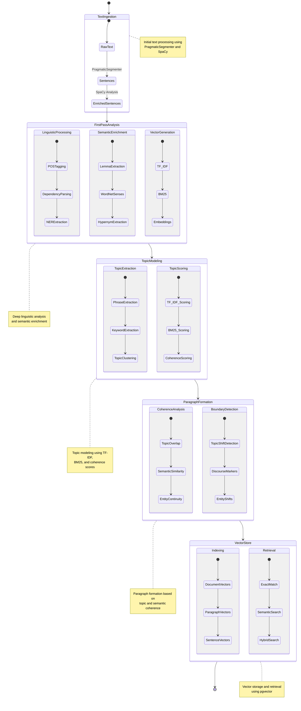
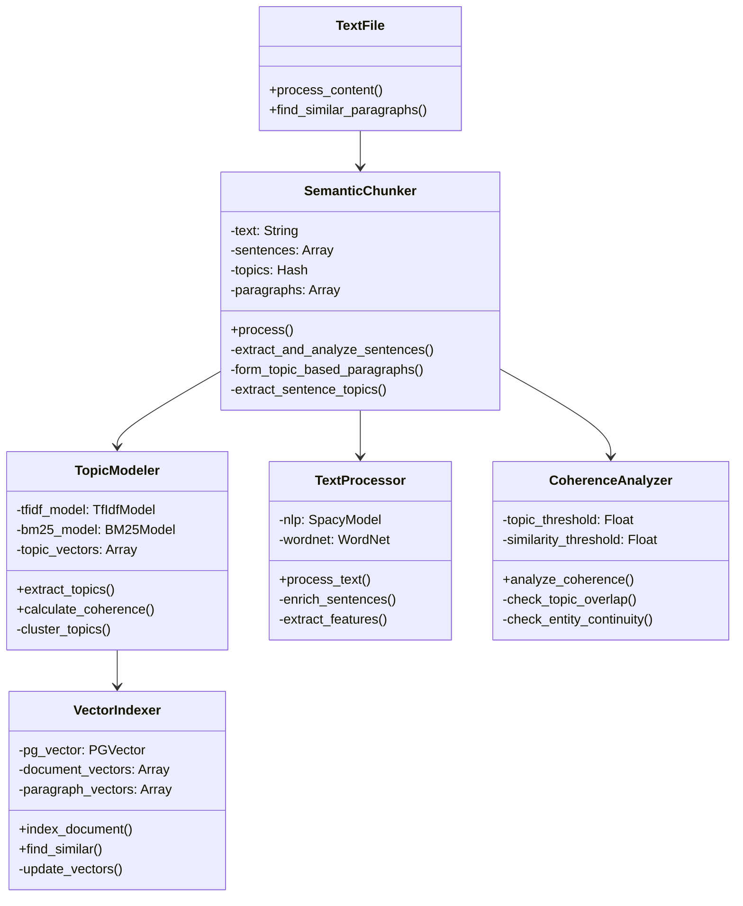

Mermaid diagram detected. Consider rendering this diagram.

1. **Initial Processing Pipeline**
    * Text segmentation using PragmaticSegmenter
    * Rich linguistic analysis with SpaCy
    * Semantic enrichment with WordNet
2. **Topic Analysis Pipeline**
    * Phrase and keyword extraction
    * Topic clustering and scoring
    * Multiple scoring methods (TF-IDF, BM25, coherence)
3. **Paragraph Formation Logic**
    * Topic overlap analysis
    * Semantic similarity checks
    * Entity continuity tracking
    * Boundary detection using multiple signals
4. **Vector Storage and Retrieval**
    * Multi-level vector indexing (document, paragraph, sentence)
    * Hybrid search combining exact and semantic matching

Mermaid diagram detected. Consider rendering this diagram.
