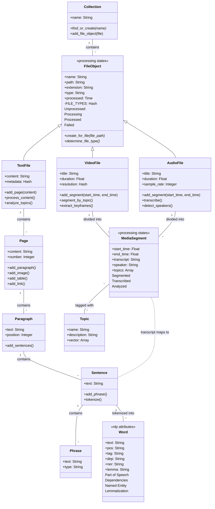

so a Collection contains a bunch of FileObjects, which could be any sort of media file....VideoFiles can be segmented by topic....AudioFiles can be segmented and transcribed.....TextFiles may contain a Page or Pages....which contain sentences, phrases, words which make up paragraphs....sentences can be tokenized and words can be tagged with various NLP attributes....



Mermaid diagram detected. Consider rendering this diagram.

This structure shows how:

1. Media Processing Flow:

```ruby
class AudioFile < FileObject
  def transcribe
    segments.each do |segment|
      transcript = transcription_service.process(segment)
      segment.update(transcript: transcript)
      
      # Create sentence mappings from transcript
      sentences = TextProcessor.new.process(transcript)
      sentences.each do |sentence_text|
        sentence = Sentence.create(text: sentence_text)
        segment.sentences.add(sentence)
      end
    end
  end
end
```

2. Cross-Media Topic Analysis:

```ruby
class MediaSegment < Ohm::Model
  def analyze_topics
    # Topics can be derived from transcript text
    topic_processor = TopicModelProcessor.instance
    topics = topic_processor.infer_topics(transcript)
    
    topics.each do |topic_data|
      topic = Topic.find_or_create(name: topic_data[:name])
      self.topics.add(topic)
    end
  end
end
```

3. Text Processing Pipeline:

```ruby
class TextFile < FileObject
  def process_content
    nlp_processor = NLPProcessor.instance
    
    pages.each do |page|
      page.paragraphs.each do |paragraph|
        paragraph.sentences.each do |sentence|
          # Tokenize and analyze
          tokens = nlp_processor.process(sentence.text)
          tokens.each do |token|
            Word.create(
              text: token.text,
              pos: token.pos,
              tag: token.tag,
              dep: token.dep,
              ner: token.ner,
              lemma: token.lemma,
              sentence: sentence
            )
          end
        end
      end
    end
  end
end
```

4. Unified Topic Analysis:

```ruby
class Topic < Ohm::Model
  # Topics can be associated with any content type
  collection :text_files, :TextFile
  collection :media_segments, :MediaSegment
  collection :sentences, :Sentence
  
  def related_content
    # Find content across different media types
    {
      text: text_files.all,
      video: media_segments.select { |s| s.file_object.type == 'video' },
      audio: media_segments.select { |s| s.file_object.type == 'audio' }
    }
  end
end
```

This structure allows for:
* Processing different media types appropriately
* Maintaining relationships between transcribed content and text content
* Cross-referencing topics across all media types
* Detailed NLP analysis of text content
* Flexible segmentation of time-based media
