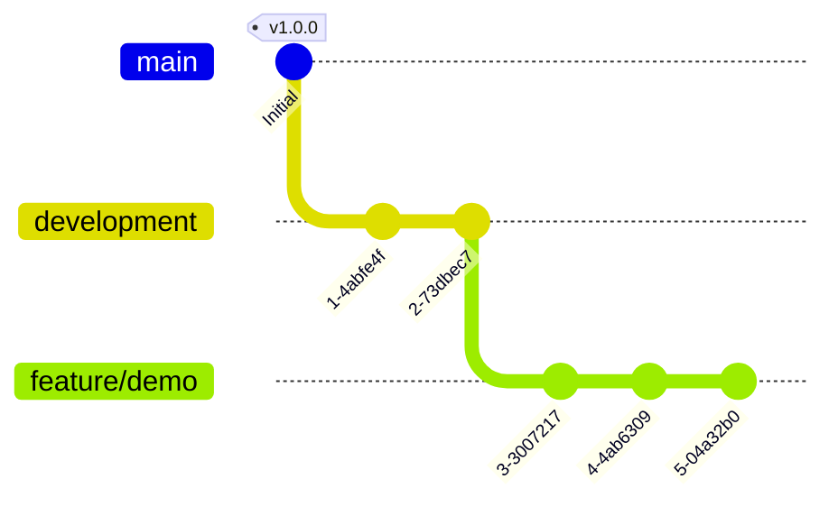
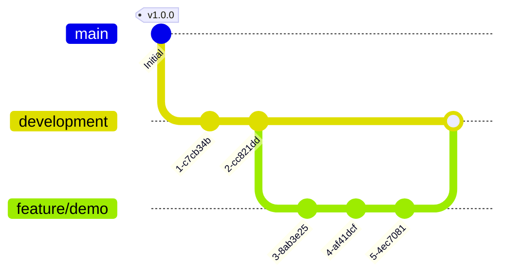
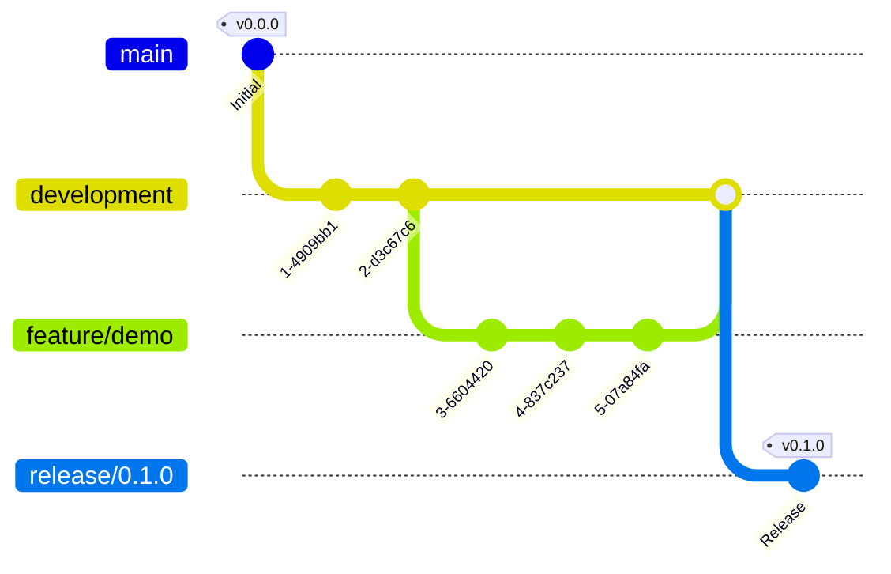
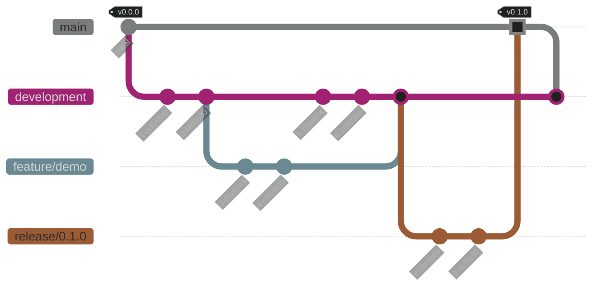
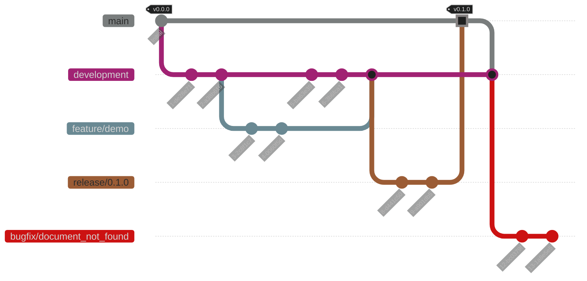
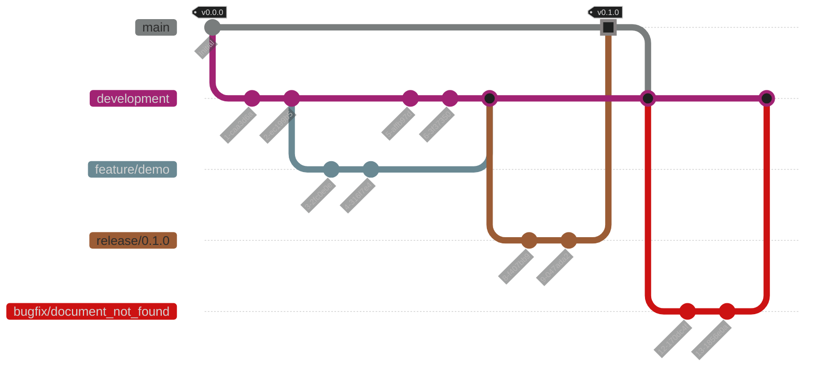
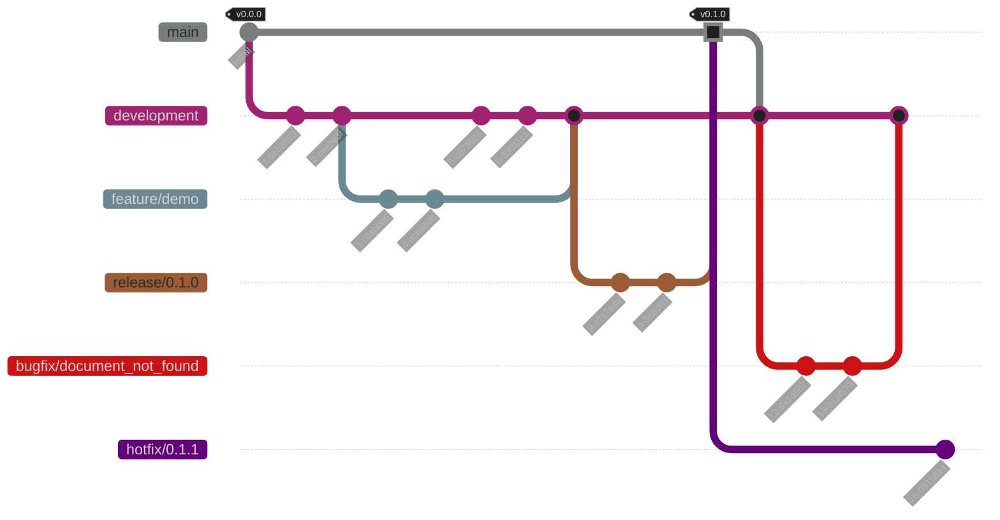
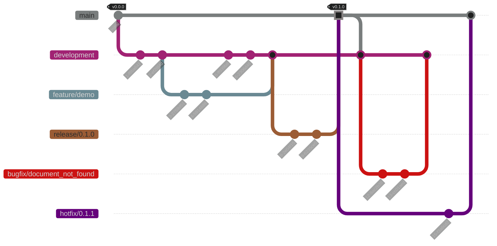
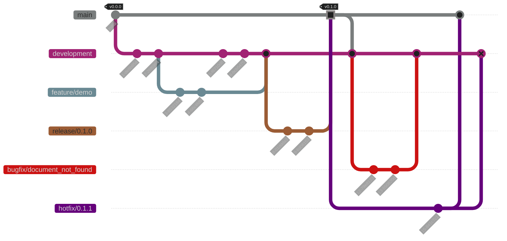

# init & Feature Start

```bash
# like anything else, we begin by initializing
[b08x@soundbot|branch: main]> git flow init
```

```bash
[b08x@soundbot|branch: development]> git flow feature start demo
# from dev branch ~> creates feature branch
# implement feature, a push to this branch triggers a job to test
# when satisfied...
```




```bash
[b08x@soundbot|branch: feature/demo]> git flow feature finish demo
# from feature branch ~> merged with dev branch

Summary of actions:
- The feature branch 'feature/demo' was merged into 'development'
- Feature branch 'feature/demo' has been locally deleted
- You are now on branch 'development'

# a push to the development branch triggers another test job
# if tests pass...
```





# Starting & Finishing a Release

```bash
[b08x@soundbot|branch: development]> git flow release start 0.1.0
# from development branch ~> creates release branch
# if desired, minor adjustments....ideally a good time to update documentations
# a push to this branch will run one last test...if successfull:
```




```bash
[b08x@soundbot|branch: release/0.1.0]> git flow release finish 0.1.0

Summary of actions:
- Release branch 'release/0.1.0' has been merged into 'main'
- The release was tagged 'v0.1.0'
- Release tag 'v0.1.0' has been back-merged into 'development'
- Release branch 'release/0.1.0' has been locally deleted
- You are now on branch 'development'

# now a push to the main branch will deploy to 'production'

```



## a bugfix branch: based on development branch

```bash
[b08x@soundbot:/tmp/flowdemo on development]
% git flow bugfix start document_not_found

Switched to a new branch 'bugfix/document_not_found'

Summary of actions:
- A new branch 'bugfix/document_not_found' was created, based on 'development'
- You are now on branch 'bugfix/document_not_found'

Now, start committing on your bugfix. When done, use:

     git flow bugfix finish document_not_found

[b08x@soundbot:/tmp/flowdemo on bugfix/document_not_found]
% vim ondev.txt

[b08x@soundbot:/tmp/flowdemo on bugfix/document_not_found]
% git commit -am 'corrected typo'

[bugfix/document_not_found c04a8bd] corrected typo
 1 file changed, 2 insertions(+)

# a push here would send to a QA host for review. if approved...
 ```



## finishing a bugfix branch will merge back into development

```bash
[b08x@soundbot:/tmp/flowdemo on bugfix/document_not_found]
% git flow bugfix finish document_not_found

Switched to branch 'development'
Updating 92d95c0..c04a8bd
Fast-forward
 ondev.txt | 2 ++
 1 file changed, 2 insertions(+)
Deleted branch bugfix/document_not_found (was c04a8bd).

Summary of actions:
- The bugfix branch 'bugfix/document_not_found' was merged into 'development'
- bugfix branch 'bugfix/document_not_found' has been locally deleted
- You are now on branch 'development'
```



# a hotfix branch: based on main

```bash
[b08x@soundbot:/tmp/flowdemo on development]
% git flow hotfix start 0.1.1

Switched to a new branch 'hotfix/0.1.1'

Summary of actions:
- A new branch 'hotfix/0.1.1' was created, based on 'main'
- You are now on branch 'hotfix/0.1.1'

Follow-up actions:
- Start committing your hot fixes
- Bump the version number now!
- When done, run:

     git flow hotfix finish '0.1.1'
```



```bash
[b08x@soundbot:/tmp/flowdemo on hotfix/0.1.1]
% vim ondev.txt

[b08x@soundbot:/tmp/flowdemo on hotfix/0.1.1]
% git commit -am 'modified on hotfix/0.1.1 branch'

[hotfix/0.1.1 521a542] modified on hotfix/0.1.1 branch
 1 file changed, 2 insertions(+)
```

### finishing a hotfix branch will merge into main then development
```bash
[b08x@soundbot:/tmp/flowdemo on hotfix/0.1.1]
% git flow hotfix finish 0.1.1

Switched to branch 'main'
Merge made by the 'ort' strategy.
 ondev.txt | 2 ++
 1 file changed, 2 insertions(+)
...
```



#### If the development branch has changes which weren't part of the release the hotfix branch is based on, there will be a merge conflict.

```bash
...
Switched to branch 'main'
Merge made by the 'ort' strategy.
 ondev.txt | 2 ++
 1 file changed, 2 insertions(+)
Switched to branch 'development'
Auto-merging ondev.txt
CONFLICT (content): Merge conflict in ondev.txt
Automatic merge failed; fix conflicts and then commit the result.
Fatal: There were merge conflicts.
```




# review the changes
Here we would need a better example to clearly show what a problem could be. In this example, since this is being merged into the development branch, we keep all of the lines. That doesn't seem right...

#TODO: a more realistic example

```bash
[b08x@soundbot:/tmp/flowdemo on development]
% cat ondev.txt1
```
```text
# an example text file
created on dev branch

edited on release 0.1.0 branch

modified on hotfix/0.1.1 branch
```


##### changes in development > merge to main

```bash
[b08x@soundbot:~/syncopated on development] git checkout main
[b08x@soundbot:~/syncopated on main] git merge --no-commit development
[b08x@soundbot:~/syncopated on main] git commit -a
[b08x@soundbot:~/syncopated on main] git push
[b08x@soundbot:~/syncopated on main] git checkout development
[b08x@soundbot:~/syncopated on development]
```


###### a sixth heading
