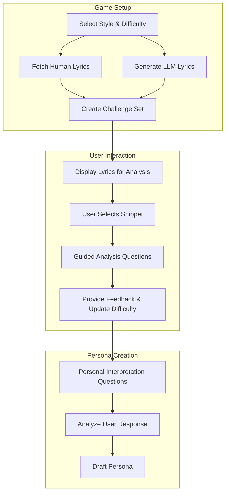

<ul class="chat-thread">
  <li>
    <p>Please condense this text, preserve context</p>
    <p>"""Students with an interest in music and lyrics: Those who enjoy deconstructing songs, analyzing how lyrics evoke emotions, and exploring themes across different musical genres. Creatively inclined students: Those who enjoy writing (poetry, short stories, etc.) or experimenting with creative mediums, regardless of their prior technical knowledge. Technologically curious students: Those interested in how AI works and how it can be used for creative purposes. Interest in coding or computer science is a plus, but not mandatory. Analytical thinkers: Students who enjoy delving deeper into texts, exploring multiple interpretations, and debating the nuances of meaning. Students seeking interdisciplinary connections: Those who are fascinated by the interplay between language, technology, and creativity"""</p>
  </li>
  <li>
    <p>Students interested in music and lyrics, creatively inclined individuals, technologically curious students, analytical thinkers, and those seeking interdisciplinary connections.</p>
  </li>
</ul>

## Music: Basically manipulation to achieve a desired outcome.

~~Witchcraft, as it was explained to me, is a practice of magic skills and abilities with the intent to influence events or individuals through the use of spells, charms, and rituals. NLP algorithms use linguistic rules and data to generate coherent and meaningful text~~

~~Witchcraft,~ 

Just as a witch might use incantations and spells to create a magical effect, NLP algorithms use linguistic rules and algorithms to generate coherent and meaningful text. Both processes involve a kind of transformation or 

*insert humor*

In this overview, a demonstration of how one could use Natural Language Processing to achieve the basically the same result.

```json
{
  "verses": [
    {
      "text": "Kernel panic, static, attic full of open source magic, Command line acrobatics, shell syntax tactics, Within the crypt of cryptic scripts, branches split and flip Pull and merge tricks, where bugs get a fix and slip."
    },
    {
      "text": "Reflecting on the echo of your echo, not so much unlike when the loops compute and dont flip on their condition in obstructive dispute. In the depths of code, a tale unfolds, gripping the command line, don't mind, fingers will turn cold."
    },
    {
      "text": "Merging blurred lines of vision, refactoring enumerable recursions. With algorithmic eyes, paved with sleepless nights, to know the idea will have the mind make no other sense other than drive. Concepts dissected, projected, connected"
    }
  ]
}

```


---

The final output should incorporate each of these elements;

- **Complex Metaphors and Imagery**: Vivid and intricate metaphors, similes, and allusions. These aren't simple comparisons; create multi-layered images.
- **Abstract and Introspective**: Delves into personal experiences, introspection, and broader philosophical themes in a way that's both raw and abstract. Lyrics demand active listening and interpretation.
- **Dense and Wordy**: The density creates a sense of urgency and gives the lyrics a distinct texture.
- **Storytelling**: While primarily focused on internal struggles and observations, incorporates narrative elements, creating vivid characters and scenarios that illuminate the main points.
- **Intellectual Focus**: Avoid common tropes of boasting or materialism, focusing instead on internal conflicts, the human condition, and social commentary.
- **Intentional Obfuscation**: At times, intentionally make the work challenging to decipher. This forces the listener to actively engage and find their own meaning.
- **Complex Flows**: Switch between rhythmic patterns and speeds. Weave words together densely while still maintaining a musical flow.
- **Verbal Dexterity**: Using words playfully, be whimsical yet insightful.
- **Freestyle Influence**: Reflects in quick-witted wordplay, find surprising rhymes and connections between concepts.
- **Positive and Uplifting Themes**: Focuses on themes of positivity, self-improvement, and finding joy in the face of life's challenges.
- **Evocative Imagery**: Focuses on sensory details and natural imagery to create a strong sense of place and emotion.
- **Conversational Tone**: Creates a more personal and relatable experience.
- **Repetition and Scatting**: Repetition of key phrases or nonsensical scatting sounds to enhances the musicality and emotional impact.
- **Love, Loss, and Connection**: Explores relationships (both romantic and otherwise), the passage of time, and finding joy in simple moments.
- **Open to Interpretation**: While the lyrics can be direct, they should be open to multiple layers of meaning. Encourages listeners to project their own experiences onto his words.
- **Emotional Resonance**: Prioritizes creating a feeling over showcasing technical lyrical prowess. Emotional resonance is paramount.

---

<ul class="chat-bubble">
  <li>
    <p>The generative grammar of the list follows a consistent structure, with each element consisting of a noun phrase ("Complex Metaphors and Imagery," "Abstract and Introspective," etc.) followed by a description that elaborates on the nature of the element. The descriptions are structured as verb phrases or verb phrases with complements, providing actions or attributes associated with each element. The grammar is largely declarative, stating facts or characteristics about each lyrical element rather than giving commands or making requests.</p>
  </li>
</ul>

---


```json
{
  "lyrical_elements": [
    {
      "element": "Complex Metaphors and Imagery",
      "description": "Vivid and intricate metaphors, similes, and allusions. These aren't simple comparisons; create multi-layered images."
    },
    {
      "element": "Abstract and Introspective",
      "description": "Delves into personal experiences, introspection, and broader philosophical themes in a way that's both raw and abstract. Lyrics demand active listening and interpretation."
    },
    {
      "element": "Dense and Wordy",
      "description": "The density creates a sense of urgency and gives the lyrics a distinct texture."
    },
    {
      "element": "Storytelling",
      "description": "While primarily focused on internal struggles and observations, incorporates narrative elements, creating vivid characters and scenarios that illuminate the main points."
    },
    {
      "element": "Intellectual Focus",
      "description": "Avoid common tropes of boasting or materialism, focusing instead on internal conflicts, the human condition, and social commentary."
    },
    {
      "element": "Intentional Obfuscation",
      "description": "At times, intentionally make the work challenging to decipher. This forces the listener to actively engage and find their own meaning."
    },
    {
      "element": "Complex Flows",
      "description": "Switch between rhythmic patterns and speeds. Weave words together densely while still maintaining a musical flow."
    },
    {
      "element": "Verbal Dexterity",
      "description": "Using words playfully, be whimsical yet insightful."
    },
    {
      "element": "Freestyle Influence",
      "description": "Reflects in quick-witted wordplay, find surprising rhymes and connections between concepts."
    },
    {
      "element": "Positive and Uplifting Themes",
      "description": "Focuses on themes of positivity, self-improvement, and finding joy in the face of life's challenges."
    },
    {
      "element": "Evocative Imagery",
      "description": "Focuses on sensory details and natural imagery to create a strong sense of place and emotion."
    },
    {
      "element": "Conversational Tone",
      "description": "Creates a more personal and relatable experience."
    },
    {
      "element": "Repetition and Scatting",
      "description": "Repetition of key phrases or nonsensical scatting sounds to enhances the musicality and emotional impact."
    },
    {
      "element": "Love, Loss, and Connection",
      "description": "Explores relationships (both romantic and otherwise), the passage of time, and finding joy in simple moments."
    },
    {
      "element": "Open to Interpretation",
      "description": "While the lyrics can be direct, they should be open to multiple layers of meaning. Encourages listeners to project their own experiences onto his words."
    },
    {
      "element": "Emotional Resonance",
      "description": "Prioritizes creating a feeling over showcasing technical lyrical prowess. Emotional resonance is paramount."
    }
  ]
}
```


```ruby
module LyricalElements
  ELEMENTS = [
    "Complex Metaphors and Imagery",
    "Abstract and Introspective",
    "Dense and Wordy",
    "Storytelling",
    "Intellectual Focus",
    "Intentional Obfuscation",
    "Complex Flows",
    "Verbal Dexterity",
    "Freestyle Influence",
    "Positive and Uplifting Themes",
    "Evocative Imagery",
    "Conversational Tone",
    "Repetition and Scatting",
    "Love, Loss, and Connection",
    "Open to Interpretation",
    "Emotional Resonance"
  ].freeze

  def self.random_element
    ELEMENTS.sample
  end
end

class LyricGenerator
  include LyricalElements

  def generate_lyrics
    elements = []
    4.times { elements << LyricalElements.random_element }

    lyrics = []

    elements.each do |element|
      case element
      when "Complex Metaphors and Imagery"
        
      when "Abstract and Introspective"
        
      when "Dense and Wordy"
        
      when "Storytelling"
        
      # Add more cases for other elements
      end
    end

    lyrics.join("\n")
  end
end

# Example usage
generator = LyricGenerator.new
puts generator.generate_lyrics

```

```ruby
require 'anthropic'

class LyricGenerator
  attr_reader :lyrical_elements

  def initialize
    @lyrical_elements = load_lyrical_elements
    Anthropic.configure { |config| config.access_token = ENV.fetch("ANTHROPIC_API_KEY") }
    @client = Anthropic::Client.new
  end

  def generate_lyrics
    elements = []
    4.times { elements << @lyrical_elements.sample }

    lyrics = []

    elements.each do |element|
      lyrics << generate_text(element["description"])
    end

    lyrics.join("\n\n")
  end

  private

  def load_lyrical_elements
    JSON.parse(File.read('lyrical_elements.json'))["lyrical_elements"]
  end

  def generate_text(description)
    response = @client.complete(
      parameters: {
        model: "claude-3-haiku",
        prompt: description,
        max_tokens_to_sample: 50
      }
    )
    response["completion"]
  end
end

# Example usage
generator = LyricGenerator.new
puts generator.generate_lyrics

```


---

1. **Structure:**
    
    - **Rhyme Schemes:** In your prompt, include "Follow an AABB rhyme scheme" or variations thereof.
    - **Song Sections:** Specify if you want a verse, chorus, or bridge. This helps the LLM generate lyrics with the right flow.
    - **Lines/Syllables:** Consider setting limits like "Each line should have roughly 8 syllables."


1. **Metaphors and Imagery:**
    
    - **Seed the Prompt:** Instead of asking for metaphors generally, provide one: "The weight of my mistakes is like..." and let the LLM complete the thought.
    - **Sensory Details:** Request lyrics focusing on a specific sense (sight, sound, smell) for a richer experience.

    - **Unique Diction:** Prompt the LLM to use slang, archaic language, or a regional dialect depending on the style.


Functions:
**Prompt Crafting: The build_prompt function is where you'll shape the instructions given to the LLM.**

**Automated Analysis: Use NLP gems like ruby-spacy to analyze generated lyrics for basic metrics (readability score, presence of repetitive phrases). This can help filter out exceptionally poor quality outputs.**


---

User Scenario


1. Lyric Presentation: The application presents a randomly selected set of lyrics (ideally focused on a specific theme or style for greater educational value).
    
2. Prompt Analysis Task: The user is given a task to analyze the lyrics. Sample tasks could include:


- Identifying the underlying theme of the lyrics.
- Detecting the primary emotions conveyed.
- Breaking down specific metaphors or literary devices used.

3. Prompt Engineering Challenge: The user is then asked to craft a prompt for a language model with the goal of:

- Generating similar lyrics (style, structure, theme).
- Asking the LM to analyze the original lyrics for sentiment.
- Summarise the key concepts within the lyrics.

4. Feedback and Refinement:
- LM Response Evaluation: The user's prompt is fed to a language model, and the resulting output is presented. They evaluate if the model's response aligns with their intentions.
- Guidance: The application provides feedback on the prompt's strengths and weaknesses, offering tips for improvement.


---


1. "Odd One Out" Exercise:
- Create a function to pull sets of lyrics (e.g., 3 human-written, 1 LLM).
- Develop analysis prompts to display to the user alongside the lyrics.

- Implement logic to track user choices and provide explanatory feedback.

### Notes on Functionality 2: LLM Detection "Odd One Out"

Premise: Present the user with a set of three or four short lyrical passages. One of these passages is LLM-generated, while the others are human-written. The user's task is to:

1. Identify which lyric snippet they believe is LLM-generated.   
2. Articulate the reasoning behind their choice.

How It Works

Lyric Selection:
- LLM-generated: Use a language model to produce lyrics mimicking different styles (be sure to use various models, as some are more sophisticated than others).
- Human-written: Source snippets from a database of song lyrics or poetry.
- Balancing Difficulty: Initially, select LLM content that exhibits obvious tells and pair it with distinctive human-written lyrics. Gradually increase the difficulty as the user improves.
    

Guided Analysis: 
After the user makes their choice, provide guiding questions to help them pinpoint their reasoning. 
Examples:
- "Does the language feel repetitive or generic?"
- "Are the metaphors and imagery vivid or cliché?"
- "Is there a clear sense of emotion, or does the passage feel impersonal?"
- "Does the word choice feel natural or are there awkward phrases?"
- Feedback: 
  - Provide clear explanations for why the user's choice was correct or not. Highlight the specific elements that exposed a passage as LLM-generated.

Personal Interpretation:
Ask the user to summarize their overall understanding of the excerpt's message.

Connection to Experience:
- Inquiry: Ask, "Do any of the themes, emotions, or images explored in the excerpt resonate with your own experiences? If so, how?"

Logic Branch: Guiding Lyric Creation

- If YES, they resonate:
- Focus: Ask the user to elaborate on the specific personal experience that connects to the excerpt.
    
- Imagery: Guide them to brainstorm their own metaphors and symbols that represent their experience.
    
- Structure: Suggest simple lyric structures (couplets, short verses) to start expressing their idea.
    

- If NO, no resonance:
- Reflection: Ask, "Can you recall an experience of confusion, searching, or a time when your perspective shifted?"
    
- Adaptation: Help them draw parallels between the excerpt's imagery and a relatable personal situation.

Additional Notes:

- Overcoming Confirmation Bias: Ensure the exercise doesn't become a guessing game. Sometimes, the task might be to identify lyrics that are all human-written to prevent the user from always assuming there's one LLM-generated example present.


Agile User Story: 

I guess sort of a game to discern language model generated lyrics from human-written lyrics. And then they'll be asked to articulate the reasoning behind their choice, with leading questions as guidelines. After answering the questions,Ask the user to summarize their overall understanding of the excerpt's message. Then, assess the connection to experience. 

Then, craft a prompt that correlates the user responses to personality dimensions. The intent is to craft a persona for the lyric generation,
The persona should encapsulate all crucial personality dimensions determined from the users responses, along with the motivations and aspirations associated with the lyrical elements. Keep in mind to balance succinctness and depth of detail for each dimension. The deliverable here is a comprehensive draft of the character sheet that captures the speaker's unique essence. Validate its content and ensure it captures both the speaker’s overt characteristics and the subtler undertones.





### Logic for Persona Generation

1. **Preprocessing**
    
    - **Tokenize and Normalize:** Split the user's response into words, lowercase them for easier matching.
    - **Lemmatization (if using 'lemmatizer'):** Reduce words to their root form (e.g., "running" -> "run").
2. **Keyword Identification**
    
    - **Emotion Words:** Create a list of emotion-related words (sad, joyful, anxious). Compare against the user's response for matches. You can use WordNet to expand synonyms.
    - **Theme Keywords:** Decide which broader themes resonate with your LLM exercise (love, loss, defiance). Use a similar matching approach.
3. **Sentiment Analysis**
    
    - **Integrate an NLP Gem:** Employ a gem like 'ruby-spacy' for basic sentiment (positive, negative, neutral) detection on the overall response.
    - **Caveat:** Sentiment of a short text can be inaccurate, use it as one data point
4. **Persona Template**
    
    - **Key Sections:**
        - **Background:** Extremely simple. Could be just age range, gender (optional, inferred if possible)
        - **Motivations:** Based on themes. "Driven by a yearning for connection"
        - **Emotional Landscape:** Dominant sentiment, emotion words. "Prone to melancholy, seeks moments of joy"
        - **Voice:** Based on original lyrics. "Poetic and introspective" OR "Direct and defiant"
5. **Interpretation and Refinement**
    
    - **Avoid Oversimplification:** If sentiment is positive, but keywords include "struggle," temper your persona draft.
    - **Nuance:** Look for interesting contradictions in the response. These make a persona more realistic.


---


## Lyrical Elements


```ruby
require 'wordnet'
lexicon = WordNet::Lexicon.new 
synsets = lexicon.lookup_synsets('intellectual focus')
keywords = []
synsets.each do |synset|
    keywords += synset.words.map(&:lemma) # Synonyms

    synset.hyponyms.each do |hyponym_set|
        keywords += hyponym_set.words.map(&:lemma)
    end
end

keywords.uniq! # Remove duplicates
puts keywords 
```


```json
{
    "elements": [
        {
            "name": "Abstract and Introspective",
            "subelements": [
                {
                    "name": "Abstract",
                    "details": {
                        "synsets": "Explore senses related to concepts, not physical objects.",
                        "hyponyms": "Look for words like 'thought,' 'idea,' 'theory.'",
                        "related_words": "Consider terms like 'philosophical,' 'metaphysical.'"
                    }
                },
                {
                    "name": "Introspective",
                    "details": {
                        "synsets": "Focus on the sense of examining one's own thoughts and feelings.",
                        "hyponyms": "Focus on words like 'self-analysis,' 'contemplative,' 'reflective,' 'soul-searching.'"
                    }
                }
            ],
            "keywords": {
                "emotions": [
                    "wistful",
                    "pensive",
                    "nostalgic",
                    "contemplative",
                    "yearning",
                    "uncertain",
                    "conflicted",
                    "introverted"
                ],
                "themes": [
                    "identity",
                    "self-discovery",
                    "existentialism",
                    "consciousness",
                    "memory",
                    "the human condition",
                    "spirituality"
                ]
            }
        },
        {
            "name": "Storytelling",
            "details": {
                "narrative_focus": "Search for variations on 'story,' 'tale,' 'chronicle.'",
                "hyponyms": "These might reveal specific narrative forms (fable, myth, legend).",
                "character-driven": "Explore words like 'character,' 'persona,' and 'protagonist.'"
            },
            "keywords": {
                "emotions": [
                    "empathy",
                    "longing",
                    "suspense",
                    "curiosity",
                    "awe",
                    "bittersweet"
                ],
                "themes": [
                    "journey",
                    "transformation",
                    "conflict",
                    "resolution",
                    "legacy",
                    "morality",
                    "good vs. evil"
                ]
            }
        },
        {
            "name": "Emotional Resonance",
            "details": {
                "synonyms_and_intensity": "Go beyond basic 'emotion.' Consider 'passion,' 'affect,' 'sentiment.' Find words for different intensities: 'stirring' vs. 'overwhelming.'",
                "evoke_vs_describe": "Think about words that capture the act of evoking emotion, not just labeling it. Terms like 'resonate,' 'haunt,' 'stir.'"
            }
        }
    ]
}
```


**Potential Keywords**

- **Emotions:** melancholy, poignant, cathartic, wistful, transcendent, bittersweet, raw, vulnerable.
- **Themes:** (These overlap strongly with other elements, but focus here on the _experience_ of feeling - connection, universality, empathy, catharsis).

**Important Notes**
- **Curation is Key:** WordNet will generate a lot of options. Remove words that don't fit the ***tone*** of your lyric analysis.
- **Genre Matters:** If you focus on, say, introspective folk music, your lists will be different than analyzing hard-hitting hip-hop.


<ul class="chat-thread">
  <li>
    <p>Generate a verse that Prioritizes creating a feeling over showcasing technical lyrical prowess. Use Vivid and intricate metaphors, similes, and allusions. These aren't simple comparisons; create multi-layered images. At times, intentionally make the work challenging to decipher. Emotional resonance is paramount</p>
  </li>
  <li>
    <p>In the twilight's hush, where shadows dance like memories, I seek the echo of your touch in the rustle of the leaves. The moon, a silent witness, veiled in a cloak of mist, Whispers secrets of the night, in a language only we resist.</p>
    <p>Like a river's journey through the heart of time,  
    Our love flows on, a rhythm without rhyme.  
    In the tapestry of stars, our story is sewn,  
    A constellation of dreams, in the night sky alone.</p>
    <p>Each word a brushstroke on the canvas of my soul,  
    Painting pictures of longing, of love's toll.  
    In the silence between heartbeats, your name I call,  
    A symphony of yearning, in the night's dark thrall.</p>
    <p>So let the world spin on, in its endless chase,  
    We'll linger here, in our secret place.  
    For in the language of the heart, where words fail,  
    Our love's story, in whispers, will prevail.</p>
  </li>
</ul>


https://cloud.google.com/vertex-ai/generative-ai/docs/text/text-prompts


---

The first task we'll create will remove all of the punctuation from the lyrics. This can be done using the following code: 

```ruby

class Tokenizer < ComposableOperations::Operation
  processes :chunks
	
  property :punct, default: :all, required: true
  property :stopwords, default: false, required: true

  before do
    @options = {
      remove_stop_words: stopwords,
      punctuation: punct,
      numbers: :all,
      minimum_length: 0,
      remove_emoji: true,
      remove_emails: true,
      remove_urls: true,
      remove_domains: true,
      expand_contractions: true,
      clean: false,
      mentions: :keep_original,
      hashtags: :keep_original,
      classic_filter: true,
      downcase: false,
      long_word_split: 20
    }
  end

  def execute
    chunks.segment.map do |segment|
    PragmaticTokenizer::Tokenizer.new(@options).tokenize(segment)
  end

end
```


The next task we'll create will tokenize the lyrics. This can be done using the following code: 
```ruby 
def tokenize(lyrics)
  lyrics.split(' ')
end 
``` 

The final task we'll create will create a bag-of-words representation of the lyrics. 

This can be done using the following code: 
```ruby
def create_bag_of_words(lyrics)
  lyrics.map { |word| word.downcase }.to_set 
end 
``` 

Once we've created the bag-of-words representation of the lyrics, we can use it to train a machine learning model to generate new lyrics. 

We can do this using the following code: 
```ruby 
model = LinearRegression.new model.fit(X, y)
``` 

Once the model is trained, we can use it to generate new lyrics. We can do this using the following code: 

```ruby
generated_lyrics = model.predict(X_test) 
``` 

The generated lyrics will be a mix of real lyrics and new lyrics that have been generated by the model. We can then use these lyrics to create new songs. NLP is a powerful tool that can be used to generate text. By using NLP to generate music lyrics, we can create new songs that are both relevant