```mermaid!
graph LR

subgraph N[Item]

subgraph E[Embedding]

  
  

subgraph Subject

subgraph Content

subgraph Page

subgraph Sections

A[Heading<br/>Paragraphs]

  

J[Subheading<br/>Paragraphs]

  

K[Lists<br/>Tables<br/>Figures]

end

end

end

end

A --- F[Sentences] --> U[Phrases] --> W[Words] ---> S[Tokens] ---> T[Subject]

  

J --- F[Sentences] --> U[Phrases] --> W[Words] --> S[Tokens] --> T[Subject]

  

K --- F[Sentences] --> U[Phrases] --> W[Words] ---> S[Tokens] ---> T[Subject]

end

  
  

end

style N fill:#1a1a1a,stroke:#333,stroke-width:4px

style E fill:#2a1a2a,stroke:#f66,stroke-width:2px,color:#fff,stroke-dasharray: 5 5

```

## Index
- [[Capturing Personality with Verb Phrase Extraction]]
- [[Chunk Analyzer]]
- [[Echo Embedding]]
- [[Parts of a Document]]
- [[Ranking Chunks]]
- [[STS Semantic Textual Similarity]]
- [[Stop Words]]
- [[Text Processing]]

# Text Processing: The Process

Text processing refers to the use of computational methods and techniques to analyze, understand, and generate text data. It encompasses various subfields such as natural language processing (NLP), text mining, information retrieval, and text analysis.

In general, text processing involves several steps:

1. **Text Preprocessing**: This step involves cleaning and formatting the raw text data to make it suitable for further analysis. It may include tasks such as removing punctuation marks or special characters, converting text to lowercase, tokenization (breaking down text into smaller pieces, such as words or sentences), and stemming (reducing words to their base form).
2. **Text Analysis**: This step involves analyzing the text data to extract useful information or insights. It may include tasks such as sentiment analysis (determining the emotion or attitude expressed in a piece of text), topic modeling (identifying the main topics discussed in a text), and entity recognition (identifying important entities mentioned in a text, such as names, locations, or organizations).
3. **Text Understanding**: This step involves understanding the meaning of the text data. It may include tasks such as parsing (analyzing the structure and grammar of a sentence) and semantic analysis (understanding the meaning of words and phrases in context).
4. **Text Generation**: This step involves generating new text data based on existing text data or specific instructions. It may involve tasks such as writing summaries, generating chatbot responses, or creating new text based on a given prompt.

By using different techniques and algorithms, researchers and practitioners can automate various aspects of text processing, making it easier to analyze large amounts of text data quickly and accurately. 

## scratch

https://github.com/MLRG-CEFET-RJ/ml-class/blob/master/DataMining_week08.ipynb

## SetFit

SetFit is an efficient and prompt-free framework for few-shot fine-tuning of [Sentence Transformers](https://sbert.net/).

https://github.com/huggingface/setfit
https://github.com/davidberenstein1957/spacy-setfit

