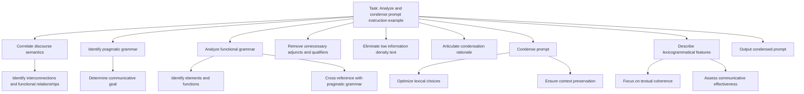

## I. Introduction

   A. The importance of efficient prompts in LLMOps

   B. Overview of the prompt condensation process

## II. Understanding the Original Prompt

   A. Analyzing discourse semantics

   B. Identifying pragmatic grammar

   C. Breaking down functional grammar elements

## III. The Condensation Process

   A. Removing unnecessary qualifiers and redundancies

   B. Streamlining instructions while preserving core information

   C. Consolidating constraints and requirements

## IV. Rationale Behind Condensation Decisions

   A. Balancing brevity with clarity

   B. Ensuring all essential information is retained

   C. Considering the impact on LLM comprehension and output

## V. Lexicogrammatical Considerations

   A. Maintaining appropriate mood and tone

   B. Using concise noun phrases effectively

   C. Preserving hierarchical structure in condensed form

## VI. Before and After: A Comparative Analysis

   A. Side-by-side comparison of original and condensed prompts

   B. Quantitative analysis (e.g., word count reduction, estimated token savings)

   C. Qualitative analysis of preserved meaning and functionality

## VII. Applications in LLMOps

   A. Improved efficiency in high-volume scenarios

   B. Cost reduction through optimized token usage

   C. Enhanced scalability of LLM-based systems

## VIII. Challenges and Considerations

   A. Potential pitfalls of over-condensation

   B. Balancing condensation with model-specific requirements

   C. Maintaining prompt effectiveness across different LLMs

## IX. Towards Automation: Future Directions

   A. Potential for AI-assisted prompt condensation

   B. Integrating condensation into LLMOps workflows

   C. Ethical considerations in automated prompt optimization

## X. Conclusion

   A. Recap of key condensation principles

   B. The evolving role of prompt engineering in AI development

   C. Call to action for continued innovation in prompt optimization

