```mermaid!
---
title: Ansible Playbook Grapher
---
%%{ init: { "flowchart": { "curve": "bumpX" } } }%%
flowchart LR
	%% Start of the playbook 'example/playbooks/desktop.yml'
	playbook_cebe15f2("example/playbooks/desktop.yml")
		%% Start of the play 'Play: all (8)'
		play_678c9b12["Play: all (8)"]
		style play_678c9b12 fill:#b27d1a,color:#ffffff
		playbook_cebe15f2 --> |"1"| play_678c9b12
		linkStyle 0 stroke:#b27d1a,color:#b27d1a
			pre_task_8a1d69f5["[pre_task]  warn about setting ANSIBLE_HOME"]
			style pre_task_8a1d69f5 stroke:#b27d1a,fill:#ffffff
			play_678c9b12 --> |"1"| pre_task_8a1d69f5
			linkStyle 1 stroke:#b27d1a,color:#b27d1a
			pre_task_cefc659f["[pre_task]  Set datetime"]
			style pre_task_cefc659f stroke:#b27d1a,fill:#ffffff
			play_678c9b12 --> |"2"| pre_task_cefc659f
			linkStyle 2 stroke:#b27d1a,color:#b27d1a
			pre_task_dfd53f32["[pre_task]  Set suffix"]
			style pre_task_dfd53f32 stroke:#b27d1a,fill:#ffffff
			play_678c9b12 --> |"3"| pre_task_dfd53f32
			linkStyle 3 stroke:#b27d1a,color:#b27d1a
			pre_task_139477bd["[pre_task]  Set admin group name"]
			style pre_task_139477bd stroke:#b27d1a,fill:#ffffff
			play_678c9b12 --> |"4"| pre_task_139477bd
			linkStyle 4 stroke:#b27d1a,color:#b27d1a
			pre_task_bbe67017["[pre_task]  Check -march support"]
			style pre_task_bbe67017 stroke:#b27d1a,fill:#ffffff
			play_678c9b12 --> |"5"| pre_task_bbe67017
			linkStyle 5 stroke:#b27d1a,color:#b27d1a
			%% Start of the block ''
			block_262e11b5["[block] "]
			style block_262e11b5 fill:#b27d1a,color:#ffffff,stroke:#b27d1a
			play_678c9b12 --> |"6 [when: supported_march.stdout_lines[0] is defined]"| block_262e11b5
			linkStyle 6 stroke:#b27d1a,color:#b27d1a
			subgraph subgraph_block_262e11b5[" "]
				pre_task_7688b400[" Set architecture"]
				style pre_task_7688b400 stroke:#b27d1a,fill:#ffffff
				block_262e11b5 --> |"1 [when: supported_march.stdout_lines[0] is defined and supported_march.stdout_lines[0] == 'x86-64-v3']"| pre_task_7688b400
				linkStyle 7 stroke:#b27d1a,color:#b27d1a
				pre_task_8f994511[" Set architecture"]
				style pre_task_8f994511 stroke:#b27d1a,fill:#ffffff
				block_262e11b5 --> |"2 [when: supported_march.stdout_lines[0] is defined and supported_march.stdout_lines[0] == 'x86-64-v2']"| pre_task_8f994511
				linkStyle 8 stroke:#b27d1a,color:#b27d1a
			end
			%% End of the block ''
			pre_task_e728455f["[pre_task]  Show desktop variables"]
			style pre_task_e728455f stroke:#b27d1a,fill:#ffffff
			play_678c9b12 --> |"7"| pre_task_e728455f
			linkStyle 9 stroke:#b27d1a,color:#b27d1a
			%% Start of the role 'common'
			play_678c9b12 --> |"8"| role_9efab239
			linkStyle 10 stroke:#b27d1a,color:#b27d1a
			role_9efab239("[role] common")
			style role_9efab239 fill:#b27d1a,color:#ffffff,stroke:#b27d1a
			%% End of the role 'common'
			%% Start of the role 'terminal'
			play_678c9b12 --> |"9"| role_ede997b0
			linkStyle 11 stroke:#b27d1a,color:#b27d1a
			role_ede997b0("[role] terminal")
			style role_ede997b0 fill:#b27d1a,color:#ffffff,stroke:#b27d1a
			%% End of the role 'terminal'
			%% Start of the role 'network'
			play_678c9b12 --> |"10"| role_91e02cd2
			linkStyle 12 stroke:#b27d1a,color:#b27d1a
			role_91e02cd2("[role] network")
			style role_91e02cd2 fill:#b27d1a,color:#ffffff,stroke:#b27d1a
			%% End of the role 'network'
			%% Start of the role 'ruby'
			play_678c9b12 --> |"11"| role_58e53d13
			linkStyle 13 stroke:#b27d1a,color:#b27d1a
			role_58e53d13("[role] ruby")
			style role_58e53d13 fill:#b27d1a,color:#ffffff,stroke:#b27d1a
			%% End of the role 'ruby'
			%% Start of the role 'alsa'
			play_678c9b12 --> |"12"| role_a32a2af4
			linkStyle 14 stroke:#b27d1a,color:#b27d1a
			role_a32a2af4("[role] alsa")
			style role_a32a2af4 fill:#b27d1a,color:#ffffff,stroke:#b27d1a
			%% End of the role 'alsa'
			%% Start of the role 'pipewire'
			play_678c9b12 --> |"13"| role_089ace76
			linkStyle 15 stroke:#b27d1a,color:#b27d1a
			role_089ace76("[role] pipewire")
			style role_089ace76 fill:#b27d1a,color:#ffffff,stroke:#b27d1a
			%% End of the role 'pipewire'
			%% Start of the role 'jack'
			play_678c9b12 --> |"14"| role_4ff9fc6e
			linkStyle 16 stroke:#b27d1a,color:#b27d1a
			role_4ff9fc6e("[role] jack")
			style role_4ff9fc6e fill:#b27d1a,color:#ffffff,stroke:#b27d1a
			%% End of the role 'jack'
			%% Start of the role 'pulseaudio'
			play_678c9b12 --> |"15"| role_6846e4f7
			linkStyle 17 stroke:#b27d1a,color:#b27d1a
			role_6846e4f7("[role] pulseaudio")
			style role_6846e4f7 fill:#b27d1a,color:#ffffff,stroke:#b27d1a
			%% End of the role 'pulseaudio'
			%% Start of the role 'audio'
			play_678c9b12 --> |"16"| role_a5ca0b58
			linkStyle 18 stroke:#b27d1a,color:#b27d1a
			role_a5ca0b58("[role] audio")
			style role_a5ca0b58 fill:#b27d1a,color:#ffffff,stroke:#b27d1a
			%% End of the role 'audio'
			%% Start of the role 'docker'
			play_678c9b12 --> |"17"| role_05b6053c
			linkStyle 19 stroke:#b27d1a,color:#b27d1a
			role_05b6053c("[role] docker")
			style role_05b6053c fill:#b27d1a,color:#ffffff,stroke:#b27d1a
			%% End of the role 'docker'
			%% Start of the role 'libvirt'
			play_678c9b12 --> |"18"| role_b0839af9
			linkStyle 20 stroke:#b27d1a,color:#b27d1a
			role_b0839af9("[role] libvirt")
			style role_b0839af9 fill:#b27d1a,color:#ffffff,stroke:#b27d1a
			%% End of the role 'libvirt'
			%% Start of the role 'theme'
			play_678c9b12 --> |"19"| role_f484570d
			linkStyle 21 stroke:#b27d1a,color:#b27d1a
			role_f484570d("[role] theme")
			style role_f484570d fill:#b27d1a,color:#ffffff,stroke:#b27d1a
			%% End of the role 'theme'
			%% Start of the role 'desktop'
			play_678c9b12 --> |"20"| role_b2c79ad7
			linkStyle 22 stroke:#b27d1a,color:#b27d1a
			role_b2c79ad7("[role] desktop")
			style role_b2c79ad7 fill:#b27d1a,color:#ffffff,stroke:#b27d1a
			%% End of the role 'desktop'
			%% Start of the role 'user'
			play_678c9b12 --> |"21"| role_ee11cbb1
			linkStyle 23 stroke:#b27d1a,color:#b27d1a
			role_ee11cbb1("[role] user")
			style role_ee11cbb1 fill:#b27d1a,color:#ffffff,stroke:#b27d1a
			%% End of the role 'user'
			%% Start of the role 'applications'
			play_678c9b12 --> |"22"| role_b5fba9ff
			linkStyle 24 stroke:#b27d1a,color:#b27d1a
			role_b5fba9ff("[role] applications")
			style role_b5fba9ff fill:#b27d1a,color:#ffffff,stroke:#b27d1a
			%% End of the role 'applications'
			post_task_b287d10a["[post_task]  Cleanup old backup files"]
			style post_task_b287d10a stroke:#b27d1a,fill:#ffffff
			play_678c9b12 --> |"23 [when: cleanup is defined]"| post_task_b287d10a
			linkStyle 25 stroke:#b27d1a,color:#b27d1a
		%% End of the play 'Play: all (8)'
	%% End of the playbook 'example/playbooks/desktop.yml'


```

The "Syncopated" Ansible collection is a framework that contains roles, playbooks, and modules to help configure and manage Linux hosts that are part of an audio production workflow. This includes digital signal processing (DSP) servers as well as digital audio workstation (DAW) client machines.

---



---


```
"example/group_vars/all.yml"
{"user"=>{"name"=>"b08x", "realname"=>"Robert Pannick", "group"=>"b08x", "uid"=>1000, "gid"=>1000, "secondary_groups"=>"input,video,audio", "sudoers"=>true, "home"=>"/home/b08x", "workspace"=>"/home/b08x/Workspace", "shell"=>"/usr/bin/zsh", "email"=>"rwpannick@gmail.com", "gpg"=>"36A6ECD355DB42B296C0CEE2157CA2FC56ECC96A", "dots"=>"git@github.com:b08x/dots.git"}, "users"=>[{"name"=>"root", "group"=>"root", "uid"=>0, "gid"=>0, "home"=>"/root", "shell"=>"/usr/bin/zsh"}, {"name"=>"b08x", "realname"=>"Robert Pannick", "group"=>"b08x", "uid"=>1000, "gid"=>1000, "secondary_groups"=>"input,video,audio", "sudoers"=>true, "home"=>"/home/b08x", "workspace"=>"/home/b08x/Workspace", "shell"=>"/usr/bin/zsh", "email"=>"rwpannick@gmail.com", "gpg"=>"36A6ECD355DB42B296C0CEE2157CA2FC56ECC96A", "dots"=>"git@github.com:b08x/dots.git"}], "autofs_client"=>{"host"=>"bender", "shares"=>["backup", "storage"]}, "docker"=>{"storage"=>"/var/lib/docker", "service"=>{"enabled"=>true}, "nvidia"=>false, "users"=>["b08x"]}, "libvirt"=>{"service"=>{"enabled"=>false}, "users"=>["b08x"]}}
"example/group_vars/server.yml"
nil
No Variables in example/group_vars/server.yml
"example/group_vars/workstation.yml"
nil
No Variables in example/group_vars/workstation.yml
+---------------------------------------------------------------------------------------------------------------------------->>
|            File            |      Key      |                                                                               >>
+---------------------------------------------------------------------------------------------------------------------------->>
| example/group_vars/all.yml | user          | {"name"=>"b08x", "realname"=>"Robert Pannick", "group"=>"b08x", "uid"=>1000, ">>
| example/group_vars/all.yml | users         | [{"name"=>"root", "group"=>"root", "uid"=>0, "gid"=>0, "home"=>"/root", "shell>>
| example/group_vars/all.yml | autofs_client | {"host"=>"bender", "shares"=>["backup", "storage"]}                           >>
| example/group_vars/all.yml | docker        | {"storage"=>"/var/lib/docker", "service"=>{"enabled"=>true}, "nvidia"=>false, >>
| example/group_vars/all.yml | libvirt       | {"service"=>{"enabled"=>false}, "users"=>["b08x"]}                            >>
+---------------------------------------------------------------------------------------------------------------------------->>

```

