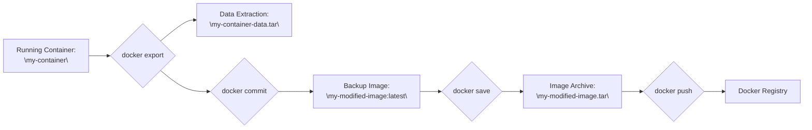
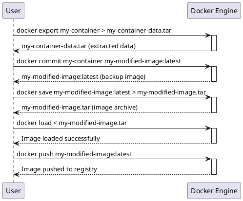

## Transferring Modified Docker Containers: A Step-by-Step Guide

This guide outlines a practical workflow for transferring a Docker container with modified data to a registry, leveraging the strengths of `docker export`, `docker commit`, and `docker save`.

### Scenario

You have a running container ("my-container") based on the image "my-base-image:latest". You've made changes inside the container and want to:

1. Extract specific data from the container.
2. Create a backup image capturing the modifications.
3. Transfer a complete image with the modified data to a Docker registry.

### Workflow

1. **Data Extraction with `docker export`:**

   ```bash
   docker export my-container > my-container-data.tar
   ```

   This command exports the container's filesystem to "my-container-data.tar", allowing you to extract specific files or directories as needed. This step is useful for grabbing configuration files, logs, or other data generated during the container's runtime.

2. **Backup with `docker commit`:**

   ```bash
   docker commit my-container my-modified-image:latest
   ```

   This command creates a new image, "my-modified-image:latest", based on the current state of "my-container", capturing all modifications made within it. This serves as a backup point before transferring the image.

3. **Transfer with `docker save` and `docker push`:**

   ```bash
   docker save my-modified-image:latest > my-modified-image.tar
   docker load < my-modified-image.tar
   docker push my-modified-image:latest 
   ```

   First, save the "my-modified-image:latest" as a .tar archive. Then, this archive can be loaded onto the destination machine. Finally, push this image to your desired Docker registry (e.g., Docker Hub) using `docker push`. This makes the modified image, including the data changes, available for deployment in other environments.

### Advantages of This Workflow

- **Data Isolation:** `docker export` allows you to extract only the necessary data, keeping your images leaner.
- **Versioned Backup:** `docker commit` creates a reusable image of your modified container, serving as a backup point.
- **Complete Image Transfer:** `docker save` ensures all image layers, history, and metadata are included in the transfer, guaranteeing portability.

By combining these commands, you achieve a robust and efficient workflow for managing and transferring modified Docker containers while maintaining data integrity and image reproducibility.




