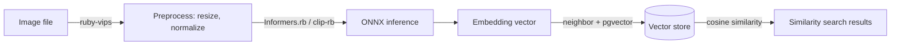

## Introduction to Image Embeddings for Ruby Applications

### What Are Image Embeddings?

An image embedding is a dense, numerical representation of an image, typically in the form of a low-dimensional vector. This vector, which is an array of floating-point numbers, is generated by a deep learning model and is designed to capture the high-level semantic content of the image — its abstract features, textures, shapes, and conceptual meaning. The fundamental principle of embeddings is that images with similar visual and semantic content will produce vectors that are numerically close to one another within this high-dimensional "embedding space." The proximity between these vectors can be quantified using mathematical distance metrics, such as cosine similarity, which measures the angle between two vectors, or Euclidean distance, which measures their straight-line distance. This transformation from unstructured pixel data to a structured vector format enables powerful computational analysis and search capabilities.

### Why Use Image Embeddings in a Ruby Application?

Integrating image embeddings into Ruby applications, particularly those built with frameworks like Ruby on Rails, unlocks a new class of intelligent features that go far beyond traditional metadata-based operations. The primary applications include:

* **Semantic Search:** This is the most prominent use case. Instead of relying on manually assigned keywords or tags, semantic search allows users to find images based on their actual content. This can manifest as "visual similarity search" (finding images that look like a given query image) or even "cross-modal search" (using a text description to find relevant images). For example, a user could upload a photo of a particular style of furniture and find all similar items in an e-commerce catalog.
* **Content Recommendation:** In applications such as e-commerce or media platforms, embeddings can power sophisticated recommendation engines. By generating an embedding for a product a user is currently viewing, the system can perform a similarity search to find and suggest other visually comparable items, enhancing user engagement and discovery.
* **Clustering and Data Analysis:** For applications managing large volumes of visual data, embeddings provide a way to programmatically organize and understand the dataset. By applying clustering algorithms to the image vectors, developers can automatically group similar images, identify outliers or anomalous data, and efficiently curate large collections without manual intervention.

### The Modern Ruby Stack for Computer Vision

A practical and performant stack for implementing image embedding workflows has emerged within the Ruby ecosystem. This stack consists of:

* **Preprocessing:** The `ruby-vips` gem, a binding for the highly efficient `libvips` image processing library, is the foundation for loading and preparing images for model input.
* **Inference:** For generating the embeddings, `Informers.rb` provides a high-level pipeline for running a wide variety of transformer models, while `clip-rb` offers a specialized solution for multimodal image-text embeddings. Both rely on the ONNX (Open Neural Network Exchange) model format.
* **Persistence & Search:** To store and query the generated vectors, the `neighbor` gem provides a seamless integration with ActiveRecord and PostgreSQL via the `pgvector` extension. For use cases demanding a specialized, high-performance key-value approach, `redis-rb` can be used to interact with a Redis database equipped with the RediSearch module.

> The most robust and practical Ruby libraries have focused on the high-value task of *inference* rather than training. `Informers` and `clip-rb` run pre-trained models standardized into the interoperable ONNX format — letting Ruby developers leverage the broader AI community's models directly inside the web applications where Ruby excels.



A significant portion of this modern stack — including `Informers`, `neighbor`, and the `torch.rb` bindings — is maintained by a single, prolific contributor. This has resulted in a de facto standard toolchain where the components are designed to be interoperable. For example, `Informers` vision pipelines explicitly require `ruby-vips`, and the `neighbor` gem documentation provides examples of its use with embeddings generated by `Informers`.

## The Foundational Layer: Image Preprocessing with Ruby-vips

### The Critical Role of Libvips and Ruby-vips

At the base of any image embedding pipeline is the need to efficiently load, decode, and manipulate image data. For the modern Ruby stack, this role is filled by `libvips` and its corresponding Ruby binding, `ruby-vips`. `libvips` is a powerful image processing library renowned for its exceptional performance, particularly its low memory consumption and high speed compared to alternatives like ImageMagick. Its efficiency stems from a demand-driven, horizontally threaded processing model, where image data is streamed through a pipeline of operations, avoiding the need to load entire large images into memory at once.

The `ruby-vips` gem provides a direct interface to this underlying C library using `ruby-ffi`, making its performance and extensive feature set available to Ruby developers. Crucially, it is a mandatory dependency for the vision pipelines in `Informers.rb`, making it an indispensable component of the local inference stack.

### Practical Walkthrough: Preparing an Image for a Model

Before an image can be converted into an embedding, it must be preprocessed to match the specific input requirements of the neural network. This typically involves loading, resizing, and normalizing the image data.

#### Loading an Image

The primary method for loading an image from a file is `Vips::Image.new_from_file`. A key performance consideration, especially for the large images common in machine learning contexts, is the `:access` option. Setting `access: :sequential` signals to `libvips` that pixels will be read in a top-to-bottom order, enabling it to stream the image from disk rather than loading it entirely into RAM. This can lead to significant improvements in speed and memory usage.

```ruby
require 'vips'

# Load an image using streaming access for better performance
image = Vips::Image.new_from_file('path/to/your/image.jpg', access: :sequential)
```

#### Resizing

Most pre-trained vision models are trained on images of a fixed size, such as 224x224 or 384x384 pixels. The `resize` method in `ruby-vips` is used to scale an image accordingly. Its primary argument is a single scale factor. Therefore, to resize an image to a target dimension, the developer must first calculate the appropriate factor based on the original image's dimensions.

```ruby
# Example: Resize an image to a fixed 224-pixel width, maintaining aspect ratio
target_width = 224.0
scale_factor = target_width / image.width
resized_image = image.resize(scale_factor)
```

The underlying `vips_resize` C function exposes additional options, such as separate vertical scaling (`vscale`) and different resampling kernels (`kernel`), which are available as keyword arguments in the Ruby method for more advanced control.

#### Color Space and Channel Manipulation

Vision models typically expect a standard 3-channel RGB input. `libvips` is capable of handling images with any number of bands (channels) and various color interpretations, such as `:srgb`, `:cmyk`, or `:grey16`. If an input image has an alpha channel (making it 4-band RGBA) or is grayscale (1-band), it must be converted. Operations like `bandjoin` can be used to add or manipulate channels as needed.

### From Image to Tensor: Converting to Numerical Data

The final step in preprocessing is to convert the `Vips::Image` object into a numerical format that the inference engine can process. This format is typically a flat, one-dimensional array of pixel values. The `write_to_memory` method is the essential tool for this conversion. It serializes the image's raw, unformatted pixel data into a binary string.

```ruby
# Assuming resized_image is a Vips::Image object
pixel_buffer = resized_image.write_to_memory
```

This binary string contains the pixel values arranged in scanline order (top-to-bottom, left-to-right), with channels interleaved (e.g., R1, G1, B1, R2, G2, B2, ...). This raw buffer is the direct input for the underlying ONNX runtime. If necessary for debugging or other manipulation within Ruby, this binary string can be unpacked into a Ruby array using `String#unpack`. The format string for unpacking depends on the image's band format (e.g., `'C*'` for 8-bit unsigned integers, `'f*'` for 32-bit floats).

```ruby
# Example for an 8-bit unsigned integer image (format: :uchar)
pixel_array = pixel_buffer.unpack('C*')
```

Conversely, `Vips::Image.new_from_array` allows the creation of a `Vips::Image` object from a Ruby array, a feature useful for generating convolution masks or test patterns.

> The design of the `ruby-vips` API reflects a deliberate choice to favor a performance-oriented, functional paradigm. Unlike libraries where operations modify an object in-place, most `ruby-vips` methods return a new `Vips::Image` object. Each method call adds an operation to a virtual computation pipeline — no actual pixel processing occurs until a final "write" method like `write_to_file` or `write_to_memory` is called.

## Generating Image Embeddings: A Comparative Analysis

Once an image is preprocessed into a numerical format, the next step is to feed it into a neural network to generate the embedding vector. The primary division lies between running models locally for full control and privacy, versus abstracting the complexity away to external, managed API services.

### The Pipeline Approach: Fast Transformer Inference with Informers.rb

`Informers.rb` is a Ruby gem engineered for "fast transformer inference." It provides a high-level `pipeline` API that abstracts away the complexities of model loading and execution, mirroring the design of the widely-used Hugging Face `transformers` library in Python. The library's functionality is built upon the ONNX standard, which allows models trained in frameworks like PyTorch or TensorFlow to be exported and executed by a compatible runtime — in this case the ONNX Runtime C library that `Informers.rb` wraps.

For vision tasks, `Informers.rb` offers several pre-defined pipelines, including `image-classification`, `object-detection`, and `image-feature-extraction`. The term "feature extraction" is synonymous with generating an embedding vector.

```ruby
require 'informers'

# Initialize a pipeline for generating image embeddings
extractor = Informers.pipeline("image-feature-extraction")

# Pass an image path to generate the feature vector
embedding = extractor.("path/to/image.jpg")
```

To use a specific model, its identifier — often from the Hugging Face Hub — can be passed to the `pipeline` constructor. A critical requirement is that the model repository must contain a converted model in the ONNX format, typically at `onnx/model.onnx`. Numerous pre-trained models, such as ResNet and Vision Transformer (ViT), are available in this format.

```ruby
# Use a specific ResNet-50 model available in ONNX format on Hugging Face
model = Informers.pipeline("image-feature-extraction", "Qdrant/resnet50-onnx")
embedding = model.("path/to/image.jpg")
```

### The Specialized Approach: Multimodal Embeddings with Clip-rb

A more specialized tool for generating embeddings is the `clip-rb` gem. It provides a Ruby implementation of OpenAI's CLIP (Contrastive Language-Image Pre-Training) model. CLIP is trained on a massive dataset of image-text pairs and learns a shared, multimodal embedding space, in which the vector for an image (e.g., a photo of a cat) is numerically close to the vector for its corresponding text description (e.g., "a photo of a cat"). This unique property makes CLIP exceptionally powerful for text-to-image search and zero-shot image classification.

Like `Informers.rb`, `clip-rb` is powered by ONNX models, which it downloads automatically on first use, eliminating any dependency on a Python environment.

```ruby
require 'clip'

clip = Clip::Model.new

# Generate an embedding from a text query
text_embedding = clip.encode_text("a photo of a cat")

# Generate an embedding from an image file
image_embedding = clip.encode_image("path/to/cat_image.jpg")

# The two resulting vectors can be directly compared using cosine similarity
```

The gem also includes support for a multilingual model variant, enabling text embeddings for languages other than English.

### The API-Driven Alternative: Context with ruby_llm

In contrast to the local inference approach of `Informers.rb` and `clip-rb`, the `ruby_llm` gem serves as a unified client for a wide array of external, managed LLM providers, including OpenAI, Google, and Anthropic. Its design philosophy is to offer "one beautiful Ruby API for all of them," abstracting away provider-specific differences.

`ruby_llm` demonstrates strong capabilities in multimodal *analysis*. A user can pass an image to a chat model and ask complex questions about its content, leveraging the power of state-of-the-art vision models without managing any infrastructure.

```ruby
chat = RubyLLM.chat(model: "gpt-4o-mini")
response = chat.ask("What is the main subject of this image?", with: "ruby_conf.jpg")
```

However, it is crucial to distinguish this analytical capability from embedding generation. While `ruby_llm` provides a `RubyLLM.embed` method, all available documentation and examples demonstrate its use exclusively for generating *text* embeddings. There is no documented method for using `ruby_llm` to generate a raw image embedding vector — it is best suited for tasks requiring a general AI to interpret and describe an image, not for producing the vectors needed for a local similarity search database.

| Library | Primary Function | Model Source | Key Dependencies | Best For |
| --- | --- | --- | --- | --- |
| **`Informers.rb`** | General-purpose transformer inference | Local ONNX models | `onnxruntime`, `ruby-vips` | Building custom vision pipelines with various models (e.g., ResNet, ViT) for feature extraction, classification, etc. |
| **`clip-rb`** | Multimodal (image-text) embedding | Local ONNX models | `onnxruntime`, `mini_magick` | Implementing text-to-image search, zero-shot classification, and finding visually similar images based on semantic meaning. |
| **`ruby_llm`** | Unified API for external LLMs | External API (OpenAI, Google, etc.) | `faraday`, `marcel` | Leveraging powerful, managed SOTA models for image analysis, description, and question-answering without infrastructure management. |

The viability of the entire local inference camp in Ruby is enabled by the ONNX standard: the broader machine learning community produces and trains models in Python-based frameworks, these models are converted to the ONNX format, and Ruby gems then wrap the ONNX Runtime to execute them. ONNX acts as the universal "lingua franca" that makes state-of-the-art machine learning practical and accessible within a pure Ruby environment.

## Persistence and Querying: Implementing Vector Search

After generating an embedding vector, it must be stored in a database that is capable of performing efficient similarity searches. The Ruby ecosystem provides robust solutions for this, primarily centered around PostgreSQL with the `pgvector` extension and Redis with the RediSearch module.

### The ActiveRecord Way: Neighbor and Pgvector

For developers working within the Ruby on Rails framework, the `neighbor` gem offers the most integrated and idiomatic solution for vector search. It extends ActiveRecord models with vector search capabilities and supports several database backends, with `pgvector` for PostgreSQL being a mature and widely adopted choice.

The setup process is straightforward and follows standard Rails conventions:

1. **Enable the extension** via a database migration:

```ruby
# db/migrate/enable_pgvector_extension.rb
class EnablePgvector < ActiveRecord::Migration[7.1]
  def change
    enable_extension "vector"
  end
end
```

2. **Add a vector column.** It is critical to specify the `limit` (or `dimensions`), which must match the output dimension of the embedding model being used:

```ruby
# db/migrate/add_embedding_to_photos.rb
class AddEmbeddingToPhotos < ActiveRecord::Migration[7.1]
  def change
    add_column :photos, :embedding, :vector, limit: 512 # e.g., for a CLIP model
  end
end
```

3. **Configure the model** with the `has_neighbors` macro, linking it to the embedding column:

```ruby
# app/models/photo.rb
class Photo < ApplicationRecord
  has_one_attached :image
  has_neighbors :embedding
end
```

Once set up, storing an embedding is as simple as assigning the vector (as a Ruby `Array` of floats) to the model attribute and saving the record. The `neighbor` gem provides a `nearest_neighbors` scope for querying, supporting standard distance metrics like `euclidean`, `cosine`, and `inner_product`.

```ruby
# Store an embedding
photo.update(embedding: [0.1, 0.2, 0.3])

# Find the 5 most similar photos to a given photo instance
similar_photos = photo.nearest_neighbors(:embedding, distance: "cosine").first(5)

# Find the 10 most similar photos to an external query vector
query_vector = [0.15, 0.25, 0.35]
search_results = Photo.nearest_neighbors(:embedding, query_vector, distance: "cosine").first(10)
```

### High-Performance Search with Redis

Redis, when augmented with the RediSearch module, transforms into a high-performance vector database capable of indexing and searching millions of vectors with low latency. It supports advanced indexing strategies like HNSW (Hierarchical Navigable Small World) for approximate nearest neighbor (ANN) search, which is significantly faster than exhaustive brute-force search on large datasets.

The standard `redis-rb` gem does not include high-level abstractions for RediSearch commands, so developers typically interact with it by sending raw commands via `redis.call`:

```ruby
require 'redis'
redis = Redis.new

# vector is a Ruby Array of floats
binary_embedding = vector.pack('f*')
redis.hset("image:123", {
  "filename" => "foo.jpg",
  "image_embedding" => binary_embedding
})

# query_vector is a Ruby Array of floats, packed the same way
binary_query_vector = query_vector.pack('f*')

results = redis.call(
  "FT.SEARCH", "my_image_index", "(*)=>[KNN 10 @image_embedding $query_blob]",
  "PARAMS", 2, "query_blob", binary_query_vector,
  "SORTBY", "vector_score",
  "DIALECT", 2
)
```

The choice between these two database solutions represents a classic architectural trade-off. The `neighbor` + `pgvector` combination offers unparalleled simplicity and integration for Rails developers, treating embeddings as a native feature of ActiveRecord — the pragmatic choice for most applications. Redis with RediSearch provides a specialized, high-performance engine that may offer superior speed and scalability where vector search is the core, mission-critical function, at the cost of increased operational complexity and a less mature client ecosystem in Ruby.

## Strategic Recommendations

* **For most Rails applications**, the primary recommended path is `ruby-vips` + `Informers.rb` + `neighbor` with `pgvector` — an optimal balance of performance, developer-friendly integration, and ease of use within the familiar Rails paradigm.
* **For multimodal search (text-to-image)**, `clip-rb` is the superior, specialized tool, purpose-built for the shared image-text embedding space CLIP models provide. It integrates seamlessly with the same `neighbor` + `pgvector` backend.
* **For image *analysis* and *understanding*** without infrastructure management, `ruby_llm` is the appropriate choice — but it should not be mistaken for a tool to generate local embedding vectors for a similarity search database.
* **For extreme performance and scale**, Redis with the RediSearch module is a viable alternative, recommended only when vector search is the absolute core function of the application and PostgreSQL performance becomes a bottleneck.

### The Path to Deeper Customization: torch.rb and Tensorflow-ruby

For developers seeking lower-level control or closer parity with the Python ecosystem, bindings for the core deep learning frameworks exist, though their roles are distinct:

* **`torch.rb`** is the more mature and complete library, providing extensive bindings to the underlying LibTorch C++ API. Accompanied by `torchvision-ruby`, it allows for loading pre-trained models like ResNet, defining custom neural network architectures, and performing tensor operations in a manner that closely mirrors the PyTorch API.
* **`tensorflow-ruby`** is explicitly described as experimental and currently limited to basic tensor operations. The official recommendation from its maintainer is to convert TensorFlow models to the ONNX format and execute them using the `onnxruntime` gem or `Informers.rb` — reinforcing the current dominance of the ONNX-based workflow.

## Concluding Thoughts: The Pragmatic State of Ruby ML

The Ruby ecosystem has successfully carved out a pragmatic and powerful niche in the broader machine learning landscape. By strategically embracing interoperability through the ONNX standard and focusing on the "last mile" of deployment and inference, Ruby developers are now equipped to build sophisticated AI-powered features without abandoning the productivity and elegance of the Ruby and Rails environment. The community's strength lies not in attempting to replicate the vast research and training infrastructure of the Python world, but in providing robust, well-integrated tools that bring the fruits of that research into production-ready web applications.
