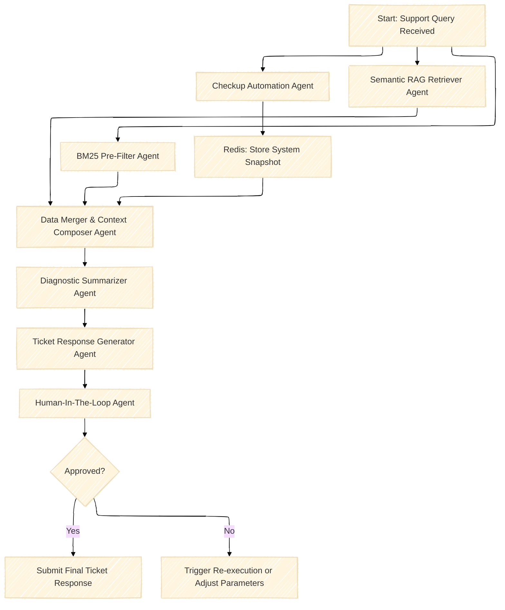

🔍 Diagram Explanation

Component | Description |
-----------|-------------|
Start: Support Query Received | The process begins when a support query is received. |
Checkup Automation Agent | Executes IT checkup playbooks and gathers system metrics, storing the results in Redis. |
BM25 Pre-Filter Agent | Performs keyword-based retrieval from the knowledge base to find direct matches related to the support query. |
Semantic RAG Retriever Agent | Uses semantic search to find contextually relevant documents from the knowledge base. |
Data Merger & Context Composer Agent | Combines data from the system snapshot, BM25 results, and semantic results into a unified context. |
Diagnostic Summarizer Agent | Analyzes the unified context to generate a diagnostic summary highlighting key issues and recommendations. |
Ticket Response Generator Agent | Crafts a draft support ticket response based on the diagnostic summary. |
Human-In-The-Loop (HITL) Agent | Reviews the outputs for accuracy and quality. |
Decision Point | If approved, the final ticket response is submitted. If not, tasks may be re-executed or parameters adjusted. |

---

```mermaid
---
config:
  layout: dagre
  theme: base
---
stateDiagram
  direction TB
  state InputProcessing {
    direction TB
    [*] --> PlaybookExecution:Run IT Checkups
    PlaybookExecution --> SystemDataCollection:Gather Metrics
    SystemDataCollection --> MultimodalCapture:Screenshots & Logs
    MultimodalCapture --> TicketExtraction:Historical Context
    TicketExtraction --> [*]
[*]    PlaybookExecution
    SystemDataCollection
    MultimodalCapture
    TicketExtraction
[*]  }
  state HybridRetrieval {
    direction TB
    [*] --> BM25PreFiltering:Error Code Matching
    BM25PreFiltering --> SemanticEmbeddingSearch:Calculate Similarities
    SemanticEmbeddingSearch --> WeightedResultCombination
    WeightedResultCombination --> [*]:Direct KB Matches
[*]    BM25PreFiltering
    SemanticEmbeddingSearch
    WeightedResultCombination
[*]  }
  state ContextualRetrieval {
    direction TB
    [*] --> RelatedContextFinding:Topic & Entity Overlap
    RelatedContextFinding --> TemporalContextAnalysis:Historical Patterns
    TemporalContextAnalysis --> DiscourseRelationMapping:Symptom-Cause-Solution
    DiscourseRelationMapping --> SyntacticPatternMatching:Technical Issue Patterns
    SyntacticPatternMatching --> [*]:Contextual Evidence
[*]    RelatedContextFinding
    TemporalContextAnalysis
    DiscourseRelationMapping
    SyntacticPatternMatching
[*]  }
  state ContextMerger {
    direction TB
    [*] --> RedisDataRetrieval:Get System Snapshot
    RedisDataRetrieval --> MultiSourceIntegration:Combine All Sources
    MultiSourceIntegration --> WeightedMergeStrategy:Prioritize Evidence
    WeightedMergeStrategy --> UnifiedJSONConstruction:Structure Data
    UnifiedJSONConstruction --> [*]:Unified Context
[*]    RedisDataRetrieval
    MultiSourceIntegration
    WeightedMergeStrategy
    UnifiedJSONConstruction
[*]  }
  state HITLFirstReview {
    direction TB
    [*] --> RetrievalCoverageCheck
    RetrievalCoverageCheck --> EvidencePathInspection
    EvidencePathInspection --> AnomalyDetection
    AnomalyDetection --> ParameterAdjustment
    ParameterAdjustment --> [*]
[*]    RetrievalCoverageCheck
    EvidencePathInspection
    AnomalyDetection
    ParameterAdjustment
[*]  }
  state DiagnosticSummarization {
    direction TB
    [*] --> IssueIndicatorIdentification
    IssueIndicatorIdentification --> ConfidenceScoreAssignment
    ConfidenceScoreAssignment --> RemediationSuggestionGeneration
    RemediationSuggestionGeneration --> AnomalyFlagging
    AnomalyFlagging --> [*]
[*]    IssueIndicatorIdentification
    ConfidenceScoreAssignment
    RemediationSuggestionGeneration
    AnomalyFlagging
[*]  }
  state TicketResponseGeneration {
    direction TB
    [*] --> KBReferenceIncorporation
    KBReferenceIncorporation --> ActionStepFormulation
    ActionStepFormulation --> ConfidenceIndicatorAddition
    ConfidenceIndicatorAddition --> [*]
[*]    KBReferenceIncorporation
    ActionStepFormulation
    ConfidenceIndicatorAddition
[*]  }
  state HITLFinalReview {
    direction TB
    [*] --> DiagnosticVerification
    DiagnosticVerification --> ActionSafetyCheck
    ActionSafetyCheck --> ResponseAdjustment
    ResponseAdjustment --> FeedbackCapture
    FeedbackCapture --> [*]
[*]    DiagnosticVerification
    ActionSafetyCheck
    ResponseAdjustment
    FeedbackCapture
[*]  }
  state EffectivenessLogging {
    direction TB
    [*] --> RetrievalMethodTracking
    RetrievalMethodTracking --> StrategyComparisonRecording
    StrategyComparisonRecording --> InterventionPointLogging
    InterventionPointLogging --> RedisStorageOperation
    RedisStorageOperation --> [*]
[*]    RetrievalMethodTracking
    StrategyComparisonRecording
    InterventionPointLogging
    RedisStorageOperation
[*]  }
  state FinalOutput {
    direction TB
    [*] --> SupportTicketResponse
    [*] --> DiagnosticSummaryReport
    [*] --> UnifiedJSONContext
    [*] --> RetrievalEffectivenessLog
[*]    SupportTicketResponse
    DiagnosticSummaryReport
    UnifiedJSONContext
    RetrievalEffectivenessLog
  }
  [*] --> InputProcessing:Support Query & Host Info Received
  InputProcessing --> HybridRetrieval:System Data & Support Query
  InputProcessing --> ContextualRetrieval:Query & Historical Data
  HybridRetrieval --> ContextMerger:Direct KB Matches
  ContextualRetrieval --> ContextMerger:Contextual Evidence
  InputProcessing --> ContextMerger:System Data
  ContextMerger --> HITLFirstReview:Unified JSON Context
  HITLFirstReview --> DiagnosticSummarization:Approved Context
  DiagnosticSummarization --> TicketResponseGeneration:Diagnostic Summary
  TicketResponseGeneration --> HITLFinalReview:Draft Response
  DiagnosticSummarization --> HITLFinalReview:Diagnostic Report
  HITLFinalReview --> EffectivenessLogging:Approved Materials
  EffectivenessLogging --> FinalOutput
  HITLFinalReview --> FinalOutput
  FinalOutput --> [*]:Process Complete
```

