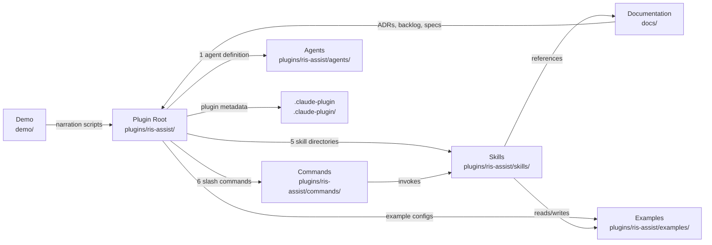
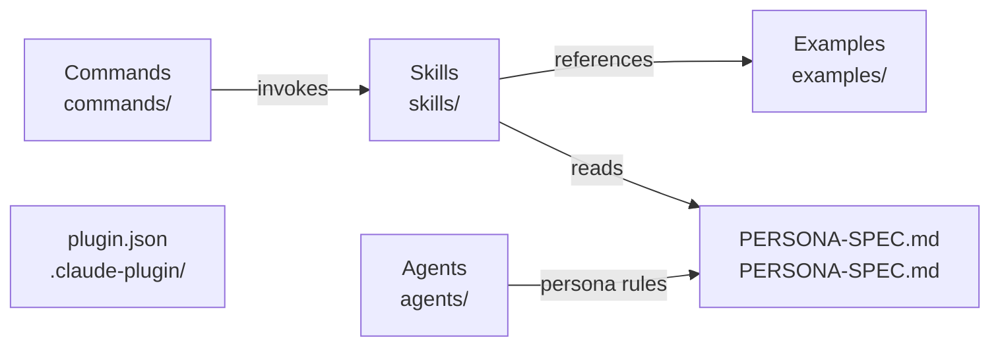
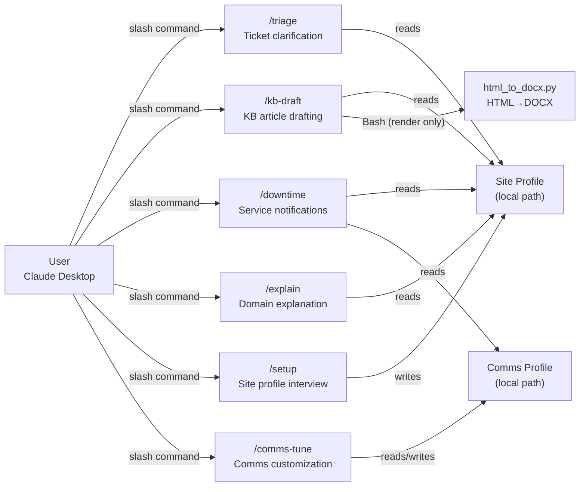

## Problem

RIS support lives at a messy intersection: tickets arrive from radiologists, techs, and scheduling staff about a system wired into PACS, dictation, the EHR, and a tangle of HL7 interfaces. Most "RIS problems" are really integration problems, most triage knowledge lives in one senior analyst's head, and most of it walks out the door at every staff rotation — hardest exactly when it's needed most: overnight, alone, no senior analyst to ask, vendor support behind a callback queue.

Notifications compound the problem. A single outage needs different messages for radiologists (where to read from), technologists (which paper process to start), and leadership (how big this is) — and most sites have never written most of those variants down. The [coverage demo](/projects/ris-assist/coverage-demo.html) makes the gap visible: event class down one side, audience across the top, most cells hatched.

## Approach

RIS Assist packages the senior analyst's working method as a Claude plugin, built on three commitments:

**Deterministic where it matters.** Anything decidable by code is decided by code; the model reasons over the result, not raw input. Message forensics — parsing pipe-delimited HL7 data — ships as a [separate, parked plugin](https://github.com/b08x/RIS_Assist) precisely because a language model freestyle-parsing that data is the failure mode this project exists to avoid.

**Your site stays yours.** The plugin ships generic. A cold-start interview asks about *your* RIS, interfaces, escalation matrix, and SLA tiers, and writes a site profile to a local path outside the plugin — it survives updates and never touches the repo.

**Synthetic from birth.** Every example — Riverside Regional Imaging, its tickets, its site profile — is invented. Nothing derives from production clinical data, not even de-identified derivatives, because provenance survives scrubbing.

Every skill speaks through one [analyst persona](/projects/ris-assist/persona-card.html): observation separated from inference, every diagnostic conclusion marked *confirmed / likely / possible*, anything absent from the site profile declared absent rather than given a plausible fiction.



## Architecture

The plugin is structured to separate site-specific profiles from the core logic, ensuring that local data never pollutes the plugin repository.

### Overall Structure

### Plugin Root

### Command Surface

## Outcome

Four capabilities ship as slash commands — `/triage`, `/kb-draft`, `/downtime`, `/explain`, plus `/setup` and `/comms-tune` — each a thin skill over the same analyst persona and site profile. It is a triage assistant, not an operator: it drafts, decodes, and recommends. It does not execute state-changing operations, does not handle identified PHI, and does not parse HL7 directly — those stay separate, deliberately, until the deterministic groundwork under them exists.

Status is pre-alpha: the demos above are worked examples of the intended shape, not a claim that every cell in the coverage grid or every triage path is production-hardened yet.
