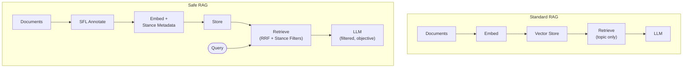

No single domain solves LLM context poisoning alone. SFL provides the metadata; CBT the exclusion criteria; neuroscience the consolidation pattern; philosophy the payload-separation schema; Unix the composable pipeline; cybersecurity the air-gapping model. The intersection — territory none of them individually claim — is where the defense lives.

Goal: not a product feature, but **modular middleware** — a pre-processing and retrieval-filtering layer that sits between any document store and any LLM, adding the one filter dimension standard RAG doesn't have: *how* something was said.
{: .fragment}
