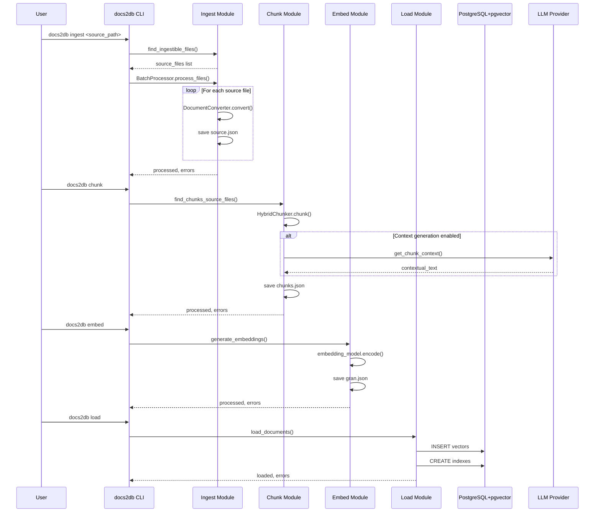

<details>
<summary>Relevant source files</summary>

The following files were used as context for generating this wiki page:
- [README.md](https://github.com/b08x/docs2db/blob/main/README.md)
- [src/docs2db/docs2db.py](https://github.com/b08x/docs2db/blob/main/src/docs2db/docs2db.py)
- [src/docs2db/ingest.py](https://github.com/b08x/docs2db/blob/main/src/docs2db/ingest.py)
- [src/docs2db/chunks.py](https://github.com/b08x/docs2db/blob/main/src/docs2db/chunks.py)
- [src/docs2db/multiproc.py](https://github.com/b08x/docs2db/blob/main/src/docs2db/multiproc.py)

</details>

# Quickstart Guide

## Introduction

The Quickstart Guide serves as the entry point for users of the docs2db system, which is a RAG (Retrieval Augmented Generation) pipeline tool designed to transform source documents into a searchable vector database. The system operates through a multi-stage pipeline: ingestion, chunking, embedding generation, and database loading. Each stage produces intermediate artifacts that subsequent stages consume, creating a dependency chain documented within the CLI commands exposed via the typer framework in `docs2db.py`.

The repository structure reveals a modular architecture where `docs2db.py` defines the command-line interface as the primary entry point, orchestrating operations through four main commands: `ingest`, `chunk`, `embed`, and `load`. The `ingest.py` module handles document conversion to Docling JSON format, while `chunks.py` manages text splitting with optional LLM-generated contextual enrichment. The `multiproc.py` module provides the batch processing infrastructure enabling parallel execution across multiple workers.

## System Architecture Overview

The docs2db system follows a staged pipeline architecture where each stage operates on files produced by the previous stage. The content directory structure mirrors the source document hierarchy, with each source file receiving its own subdirectory containing processing artifacts.

### Pipeline Stages

The complete processing pipeline consists of four sequential stages, each with distinct responsibilities:

| Stage | Command | Input | Output | Primary Module |
|-------|---------|-------|--------|----------------|
| Ingestion | `docs2db ingest` | Source files (PDF, HTML, MD) | `source.json` (Docling JSON) | `ingest.py` |
| Chunking | `docs2db chunk` | `source.json` | `chunks.json` | `chunks.py` |
| Embedding | `docs2db embed` | `chunks.json` | `gran.json` (or model-specific) | `embed.py` |
| Loading | `docs2db load` | `gran.json` + `chunks.json` | Database records | `database.py` |

Sources: [README.md#L1-L50](), [src/docs2db/docs2db.py#L1-L100]()

### Content Directory Structure

The system maintains intermediate processing files in a content directory (default: `docs2db_content/`). This directory must be committed to version control as it contains expensive preprocessing that can be reused across updates.

```
docs2db_content/
├── path/
│   └── to/
│       └── your/
│           └── document/
│               ├── source.json      # Docling ingested document
│               ├── chunks.json      # Text chunks with context
│               ├── gran.json       # Granite embeddings
│               └── meta.json       # Processing metadata
└── README.md
```

Sources: [README.md#L60-L80]()

## Core Components

### CLI Entry Point

The main CLI application is defined using typer in `docs2db.py`, providing subcommands for each pipeline stage. The application automatically detects database configuration from compose files when not explicitly provided.

```python
app = typer.Typer(help="Make a RAG Database from source content")

@app.command()
def ingest(...): ...

@app.command()
def chunk(...): ...

@app.command()
def embed(...): ...

@app.command()
def load(...): ...
```

Sources: [src/docs2db/docs2db.py#L1-L30]()

### Ingestion Module

The ingestion module converts various document formats into Docling JSON format. It uses a singleton pattern for the DocumentConverter to avoid redundant initialization overhead across multiple files.

```python
def _get_converter() -> Any:
    """Get or create the DocumentConverter singleton."""
    global _converter, _last_converter_settings
    # ... configuration logic
```

The module supports configurable pipelines (standard or vlm), models, devices (auto, cpu, cuda, mps), and batch sizes. Source files are discovered via `find_ingestible_files()` and processed in sorted order for deterministic behavior.

Sources: [src/docs2db/ingest.py#L1-L100](), [src/docs2db/ingest.py#L200-L280]()

### Chunking Module

The chunking module splits documents into smaller text segments suitable for embedding and retrieval. It supports two types of context generation:

1. **Structural context** - Heading hierarchy, page numbers from Docling
2. **Semantic context** - LLM-generated descriptions of chunk relevance

The module integrates with multiple LLM providers (OpenAI, WatsonX, OpenRouter, Mistral) for contextual enrichment, using a chat-based message format.

```python
class LLMProvider(ABC):
    """Abstract base class for LLM providers."""
    
    def get_chunk_context(self, chunk_prompt: str) -> str:
        """Get context for a chunk using LLM."""
        
    def summarize_text(self, text: str) -> str:
        """Summarize text using LLM."""
```

Sources: [src/docs2db/chunks.py#L1-L80](), [src/docs2db/chunks.py#L200-L250]()

### Batch Processing Infrastructure

The multiprocessing module provides the `BatchProcessor` class that enables parallel file processing with progress tracking and memory management.

```python
class BatchProcessor:
    def __init__(
        self,
        worker_function,
        worker_args,
        progress_message: str,
        batch_size: int,
        mem_threshold_mb: int,
        max_workers: int,
        use_shared_state: bool = False,
    ):
```

The system uses worker-based parallelism with configurable memory thresholds to prevent OOM conditions during processing.

Sources: [src/docs2db/multiproc.py#L1-L50]()

## Data Flow and Processing Sequence

The following sequence diagram illustrates the complete processing flow from source documents to searchable database:



The pipeline automatically skips unchanged files when re-running commands, enabling efficient incremental updates. This is determined by timestamp comparison between source and output files.

Sources: [src/docs2db/docs2db.py#L100-L200](), [src/docs2db/ingest.py#L150-L180]()

## Configuration and Environment

### CLI Options by Command

#### Ingest Command

| Parameter | Type | Default | Description |
|-----------|------|---------|-------------|
| `source_path` | Argument | Required | Path to directory or file to ingest |
| `--dry-run` | Option | False | Show what would be processed |
| `--force` | Option | False | Force reprocessing |
| `--pipeline` | Option | "standard" | Docling pipeline: "standard" or "vlm" |
| `--model` | Option | None | Docling model (pipeline-specific) |
| `--device` | Option | "auto" | Device: "auto", "cpu", "cuda", "mps" |
| `--batch-size` | Option | None | Batch size per worker |
| `--workers` | Option | None | Number of parallel workers |

Sources: [src/docs2db/docs2db.py#L30-L60]()

#### Chunk Command

| Parameter | Type | Default | Description |
|-----------|------|---------|-------------|
| `--content-dir` | Option | None | Path to content directory |
| `--pattern` | Option | "**" | Directory pattern for files |
| `--force` | Option | False | Force reprocessing |
| `--dry-run` | Option | False | Show what would process |
| `--skip-context` | Option | None | Skip LLM contextual generation |
| `--context-model` | Option | None | LLM model for context |
| `--llm-provider` | Option | None | Provider: "openai", "watsonx", "openrouter", "mistral" |

Sources: [src/docs2db/docs2db.py#L200-L260]()

### LLM Provider Configuration

The system supports multiple LLM providers for contextual chunk generation:

| Provider | Environment Variables | URL Parameter |
|----------|----------------------|---------------|
| OpenAI | `OPENAI_API_KEY` | `--openai-url` |
| WatsonX | `WATSONX_API_KEY`, `WATSONX_PROJECT_ID` | `--watsonx-url` |
| OpenRouter | `OPENROUTER_API_KEY` | `--openrouter-url` |
| Mistral | `MISTRAL_API_KEY` | `--mistral-url` |

```bash
# Example: Using Ollama with OpenAI-compatible endpoint

docs2db chunk --context-model qwen2.5:7b-instruct

# Example: Using OpenAI API

docs2db chunk --openai-url https://api.openai.com --context-model gpt-4o-mini

# Example: Using WatsonX

docs2db chunk --watsonx-url https://us-south.ml.cloud.ibm.com
```

Sources: [README.md#L90-L110](), [src/docs2db/chunks.py#L300-L350]()

## Using as a Library

The docs2db package can be imported and used programmatically in Python applications:

```python
from pathlib import Path
from docs2db.ingest import ingest_file, ingest_from_content

# Ingest a file from disk

ingest_file(
    source_file=Path("document.pdf"),
    content_path=Path("docs2db_content/my_docs/document"),
    source_metadata={"source": "my_system", "retrieved_at": "2024-01-01"}
)

# Ingest content from memory (HTML, markdown, etc.)

ingest_from_content(
    content="<html>...</html>",
    content_path=Path("docs2db_content/my_docs/page"),
    stream_name="page.html",
    source_metadata={"url": "https://example.com"},
    content_encoding="utf-8"
)
```

Sources: [README.md#L130-L155]()

## Database Operations

The system manages PostgreSQL database lifecycle through dedicated commands:

| Command | Function |
|---------|----------|
| `docs2db db-start` | Start database container |
| `docs2db db-stop` | Stop database container |
| `docs2db db-status` | Check database connection |
| `docs2db db-destroy` | Destroy database |

The database uses pgvector extension for vector similarity search and GIN indexing for full-text search (tsvector/BM25).

Sources: [README.md#L115-L125]()

## RAG Features

The system implements several retrieval-augmented generation features:

- **Contextual chunks** - LLM-generated context for each chunk following Anthropic's approach
- **Vector embeddings** - Multiple models: granite-30m, e5-small-v2, slate-125m, noinstruct-small
- **Full-text search** - PostgreSQL tsvector with GIN indexing for BM25
- **Vector similarity** - pgvector extension with HNSW indexes
- **Schema versioning** - Track metadata and schema changes
- **Portable dumps** - Self-contained SQL files

Sources: [README.md#L45-L58]()

## Troubleshooting

### Common Issues

| Issue | Solution |
|-------|----------|
| "Neither Podman nor Docker found" | Install Podman or Docker |
| "Database connection refused" | Run `docs2db db-start` to start database |

Sources: [README.md#L160-L165]()

## Conclusion

The Quickstart Guide represents the foundational user-facing documentation for the docs2db RAG pipeline system. The architecture demonstrates a clear separation of concerns: document conversion handled by Docling in `ingest.py`, text segmentation with optional LLM enrichment in `chunks.py`, parallel processing infrastructure in `multiproc.py`, and orchestration through the typer CLI in `docs2db.py`. The staged pipeline approach with intermediate file artifacts enables both incremental processing and debugging at individual stages. The modular provider abstraction for LLM contextual generation allows flexibility in deployment environments while maintaining consistent interface behavior across different API backends.