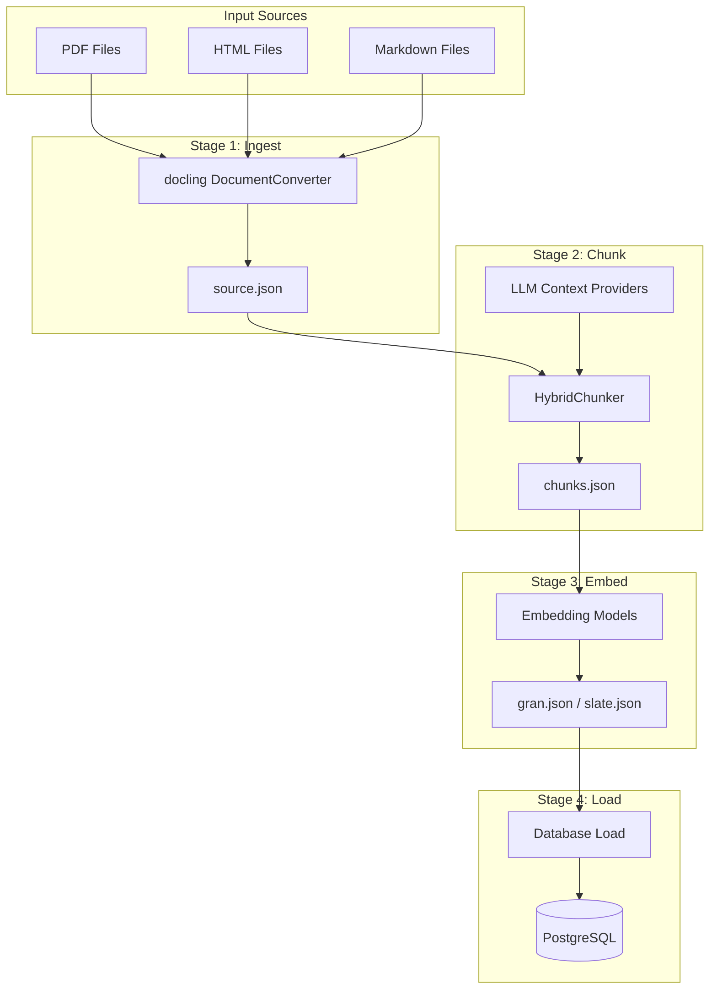
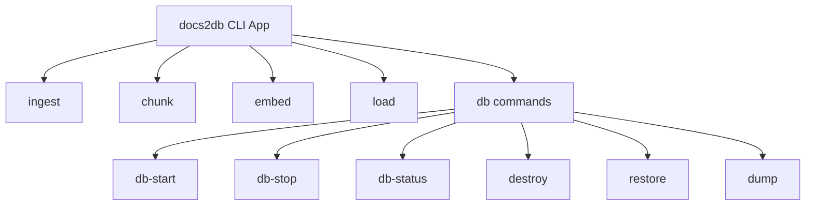
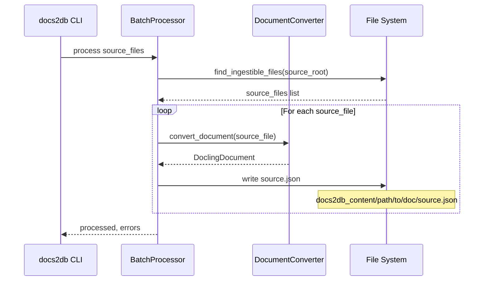
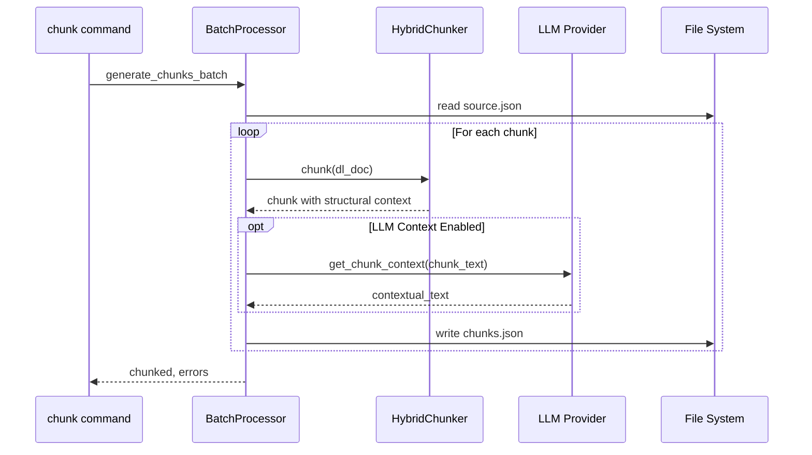
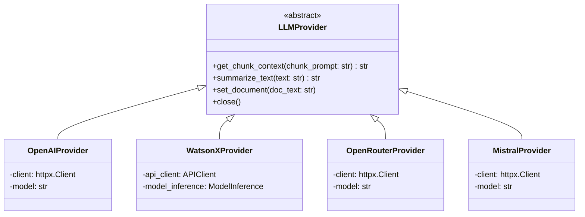
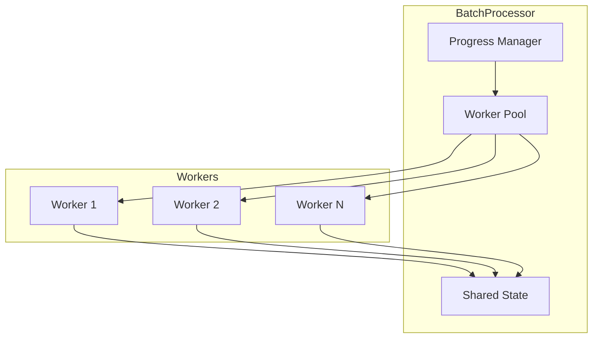
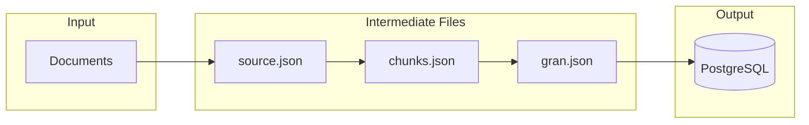

<details>
<summary>Relevant source files</summary>

The following files were used as context for generating this wiki page:
- [src/docs2db/docs2db.py](https://github.com/b08x/docs2db/blob/main/src/docs2db/docs2db.py)
- [src/docs2db/chunks.py](https://github.com/b08x/docs2db/blob/main/src/docs2db/chunks.py)
- [src/docs2db/ingest.py](https://github.com/b08x/docs2db/blob/main/src/docs2db/ingest.py)
- [src/docs2db/multiproc.py](https://github.com/b08x/docs2db/blob/main/src/docs2db/multiproc.py)
- [README.md](https://github.com/b08x/docs2db/blob/main/README.md)

</details>

# System Architecture

## Introduction

docs2db is a Retrieval-Augmented Generation (RAG) pipeline tool that transforms source documents into a searchable vector database. The system operates as a multi-stage processing pipeline that ingests documents, generates context-aware text chunks, creates vector embeddings, and loads the resulting data into a PostgreSQL database with both full-text and vector search capabilities.

The architecture follows a sequential stage model where each pipeline stage produces intermediate artifacts that subsequent stages consume. The system supports multiple LLM providers for contextual chunk enrichment and multiple embedding models for vector generation. Processing can occur incrementally, with automatic detection of unchanged files to skip unnecessary reprocessing.

## Overall Architecture

The system comprises four primary processing stages orchestrated through a Typer-based CLI. Each stage operates independently but reads artifacts produced by previous stages.



The content directory structure mirrors the source document hierarchy. Each source file generates a dedicated subdirectory containing the processing artifacts: `source.json` (Docling format), `chunks.json` (text chunks with context), `gran.json` (vector embeddings), and `meta.json` (processing metadata).

Sources: [README.md](https://github.com/b08x/docs2db/blob/main/README.md), [src/docs2db/docs2db.py#L1-L50]()

## CLI Command Structure

The CLI application exposes commands for each processing stage and database lifecycle management. The entry point is defined in `docs2db.py` using the Typer framework.



| Command | Purpose | Key Parameters |
|---------|---------|----------------|
| `ingest` | Convert documents to Docling JSON | `--source-path`, `--pipeline`, `--model`, `--device`, `--batch-size`, `--workers` |
| `chunk` | Generate text chunks with optional LLM context | `--pattern`, `--skip-context`, `--context-model`, `--llm-provider`, `--openai-url`, `--watsonx-url` |
| `embed` | Generate vector embeddings | `--model`, `--pattern`, `--batch-size` |
| `load` | Load chunks and embeddings to database | `--model`, `--pattern`, `--force` |
| `db-start` | Start PostgreSQL container | N/A |
| `db-stop` | Stop PostgreSQL container | N/A |
| `db-status` | Check database connectivity | N/A |

Sources: [src/docs2db/docs2db.py#L27-L280]()

## Processing Pipeline

### Stage 1: Document Ingestion

The ingestion stage uses Docling to convert various document formats (PDF, HTML, Markdown) into a standardized Docling JSON representation. The core conversion logic resides in `ingest.py`.



The ingestion process uses a singleton `DocumentConverter` that is reused across files to avoid repeated initialization overhead. The converter is configured based on pipeline type ("standard" or "vlm"), model selection, and device acceleration (CPU, CUDA, MPS).

```python
def _get_converter() -> Any:
    """Get or create the DocumentConverter singleton."""
    global _converter, _last_converter_settings
    
    current_settings = (
        settings.docling_pipeline,
        settings.docling_model,
        settings.docling_device,
        settings.docling_batch_size,
    )
    
    if _converter is not None and _last_converter_settings == current_settings:
        return _converter
    # ... converter initialization
```

Sources: [src/docs2db/ingest.py#L1-L100](), [src/docs2db/ingest.py#L200-L280]()

### Stage 2: Chunking with Contextual Enrichment

The chunking stage reads `source.json` files and produces `chunks.json` using the `HybridChunker` from Docling. This stage optionally generates semantic context for each chunk using LLM providers.



The chunking process produces two text representations for each chunk:
- `text`: Structural context (heading hierarchy, page numbers) combined with chunk content—used for LLM context generation
- `contextual_text`: Semantic context from LLM + structural context + chunk text—used for vector indexing and retrieval

This dual-output design follows Anthropic's contextual retrieval approach, where separate representations serve different purposes in the RAG pipeline.

Sources: [src/docs2db/chunks.py#L1-L80](), [src/docs2db/chunks.py#L200-L280]()

### Stage 3: Embedding Generation

The embedding stage converts text chunks into vector representations using configurable embedding models. The system supports multiple embedding models including:
- `ibm-granite/granite-embedding-30m-english` (default, outputs `gran.json`)
- `e5-small-v2` (outputs `e5sm.json`)
- `intfloat/slate-125m-english` (outputs `slate.json`)
- `BAAI/bge-small-en-v1.5` (outputs noinstruct-small)

### Stage 4: Database Loading

The final stage loads processed chunks and embeddings into PostgreSQL, creating tables with both full-text search (tsvector with GIN indexing) and vector similarity search (pgvector with HNSW indexes).

Sources: [README.md](https://github.com/b08x/docs2db/blob/main/README.md), [src/docs2db/database.py](https://github.com/b08x/docs2db/blob/main/src/docs2db/database.py)

## LLM Provider Architecture

The system implements a provider abstraction for LLM-based contextual enrichment. Four providers are supported: OpenAI, WatsonX, OpenRouter, and Mistral. Each provider implements the `LLMProvider` abstract base class.



Each provider implements a chat-based interface where messages follow a structured format:

```python
messages = [
    {"role": "system", "content": "You are an expert at providing concise context..."},
    {"role": "user", "content": f"<document>\n{doc_text}\n</document>"},
    {"role": "assistant", "content": "I have read the document..."},
    {"role": "user", "content": chunk_prompt},
]
```

The WatsonX provider uses IBM's `ModelInference` class for API interaction, while OpenAI, OpenRouter, and Mistral use httpx for HTTP requests.

Sources: [src/docs2db/chunks.py#L80-L250]()

## Batch Processing Architecture

Parallel processing is handled by the `BatchProcessor` class in `multiproc.py`. This class manages worker processes and provides progress tracking.



The `BatchProcessor` accepts:
- `worker_function`: The function to execute for each batch
- `worker_args`: Tuple of arguments passed to each worker
- `batch_size`: Number of files per batch
- `mem_threshold_mb`: Memory threshold for progress display
- `max_workers`: Maximum parallel workers
- `use_shared_state`: Enable rate limiting across workers

The system uses a `SharedState` dict for global rate limiting when multiple workers share API rate limits. This is particularly important for LLM providers with per-second or per-minute request limits.

Sources: [src/docs2db/multiproc.py#L1-L80]()

## Configuration and Settings

Configuration is managed through a centralized `settings` object with environment variable support. Key configuration areas include:

| Category | Settings | Environment Variables |
|----------|----------|----------------------|
| Docling | `docling_pipeline`, `docling_model`, `docling_device`, `docling_batch_size`, `docling_workers` | `DOCLING_PIPELINE`, `DOCLING_MODEL`, `DOCLING_DEVICE` |
| LLM | `context_model`, `llm_provider`, `openai_url`, `watsonx_url`, `openrouter_url`, `mistral_url` | `OPENAI_API_KEY`, `WATSONX_API_KEY`, `MISTRAL_API_KEY` |
| Embedding | `embedding_model`, `embedding_batch_size` | `EMBEDDING_MODEL` |
| Database | `db_host`, `db_port`, `db_name`, `db_user`, `db_password` | PostgreSQL env vars |

The system uses `.env` file support for local configuration overrides.

Sources: [src/docs2db/chunks.py#L280-L350]()

## Data Flow Summary

The complete data flow follows this pattern:

1. **Input**: Source documents (PDF, HTML, Markdown) from user-specified directory
2. **Ingest** → `source.json`: Docling JSON representation with document structure
3. **Chunk** → `chunks.json`: Text chunks with optional LLM-generated semantic context
4. **Embed** → `gran.json` (or model-specific filename): Vector embeddings
5. **Load** → PostgreSQL: Full-text and vector search tables

Each stage maintains incremental processing capability—files are skipped if their source is unchanged (determined by file modification timestamps).



## Component Dependencies

| Component | Depends On | Provides |
|-----------|------------|----------|
| `ingest.py` | Docling library | `source.json` files |
| `chunks.py` | `ingest.py` output, LLM providers | `chunks.json` files |
| `embed.py` | `chunks.py` output, embedding models | Vector embedding files |
| `database.py` | Embedding output, PostgreSQL | Searchable database |
| `multiproc.py` | None (utility) | Parallel processing |

The dependency structure enforces sequential execution: documents must be ingested before chunking, chunked before embedding, and embedded before database loading. The CLI commands reflect this ordering.

## Conclusion

The docs2db system architecture implements a well-structured RAG pipeline with clear separation between processing stages. The design emphasizes incremental processing through file-based artifacts and timestamp comparison, enabling efficient updates to large document collections. The provider abstraction for LLM context generation allows flexibility in choosing AI backends without modifying core processing logic. The batch processing infrastructure enables horizontal scaling for CPU-bound (Docling) and I/O-bound (LLM API) workloads.

Key structural observations:
- The four-stage pipeline produces reusable intermediate artifacts, allowing selective reprocessing of specific stages
- The LLM provider architecture supports four different backends with a consistent interface
- Batch processing with shared state enables parallel execution while respecting rate limits
- Incremental processing based on file modification timestamps prevents unnecessary reprocessing