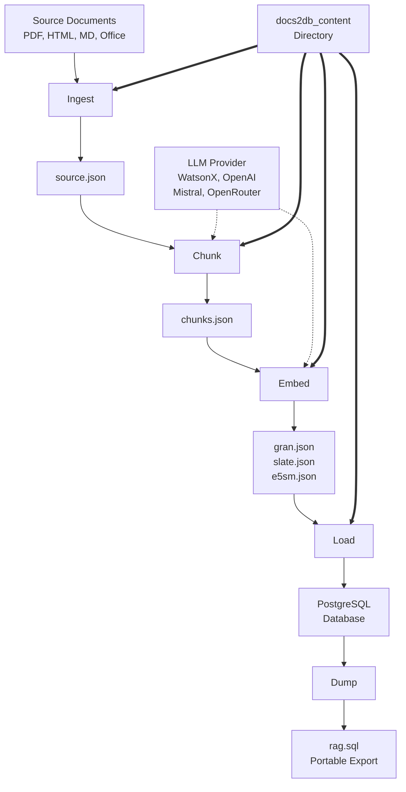
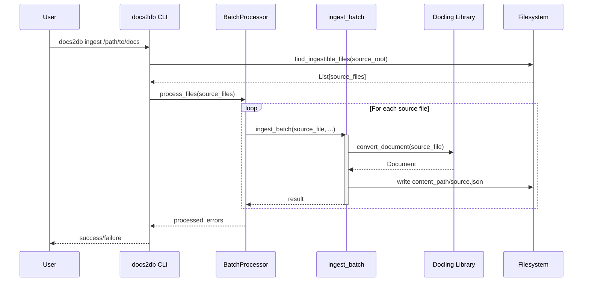
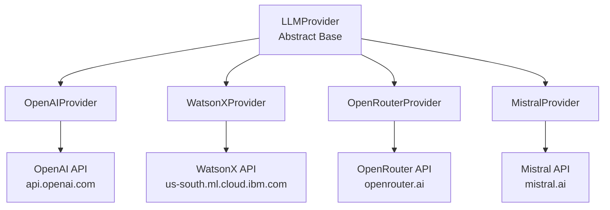
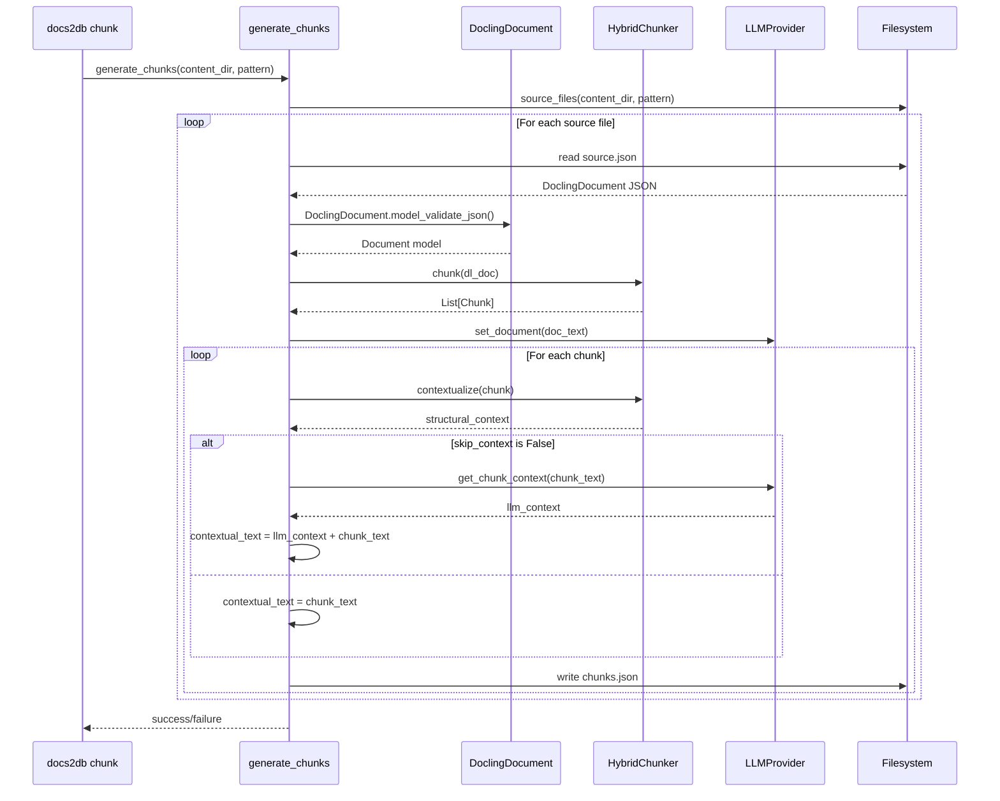
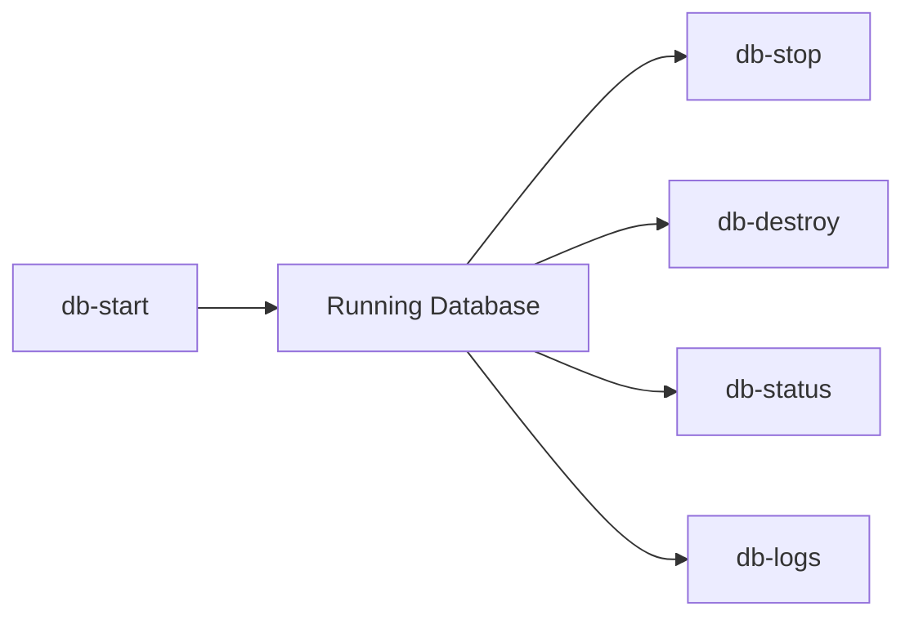

<details>
<summary>Relevant source files</summary>

The following files were used as context for generating this wiki page:
- [src/docs2db/ingest.py](https://github.com/b08x/docs2db/blob/main/src/docs2db/ingest.py)
- [src/docs2db/chunks.py](https://github.com/b08x/docs2db/blob/main/src/docs2db/chunks.py)
- [src/docs2db/docs2db.py](https://github.com/b08x/docs2db/blob/main/src/docs2db/docs2db.py)
- [src/docs2db/multiproc.py](https://github.com/b08x/docs2db/blob/main/src/docs2db/multiproc.py)
- [README.md](https://github.com/b08x/docs2db/blob/main/README.md)

</details>

# Processing Pipeline

## Introduction

The docs2db processing pipeline transforms source documents (PDFs, HTML, Markdown, Office files) into a queryable RAG (Retrieval-Augmented Generation) database. The system operates as a multi-stage pipeline where each stage produces intermediate artifacts that subsequent stages consume. The architecture demonstrates a clear separation of concerns: ingestion converts documents to Docling JSON format, chunking splits documents into manageable segments with optional LLM-generated context, embedding converts text to vector representations, and database operations handle loading and querying.

The pipeline supports incremental processing through staleness detection, automatically skipping files that have not changed since last processing. Parallel execution via multiprocessing enables efficient handling of large document collections, with configurable worker counts and batch sizes.

## Pipeline Architecture

### Overview

The processing pipeline consists of five primary stages, each implemented as a discrete CLI command that can be executed independently or as part of a unified pipeline:

1. **Ingest** - Convert source documents to Docling JSON format
2. **Chunk** - Split documents into text chunks with optional LLM-generated contextual enrichment
3. **Embed** - Generate vector embeddings for each chunk
4. **Load** - Import processed data into PostgreSQL database
5. **Dump** - Export database contents to portable SQL format



The content directory (`docs2db_content/`) serves as the persistent storage for all intermediate processing artifacts. Each source document receives its own subdirectory containing the generated files from each pipeline stage.

### Stage Dependencies

Each pipeline stage reads artifacts from the previous stage and produces outputs consumed by subsequent stages. This creates a clear dependency chain where skipping stages requires manual intervention:

| Stage | Input | Output | Dependencies |
|-------|-------|--------|--------------|
| Ingest | Source files (PDF, HTML, etc.) | `source.json` | None |
| Chunk | `source.json` | `chunks.json` | Ingest |
| Embed | `chunks.json` | `gran.json` (model-specific) | Chunk |
| Load | `gran.json`, `chunks.json` | Database tables | Embed |
| Dump | Database tables | SQL file | Load |

The pipeline command (`docs2db pipeline`) executes all stages sequentially with automatic database lifecycle management.

## Ingestion Stage

### Purpose and Scope

The ingestion stage converts source documents into a standardized Docling JSON format. Docling is a document understanding library that extracts structured content from various file formats while preserving semantic information such as headings, tables, and page layouts.

### Core Components

The ingestion functionality centers on the `ingest` function in `src/docs2db/ingest.py`:

```python
def ingest(
    source_path: str,
    dry_run: bool = False,
    force: bool = False,
    pipeline: Optional[str] = None,
    model: Optional[str] = None,
    device: Optional[str] = None,
    batch_size: Optional[int] = None,
    workers: Optional[int] = None,
) -> bool:
```

**Parameters:**

| Parameter | Type | Description |
|-----------|------|-------------|
| `source_path` | str | Path to directory or file to ingest |
| `dry_run` | bool | Show what would be processed without executing |
| `force` | bool | Force reprocessing even if files are up-to-date |
| `pipeline` | Optional[str] | Docling pipeline: 'standard' or 'vlm' |
| `model` | Optional[str] | Docling model specific to pipeline |
| `device` | Optional[str] | Device for docling: 'auto', 'cpu', 'cuda', 'mps' |
| `batch_size` | Optional[int] | Docling batch size per worker |
| `workers` | Optional[int] | Number of parallel workers |

Sources: [src/docs2db/ingest.py#L1-L100](src/docs2db/ingest.py)

### Processing Flow

The ingestion process follows a structured workflow:



### File Discovery

The system discovers ingestible files using `find_ingestible_files()`, which collects files matching supported extensions:

```python
def find_ingestible_files(source_root: Path) -> list[Path]:
    """Find all files that can be ingested."""
    patterns = [
        "**/*.pdf",
        "**/*.html",
        "**/*.htm",
        "**/*.md",
        "**/*.docx",
        "**/*.doc",
    ]
    # ... implementation
```

Sources: [src/docs2db/ingest.py#L50-L80](src/docs2db/ingest.py)

### Content Path Generation

Each source file maps to a corresponding content directory structure that preserves the original hierarchy:

```python
def generate_content_path(source_file: Path, source_root: Path) -> Path:
    """Generate content path preserving directory structure."""
    relative_path = source_file.relative_to(source_root)
    content_path = CONTENT_DIR / relative_path.parent / relative_path.stem
    return content_path
```

Sources: [src/docs2db/ingest.py#L80-L90](src/docs2db/ingest.py)

## Chunking Stage

### Purpose and Scope

The chunking stage splits documents into smaller text segments suitable for embedding and retrieval. It supports two chunking strategies: basic text splitting using a HybridChunker from Docling, and optional contextual enrichment using LLM providers to improve retrieval accuracy.

### Core Components

The chunking functionality is implemented in `src/docs2db/chunks.py`, which contains:

1. **LLM Providers** - Abstraction layer for multiple LLM backends
2. **Chunk Generation** - Document-to-chunk conversion with structural context
3. **Contextual Enrichment** - Optional LLM-generated context for each chunk

### LLM Provider Architecture

The system implements a provider abstraction pattern supporting multiple LLM backends:



Each provider implements a common interface:

```python
class LLMProvider(ABC):
    @abstractmethod
    def get_chunk_context(self, chunk_prompt: str) -> str:
        """Get context for a chunk using LLM."""
        pass
    
    @abstractmethod
    def summarize_text(self, text: str) -> str:
        """Summarize text using LLM."""
        pass
    
    @abstractmethod
    def set_document(self, doc_text: str):
        """Set document context."""
        pass
```

Sources: [src/docs2db/chunks.py#L1-L50](src/docs2db/chunks.py)

### Provider Implementations

#### WatsonX Provider

The WatsonX provider interfaces with IBM WatsonX for contextual generation:

```python
class WatsonXProvider(LLMProvider):
    def __init__(
        self,
        api_key: str,
        project_id: str,
        url: str,
        model: str,
        shared_state: dict | None = None,
    ):
        credentials = Credentials(api_key=api_key, url=url)
        self.api_client = APIClient(credentials=credentials, project_id=project_id)
        self.model_inference = ModelInference(
            model_id=model,
            api_client=self.api_client,
        )
```

Sources: [src/docs2db/chunks.py#L100-L120](src/docs2db/chunks.py)

#### Mistral Provider

The Mistral provider uses the Mistral AI API for text generation:

```python
class MistralProvider(LLMProvider):
    def __init__(
        self,
        base_url: str,
        model: str,
        api_key: str,
        shared_state: dict | None = None,
    ):
        if not api_key:
            raise ValueError(
                "Mistral API key required. "
                "Set MISTRAL_API_KEY environment variable or get one from https://console.mistral.ai/"
            )
        # ... initialization
```

Sources: [src/docs2db/chunks.py#L200-L220](src/docs2db/chunks.py)

#### OpenAI and OpenRouter Providers

Both providers use HTTP-based communication with OpenAI-compatible APIs:

```python
class OpenAIProvider(LLMProvider):
    def __init__(
        self,
        base_url: str,
        model: str,
        api_key: str,
        shared_state: dict | None = None,
    ):
        self.base_url = base_url
        self.model = model
        self.client = httpx.Client(
            headers={
                "Authorization": f"Bearer {api_key}",
                "Content-Type": "application/json",
            },
            timeout=60.0,
        )
```

Sources: [src/docs2db/chunks.py#L150-L180](src/docs2db/chunks.py)

### Chunk Generation Process

The chunk generation process combines document parsing with optional LLM enrichment:



### Token Estimation

The system uses character-based token estimation for chunk size management:

```python
def estimate_tokens(text: str) -> int:
    """Estimate token count for text.
    
    Uses a conservative approximation based on character count.
    Formula: chars / 3.0
    """
    char_count = len(text)
    return int(char_count / 3.0)
```

Sources: [src/docs2db/chunks.py#L350-L380](src/docs2db/chunks.py)

This estimation method accounts for diverse content types:
- Regular English prose: ~4-5 chars/token (conservative at 3)
- Code/data/numbers: ~2-3 chars/token

### Context Safety Margins

The system applies a safety margin to model context limits:

```python
CONTEXT_SAFETY_MARGIN = 0.75  # Use 75% of max context
```

This ensures generated prompts fit within model limits while accounting for tokenization variance.

## Embedding Stage

### Purpose and Scope

The embedding stage converts text chunks into vector representations suitable for semantic similarity search. The system supports multiple embedding models and stores vectors in model-specific files within each document's content directory.

### Supported Models

Based on the file naming conventions observed in the content directory structure:

| Model | Output File | Description |
|-------|-------------|--------------|
| granite-30m-english | `gran.json` | IBM Granite 30M English embeddings |
| e5-small-v2 | `e5sm.json` | E5 small v2 embeddings |
| slate-125m | `slate.json` | Slate 125M embeddings |
| noinstruct-small | varies | No-instruct small model |

The embedding generation is triggered via:

```python
@app.command()
def embed(
    content_dir: Annotated[str | None, typer.Option(help="Path to content directory")] = None,
    model: Annotated[str | None, typer.Option(help="Embedding model")],
    # ... additional parameters
) -> None:
```

Sources: [src/docs2db/docs2db.py#L1-L50](src/docs2db/docs2db.py)

## Database Operations

### Loading Data

The load stage imports processed chunks and embeddings into PostgreSQL:

```python
def load_documents(
    content_dir: Path,
    pattern: str = "**",
    # ... connection parameters
) -> bool:
```

The system supports:
- Vector similarity search via pgvector extension
- Full-text search via PostgreSQL tsvector with GIN indexing
- Hybrid search combining vector and BM25 approaches

Sources: [src/docs2db/database.py#L1-L50](src/docs2db/database.py)

### Database Lifecycle

The system provides commands for database management:



| Command | Function |
|---------|----------|
| `db-start` | Start PostgreSQL via Docker/Podman compose |
| `db-stop` | Stop the running database |
| `db-destroy` | Remove database containers and volumes |
| `db-status` | Check database connection status |
| `db-logs` | Retrieve database logs |

## Pipeline Orchestration

### Complete Pipeline Command

The `docs2db pipeline` command orchestrates all stages:

```python
@app.command()
def pipeline(
    source_path: Annotated[str | None, typer.Argument(help="Source path")],
    # ... many options
) -> None:
    """Run complete docs2db pipeline: start DB → ingest → chunk → embed → load → dump → stop."""
    
    # Step 1: Start database
    if not start_database():
        raise Docs2DBException("Failed to start database")
    
    # Step 2: Ingest
    if not ingest_command(...):
        raise Docs2DBException("Failed to ingest documents")
    
    # Step 3: Chunk
    if not generate_chunks(...):
        raise Docs2DBException("Failed to generate chunks")
    
    # Step 4: Embed
    if not generate_embeddings(...):
        raise Docs2DBException("Failed to generate embeddings")
    
    # Step 5: Load
    if not load_documents(...):
        raise Docs2DBException("Failed to load documents")
    
    # Step 6: Dump
    if not dump_database(...):
        raise Docs2DBException("Failed to dump database")
    
    # Step 7: Stop
    stop_database()
```

Sources: [src/docs2db/docs2db.py#L100-L150](src/docs2db/docs2db.py)

### Parallel Processing

The BatchProcessor class handles parallel execution across pipeline stages:

```python
class BatchProcessor:
    def __init__(
        self,
        worker_function: callable,
        worker_args: tuple,
        progress_message: str,
        batch_size: int,
        mem_threshold_mb: int,
        max_workers: int,
        use_shared_state: bool = False,
    ):
```

Sources: [src/docs2db/multiproc.py#L1-L50](src/docs2db/multiproc.py)

Configuration parameters control parallelism:

| Parameter | Default | Description |
|-----------|---------|-------------|
| `chunking_workers` | CPU count | Number of parallel chunking workers |
| `docling_workers` | CPU count | Number of parallel ingestion workers |
| `docling_batch_size` | 1 | Files processed per batch |
| `mem_threshold_mb` | 2000 | Memory threshold for chunking |
| `mem_threshold_mb` | 1500 | Memory threshold for ingestion |

## Content Directory Structure

The content directory stores all intermediate artifacts:

```
docs2db_content/
├── path/
│   └── to/
│       └── document/
│           ├── source.json      # Docling ingested document
│           ├── chunks.json      # Text chunks with context
│           ├── gran.json        # Vector embeddings (model-specific)
│           └── meta.json        # Processing metadata
```

Each stage reads from and writes to this directory, enabling:
- Incremental processing (stale file detection)
- Debugging and inspection at each stage
- Manual intervention between stages

Sources: [README.md#L50-L70](README.md)

## Staleness Detection

The pipeline implements automatic staleness detection to skip unchanged files:

```python
def is_chunks_stale(chunks_file: Path, source_file: Path) -> bool:
    """Check if chunks need regeneration."""
    if not chunks_file.exists():
        return True
    chunks_mtime = chunks_file.stat().st_mtime
    source_mtime = source_file.stat().st_mtime
    return chunks_mtime < source_mtime
```

This check compares modification times between source and output files, avoiding unnecessary reprocessing.

## Configuration

### Environment Variables

The system uses environment variables for configuration:

| Variable | Description |
|----------|-------------|
| `WATSONX_API_KEY` | IBM WatsonX API key |
| `WATSONX_PROJECT_ID` | WatsonX project ID |
| `OPENAI_API_KEY` | OpenAI API key |
| `MISTRAL_API_KEY` | Mistral AI API key |
| `OPENROUTER_API_KEY` | OpenRouter API key |

### CLI Options

Each pipeline command accepts extensive CLI options for configuration. Run `docs2db <command> --help` for complete option lists.

## Conclusion

The docs2db processing pipeline implements a staged architecture for transforming source documents into a searchable RAG database. Each stage produces intermediate artifacts stored in a hierarchical content directory, enabling incremental processing and manual inspection. The system demonstrates several architectural patterns:

1. **Provider Abstraction** - Multiple LLM backends (WatsonX, OpenAI, Mistral, OpenRouter) implement a common interface
2. **Parallel Processing** - BatchProcessor enables concurrent execution with configurable worker counts
3. **Incremental Processing** - Staleness detection avoids unnecessary reprocessing
4. **Pipeline Orchestration** - The unified pipeline command coordinates all stages with automatic database lifecycle management

The separation between stages allows independent execution and debugging, while the content directory structure provides visibility into each transformation step. The lack of explicit database.py and embed.py in the provided context represents a structural gap in the available source information, as the database loading and embedding generation stages are referenced but their implementations were not included in the provided file set.