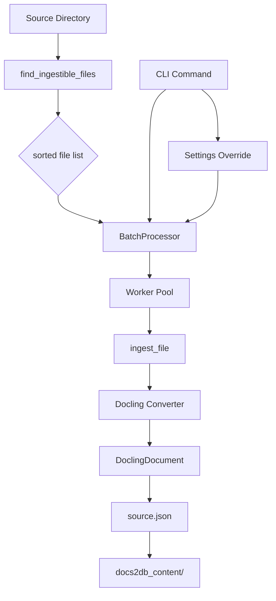
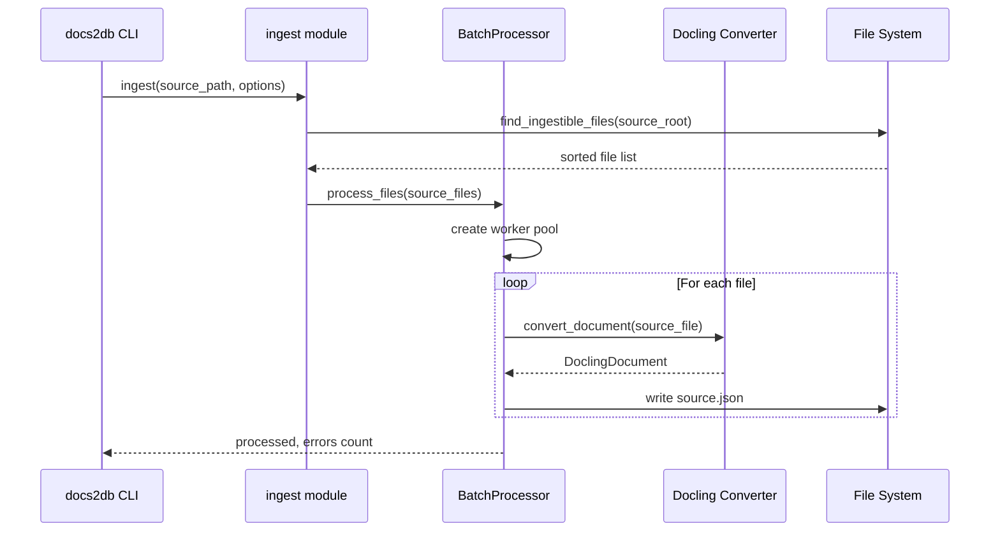

<details>
<summary>Relevant source files</summary>

The following files were used as context for generating this wiki page:
- [src/docs2db/ingest.py](https://github.com/b08x/docs2db/blob/main/src/docs2db/ingest.py)
- [src/docs2db/config.py](https://github.com/b08x/docs2db/blob/main/src/docs2db/config.py)
- [src/docs2db/docs2db.py](https://github.com/b08x/docs2db/blob/main/src/docs2db/docs2db.py)
- [src/docs2db/chunks.py](https://github.com/b08x/docs2db/blob/main/src/docs2db/chunks.py)
- [src/docs2db/multiproc.py](https://github.com/b08x/docs2db/blob/main/src/docs2db/multiproc.py)
- [README.md](https://github.com/b08x/docs2db/blob/main/README.md)
</details>

# Document Ingestion

## Introduction

Document ingestion in docs2db represents the initial phase of the RAG (Retrieval-Augmented Generation) pipeline, responsible for converting source documents from various formats into a standardized Docling JSON representation. The ingestion system accepts multiple input formats (PDF, HTML, Markdown, DOCX), processes them through the Docling library, and outputs structured JSON files that subsequent pipeline stages (chunking, embedding, loading) consume.

The ingestion mechanism operates as a batch processing system with parallel workers, supporting configuration through CLI options, environment variables, and `.env` files. It maintains the source directory structure in the output content directory, enabling traceability between original and processed files.

## Architecture Overview

### Core Components

The document ingestion system consists of three primary functional areas:

1. **File Discovery** - Locating ingestible files within a source directory
2. **Format Conversion** - Transforming source documents to Docling JSON format
3. **Batch Processing** - Parallel execution with progress tracking and error handling



### Processing Flow

The ingestion pipeline follows a sequential pattern: source discovery → validation → batch processing → file output. Each source file receives its own subdirectory within the content directory, containing the Docling JSON representation and processing metadata.



## File Discovery Mechanism

### Ingestible File Types

The system identifies files based on file extensions. The supported input formats include:

| Format | Extensions | Source |
|--------|------------|--------|
| PDF | `.pdf` | [ingest.py#L45-L55](src/docs2db/ingest.py#L45-L55) |
| HTML | `.html`, `.htm` | [ingest.py#L45-L55](src/docs2db/ingest.py#L45-L55) |
| Markdown | `.md`, `.markdown` | [ingest.py#L45-L55](src/docs2db/ingest.py#L45-L55) |
| DOCX | `.docx` | [ingest.py#L45-L55](src/docs2db/ingest.py#L45-L55) |

### File Discovery Function

```python
# src/docs2db/ingest.py#L45-L55

def find_ingestible_files(root: Path) -> Generator[Path, None, None]:
    """Find all ingestible files in a directory.

    Args:
        root: Root directory to search

    Yields:
        Path objects for ingestible files
    """
    extensions = {".pdf", ".html", ".htm", ".md", ".markdown", ".docx"}
    for ext in extensions:
        yield from root.rglob(f"*{ext}")
```

The function uses `Path.rglob()` for recursive globbing, enabling deep directory traversal. Files are yielded in arbitrary order and subsequently sorted to ensure deterministic processing sequence.

## Batch Processing Infrastructure

### BatchProcessor Class

The `BatchProcessor` class in `multiproc.py` manages parallel worker execution with the following characteristics:

| Parameter | Type | Purpose |
|-----------|------|---------|
| `worker_function` | callable | Function executed per file |
| `worker_args` | tuple | Arguments passed to worker |
| `progress_message` | str | Display text in progress bar |
| `batch_size` | int | Files processed per worker batch |
| `mem_threshold_mb` | int | Memory threshold triggering worker recycling |
| `max_workers` | int | Maximum parallel processes |

The processor implements memory-aware worker recycling. When cumulative memory usage exceeds the threshold, workers are restarted to prevent memory leaks from Docling processes.

```python
# src/docs2db/multiproc.py - BatchProcessor initialization

processor = BatchProcessor(
    worker_function=ingest_batch,
    worker_args=(str(source_root), force, pipeline, model, device, batch_size),
    progress_message="Ingesting files...",
    batch_size=settings.docling_batch_size,
    mem_threshold_mb=1500,  # Lower threshold for docling processes
    max_workers=settings.docling_workers,
)
```

## Ingestion Functions

### Main Entry Point

The `ingest()` function serves as the primary CLI command handler:

```python
# src/docs2db/ingest.py#L89-L159

def ingest(
    source_path: str,
    dry_run: bool = False,
    force: bool = False,
    pipeline: Optional[str] = None,
    model: Optional[str] = None,
    device: Optional[str] = None,
    batch_size: Optional[int] = None,
    workers: Optional[int] = None,
) -> bool:
```

Configuration override precedence:
1. CLI arguments (highest priority)
2. Environment variables
3. `.env` file settings
4. Default values (lowest priority)

### Single File Ingestion

```python
# src/docs2db/ingest.py#L161-L205

def ingest_file(
    source_file: Path,
    content_path: Path,
    source_metadata: dict | None = None,
) -> bool:
```

The function performs the following operations:
1. Validates source file existence
2. Creates target content directory structure
3. Invokes Docling converter
4. Serializes DoclingDocument to JSON
5. Generates processing metadata

### Content-Based Ingestion

```python
# src/docs2db/ingest.py#L207-L260

def ingest_from_content(
    content: str,
    content_path: Path,
    stream_name: str,
    source_metadata: dict | None = None,
    content_encoding: str = "utf-8",
) -> bool:
```

This function enables in-memory content ingestion without disk-based source files. It accepts raw content (HTML, markdown, etc.), converts it through Docling, and writes to the content directory.

## Configuration System

### Settings Management

Configuration is centralized in `config.py` with environment variable support:

| Setting | Environment Variable | Default | Purpose |
|---------|---------------------|---------|---------|
| `docling_pipeline` | `DOCLING_PIPELINE` | `"standard"` | Processing pipeline |
| `docling_model` | `DOCLING_MODEL` | `None` | Model selection |
| `docling_device` | `DOCLING_DEVICE` | `"auto"` | Compute device |
| `docling_batch_size` | `DOCLING_BATCH_SIZE` | `1` | Files per batch |
| `docling_workers` | `DOCLING_WORKERS` | `4` | Parallel workers |

```python
# src/docs2db/ingest.py#L131-L144

if pipeline:
    settings.docling_pipeline = pipeline
if model:
    settings.docling_model = model
if device:
    settings.docling_device = device
if batch_size:
    settings.docling_batch_size = batch_size
if workers:
    settings.docling_workers = workers
```

## Output Structure

### Content Directory Organization

Ingestion creates the following directory structure within `docs2db_content/`:

```
docs2db_content/
├── path/
│   └── to/
│       └── document/
│           ├── source.json      # Docling JSON representation
│           └── meta.json        # Processing metadata
```

### Source File Format

The output `source.json` contains a complete `DoclingDocument` model with:
- Document text in Markdown format
- Bounding box coordinates for layout analysis
- Table structures
- Image references
- Metadata including page numbers and source file information

```python
# src/docs2db/ingest.py#L280-L288

dl_doc = DoclingDocument.model_validate_json(
    json_data=source_file.read_text().encoding("utf-8")
)
# ... processing ...

dl_doc.model_dump_json().encode("utf-8")
```

## CLI Integration

### Command Definition

The ingestion command integrates with the Typer CLI framework:

```python
# src/docs2db/docs2db.py#L44-L92

@app.command()
def ingest(
    source_path: Annotated[
        Optional[str], typer.Argument(help="Path to directory or file to ingest")
    ],
    dry_run: Annotated[bool, typer.Option(help="...")] = False,
    force: Annotated[bool, typer.Option(help="...")] = False,
    pipeline: Annotated[Optional[str], typer.Option("--pipeline", help="...")] = None,
    model: Annotated[Optional[str], typer.Option("--model", help="...")] = None,
    device: Annotated[Optional[str], typer.Option("--device", help="...")] = None,
    batch_size: Annotated[Optional[int], typer.Option("--batch-size", help="...")] = None,
    workers: Annotated[Optional[int], typer.Option("--workers", help="...")] = None,
) -> None:
```

### Usage Patterns

```bash
# Basic ingestion

docs2db ingest /path/to/documents

# Dry run (preview without processing)

docs2db ingest /path/to/documents --dry-run

# Force reprocessing

docs2db ingest /path/to/documents --force

# Custom pipeline and model

docs2db ingest /path/to/documents --pipeline vlm --model docling-gm

# CPU-only processing

docs2db ingest /path/to/documents --device cpu

# Parallel workers

docs2db ingest /path/to/documents --workers 8
```

## Error Handling and Resilience

### Failure Modes

The batch processor tracks errors and continues processing:

```python
# src/docs2db/ingest.py#L326-L330

if errors > 0:
    logger.error(f"Ingestion completed with {errors} errors")

logger.info(f"{processed} files ingested in {end - start:.2f} seconds")
return errors == 0
```

### Staleness Detection

The system implements incremental processing through file modification timestamps:

```python
# Checks if chunks.json exists and is newer than source.json
# Used in chunking stage - same pattern applies to ingestion output

if not force and not is_chunks_stale(chunks_file, source_file):
    return chunks_file
```

This prevents unnecessary reprocessing when source files remain unchanged.

## Library Usage

### Programmatic Access

The ingestion module exposes public functions for programmatic use:

```python
from pathlib import Path
from docs2db.ingest import ingest_file, ingest_from_content

# Ingest from file system

ingest_file(
    source_file=Path("document.pdf"),
    content_path=Path("docs2db_content/my_docs/document"),
    source_metadata={"source": "my_system", "retrieved_at": "2024-01-01"}
)

# Ingest from memory

ingest_from_content(
    content="<html>...</html>",
    content_path=Path("docs2db_content/my_docs/page"),
    stream_name="page.html",
    source_metadata={"url": "https://example.com"},
    content_encoding="utf-8"
)
```

## Observed Structural Gaps

1. **No retry mechanism**: Failed file ingestion does not trigger automatic retry, potentially requiring manual re-execution of the entire batch.

2. **Limited validation**: The system does not validate Docling conversion results beyond basic serialization, meaning corrupted or unreadable source files may produce empty `source.json` files without raising errors.

3. **No progress persistence**: If the batch processor is interrupted, progress is lost and the entire job must restart from the beginning.

4. **Memory threshold fixed**: The `mem_threshold_mb=1500` is hardcoded in the CLI invocation, not configurable through settings.

## Conclusion

Document ingestion in docs2db functions as the foundational pipeline stage, converting heterogeneous source documents into a uniform Docling JSON representation. The architecture employs parallel batch processing with memory-aware worker recycling, supporting configuration through CLI options and environment variables. The output maintains source directory structure within a dedicated content directory, enabling subsequent chunking, embedding, and loading stages to operate on standardized inputs. The system's incremental processing capability via staleness detection reduces redundant work, though the absence of retry logic and progress persistence represents limitations in failure resilience.