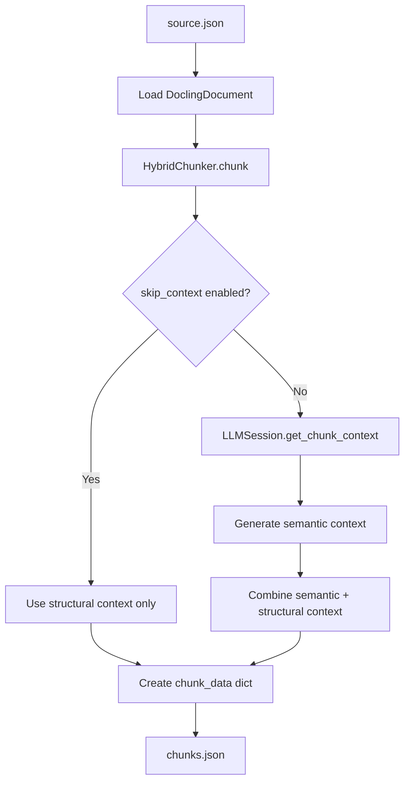
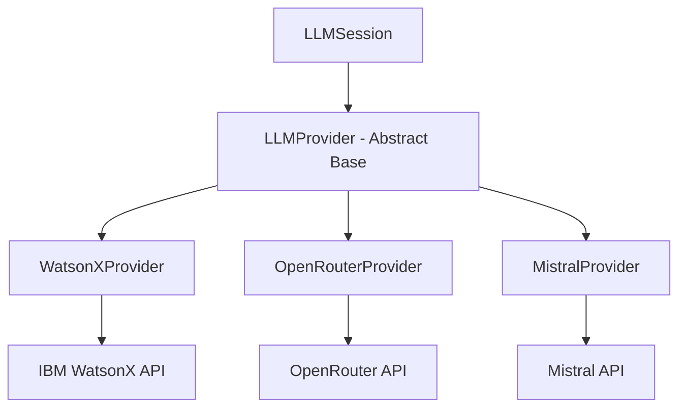

<details>
<summary>Relevant source files</summary>

The following files were used as context for generating this wiki page:
- [src/docs2db/chunks.py](https://github.com/b08x/docs2db/blob/main/src/docs2db/chunks.py)
- [src/docs2db/docs2db.py](https://github.com/b08x/docs2db/blob/main/src/docs2db/docs2db.py)
- [src/docs2db/multiproc.py](https://github.com/b08x/docs2db/blob/main/src/docs2db/multiproc.py)
- [src/docs2db/ingest.py](https://github.com/b08x/docs2db/blob/main/src/docs2db/ingest.py)
- [README.md](https://github.com/b08x/docs2db/blob/main/README.md)
- [CHANGELOG.md](https://github.com/b08x/docs2db/blob/main/CHANGELOG.md)

</details>

# Chunking and Contextual Retrieval

## 1. Introduction

Chunking and Contextual Retrieval constitutes the second major processing stage in the docs2db pipeline, following document ingestion. This mechanism transforms raw Docling JSON documents into semantically enriched text segments optimized for retrieval-augmented generation (RAG) applications.

The system operates through a hybrid approach combining structural analysis from Docling's chunker with optional LLM-generated semantic context. Each document is split into chunks, and an optional contextual enrichment layer is applied using external LLM providers (OpenAI-compatible APIs, IBM WatsonX, OpenRouter, or Mistral). This contextual retrieval approach follows principles similar to Anthropic's engineering methodology, where each chunk receives a brief semantic description situating it within the broader document.

The processing pipeline supports parallel execution via a BatchProcessor, enabling efficient handling of large document collections. The system maintains incremental processing capabilities, automatically skipping documents that have not changed since the last processing run.

Sources: [src/docs2db/chunks.py#L1-L50](), [README.md#L1-L30]()

---

## 2. Architecture Overview

### 2.1 Pipeline Position

The chunking stage occupies the third position in the docs2db processing pipeline:

```
[1] Ingest → [2] Chunk → [3] Embed → [4] Load → Database
```

Each stage produces intermediate files stored in the content directory (`docs2db_content/`). The chunking stage reads `source.json` files produced by ingestion and generates `chunks.json` files containing text segments with optional semantic context.

Sources: [src/docs2db/docs2db.py#L1-L30](), [README.md#L30-L50]()

### 2.2 Core Components

The chunking subsystem comprises five primary components:

| Component | File | Responsibility |
|-----------|------|----------------|
| `generate_chunks` | `chunks.py` | Main CLI command and orchestration |
| `HybridChunker` | `chunks.py` | Docling-based document splitting |
| `LLMSession` | `chunks.py` | LLM provider abstraction and session management |
| LLM Providers | `chunks.py` | API clients for WatsonX, OpenRouter, Mistral |
| `BatchProcessor` | `multiproc.py` | Parallel file processing |

Sources: [src/docs2db/chunks.py#L100-L300](), [src/docs2db/multiproc.py#L1-L50]()

---

## 3. Document Chunking Mechanism

### 3.1 HybridChunker Usage

The system employs Docling's `HybridChunker` for document segmentation. This chunker provides structural context including heading hierarchy, page numbers, and document organization. The chunker is initialized with a tokenizer and peer-merging enabled to produce coherent segments.

```python
# From chunks.py - chunk generation logic

chunker = HybridChunker(tokenizer=get_tokenizer(), merge_peers=True)

for chunk in chunker.chunk(dl_doc=dl_doc):
    # Get structural context from docling
    structural_context_text = chunker.contextualize(chunk=chunk)
    chunk_text = structural_context_text.replace("\xa0", " ")
```

Sources: [src/docs2db/chunks.py#L200-L220]()

### 3.2 Chunk Data Structure

Each chunk produces a structured dictionary containing multiple text representations:

```python
chunk_data = {
    "text": chunk_text,              # Structural context + chunk text - shown to LLM
    "contextual_text": contextual_text,  # Semantic context + structural context + chunk text - for indexing
    "metadata": chunk.meta.model_dump(),
}
```

The `text` field contains structural context intended for display to language models during question answering. The `contextual_text` field combines semantic context (generated by LLM) with structural context and is used for vector embedding and retrieval.

Sources: [src/docs2db/chunks.py#L230-L240]()

### 3.3 Processing Flow



The chunking process branches based on whether contextual enrichment is enabled. When `skip_context` is True, the system relies solely on Docling's structural context. When False, an LLM generates semantic context for each chunk.

Sources: [src/docs2db/chunks.py#L180-L250](), [README.md#L50-L70]()

---

## 4. Contextual Enrichment System

### 4.1 LLMSession Class

The `LLMSession` class manages the interaction between chunk generation and LLM providers. It handles provider initialization, document-level context management, summarization for large documents, and per-chunk context generation.

```python
class LLMSession:
    def __init__(
        self,
        model: str,
        provider: str,
        openai_url: str | None = None,
        watsonx_url: str | None = None,
        openrouter_url: str | None = None,
        mistral_url: str = "https://api.mistral.ai/v1",
        context_limit_override: int | None = None,
        shared_state: dict | None = None,
    ):
        # Provider instantiation based on configuration
```

Sources: [src/docs2db/chunks.py#L300-L380]()

### 4.2 Document Context Management

The session maintains document-level context and handles documents exceeding model token limits through summarization:

```python
def set_document(self, doc_text: str):
    # Analyze document size
    doc_words = len(doc_text.split())
    doc_tokens = estimate_tokens(doc_text)
    
    # Determine model limits
    model_limit = self.context_limit_override or MODEL_CONTEXT_LIMITS.get(self.model, 32768)
    usable_limit = int(model_limit * CONTEXT_SAFETY_MARGIN)
    
    # Summarize if document exceeds limits
    if doc_tokens > usable_limit:
        doc_text = self._summarize_document(doc_text)
```

The system applies a safety margin (0.8 default) to prevent exceeding context windows. When documents exceed usable limits, they are summarized to fit within available context.

Sources: [src/docs2db/chunks.py#L400-L450]()

### 4.3 Chunk Context Generation

For each chunk, the system generates a succinct semantic context:

```python
def get_chunk_context(self, chunk_text: str) -> str:
    chunk_prompt = f"""Here is a chunk from the document:
<chunk>
{chunk_text}
</chunk>

Please give a short succinct context to situate this chunk within the overall document for the purposes of improving search retrieval of the chunk. Answer only with the succinct context and nothing else."""
    
    return self.provider.get_chunk_context(chunk_prompt)
```

The prompt explicitly instructs the LLM to provide only the contextual description without additional commentary, ensuring clean context for retrieval.

Sources: [src/docs2db/chunks.py#L460-L475]()

---

## 5. LLM Provider Implementation

### 5.1 Provider Architecture

The system implements a provider abstraction pattern with a base `LLMProvider` class and concrete implementations for each service:



Each provider implements the `get_chunk_context` method with provider-specific API calls while exposing a unified interface.

Sources: [src/docs2db/chunks.py#L500-L700]()

### 5.2 WatsonX Provider

The WatsonX provider uses IBM's WatsonX SDK for model inference:

```python
class WatsonXProvider(LLMProvider):
    def __init__(self, api_key: str, project_id: str, url: str, model: str, shared_state: dict | None = None):
        credentials = Credentials(api_key=api_key, url=url)
        self.api_client = APIClient(credentials=credentials, project_id=project_id)
        self.model_inference = ModelInference(model_id=model, api_client=self.api_client)
    
    def get_chunk_context(self, chunk_prompt: str) -> str:
        messages = [
            {"role": "system", "content": "You are an expert at providing concise context..."},
            {"role": "user", "content": f"<document>\n{self.doc_text}\n</document>"},
            {"role": "assistant", "content": "I have read the document..."},
            {"role": "user", "content": chunk_prompt},
        ]
        response = self.model_inference.chat(messages=messages, params=params)
        return response["choices"][0]["message"]["content"].strip()
```

The provider maintains conversation history with the LLM, reading the full document once and then answering chunk-specific context queries.

Sources: [src/docs2db/chunks.py#L520-L580]()

### 5.3 OpenRouter Provider

OpenRouter provides access to multiple models through a unified OpenAI-compatible API:

```python
class OpenRouterProvider(LLMProvider):
    def __init__(self, base_url: str, model: str, api_key: str, site_url: str | None = None, 
                 app_name: str | None = None, shared_state: dict | None = None):
        super().__init__(shared_state=shared_state)
        self.base_url = base_url.rstrip("/")
        self.model = model
        self.api_key = api_key
        self.site_url = site_url
        self.app_name = app_name
        self.client = httpx.Client(timeout=600.0)
```

Sources: [src/docs2db/chunks.py#L600-L650]()

### 5.4 Provider Configuration Parameters

| Parameter | WatsonX | OpenRouter | Mistral | Description |
|-----------|---------|-------------|---------|-------------|
| `api_key` | Required | Required | Required | Service-specific API key |
| `model` | Required | Required | Required | Model identifier |
| `base_url` | N/A | Required | Optional | API endpoint URL |
| `project_id` | Required | N/A | N/A | WatsonX project ID |
| `site_url` | N/A | Optional | N/A | Referrer for OpenRouter |
| `app_name` | N/A | Optional | N/A | Application name for OpenRouter |

Sources: [src/docs2db/chunks.py#L520-L700]()

---

## 6. Parallel Processing

### 6.1 BatchProcessor Integration

The chunking command uses `BatchProcessor` from `multiproc.py` to process multiple documents in parallel:

```python
chunker = BatchProcessor(
    worker_function=generate_chunks_batch,
    worker_args=(
        content_dir,
        force,
        skip_context,
        context_model,
        provider,
        openai_url,
        watsonx_url,
        openrouter_url,
        mistral_url,
        context_limit_override,
    ),
    progress_message="Chunking files...",
    batch_size=1,
    mem_threshold_mb=2000,
    max_workers=max_workers,
    use_shared_state=True,
)
```

Sources: [src/docs2db/docs2db.py#L150-L180]()

### 6.2 Shared State for Rate Limiting

The system uses shared state to coordinate rate limiting across parallel workers:

```python
shared_state = {"watsonx": 0, "mistral": 0, "openrouter": 0}
```

Each provider tracks request counts to implement throttling when necessary. The `use_shared_state=True` parameter enables this coordination.

Sources: [src/docs2db/chunks.py#L250-L280](), [src/docs2db/multiproc.py#L50-L100]()

---

## 7. CLI Interface

### 7.1 Chunk Command

The `chunk` command exposes chunking functionality through the CLI:

```python
@app.command()
def chunk(
    content_dir: Annotated[str | None, typer.Option(help="Path to content directory")] = None,
    pattern: Annotated[str, typer.Option(help="Directory pattern")] = "**",
    force: Annotated[bool, typer.Option(help="Force reprocessing even if up-to-date")] = False,
    dry_run: Annotated[bool, typer.Option(help="Show what would process")] = False,
    skip_context: Annotated[bool | None, typer.Option(help="Skip LLM contextual chunk generation")] = None,
    context_model: Annotated[str | None, typer.Option(help="LLM model for context generation")] = None,
    llm_provider: Annotated[str | None, typer.Option(help="LLM provider: 'openai', 'watsonx', 'openrouter', or 'mistral'")] = None,
    openai_url: Annotated[str | None, typer.Option(...)] = None,
    watsonx_url: Annotated[str | None, typer.Option(...)] = None,
    openrouter_url: Annotated[str | None, typer.Option(...)] = None,
    mistral_url: Annotated[str | None, typer.Option(...)] = None,
    context_limit_override: Annotated[int | None, typer.Option(...)] = None,
    workers: Annotated[int | None, typer.Option(help="Number of parallel workers")] = None,
):
```

Sources: [src/docs2db/docs2db.py#L120-L200]()

### 7.2 Usage Examples

```bash
# Fast chunking without LLM context

docs2db chunk --skip-context

# Using Ollama with local model

docs2db chunk --context-model qwen2.5:7b-instruct

# Using OpenAI

docs2db chunk --openai-url https://api.openai.com --context-model gpt-4o-mini

# Using WatsonX

docs2db chunk --watsonx-url https://us-south.ml.cloud.ibm.com --context-model granite-3-8b
```

Sources: [README.md#L70-L90]()

---

## 8. Token Estimation and Limits

### 8.1 Estimation Algorithm

The system uses character-based token estimation for efficiency:

```python
def estimate_tokens(text: str) -> int:
    """Estimate token count using conservative approximation.
    
    Formula: chars / 3.0
    - Regular English prose: ~4-5 chars/token (conservative at 3)
    - Code/data/numbers: ~2-3 chars/token
    """
    char_count = len(text)
    return int(char_count / 3.0)
```

The 3 characters-per-token formula provides a conservative estimate that accommodates diverse content types including prose, code, and data.

Sources: [src/docs2db/chunks.py#L320-L345]()

### 8.2 Model Context Limits

The system maintains a dictionary of known model context limits:

```python
MODEL_CONTEXT_LIMITS = {
    "qwen2.5:7b-instruct": 32768,
    # Additional models may be added
}
```

When no explicit limit is found, a default of 32768 tokens is used.

Sources: [src/docs2db/chunks.py#L80-L95]()

---

## 9. Incremental Processing

### 9.1 Staleness Detection

The system tracks file modification times to avoid reprocessing unchanged documents:

```python
if not force and not is_chunks_stale(chunks_file, source_file):
    return chunks_file  # Skip processing
```

The staleness check compares the modification time of the chunks file against the source file. If chunks exist and are newer than the source, processing is skipped.

Sources: [src/docs2db/chunks.py#L180-L195]()

### 9.2 Lazy LLM Session Initialization

LLM sessions are created only when needed:

```python
# Check if any files need LLM processing

llm_session_needed = False
for source_file in source_list:
    chunks_file = source_file.parent / "chunks.json"
    if force or is_chunks_stale(chunks_file, source_file):
        llm_session_needed = True
        break

if llm_session_needed:
    reusable_llm_session = LLMSession(...)
```

This optimization avoids initializing expensive LLM clients when all files are already processed.

Sources: [src/docs2db/chunks.py#L280-L310]()

---

## 10. Output and Metadata

### 10.1 Chunks File Format

The output `chunks.json` contains an array of chunk objects:

```json
[
  {
    "text": "Structural context + chunk text",
    "contextual_text": "Semantic context + structural context + chunk text",
    "metadata": {
      "chunk_id": "...",
      "page": 1,
      "heading_hierarchy": ["Section", "Subsection"]
    }
  }
]
```

### 10.2 Processing Metadata

Each chunking operation records metadata about the configuration used:

```python
processing_metadata = {
    "chunker": CHUNKING_CONFIG["chunker_class"],
    "parameters": {
        "max_tokens": CHUNKING_CONFIG["max_tokens"],
        "merge_peers": CHUNKING_CONFIG["merge_peers"],
        "tokenizer_model": CHUNKING_CONFIG["tokenizer_model"],
    },
}

if not skip_context:
    enrichment_metadata = {
        "model": context_model,
        "provider": "watsonx" | "openrouter" | "mistral",
        "endpoint": url,
    }
```

Sources: [src/docs2db/chunks.py#L240-L270]()

---

## 11. Observed Structural Patterns and Gaps

### 11.1 Provider Selection Logic

The provider selection follows a priority order: explicit `--llm-provider` flag > environment variable > URL-based inference. However, the code shows that URL flags can override provider selection even when a provider is explicitly specified:

```python
if provider == "watsonx" or watsonx_url:
    # Creates WatsonX provider
elif provider == "openrouter" or openrouter_url:
    # Creates OpenRouter provider
```

This implicit override could lead to unexpected behavior if users specify conflicting options.

Sources: [src/docs2db/chunks.py#L700-L750]()

### 11.2 Missing Error Handling

The chunk generation function lacks explicit error handling for LLM API failures. If `get_chunk_context` raises an exception, the entire batch may fail. There's no retry logic at the chunk level (only at the API request level via `@_get_llm_retry_decorator`).

Sources: [src/docs2db/chunks.py#L220-L235]()

### 11.3 Summarization Once Per Session

The document summarization only occurs once per `LLMSession` instance. If the session is reused across many documents without calling `set_document`, subsequent large documents may fail to generate context properly.

Sources: [src/docs2db/chunks.py#L400-L420]()

---

## 12. Conclusion

Chunking and Contextual Retrieval in docs2db represents a sophisticated pipeline stage that transforms ingested documents into retrieval-optimized text segments. The architecture demonstrates a clean separation between structural chunking (handled by Docling's HybridChunker) and semantic enrichment (delegated to configurable LLM providers).

Key structural observations:

1. **Modular Provider Design**: The abstraction enables flexible LLM provider selection without modifying core chunking logic.

2. **Parallel Processing**: Integration with BatchProcessor enables scalable document processing while maintaining coordination through shared state.

3. **Incremental Processing**: Staleness detection and lazy LLM initialization optimize for repeated runs over evolving document collections.

4. **Context Safety**: Token estimation, model limits, and summarization mechanisms protect against context overflow.

5. **Structured Output**: Dual text representations (`text` and `contextual_text`) serve different purposes—LLM consumption versus vector indexing.

The system's design reflects practical RAG engineering principles, balancing computational efficiency against retrieval quality through contextual enrichment. The observed gaps in error handling and provider selection logic represent areas where defensive programming could strengthen robustness.

Sources: [src/docs2db/chunks.py#L1-L50](), [src/docs2db/docs2db.py#L120-L200](), [README.md#L50-L90](), [CHANGELOG.md#L1-L30]()