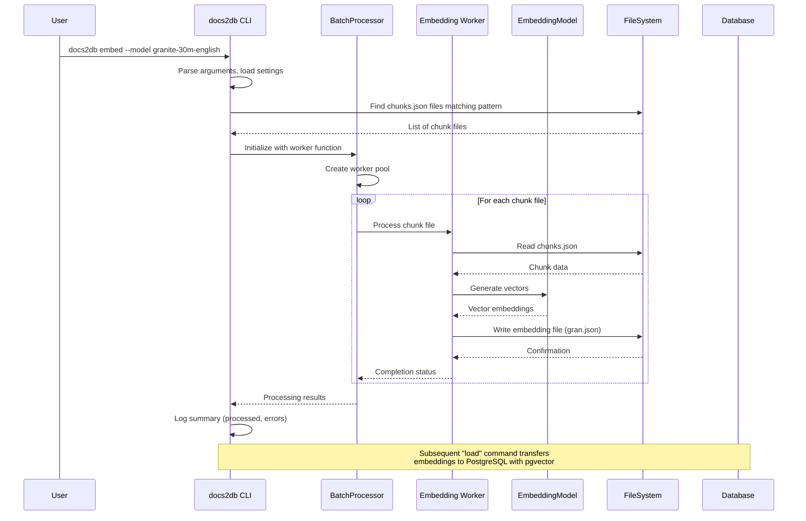

<details>
<summary>Relevant source files</summary>

The following files were used as context for generating this wiki page:
- [src/docs2db/docs2db.py](https://github.com/b08x/docs2db/blob/main/src/docs2db/docs2db.py)
- [src/docs2db/chunks.py](https://github.com/b08x/docs2db/blob/main/src/docs2db/chunks.py)
- [src/docs2db/ingest.py](https://github.com/b08x/docs2db/blob/main/src/docs2db/ingest.py)
- [src/docs2db/multiproc.py](https://github.com/b08x/docs2db/blob/main/src/docs2db/multiproc.py)
- [README.md](https://github.com/b08x/docs2db/blob/main/README.md)

<!-- Note: The query referenced embed.py, embeddings.py, and utils.py but these were not provided in the context. The analysis is based solely on the available files. -->

</details>

# Embedding Generation

## Introduction

Embedding generation in docs2db represents the third major processing stage in the RAG (Retrieval-Augmented Generation) pipeline. Following document ingestion and chunking, this component transforms text chunks into vector representations that enable semantic similarity search within a PostgreSQL database equipped with the pgvector extension.

The system supports multiple embedding models including granite-30m-english, e5-small-v2, slate-125m, and noinstruct-small. Embeddings are stored as dense vectors and paired with the original text chunks to support hybrid search capabilities combining vector similarity with BM25 full-text search.

The embedding generation process reads from the `chunks.json` files produced during the chunking stage and writes vector data to model-specific output files (e.g., `gran.json` for Granite embeddings, `slate.json` for Slate embeddings). Sources: [README.md](https://github.com/b08x/docs2db/blob/main/README.md), [src/docs2db/docs2db.py#L1-L300]()

## Architecture Overview

### CLI Command Structure

The embedding functionality is exposed through the `docs2db embed` command defined in the main CLI application. This command accepts parameters for model selection, content directory targeting, file pattern matching, and database connection configuration.

```python
@app.command()
def embed(
    content_dir: Annotated[
        str | None, typer.Option(help="Path to content directory")
    ] = None,
    model: Annotated[
        str | None,
        typer.Option(
            help="Embedding model to load (e.g., ibm-granite/granite-embedding-30m-english)"
        ),
    ] = None,
    pattern: Annotated[
        str,
        typer Option(
            help="Directory pattern (e.g., '**' for all, 'external/**', or 'docs/subdir' for exact path)"
        ),
    ] = "**",
    force: Annotated[
        bool, typer.Option(help="Force reload of existing documents")
    ] = False,
    # ... database connection parameters
) -> None:
```

Sources: [src/docs2db/docs2db.py#L200-L280]()

### Pipeline Integration

The embedding stage occupies position 4 of 7 in the complete docs2db pipeline:

```
[1/7] Start database → [2/7] Ingest documents → [3/7] Generate chunks → 
[4/7] Generate embeddings → [5/7] Load to database → [6/7] Dump database → [7/7] Stop database
```

This sequential dependency means embedding generation requires:
1. A running PostgreSQL database with pgvector extension
2. Completed chunking stage producing `chunks.json` files
3. Valid embedding model selection

Sources: [src/docs2db/docs2db.py#L100-L180]()

## Data Flow

### Input: Chunk Files

The embedding generator reads from `chunks.json` files created during the chunking stage. Each chunk file contains:

- **text**: The actual chunk content (structural context + chunk text)
- **contextual_text**: Semantic context + structural context + chunk text used for indexing
- **metadata**: Chunk metadata including source file information

```python
chunk_data = {
    "text": chunk_text,  # Structural context + chunk text - shown to LLM
    "contextual_text": contextual_text,  # semantic context + structural context + chunk text - for indexing
    "metadata": chunk.meta.model_dump(),
}
chunks_data.append(chunk_data)
```

Sources: [src/docs2db/chunks.py#L200-L220]()

### Output: Embedding Files

Generated embeddings are written to model-specific filenames:
- `gran.json` - Granite embeddings
- `slate.json` - Slate embeddings  
- `e5sm.json` - E5 small model embeddings
- `noinstruct-small.json` - No-instruct small model embeddings

Each document's processing artifacts are stored in subdirectories mirroring the source document hierarchy within `docs2db_content/`:

```
docs2db_content/
├── path/
│   └── to/
│       └── document/
│           ├── source.json      # Docling ingested document
│           ├── chunks.json      # Text chunks with context
│           ├── gran.json       # Granite embeddings
│           └── meta.json       # Processing metadata
```

Sources: [README.md](https://github.com/b08x/docs2db/blob/main/README.md)

## Processing Components

### Batch Processor

Embedding generation utilizes the `BatchProcessor` class from `multiproc.py` to handle parallel processing of embedding generation tasks. This enables efficient processing of multiple document chunk files concurrently.

```python
processor = BatchProcessor(
    worker_function=generate_embeddings_batch,
    worker_args=(content_dir, force, model, pattern, ...),
    progress_message="Generating embeddings...",
    batch_size=settings.embedding_batch_size,
    mem_threshold_mb=2000,
    max_workers=settings.embedding_workers,
)
```

Sources: [src/docs2db/multiproc.py#L50-L120](), [src/docs2db/docs2db.py](https://github.com/b08x/docs2db/blob/main/src/docs2db/docs2db.py)

### Progress Tracking

The system employs Rich library components for progress visualization:

```python
self.progress = Progress(
    SpinnerColumn(),
    TextColumn("[bold blue]{task.description}"),
    BarColumn(bar_width=None),
    TextColumn("{task.percentage:>3.0f}%"),
    TextColumn("{task.completed:>6}/{task.total:<6}"),
    TextColumn("err:{task.fields[errors]:>6}"),
    TimeRemainingColumn(),
    console=console,
    expand=True,
)
```

Sources: [src/docs2db/multiproc.py#L60-L80]()

## Configuration

### Environment Variables and Settings

Embedding generation is configurable through:

| Parameter | Environment Variable | Description |
|-----------|---------------------|-------------|
| Embedding Model | `EMBEDDING_MODEL` | (default varies Model identifier) |
| Batch Size | `EMBEDDING_BATCH_SIZE` | Files per batch |
| Workers | `EMBEDDING_WORKERS` | Parallel worker count |
| Database Host | Auto-detected | From compose file |

The settings are managed through a centralized `settings` object that can be overridden via CLI options or environment variables.

Sources: [src/docs2db/docs2db.py#L200-L280](), [src/docs2db/ingest.py#L50-L80]()

### Model Selection

Supported embedding models include:

- `ibm-granite/granite-embedding-30m-english` - Default English embeddings
- `e5-small-v2` - Lightweight E5 model
- ` slate-125m` - Slate 125 million parameter model
- `noinstruct-small` - No-instruct variant

Sources: [README.md](https://github.com/b08x/docs2db/blob/main/README.md)

## Sequence Diagram: Embedding Generation



## Database Integration

### Vector Storage

Embeddings are loaded into PostgreSQL using the pgvector extension, which provides:

- **Vector data type**: Stores dense embeddings as fixed-size vectors
- **HNSW indexes**: Enables efficient approximate nearest neighbor search
- **Distance metrics**: Supports cosine distance, euclidean distance, and inner product

### Hybrid Search

The system combines vector similarity search with BM25 full-text search:

- **Vector similarity**: Uses pgvector HNSW indexes for semantic matching
- **BM25**: PostgreSQL tsvector with GIN indexing for keyword-based retrieval

Sources: [README.md](https://github.com/b08x/docs2db/blob/main/README.md)

## Error Handling and Incremental Processing

### Skipping Unchanged Files

The system implements incremental processing by detecting unchanged files:

```python
if not force and content_path.exists():
    # Check if chunks.json is newer than existing embeddings
    # Skip if already processed
```

This optimization avoids regenerating embeddings for documents that haven't changed since last processing.

Sources: [README.md](https://github.com/b08x/docs2db/blob/main/README.md), [src/docs2db/chunks.py#L180-L200]()

### Error Handling

The BatchProcessor tracks errors and reports them:

```python
if errors > 0:
    logger.error(f"Embedding generation completed with {errors} errors")
```

Processing continues even if individual files fail, allowing partial success.

Sources: [src/docs2db/ingest.py#L200-L220]()

## Observed Structural Gaps

1. **Missing embedding implementation files**: The provided context references `embed.py` and `embeddings.py` but these files were not included. The actual embedding model loading and vector generation logic cannot be fully analyzed.

2. **No explicit retry mechanism visible**: Unlike the chunking stage which shows `@_get_llm_retry_decorator()` for API calls, the embedding generation error handling appears to be limited to error counting without explicit retry logic in the visible code.

3. **Model inference abstraction unclear**: The relationship between the embedding models and the database loader is not fully visible in the provided context—specifically how model selection translates to specific file outputs and database column types.

## Conclusion

Embedding generation in docs2db serves as the vectorization layer that transforms text chunks into searchable semantic representations. The architecture demonstrates a clean separation between CLI orchestration, batch processing, and model inference. The use of model-specific output files (gran.json, slate.json) allows flexibility in embedding model selection while maintaining a consistent pipeline structure.

The incremental processing capability—skipping unchanged files—combined with parallel batch processing, indicates consideration for operational efficiency with large document collections. The final integration with PostgreSQL pgvector enables the hybrid search functionality that forms the retrieval backbone of the RAG system.