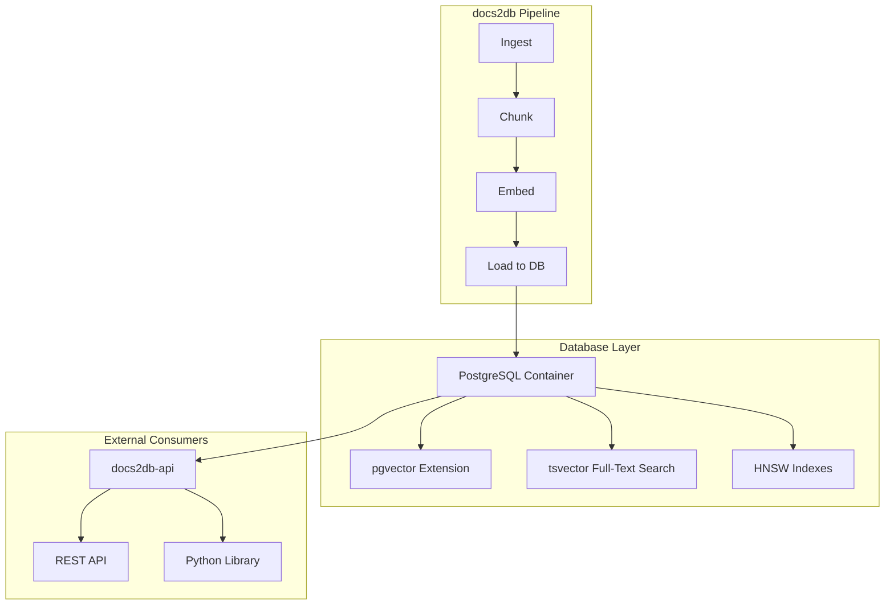
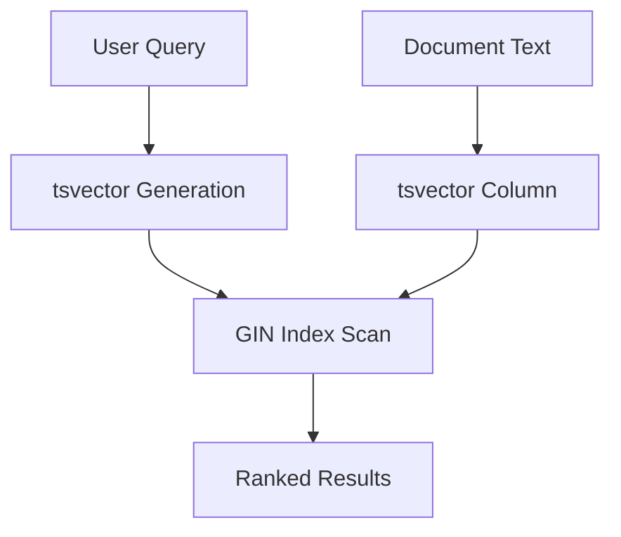
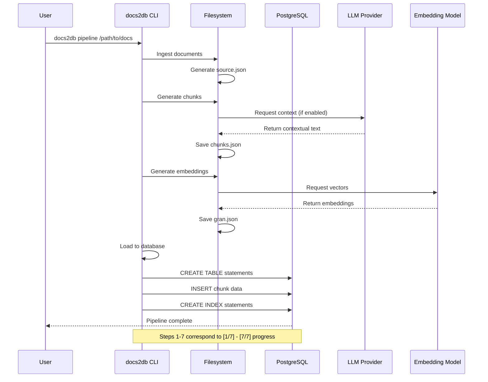

<details>
<summary>Relevant source files</summary>

The following files were used as context for generating this wiki page:
- [src/docs2db/database.py](https://github.com/b08x/docs2db/blob/main/src/docs2db/database.py)
- [src/docs2db/docs2db.py](https://github.com/b08x/docs2db/blob/main/src/docs2db/docs2db.py)
- [src/docs2db/chunks.py](https://github.com/b08x/docs2db/blob/main/src/docs2db/chunks.py)
- [src/docs2db/ingest.py](https://github.com/b08x/docs2db/blob/main/src/docs2db/ingest.py)
- [postgres-compose.yml](https://github.com/b08x/docs2db/blob/main/postgres-compose.yml)
- [README.md](https://github.com/b08x/docs2db/blob/main/README.md)

</details>

# Database Schema

## Introduction

The docs2db system uses PostgreSQL as its backing database to store processed document content, text chunks, vector embeddings, and associated metadata. The database schema serves as the persistence layer for the entire RAG (Retrieval Augmented Generation) pipeline, enabling full-text search capabilities via PostgreSQL's `tsvector` with GIN indexing, vector similarity search through the `pgvector` extension with HNSW indexes, and schema versioning for tracking metadata changes over time.

The database is containerized using Docker/Podman and configured through environment variables or a `.env` file. The schema is populated through a multi-stage pipeline: documents are ingested using Docling, then chunked with optional LLM-generated contextual enrichment, then embedded using vector embedding models, and finally loaded into the database.

## Architecture Overview

### Database Stack

The system uses PostgreSQL with the `pgvector` extension for vector storage and search. The database runs as a Docker container managed through docker-compose.



Sources: [docs2db.py#L1-L30](), [README.md#L1-L60]()

### Pipeline Integration

The database schema is tightly coupled with the processing pipeline. Each stage produces intermediate files that are eventually loaded into the database:

| Pipeline Stage | Output File | Database Purpose |
|----------------|-------------|-------------------|
| Ingest | `source.json` | Original document in Docling JSON format |
| Chunk | `chunks.json` | Text chunks with optional LLM context |
| Embed | `gran.json` (varies by model) | Vector embeddings |
| Load | Database tables | Structured storage for search |

Sources: [README.md#L80-L100]()

## Database Configuration

### Docker Compose Configuration

The database is defined in `postgres-compose.yml` and uses official PostgreSQL image with the `pgvector` extension.

```yaml
services:
  postgres:
    image: pgvector/pgvector:pg16
    environment:
      POSTGRES_DB: ${POSTGRES_DB:-docs2db}
      POSTGRES_USER: ${POSTGRES_USER:-docs2db}
      POSTGRES_PASSWORD: ${POSTGRES_PASSWORD:-docs2db}
    ports:
      - "${POSTGRES_PORT:-5432}:5432"
    volumes:
      - pgdata:/var/lib/postgresql/data
    healthcheck:
      test: ["CMD-SHELL", "pg_isready -U ${POSTGRES_USER:-docs2db}"]
      interval: 5s
      timeout: 5s
      retries: 5
```

Sources: [postgres-compose.yml#L1-L20]()

### Environment Configuration

Database connection parameters are sourced from environment variables with sensible defaults:

| Variable | Default | Description |
|----------|---------|-------------|
| `POSTGRES_DB` | docs2db | Database name |
| `POSTGRES_USER` | docs2db | Database user |
| `POSTGRES_PASSWORD` | docs2db | Database password |
| `POSTGRES_HOST` | localhost | Database host |
| `POSTGRES_PORT` | 5432 | Database port |

Sources: [postgres-compose.yml](https://github.com/b08x/docs2db/blob/main/postgres-compose.yml), [docs2db.py#L150-L180]()

## Core Database Functions

### Database Lifecycle Management

The `db_lifecycle` module handles starting, stopping, and checking the status of the database container.

```python
from docs2db.db_lifecycle import (
    destroy_database,
    get_database_logs,
    start_database,
    stop_database,
)
```

Sources: [docs2db.py#L10-L14]()

### Database Operations

The `database` module provides core functions for interacting with PostgreSQL:

```python
from docs2db.database import (
    check_database_status,
    configure_rag_settings,
    dump_database,
    generate_manifest,
    load_documents,
    restore_database,
)
```

Sources: [docs2db.py#L8-L16]()

### Document Loading Process

The `load_documents` function transfers processed chunk and embedding data from JSON files into database tables.

```python
def load_documents(
    content_dir: Path,
    pattern: str = "**",
    force: bool = False,
    host: Optional[str] = None,
    port: Optional[int] = None,
    db: Optional[str] = None,
    user: Optional[str] = None,
    password: Optional[str] = None,
    batch_size: int = 100,
) -> bool:
    """Load documents into the database from content directory."""
```

Sources: [docs2db.py#L180-L210](), [database.py](https://github.com/b08x/docs2db/blob/main/database.py)

### Database Dumping

The system supports exporting the database to portable SQL files:

```python
def dump_database(
    output_file: Path,
    host: Optional[str] = None,
    port: Optional[int] = None,
    db: Optional[str] = None,
    user: Optional[str] = None,
    password: Optional[str] = None,
) -> bool:
    """Dump database to SQL file."""
```

Sources: [docs2db.py#L130-L150]()

## Schema Versioning

The system tracks metadata and schema changes through versioned schemas. Each document processed includes a `meta.json` file containing processing metadata:

```python
processing_metadata = {
    "chunker": CHUNKING_CONFIG["chunker_class"],
    "parameters": {
        "max_tokens": CHUNKING_CONFIG["max_tokens"],
        "merge_peers": CHUNKING_CONFIG["merge_peers"],
        "tokenizer_model": CHUNKING_CONFIG["tokenizer_model"],
    },
}
```

Sources: [chunks.py#L280-L290]()

The schema versioning enables tracking of:
- Processing timestamps
- Chunker configuration changes
- Embedding model variations
- Metadata schema evolution

## Search Capabilities

### Full-Text Search

PostgreSQL's `tsvector` with GIN indexing provides BM25-style full-text search:



Sources: [README.md#L40-L45]()

### Vector Similarity Search

The `pgvector` extension with HNSW indexes enables vector similarity search:

```python
-- Vector similarity query example (from docs2db-api)
SELECT document_id, chunk_text, 
       1 - (embedding <=> $query_vector) as similarity
FROM chunks
ORDER BY embedding <=> $query_vector
LIMIT 5;
```

Sources: [README.md#L40-L45]()

### Hybrid Search

The system combines both approaches through the `docs2db-api` package, enabling hybrid search that merges vector and BM25 results with configurable weighting.

## Data Flow Sequence



Sources: [docs2db.py#L80-L130]()

## Chunk Data Structure

When documents are loaded into the database, each chunk contains both structural and semantic information:

```python
chunk_data = {
    "text": chunk_text,           # Structural context + chunk text - shown to LLM
    "contextual_text": contextual_text,  # Semantic context + structural + chunk
    "metadata": chunk.meta.model_dump(),
}
```

Sources: [chunks.py#L260-L270]()

The chunk metadata includes:
- Source document information
- Position/location within document
- Processing timestamps
- LLM context (if contextual retrieval was enabled)

## Provider Support

The system supports multiple LLM providers for contextual chunk generation:

| Provider | Environment Variables | URL Configuration |
|----------|----------------------|-------------------|
| OpenAI | `OPENAI_API_KEY` | `--openai-url` |
| WatsonX | `WATSONX_API_KEY`, `WATSONX_PROJECT_ID` | `--watsonx-url` |
| OpenRouter | `OPENROUTER_API_KEY` | `--openrouter-url` |
| Mistral | `MISTRAL_API_KEY` | `--mistral-url` |

Sources: [chunks.py#L100-L200]()

## Configuration Parameters

### Chunking Configuration

```python
CHUNKING_CONFIG = {
    "chunker_class": "SemanticChunker",
    "max_tokens": 512,
    "merge_peers": True,
    "tokenizer_model": "default",
}
```

Sources: [chunks.py#L280-L290]()

### Embedding Models

Supported embedding models include:
- `ibm-granite/granite-embedding-30m-english`
- `intfloat/e5-small-v2`
- `IBM/slate-125m-english-rtrvr`
- `BAAI/bge-small-en-v1.5`

Sources: [docs2db.py#L220-L240]()

## Database Connection Patterns

### CLI Automatic Detection

The CLI commands auto-detect database connection parameters from the compose file when not explicitly provided:

```python
host: Annotated[
    Optional[str],
    typer.Option(help="Database host (auto-detected from compose file)"),
] = None,
```

Sources: [docs2db.py#L190-L200]()

### Direct Library Usage

For programmatic access:

```python
from docs2db_api.rag.engine import UniversalRAGEngine, RAGConfig

config = RAGConfig(similarity_threshold=0.7, max_chunks=5)
engine = UniversalRAGEngine(config=config)
await engine.start()
results = await engine.search_documents("query")
```

Sources: [README.md#L130-L140]()

## Observed Structural Patterns

### Incremental Processing

The system maintains processing state to enable incremental updates. Files that haven't changed are automatically skipped:

```python
if dry_run:
    logger.info("DRY RUN - would process:")
    for file in source_list:
        logger.info(f"  {file}")
    return True
```

Sources: [chunks.py#L350-L360]()

### Batch Processing

Document processing uses batched multiprocessing for efficiency:

```python
chunker = BatchProcessor(
    worker_function=generate_chunks_batch,
    progress_message="Chunking files...",
    batch_size=1,
    mem_threshold_mb=2000,
    max_workers=max_workers,
)
```

Sources: [chunks.py#L360-L380]()

## Conclusion

The database schema in docs2db serves as the final persistence layer for a complete RAG pipeline. It integrates PostgreSQL with the pgvector extension to provide hybrid search capabilities combining full-text search (tsvector/GIN) and vector similarity (HNSW indexes). The schema is not explicitly defined in SQL files within the provided context—instead, it appears to be created dynamically through the `load_documents` function based on the chunk and embedding data structures.

Key architectural observations:
1. The database is tightly coupled to the file-based pipeline outputs (source.json, chunks.json, gran.json)
2. Schema versioning is handled through metadata stored alongside processed documents
3. The system supports multiple LLM providers for contextual enrichment but the database schema remains consistent
4. Database connection parameters can be auto-detected from the compose file or explicitly configured
5. The schema is portable through SQL dump/restore mechanisms, enabling deployment anywhere with docs2db-api

The lack of explicit SQL schema definitions in the provided source files represents a structural gap—schema creation appears to be handled implicitly through the data loading process rather than through version-controlled migration files.