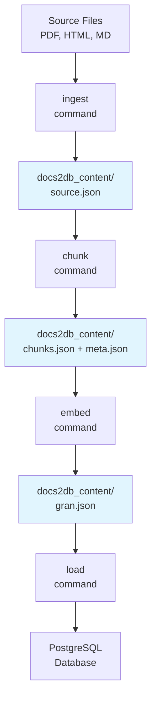
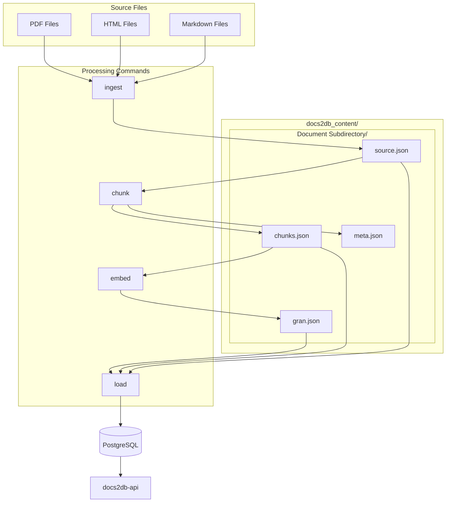

<details>
<summary>Relevant source files</summary>

The following files were used as context for generating this wiki page:
- [src/docs2db/chunks.py](https://github.com/b08x/docs2db/blob/main/src/docs2db/chunks.py)
- [src/docs2db/docs2db.py](https://github.com/b08x/docs2db/blob/main/src/docs2db/docs2db.py)
- [src/docs2db/ingest.py](https://github.com/b08x/docs2db/blob/main/src/docs2db/ingest.py)
- [src/docs2db/audit.py](https://github.com/b08x/docs2db/blob/main/src/docs2db/audit.py)
- [README.md](https://github.com/b08x/docs2db/blob/main/README.md)

</details>

# Content Directory Structure

## Introduction

The content directory in docs2db serves as the central storage location for all intermediate processing artifacts generated during the RAG (Retrieval-Augmented Generation) pipeline. This directory functions as a persistent, version-controllable cache that preserves expensive preprocessing results, enabling incremental processing and avoiding redundant computation when source documents remain unchanged.

The system operates through a staged pipeline where each processing command (`ingest`, `chunk`, `embed`, `load`) reads input files created by the previous stage and produces output files that subsequent stages consume. The content directory maintains this complete chain of artifacts, organized in a directory hierarchy that mirrors the source document structure.

## Architecture Overview

### Directory Purpose and Role

The content directory acts as an intermediary between raw source documents and the final PostgreSQL database. It stores four distinct artifact types per source document:

| Artifact File | Purpose | Generated By |
|---------------|---------|---------------|
| `source.json` | Ingested document in Docling JSON format | `ingest` command |
| `chunks.json` | Text chunks with optional LLM-generated context | `chunk` command |
| `gran.json` (model-dependent filename) | Vector embeddings | `embed` command |
| `meta.json` | Processing metadata and timestamps | All commands |

Sources: [README.md#L1-L50](https://github.com/b08x/docs2db/blob/main/README.md#L1-L50)

### Default Configuration

The default content directory is named `docs2db_content/` and can be customized through configuration. The system searches for source files using glob patterns, with the default pattern being `**/source.json` which matches all ingested documents recursively.

```python
# Default content directory pattern from chunks.py

pattern: str = "**/source.json"
```

Sources: [src/docs2db/chunks.py#L1-L50](https://github.com/b08x/docs2db/blob/main/src/docs2db/chunks.py#L1-L50)

## Directory Hierarchy Structure

### Mirrored Source Structure

The content directory maintains a directory structure that directly mirrors the source document hierarchy. Each source file gets its own subdirectory containing its processing artifacts.

```
docs2db_content/
├── path/
│   └── to/
│       └── your/
│           └── document/
│               ├── source.json      # Docling ingested document
│               ├── chunks.json      # Text chunks with context
│               ├── gran.json        # Granite embeddings
│               └── meta.json        # Processing metadata
└── README.md
```

Sources: [README.md#L60-L80](https://github.com/b08x/docs2db/blob/main/README.md#L60-L80)

### Terminal Directory Detection

The audit functionality identifies "terminal" (leaf) directories—directories containing no subdirectories—as the units for processing. This allows the system to audit and process at the appropriate granularity level.

```python
def get_terminal_directories(path: Path) -> list[Path]:
    """Get all terminal (leaf) directories under the given path."""
```

Sources: [src/docs2db/audit.py#L1-L60](https://github.com/b08x/docs2db/blob/main/src/docs2db/audit.py#L1-L60)

## Processing Pipeline Flow

### Sequential Stage Dependencies

The content directory structure enforces a strict sequential dependency between processing stages. Each stage reads specific artifact files from previous stages and produces new artifacts.



Each command in the pipeline reads from the content directory and writes updated artifacts:

| Command | Reads | Writes |
|---------|-------|--------|
| `ingest` | Source files (PDF, HTML, etc.) | `source.json` |
| `chunk` | `source.json` | `chunks.json`, `meta.json` |
| `embed` | `chunks.json` | `gran.json` (varies by model) |
| `load` | `source.json`, `chunks.json`, `gran.json` | Database tables |

Sources: [src/docs2db/docs2db.py#L1-L100](https://github.com/b08x/docs2db/blob/main/src/docs2db/docs2db.py#L1-L100)

### Pipeline Command Sequence

The full pipeline can be executed through the `pipeline` command which orchestrates all stages:

```python
# Step 1: Start database
# Step 2: Ingest
# Step 3: Generate chunks
# Step 4: Generate embeddings
# Step 5: Load to database
# Step 6: Dump database
# Step 7: Stop database

```

Sources: [src/docs2db/docs2db.py#L100-L200](https://github.com/b08x/docs2db/blob/main/src/docs2db/docs2db.py#L100-L200)

## Artifact File Specifications

### source.json

Created by the `ingest` command using Docling, this file contains the original document converted to a standardized JSON format. It serves as the authoritative source of document content for all subsequent processing stages.

```python
def ingest_file(
    source_file: Path,
    content_path: Path,
    source_metadata: dict | None = None
)
```

Sources: [src/docs2db/ingest.py#L1-L50](https://github.com/b08x/docs2db/blob/main/src/docs2db/ingest.py#L1-L50)

### chunks.json

Contains text chunks extracted from the source document. When contextual enrichment is enabled, each chunk includes both the raw text and LLM-generated contextual information:

```python
chunk_data = {
    "text": chunk_text,              # Structural context + chunk text - shown to LLM
    "contextual_text": contextual_text,  # Semantic context + structural context + chunk text - for indexing
    "metadata": chunk.meta.model_dump(),
}
```

Sources: [src/docs2db/chunks.py#L1-L50](https://github.com/b08x/docs2db/blob/main/src/docs2db/chunks.py#L1-L50)

### meta.json

Stores processing metadata including the chunker class, parameters used, and enrichment metadata when LLM context generation is enabled:

```python
processing_metadata = {
    "chunker": CHUNKING_CONFIG["chunker_class"],
    "parameters": {
        "max_tokens": CHUNKING_CONFIG["max_tokens"],
        "merge_peers": CHUNKING_CONFIG["merge_peers"],
        "tokenizer_model": CHUNKING_CONFIG["tokenizer_model"],
    },
}
```

Sources: [src/docs2db/chunks.py#L1-L50](https://github.com/b08x/docs2db/blob/main/src/docs2db/chunks.py#L1-L50)

## Content Directory Configuration

### Environment-Based Configuration

The content directory location can be configured through environment variables or `.env` files. The system provides CLI options to override defaults:

```bash
# Specify custom content directory

docs2db chunk --content-dir my-content

# Specify directory pattern

docs2db chunk --pattern "docs/**"
docs2db chunk --pattern "external/**"
```

Sources: [README.md#L30-L45](https://github.com/b08x/docs2db/blob/main/README.md#L30-L45)

### Worker Configuration

Processing uses parallel workers with configurable batch sizes:

```python
processor = BatchProcessor(
    worker_function=ingest_batch,
    worker_args=(str(source_root), force, pipeline, model, device, batch_size),
    progress_message="Ingesting files...",
    batch_size=settings.docling_batch_size,
    mem_threshold_mb=1500,
    max_workers=settings.docling_workers,
)
```

Sources: [src/docs2db/ingest.py#L50-L100](https://github.com/b08x/docs2db/blob/main/src/docs2db/ingest.py#L50-L100)

## Audit and Validation

### Staleness Detection

The audit functionality checks whether content directory artifacts are current relative to source files:

```python
def is_chunks_stale(source_file: Path) -> bool:
    """Check if chunks are stale relative to source."""
    
def is_embedding_stale(source_file: Path) -> bool:
    """Check if embeddings are stale relative to chunks."""
```

Sources: [src/docs2db/audit.py#L1-L50](https://github.com/b08x/docs2db/blob/main/src/docs2db/audit.py#L1-L50)

### Pattern-Based Auditing

The audit system supports directory patterns to scope validation to specific subsets:

```python
# Append /source.json to the pattern
# Works for both exact directory paths and glob patterns:
# - "dir/subdir" -> "dir/subdir/source.json" (exact file)
# - "dir/**" -> "dir/**/source.json" (glob pattern)

source_pattern = f"{pattern}/source.json"
```

Sources: [src/docs2db/audit.py#L40-L60](https://github.com/b08x/docs2db/blob/main/src/docs2db/audit.py#L40-L60)

## Incremental Processing

### Automatic Skip Logic

The system automatically skips processing for files that haven't changed, using file modification timestamps and content hashing to detect staleness:

```python
if dry_run:
    logger.info("DRY RUN - would process:")
    for file in source_list:
        logger.info(f"  {file}")
    return True
```

Sources: [src/docs2db/chunks.py#L100-L150](https://github.com/b08x/docs2db/blob/main/src/docs2db/chunks.py#L100-L150)

### Force Override

Users can force reprocessing regardless of staleness status:

```bash
docs2db ingest --force
docs2db chunk --force
```

Sources: [src/docs2db/docs2db.py#L1-L50](https://github.com/b08x/docs2db/blob/main/src/docs2db/docs2db.py#L1-L50)

## LLM Context Generation

### Supported Providers

The chunking stage can optionally generate contextual information for each chunk using various LLM providers:

| Provider | Environment Variable | Configuration |
|----------|---------------------|---------------|
| WatsonX | `WATSONX_API_KEY`, `WATSONX_PROJECT_ID` | `--watsonx-url` |
| OpenAI | `OPENAI_API_KEY` | `--openai-url` |
| OpenRouter | `OPENROUTER_API_KEY` | `--openrouter-url` |
| Mistral | `MISTRAL_API_KEY` | `--mistral-url` |

Sources: [src/docs2db/chunks.py#L1-L50](https://github.com/b08x/docs2db/blob/main/src/docs2db/chunks.py#L1-L50)

### Skip Context Option

For faster processing without LLM enrichment:

```bash
docs2db chunk --skip-context
```

Sources: [README.md#L30-L35](https://github.com/b08x/docs2db/blob/main/README.md#L30-L35)

## Relationship Diagram



## Key Observations

### Structural Strengths

1. **Clear separation of concerns**: Each processing stage operates on well-defined input/output artifacts
2. **Version-controllable artifacts**: The recommendation to commit the content directory preserves expensive preprocessing
3. **Pattern-based flexibility**: Glob patterns enable selective processing of document subsets

### Structural Gaps

1. **Limited visibility into internal chunk structure**: The chunks.py file shows chunk data dictionaries but the complete internal schema of `source.json` and `chunks.json` is not explicitly defined in the provided sources
2. **Token estimation approximation**: The token estimation uses character-based division (`char_count / 3.0`) which may produce inaccurate counts for varied content types

```python
def estimate_tokens(text: str) -> int:
    char_count = len(text)
    return int(char_count / 3.0)
```

Sources: [src/docs2db/chunks.py#L1-L50](https://github.com/b08x/docs2db/blob/main/src/docs2db/chunks.py#L1-L50)

3. **Hardcoded memory thresholds**: Memory thresholds for batch processing (1500MB for ingestion, 2000MB for chunking) are hardcoded rather than configurable

```python
mem_threshold_mb=1500,  # Lower threshold for docling processes
mem_threshold_mb=2000,
```

Sources: [src/docs2db/ingest.py#L50-L100](https://github.com/b08x/docs2db/blob/main/src/docs2db/ingest.py#L50-L100), [src/docs2db/chunks.py#L100-L150](https://github.com/b08x/docs2db/blob/main/src/docs2db/chunks.py#L100-L150)

## Conclusion

The content directory structure in docs2db implements a staged, artifact-based pipeline architecture that enables incremental processing and version control of preprocessing results. Each source document generates a predictable set of JSON artifacts (`source.json`, `chunks.json`, `gran.json`, `meta.json`) organized in a directory hierarchy mirroring the source structure. The sequential dependency between processing stages ensures data integrity while the staleness detection mechanism avoids redundant computation. The system supports multiple LLM providers for contextual enrichment and provides audit capabilities for validating artifact completeness. The primary structural limitation is the absence of explicit artifact schema definitions within the source code, requiring practitioners to infer the internal structure from usage patterns.