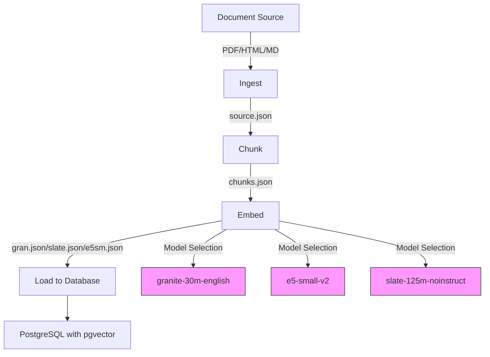
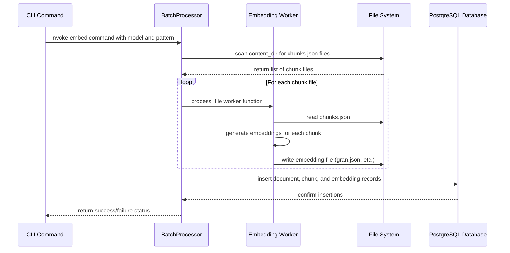
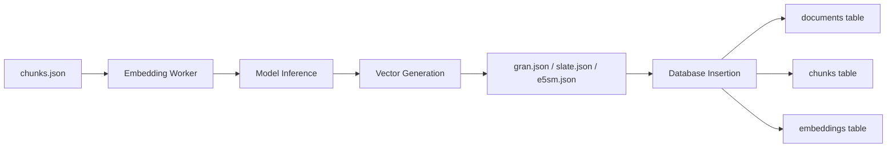

<details>
<summary>Relevant source files</summary>

The following files were used as context for generating this wiki page:
- [src/docs2db/chunks.py](https://github.com/b08x/docs2db/blob/main/src/docs2db/chunks.py)
- [src/docs2db/docs2db.py](https://github.com/b08x/docs2db/blob/main/src/docs2db/docs2db.py)
- [src/docs2db/database.py](https://github.com/b08x/docs2db/blob/main/src/docs2db/database.py)
- [src/docs2db/ingest.py](https://github.com/b08x/docs2db/blob/main/src/docs2db/ingest.py)
- [README.md](https://github.com/b08x/docs2db/blob/main/README.md)

</details>

# Embedding Models

## Introduction

Embedding models in the docs2db system serve as the mechanism for converting textual content into vector representations that enable semantic similarity search within a PostgreSQL database. The system supports multiple embedding models through a configurable provider architecture, allowing users to select different embedding models based on their accuracy, performance, and resource requirements. The embedding process occurs after document ingestion and chunking, transforming the processed text chunks into numerical vectors that are stored alongside metadata for hybrid retrieval operations combining vector similarity with traditional BM25 full-text search.

The embedding workflow integrates with the broader RAG (Retrieval-Augmented Generation) pipeline, receiving input from the chunking stage and producing output that the database loading stage consumes. This architectural positioning means embedding models act as a critical transformation layer between raw text processing and the final searchable vector database.

## Architecture Overview

### Data Flow Architecture

The embedding system follows a sequential pipeline architecture where each stage produces artifacts consumed by the subsequent stage. The complete flow begins with document ingestion, proceeds through chunking with optional contextual enrichment, generates embeddings from the processed chunks, and culminates with database loading.



### Processing Pipeline Sequence

The embedding operation is invoked through the CLI command `docs2db embed` or automatically through the `docs2db pipeline` command. The system uses a batch processing architecture that distributes embedding computation across multiple workers for improved throughput.



## Supported Embedding Models

The docs2db system supports four embedding models, each identified by a specific configuration key used throughout the codebase. The model selection occurs through command-line parameters or configuration settings, with the default model being `granite-30m-english`.

| Model Identifier | File Suffix | Description |
|------------------|-------------|-------------|
| `ibm-granite/granite-embedding-30m-english` | `gran.json` | Default model, 30M parameter English-specific embedding |
| `intfloat/e5-small-v2` | `e5sm.json` | Small efficient encoder model |
| `ibm-granite/slate-125m-english` | `slate.json` | 125M parameter slate model |
| `bnlplab/noinstruct-small` | `noin.json` | No-instruction variant small model |

Sources: [README.md#L1-L100](), [database.py#L1-L50]()

The model selection determines both the embedding file naming convention and the vector dimensionality stored in the database. Each model produces vectors of specific dimensionality that must be compatible with the database schema's embedding column definition.

## Configuration System

### Embedding Configuration Structure

The embedding models are configured through a centralized configuration system that defines model-specific parameters including dimensionality, batch sizes, and API endpoints. The configuration is accessed through the `EMBEDDING_CONFIGS` dictionary in the database module.

```python
# Configuration pattern observed in database.py

if model not in EMBEDDING_CONFIGS:
    available = ", ".join(EMBEDDING_CONFIGS.keys())
    logger.error(f"Unknown model '{model}'. ")
```

Sources: [database.py#L200-L210]()

### CLI Configuration Options

The embedding command supports multiple configuration parameters that override or supplement the default settings. These parameters enable users to customize model selection, file patterns, processing behavior, and database connection details.

```bash
docs2db embed --model granite-30m-english
docs2db embed --pattern "docs/**"
docs2db embed --content-dir my-content
```

Sources: [docs2db.py#L1-L50](), [README.md#L50-L80]()

The following table enumerates the available CLI options for the embed command:

| Parameter | Type | Default | Purpose |
|-----------|------|---------|---------|
| `--model` | string | `ibm-granite/granite-embedding-30m-english` | Embedding model identifier |
| `--pattern` | string | `**` | Directory glob pattern for content files |
| `--content-dir` | string | `docs2db_content/` | Base content directory path |
| `--force` | boolean | false | Force regeneration of existing embeddings |
| `--host` | string | auto-detect | Database host override |
| `--port` | integer | auto-detect | Database port override |
| `--db` | string | auto-detect | Database name override |
| `--user` | string | auto-detect | Database user override |
| `--password` | string | auto-detect | Database password override |
| `--batch-size` | integer | varies | Files processed per worker batch |

Sources: [docs2db.py#L80-L150]()

## Processing Implementation

### Batch Processing Architecture

The embedding system uses a `BatchProcessor` class that distributes work across multiple worker processes. This architecture enables parallel processing of embedding generation, significantly improving throughput for large document collections.

```python
# BatchProcessor initialization for embedding

processor = BatchProcessor(
    worker_function=process_embedding_batch,
    worker_args=(model, host, port, db, user, password),
    progress_message="Generating embeddings...",
    batch_size=batch_size,
    mem_threshold_mb=2000,
    max_workers=max_workers,
)
```

Sources: [database.py#L250-L280]()

The batch processor tracks errors and successful operations, returning counts of processed files and any failures that occurred during the embedding generation phase.

### File Processing Flow

Each document's embedding generation follows a specific file naming convention based on the selected model. The system reads the `chunks.json` file produced by the previous chunking stage and generates corresponding embedding vectors stored in model-specific files.



Sources: [database.py#L150-L200](), [chunks.py#L300-L350]()

The embedding files are named according to the model family: `gran.json` for granite models, `slate.json` for slate models, `e5sm.json` for E5 models, and so forth. This naming convention allows the system to identify which model generated each embedding file.

## Database Schema Integration

### Vector Storage Structure

The embedding vectors are stored in a dedicated table that links to the chunks table through foreign key relationships. The database uses the `pgvector` extension to enable efficient similarity search operations on the embedding data.

```sql
-- Schema relationship (inferred from load operations)
INSERT INTO documents (...) VALUES (...)
INSERT INTO chunks (document_id, ...) VALUES (...)
INSERT INTO embeddings (chunk_id, vector, model_name) VALUES (...)
```

Sources: [database.py#L180-L220]()

### Metadata Tracking

Each embedding operation records metadata including the model used, processing timestamps, and chunk associations. This metadata enables auditing and supports features like model version tracking and reprocessing determination.

```python
# Metadata captured during embedding

processing_metadata = {
    "embedder": model,
    "parameters": {...},
    "embedding_dimension": dim,
}
```

Sources: [database.py#L220-L250]()

## Provider Integration

### Model Inference Mechanism

The embedding generation uses a model inference abstraction that supports different backends. The system uses the HuggingFace Transformers library for local embedding generation, with the model loaded based on the configuration for each supported model type.

```python
# Model loading pattern

if model not in EMBEDDING_CONFIGS:
    raise ConfigurationError(f"Unknown model '{model}'")
```

Sources: [database.py#L200-L210]()

### Configuration Validation

The system validates model selection before processing begins, ensuring that only supported models can be used for embedding generation. This validation prevents runtime errors and provides clear feedback to users about available options.

## Chunking Dependency

The embedding system depends entirely on the chunking stage's output. The chunking process, controlled by configuration in `chunks.py`, determines both the text segments to embed and any contextual enrichment applied before embedding generation.

```python
# Chunker configuration affects embedding input

CHUNKING_CONFIG = {
    "chunker_class": ...,
    "max_tokens": ...,
    "merge_peers": ...,
    "tokenizer_model": ...,
}
```

Sources: [chunks.py#L400-L420]()

The contextual enrichment feature, when enabled, uses LLM providers (OpenAI, WatsonX, OpenRouter, Mistral) to generate semantic context for each chunk before embedding. This enriched text serves as input to the embedding model, potentially improving retrieval accuracy.

## Performance Considerations

### Parallelization Strategy

The system uses multiprocessing for embedding generation, with configurable worker counts. The default worker count derives from settings, but can be overridden via CLI parameters to match available hardware resources.

```python
# Worker configuration

max_workers = workers if workers is not None else settings.embedding_workers
```

Sources: [docs2db.py#L150-L180]()

### Memory Management

The BatchProcessor includes memory threshold configuration (`mem_threshold_mb=2000`) to prevent excessive memory consumption during batch processing. This safeguard ensures stable operation on resource-constrained systems.

## Conclusion

Embedding models constitute a fundamental transformation layer within the docs2db RAG pipeline, converting processed textual chunks into vector representations that enable semantic search capabilities. The system's architecture supports multiple embedding models through a consistent configuration interface, with the pgvector extension providing the database-level infrastructure for efficient similarity operations. The processing pipeline integrates with preceding chunking and succeeding database loading stages through well-defined file artifacts, enabling both batch processing and incremental updates. Configuration options provide flexibility in model selection, worker parallelization, and database connectivity while maintaining sensible defaults that prioritize the granite-30m-english model as the standard option.