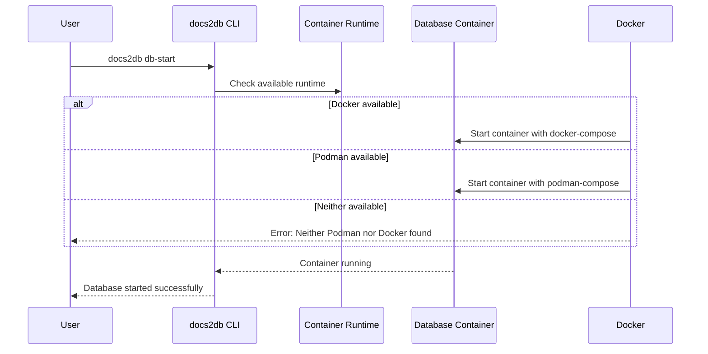
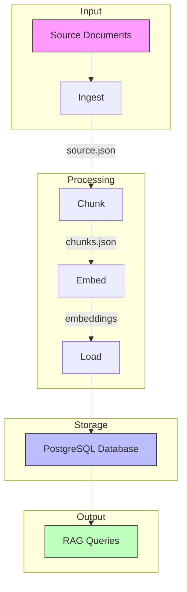
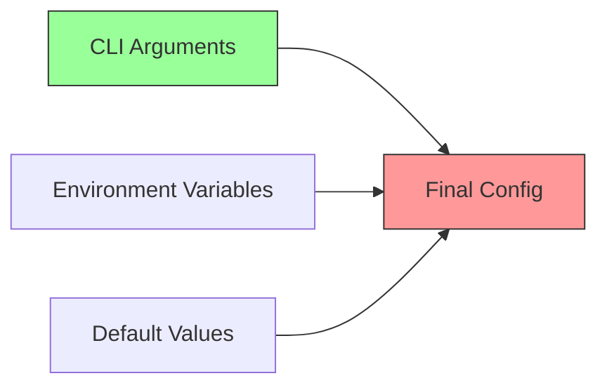

<details>
<summary>Relevant source files</summary>

The following files were used as context for generating this wiki page:
- [README.md](https://github.com/b08x/docs2db/blob/main/README.md)
- [src/docs2db/chunks.py](https://github.com/b08x/docs2db/blob/main/src/docs2db/chunks.py)
- [src/docs2db/docs2db.py](https://github.com/b08x/docs2db/blob/main/src/docs2db/docs2db.py)
- [src/docs2db/ingest.py](https://github.com/b08x/docs2db/blob/main/src/docs2db/ingest.py)
- [src/docs2db/multiproc.py](https://github.com/b08x/docs2db/blob/main/src/docs2db/multiproc.py)

</details>

# Installation

## Introduction

The installation mechanism for docs2db encompasses the setup of Python package dependencies, container runtime environment for the PostgreSQL database, and configuration of environment variables. The system operates as a command-line tool that processes documents through a RAG (Retrieval-Augmented Generation) pipeline, requiring both a Python runtime with specific package dependencies and a container runtime (Docker or Podman) for database services. The installation process is designed to support both end-user deployment and development workflows, with the primary installation method utilizing the `uv` package manager.

## Prerequisites

### Runtime Requirements

The docs2db system requires two distinct runtime environments: a Python environment for document processing and a container runtime for the PostgreSQL database service.

| Requirement | Type | Description |
|-------------|------|-------------|
| Python | Runtime | Package processing and CLI operations |
| Docker or Podman | Runtime | Database container management |
| uv | Package Manager | Python package installation |

Sources: [README.md#L1-L50](https://github.com/b08x/docs2db/blob/main/README.md)

### Container Runtime Detection

The system performs automatic detection of container runtimes during database initialization. The detection logic searches for either Docker or Podman executables in the system PATH. If neither is found, the system logs an error message instructing users to install either Podman or Docker.

```python
# From database.py - Container runtime detection

try:
    result = subprocess.run(
        ["docker", "ps"], capture_output=True, text=True, timeout=5
    )
    if result.returncode == 0:
        return "docker"
except FileNotFoundError:
    pass

try:
    result = subprocess.run(
        ["podman", "ps"], capture_output=True, text=True, timeout=5
    )
    if result.returncode == 0:
        return "podman"
except FileNotFoundError:
    pass
```

Sources: [README.md#troubleshooting](https://github.com/b08x/docs2db/blob/main/README.md)

## Python Package Installation

### Using uv (Recommended)

The recommended installation method utilizes the `uv` package manager, which provides faster dependency resolution and installation compared to traditional pip-based approaches.

```bash
uv add docs2db
```

This command installs the package and its dependencies into the current Python environment. The `uv` tool resolves and installs all required packages defined in the project's dependency specifications.

Sources: [README.md#using-as-a-library](https://github.com/b08x/docs2db/blob/main/README.md)

### Development Installation

For contributors setting up a development environment, the installation process involves cloning the repository and synchronizing dependencies.

```bash
git clone https://github.com/rhel-lightspeed/docs2db
cd docs2db
uv sync
pre-commit install
```

The `uv sync` command installs all development dependencies defined in the project configuration, while `pre-commit install` sets up Git hooks for code quality checks.

Sources: [README.md#development](https://github.com/b08x/docs2db/blob/main/README.md)

## Environment Configuration

### Configuration Methods

The system supports multiple configuration approaches, with environment variables and `.env` files being the primary mechanisms for API credentials and service endpoints.

| Configuration Type | Location | Priority |
|-------------------|----------|----------|
| Environment Variables | System shell | Highest |
| .env file | Project root | Medium |
| CLI arguments | Command line | Highest (override) |

Sources: [src/docs2db/chunks.py#L1-L100](https://github.com/b08x/docs2db/blob/main/src/docs2db/chunks.py)

### Required Environment Variables

The configuration requirements vary depending on which processing stages are enabled. The following environment variables control different aspects of the system:

**Database Configuration:**
- Database connection parameters (host, port, user, password, db name)

**LLM Provider Configuration:**
- `WATSONX_API_KEY` - IBM WatsonX API authentication
- `WATSONX_PROJECT_ID` - WatsonX project identifier
- `OPENAI_API_KEY` - OpenAI API authentication
- `MISTRAL_API_KEY` - Mistral AI API authentication
- `OPENROUTER_API_KEY` - OpenRouter API authentication

**Processing Configuration:**
- `DOCLING_PIPELINE` - Document processing pipeline selection
- `DOCLING_MODEL` - Specific model for docling
- `DOCLING_DEVICE` - Processing device (auto, cpu, cuda, mps)

Sources: [src/docs2db/chunks.py#L1-L50](https://github.com/b08x/docs2db/blob/main/src/docs2db/chunks.py), [src/docs2db/ingest.py#L1-L50](https://github.com/b08x/docs2db/blob/main/src/docs2db/ingest.py)

### WatsonX Provider Configuration

When using IBM WatsonX as the LLM provider for contextual chunk generation, specific configuration is required:

```python
# From chunks.py - WatsonX provider initialization

if provider == "watsonx":
    if not self.watsonx_url:
        raise ValueError(
            "provider is 'watsonx' but watsonx_url is None. "
            "WatsonX API URL is required."
        )

    api_key = settings.watsonx_api_key
    project_id = settings.watsonx_project_id

    if not api_key or not project_id:
        raise ValueError(
            "WATSONX_API_KEY and WATSONX_PROJECT_ID must be set (via env vars or .env file)"
        )
```

Sources: [src/docs2db/chunks.py#L1-L50](https://github.com/b08x/docs2db/blob/main/src/docs2db/chunks.py)

### Mistral Provider Configuration

The Mistral AI provider requires an API key that can be set via environment variable:

```python
# From chunks.py - Mistral provider validation

if not api_key:
    raise ValueError(
        "Mistral API key required. "
        "Set MISTRAL_API_KEY environment variable or get one ..."
    )
```

Sources: [src/docs2db/chunks.py#L1-L100](https://github.com/b08x/docs2db/blob/main/src/docs2db/chunks.py)

## Database Setup

### Container-Based Database

The system uses a containerized PostgreSQL database with the pgvector extension for vector similarity search. Database lifecycle management is handled through the CLI commands.

| Command | Function |
|---------|----------|
| `docs2db db-start` | Start the database container |
| `docs2db db-stop` | Stop the database container |
| `docs2db db-status` | Check database connection status |

Sources: [README.md#troubleshooting](https://github.com/b08x/docs2db/blob/main/README.md), [src/docs2db/docs2db.py#L1-L50](https://github.com/b08x/docs2db/blob/main/src/docs2db/docs2db.py)

### Database Initialization Flow



Sources: [README.md#troubleshooting](https://github.com/b08x/docs2db/blob/main/README.md)

## CLI Installation Verification

### Command Availability

After installation, the `docs2db` CLI command becomes available. The CLI provides multiple subcommands for different stages of the RAG pipeline:

```bash
docs2db --help
```

The help output displays available commands including:
- `ingest` - Convert source documents to Docling JSON format
- `chunk` - Generate text chunks with optional LLM context
- `embed` - Generate vector embeddings
- `load` - Load processed data into the database
- `db-start`, `db-stop`, `db-status` - Database lifecycle management

Sources: [src/docs2db/docs2db.py#L1-L100](https://github.com/b08x/docs2db/blob/main/src/docs2db/docs2db.py)

### Ingest Command

The ingest command processes source files and converts them to the internal Docling JSON format:

```bash
docs2db ingest SOURCE_PATH [OPTIONS]
```

Key options include:
- `--dry-run` - Preview processing without execution
- `--force` - Force reprocessing of existing files
- `--pipeline` - Docling pipeline selection (standard or vlm)
- `--device` - Processing device (auto, cpu, cuda, mps)
- `--batch-size` - Documents per worker batch
- `--workers` - Number of parallel workers

Sources: [src/docs2db/docs2db.py#L1-L100](https://github.com/b08x/docs2db/blob/main/src/docs2db/docs2db.py), [src/docs2db/ingest.py#L1-L50](https://github.com/b08x/docs2db/blob/main/src/docs2db/ingest.py)

### Chunk Command

The chunk command generates text chunks from ingested documents with optional LLM-generated contextual enrichment:

```bash
docs2db chunk [OPTIONS]
```

Key options include:
- `--skip-context` - Disable LLM contextual generation (faster processing)
- `--context-model` - LLM model for context generation
- `--llm-provider` - Provider selection (openai, watsonx, openrouter, mistral)
- `--openai-url` - OpenAI-compatible API endpoint
- `--watsonx-url` - WatsonX API endpoint

Sources: [src/docs2db/docs2db.py#L1-L100](https://github.com/b08x/docs2db/blob/main/src/docs2db/docs2db.py), [src/docs2db/chunks.py#L1-L50](https://github.com/b08x/docs2db/blob/main/src/docs2db/chunks.py)

## Processing Pipeline Architecture

### Pipeline Stages

The docs2db system implements a sequential processing pipeline where each stage produces artifacts consumed by subsequent stages:



Each stage creates intermediate files in the content directory (`docs2db_content/`), allowing incremental processing and reuse of expensive preprocessing steps.

Sources: [README.md#content-directory](https://github.com/b08x/docs2db/blob/main/README.md)

### Parallel Processing Configuration

The system utilizes multiprocessing for computationally intensive operations, with configurable worker counts and memory thresholds:

```python
# From multiproc.py - Batch processor initialization

processor = BatchProcessor(
    worker_function=ingest_batch,
    worker_args=(str(source_root), force, pipeline, model, device, batch_size),
    progress_message="Ingesting files...",
    batch_size=settings.docling_batch_size,
    mem_threshold_mb=1500,  # Lower threshold for docling processes
    max_workers=settings.docling_workers,
)
```

The `BatchProcessor` class manages parallel file processing with progress tracking and error handling.

Sources: [src/docs2db/multiproc.py#L1-L50](https://github.com/b08x/docs2db/blob/main/src/docs2db/multiproc.py), [src/docs2db/ingest.py#L1-L50](https://github.com/b08x/docs2db/blob/main/src/docs2db/ingest.py)

## Content Directory Structure

### Directory Initialization

The content directory (`docs2db_content/`) stores all intermediate processing files. The system automatically ensures the README exists in this directory:

```python
# From ingest.py - Directory setup

ensure_content_dir_readme()
```

The directory structure mirrors the source document hierarchy, with each source file receiving its own subdirectory containing:

| File | Purpose |
|------|---------|
| `source.json` | Ingested document in Docling JSON format |
| `chunks.json` | Text chunks with optional LLM context |
| `gran.json` | Vector embeddings (filename varies by model) |
| `meta.json` | Processing metadata and timestamps |

Sources: [README.md#content-directory](https://github.com/b08x/docs2db/blob/main/README.md), [src/docs2db/ingest.py#L1-L50](https://github.com/b08x/docs2db/blob/main/src/docs2db/ingest.py)

## Troubleshooting Installation Issues

### Container Runtime Errors

If the system reports "Neither Podman nor Docker found", users must install one of these container runtimes:

| Runtime | Installation URL |
|---------|------------------|
| Podman | https://podman.io/getting-started/installation |
| Docker | https://docs.docker.com/get-docker/ |

Sources: [README.md#troubleshooting](https://github.com/b08x/docs2db/blob/main/README.md)

### Database Connection Errors

When experiencing "Database connection refused":

```bash
docs2db db-start      # Start the database
docs2db db-status     # Check connection status
```

Sources: [README.md#troubleshooting](https://github.com/b08x/docs2db/blob/main/README.md)

## Configuration Inheritance

### Settings Precedence

The system implements a hierarchical configuration resolution where CLI arguments override environment variables, which override default values:



This precedence ensures that users can override defaults at runtime while maintaining sensible fallbacks for unspecified options.

Sources: [src/docs2db/ingest.py#L1-L50](https://github.com/b08x/docs2db/blob/main/src/docs2db/ingest.py), [src/docs2db/chunks.py#L1-L50](https://github.com/b08x/docs2db/blob/main/src/docs2db/chunks.py)

## Conclusion

The installation architecture of docs2db reflects a modular design where Python package installation, container runtime setup, and environment configuration operate as independent but interconnected subsystems. The system prioritizes developer experience through multiple configuration mechanisms and clear error messaging for common installation failures. The prerequisite requirements are minimal—Python with uv, and Docker or Podman—making deployment straightforward across different environments. The sequential pipeline design with intermediate file storage enables incremental processing and supports efficient workflows for large document collections. The absence of a unified configuration file format (relying instead on environment variables and CLI arguments) represents a structural choice that prioritizes flexibility over opinionated defaults, though it may increase initial setup complexity for users preferring declarative configuration management.