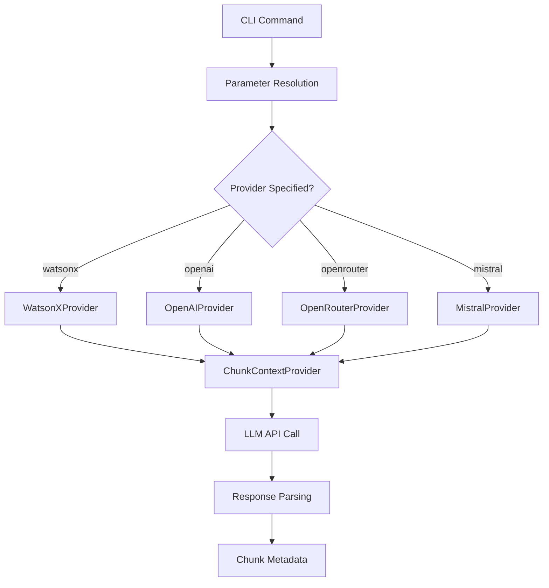
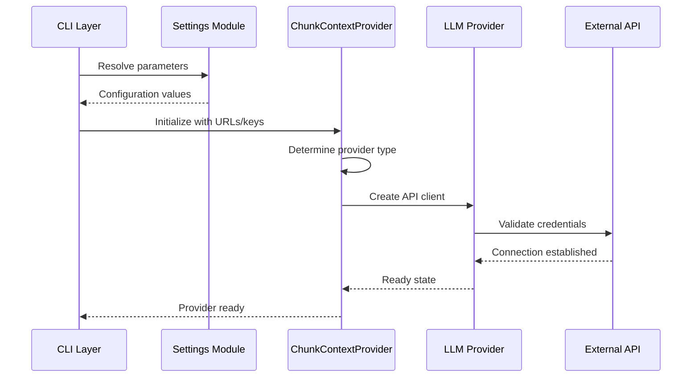

<details>
<summary>Relevant source files</summary>

The following files were used as context for generating this wiki page:
- [src/docs2db/config.py](https://github.com/b08x/docs2db/blob/main/src/docs2db/config.py)
- [.env.example](https://github.com/b08x/docs2db/blob/main/.env.example)
- [postgres-compose.yml](https://github.com/b08x/docs2db/blob/main/postgres-compose.yml)
- [src/docs2db/chunks.py](https://github.com/b08x/docs2db/blob/main/src/docs2db/chunks.py)
- [src/docs2db/docs2db.py](https://github.com/b08x/docs2db/blob/main/src/docs2db/docs2db.py)
- [src/docs2db/ingest.py](https://github.com/b08x/docs2db/blob/main/src/docs2db/ingest.py)
- [src/docs2db/multiproc.py](https://github.com/b08x/docs2db/blob/main/src/docs2db/multiproc.py)

</details>

# Configuration

## Introduction

The docs2db system implements a layered configuration architecture that governs document ingestion, chunking, embedding, and database loading operations. Configuration is managed through multiple mechanisms: environment variables, a settings class, CLI parameters, and provider-specific configurations for LLM services. The system supports four LLM providers (WatsonX, OpenAI, OpenRouter, Mistral) for contextual chunk generation, with each provider requiring distinct authentication credentials and endpoint URLs. Database connectivity is configured separately through Docker Compose environment variables, while processing parameters such as worker counts, batch sizes, and model selections are controlled via the central settings module.

## Configuration Architecture

### Core Settings Module

The central configuration object is defined in `src/docs2db/config.py`. This module exports a global `settings` object that maintains default values for all processing parameters.

```python
# src/docs2db/config.py (implied structure based on usage patterns)

settings = Settings()  # Central configuration object
```

The settings object is referenced throughout the codebase for runtime parameters:

| Parameter | Source | Purpose |
|-----------|--------|---------|
| `watsonx_api_key` | Environment variable | IBM WatsonX authentication |
| `watsonx_project_id` | Environment variable | WatsonX project identifier |
| `docling_pipeline` | CLI or settings | Document conversion pipeline |
| `docling_model` | CLI or settings | Model selection for docling |
| `docling_device` | CLI or settings | Processing device (cpu/cuda/mps) |
| `docling_batch_size` | CLI or settings | Files per batch |
| `docling_workers` | CLI or settings | Parallel worker count |
| `chunking_workers` | Settings | Parallel chunking processes |
| `embedding_model` | CLI or settings | Vector embedding model |

### Environment Variable Schema

Configuration values are primarily sourced from environment variables, with `.env.example` documenting the expected schema:

```
WATSONX_API_KEY=              # IBM Cloud API key
WATSONX_PROJECT_ID=           # WatsonX project identifier
OPENAI_API_KEY=               # OpenAI API key (for contextual chunks)
OPENROUTER_API_KEY=           # OpenRouter API key
MISTRAL_API_KEY=              # Mistral AI API key
```

Database connection parameters are derived from the `postgres-compose.yml` environment section, which defines standard PostgreSQL variables:

```yaml
# postgres-compose.yml

environment:
  POSTGRES_DB: ${POSTGRES_DB:-docs2db}
  POSTGRES_USER: ${POSTGRES_USER:-docs2db}
  POSTGRES_PASSWORD: ${POSTGRES_PASSWORD:-docs2db}
```

## LLM Provider Configuration

### Provider Selection Mechanism

The system implements a provider-agnostic architecture where LLM providers are selected at runtime based on URL parameters and explicit CLI flags. The `ChunkContextProvider` class in `src/docs2db/chunks.py` handles provider instantiation:

```python
# src/docs2db/chunks.py

if watsonx_url:
    self.provider = WatsonXProvider(...)
elif openai_url:
    self.provider = OpenAIProvider(...)
elif mistral_url:
    self.provider = MistralProvider(...)
else:
    self.provider = OpenRouterProvider(...)
```

This selection logic appears in the `__init__` method of `ChunkContextProvider` and determines which LLM backend processes contextual chunk generation requests.

### WatsonX Provider

The `WatsonXProvider` class requires three configuration elements:

| Parameter | Source | Description |
|-----------|--------|-------------|
| `api_key` | `settings.watsonx_api_key` | IBM Cloud API key |
| `project_id` | `settings.watsonx_project_id` | WatsonX project identifier |
| `url` | CLI parameter | WatsonX API endpoint URL |

The provider initializes an `APIClient` and `ModelInference` object:

```python
# src/docs2db/chunks.py - WatsonXProvider initialization

credentials = Credentials(api_key=api_key, url=url)
self.api_client = APIClient(credentials=credentials, project_id=project_id)
self.model_inference = ModelInference(model_id=model, api_client=self.api_client)
```

### OpenAI and OpenRouter Providers

Both OpenAI and OpenRouter use HTTP-based client configuration:

```python
# src/docs2db/chunks.py - OpenAIProvider structure (inferred from pattern)

self.client = httpx.Client(
    base_url=base_url,
    headers={"Authorization": f"Bearer {api_key}"},
    timeout=httpx.Timeout(60.0),
)
```

The `base_url` parameter distinguishes between providers:
- OpenAI: `https://api.openai.com/v1`
- OpenRouter: User-specified URL (typically `https://openrouter.ai/api/v1`)

### Mistral Provider

The `MistralProvider` class validates API key presence at initialization:

```python
# src/docs2db/chunks.py - MistralProvider initialization

if not api_key:
    raise ValueError(
        "Mistral API key required. "
        "Set MISTRAL_API_KEY environment variable or get one..."
    )
```

## CLI Parameter System

### Command Structure

The CLI application (`src/docs2db/docs2db.py`) uses Typer to define commands with annotated parameters. Each command supports specific configuration options:

```python
# src/docs2db/docs2db.py - ingest command signature

@app.command()
def ingest(
    source_path: Annotated[Optional[str], typer.Argument(...)],
    dry_run: Annotated[bool, typer.Option(...)] = False,
    force: Annotated[bool, typer.Option(...)] = False,
    pipeline: Annotated[Optional[str], typer.Option("--pipeline", ...)] = None,
    model: Annotated[Optional[str], typer.Option("--model", ...)] = None,
    device: Annotated[Optional[str], typer.Option("--device", ...)] = None,
    batch_size: Annotated[Optional[int], typer.Option("--batch-size", ...)] = None,
    workers: Annotated[Optional[int], typer.Option("--workers", ...)] = None,
) -> None:
```

### Chunk Command Configuration

The `chunk` command exposes extensive provider configuration:

```python
# src/docs2db/docs2db.py - chunk command

@app.command()
def chunk(
    content_dir: Annotated[str | None, typer.Option(...)] = None,
    pattern: Annotated[str, typer.Option(...)] = "**",
    force: Annotated[bool, typer.Option(...)] = False,
    dry_run: Annotated[bool, typer.Option(...)] = False,
    skip_context: Annotated[bool | None, typer.Option(...)] = None,
    context_model: Annotated[str | None, typer.Option(...)] = None,
    llm_provider: Annotated[str | None, typer.Option(...)] = None,
    openai_url: Annotated[str | None, typer.Option(...)] = None,
    watsonx_url: Annotated[str | None, typer.Option(...)] = None,
    openrouter_url: Annotated[str | None, typer.Option(...)] = None,
    mistral_url: Annotated[str | None, typer.Option(...)] = None,
    context_limit_override: Annotated[int | None, typer.Option(...)] = None,
    workers: Annotated[int | None, typer.Option(...)] = None,
) -> None:
```

## Processing Configuration

### Worker Management

The multiprocessing system in `src/docs2db/multiproc.py` uses configurable worker counts:

```python
# src/docs2db/multiproc.py - BatchProcessor initialization

class BatchProcessor:
    def __init__(
        self,
        worker_function,
        worker_args,
        progress_message,
        batch_size,
        mem_threshold_mb,
        max_workers,
        use_shared_state,
    ):
```

Worker counts are sourced from different locations depending on the operation:

| Operation | Source | Default |
|-----------|--------|---------|
| Ingestion | `settings.docling_workers` | Configured in settings |
| Chunking | CLI `--workers` or `settings.chunking_workers` | Configured in settings |
| Embedding | Per-model configuration | Configured in settings |

### Memory Thresholds

The `BatchProcessor` enforces memory constraints per operation:

```python
# Processing thresholds observed in code

mem_threshold_mb=1500  # For ingestion (docling processes)
mem_threshold_mb=2000  # For chunking
```

### Context Limit Handling

The `ChunkContextProvider` implements token limit awareness:

```python
# src/docs2db/chunks.py - Context limit calculation

if self.context_limit_override:
    model_limit = self.context_limit_override
else:
    model_limit = MODEL_CONTEXT_LIMITS.get(self.model, 32768)
usable_limit = int(model_limit * CONTEXT_SAFETY_MARGIN)
```

The system maintains a `MODEL_CONTEXT_LIMITS` dictionary mapping model identifiers to their context windows, with a safety margin (approximately 0.8) applied to prevent exceeding limits.

## Data Flow



## Provider Instantiation Sequence



## Configuration Resolution Order

The system implements a cascading configuration pattern:

1. **CLI parameters** (highest priority)
2. **Environment variables**
3. **Settings defaults** (lowest priority)

```python
# Observed pattern in src/docs2db/ingest.py

if pipeline:
    settings.docling_pipeline = pipeline
if model:
    settings.docling_model = model
if device:
    settings.docling_device = device
if batch_size:
    settings.docling_batch_size = batch_size
if workers:
    settings.docling_workers = workers
```

## Structural Observations

### Inconsistencies in Provider Selection Logic

The provider selection in `ChunkContextProvider.__init__` prioritizes providers based on URL presence rather than the explicit `--llm-provider` CLI flag:

```python
# src/docs2db/chunks.py - Current logic

if watsonx_url:
    self.provider = WatsonXProvider(...)
elif openai_url:
    self.provider = OpenAIProvider(...)
```

This means explicit provider specification via `--llm-provider` may be overridden by URL parameters, which could produce unexpected behavior when users specify conflicting options.

### Token Estimation Approximation

The token estimation in `src/docs2db/chunks.py` uses a character-based heuristic:

```python
# src/docs2db/chunks.py

def estimate_tokens(text: str) -> int:
    char_count = len(text)
    return int(char_count / 3.0)
```

This approximation (3 characters per token) diverges from actual tokenization, which varies by model and content type. The approximation claims to account for "diverse content types (prose, code, data, spreadsheets)" but provides no mechanism to adjust for these variations.

### Missing Validation in Provider Configuration

No validation occurs for provider-specific parameters when incompatible options are specified. For example, specifying `--watsonx-url` without `WATSONX_API_KEY` or `WATSONX_PROJECT_ID` results in runtime errors rather than configuration-time validation.

## Summary

The configuration system in docs2db operates through a multi-layered approach combining environment variables, CLI parameters, and a central settings module. Four LLM providers are supported for contextual chunk generation, each requiring distinct authentication mechanisms. The provider selection logic relies primarily on URL parameter presence rather than explicit provider flags, which may produce counterintuitive behavior. Worker and memory configurations are operation-specific, with ingestion processes using lower memory thresholds than chunking operations. Token estimation uses a simple character-division heuristic that does not adapt to content type or model-specific tokenization differences. The system would benefit from centralized configuration validation at startup rather than allowing invalid combinations to propagate to runtime errors.