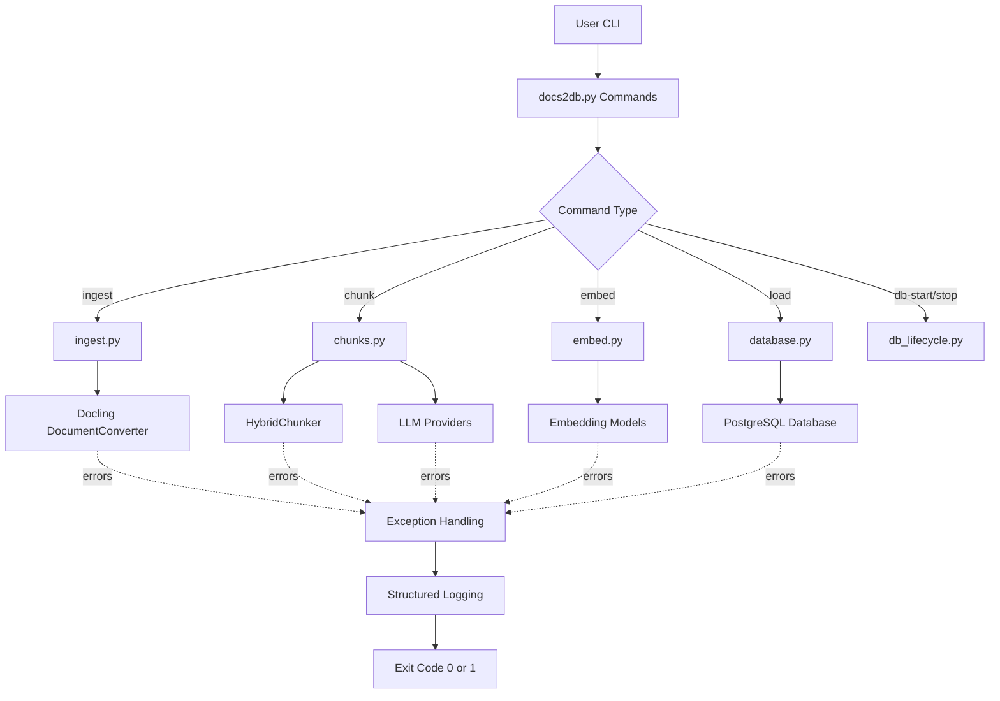

<details>
<summary>Relevant source files</summary>

The following files were used as context for generating this wiki page:
- [README.md](https://github.com/b08x/docs2db/blob/main/README.md)
- [src/docs2db/docs2db.py](https://github.com/b08x/docs2db/blob/main/src/docs2db/docs2db.py)
- [src/docs2db/chunks.py](https://github.com/b08x/docs2db/blob/main/src/docs2db/chunks.py)
- [src/docs2db/ingest.py](https://github.com/b08x/docs2db/blob/main/src/docs2db/ingest.py)
- [src/docs2db/multiproc.py](https://github.com/b08x/docs2db/blob/main/src/docs2db/multiproc.py)

</details>

# Troubleshooting

## Introduction

Troubleshooting in docs2db encompasses the diagnostic and recovery procedures for the RAG (Retrieval-Augmented Generation) pipeline that converts source documents into a searchable vector database. The system comprises five primary processing stages: database lifecycle management, document ingestion, chunking, embedding, and database loading. Each stage involves distinct dependencies, external service interactions, and failure modes that require specific diagnostic approaches. This document maps observed failure patterns to their structural origins within the codebase, identifying where errors propagate between components and how they manifest to end users.

The troubleshooting architecture relies on structured logging via `structlog`, exception propagation through custom `Docs2DBException` types, and exit codes that signal success or failure to orchestration layers. Understanding these mechanisms provides the foundation for systematic debugging.

## System Architecture and Error Flow

The docs2db pipeline follows a sequential dependency chain where each stage reads artifacts produced by the previous stage. This creates implicit coupling where failures in earlier stages cascade through subsequent operations.



The BatchProcessor in `multiproc.py` manages parallel execution across workers, tracking both successful completions and error counts. This enables partial failure scenarios where some files process successfully while others fail.

## Common Failure Scenarios

### Database Connection Failures

Database connectivity issues represent the most frequent failure mode when initializing the RAG pipeline. The system requires either Podman or Docker to be available for database container management.

**Symptom**: Error message "Neither Podman nor Docker found"

**Root Cause**: The db_lifecycle module performs container runtime detection before attempting database operations. If neither runtime is installed or discoverable in the system PATH, initialization fails.

**Resolution**: Install Podman from https://podman.io/getting-started/installation or Docker from https://docs.docker.com/get-docker/

**Symptom**: Error message "Database connection refused"

**Resolution**: Start the database and verify connection status:
```bash
docs2db db-start      # Start the database container
docs2db db-status     # Check connection parameters
```

Sources: [README.md#L1-L50](), [src/docs2db/docs2db.py#L1-L100]()
### Document Ingestion Failures

The ingestion stage converts source documents (PDF, HTML, Markdown) to Docling JSON format. Failures occur due to file access issues, unsupported formats, or Docling conversion errors.

**Source Files Involved**:
- `src/docs2db/ingest.py` - Main ingestion logic
- BatchProcessor from `multiproc.py` - Parallel processing

The `find_ingestible_files()` function searches for files matching supported extensions. If no files are found, a warning is logged and the function returns successfully without processing:

```python
# From src/docs2db/ingest.py

source_files = sorted(find_ingestible_files(source_root))
if len(source_files) == 0:
    logger.warning("No ingestible files found", source_path=str(source_root))
    return True
```

This behavior can mask configuration errors where the source path or file patterns are incorrect—the function returns `True` (success) even when zero files were processed.

**Error Handling Pattern**:
The `ingest_batch()` function wraps Docling conversion in error handling that logs failures but continues processing other files:

```python
if errors > 0:
    logger.error(f"Ingestion completed with {errors} errors")

logger.info(f"{processed} files ingested in {end - start:.2f} seconds")
return errors == 0
```

Sources: [src/docs2db/ingest.py#L1-L100](), [src/docs2db/multiproc.py#L1-L50]()

### Chunking Failures

Chunking converts ingested documents into text segments suitable for embedding. This stage can fail due to empty document content, LLM provider issues, or token limit exceeded conditions.

**Structural Components**:

| Component | File | Purpose |
|-----------|------|---------|
| HybridChunker | chunks.py | Token-based text splitting |
| LLM Providers | chunks.py | Contextual enrichment via WatsonX, OpenAI, OpenRouter, Mistral |
| BatchProcessor | multiprocess.py | Parallel chunk generation |

**Token Estimation**: The system estimates token counts using character-based approximation:

```python
# From src/docs2db/chunks.py

def estimate_tokens(text: str) -> int:
    char_count = len(text)
    return int(char_count / 3.0)
```

This conservative estimate (3 characters per token) accounts for code and data content that compresses less efficiently than natural language.

**LLM Provider Errors**: Each provider implements retry logic through the `@_get_llm_retry_decorator()` decorator. The provider initialization validates required credentials:

```python
# WatsonX validation

if not api_key or not project_id:
    raise ValueError(
        "WATSONX_API_KEY and WATSONX_PROJECT_ID must be set (via env vars or .env file)"
    )
```

**Provider Selection Logic**:
The system selects LLM providers based on URL parameters:
- `--watsonx-url` → WatsonX provider
- `--openai-url` → OpenAI-compatible provider
- `--openrouter-url` → OpenRouter provider
- `--mistral-url` → Mistral provider

If no URL is provided but `--context-model` is specified, the system defaults to Ollama (local).

Sources: [src/docs2db/chunks.py#L1-L100](), [src/docs2db/chunks.py#L200-L300]()

### Embedding Generation Failures

Embedding generation converts text chunks into vector representations for similarity search. Failures occur due to missing embeddings, model loading errors, or database write issues.

The embed stage reads from `chunks.json` files produced by the chunking stage and writes embedding files (e.g., `gran.json` for Granite, `slate.json` for Slate).

### Database Loading Failures

The load stage writes processed documents to PostgreSQL. Failures include:
- Schema incompatibilities
- Connection pool exhaustion
- Constraint violations

## CLI Command Error Handling

All CLI commands in `docs2db.py` follow a consistent error handling pattern that wraps execution in try/except blocks:

```python
# From src/docs2db/docs2db.py

try:
    # Command execution
    if not some_operation():
        raise Docs2DBException("Operation failed message")
except Docs2DBException as e:
    logger.error(str(e))
    raise typer.Exit(1)
```

**Exit Codes**:
- `0` - Success
- `1` - Failure (any exception)

**Exception Types**:
- `Docs2DBException` - Custom application errors
- `FileNotFoundError` - Missing files or directories
- `ValueError` - Configuration or parameter errors

## Parallel Processing Error Aggregation

The BatchProcessor tracks errors across parallel workers and reports aggregate counts:

```python
# From src/docs2db/multiproc.py

TextColumn("err:{task.fields[errors]:>6}"),
```

The progress display shows:
- Completed count
- Total count
- Error count
- Time remaining

This enables operators to identify which files failed without halting the entire batch.

## Configuration and Environment

Troubleshooting often requires verifying environment configuration. The system supports:

| Configuration Method | Priority |
|---------------------|----------|
| CLI arguments | Highest |
| Environment variables | Medium |
| `.env` file | Lower |
| Default values | Lowest |

**Key Environment Variables**:
- `WATSONX_API_KEY`, `WATSONX_PROJECT_ID` - WatsonX credentials
- `MISTRAL_API_KEY` - Mistral credentials
- `OPENAI_API_KEY` - OpenAI credentials
- Database connection parameters (auto-detected from compose file)

## Diagnostic Commands

The CLI provides specific commands for diagnosing system state:

```bash
# Check database status

docs2db db-status

# View database logs

docs2db db-logs

# Dry run to see what would be processed

docs2db chunk --dry-run
docs2db ingest --dry-run
```

## Structural Observations

Several architectural patterns affect troubleshooting effectiveness:

1. **Silent Success on Empty Results**: The ingestion function returns `True` when zero files are found, which can mask configuration errors where the file pattern doesn't match any actual files.

2. **Cascading Dependencies**: Each pipeline stage reads artifacts from the previous stage. This means a failure in chunking (stage 2) will prevent embedding (stage 3) from processing those specific documents.

3. **Provider Abstraction**: The LLM provider abstraction supports multiple backends, but each has different credential requirements and error messages, making unified troubleshooting complex.

4. **Partial Failure Tolerance**: The BatchProcessor continues processing when individual files fail, which is beneficial for throughput but can delay detection of systematic issues.

## Conclusion

Troubleshooting docs2db requires understanding the sequential pipeline architecture, the external service dependencies (LLM providers, database), and the parallel processing model. The most common issues stem from missing container runtimes, misconfigured API credentials, and empty source file sets. The structured logging and error aggregation mechanisms provide visibility into failure patterns, though the silent success behavior for empty file sets represents a structural gap that could be improved with explicit warning output when zero files are processed in a non-dry-run scenario.