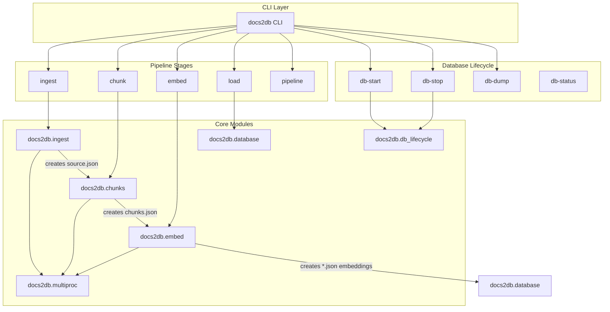
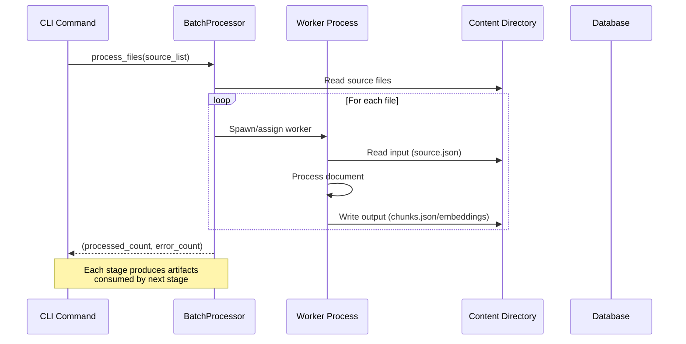

<details>
<summary>Relevant source files</summary>

The following files were used as context for generating this wiki page:
- [src/docs2db/docs2db.py](https://github.com/b08x/docs2db/blob/main/src/docs2db/docs2db.py)
- [README.md](https://github.com/b08x/docs2db/blob/main/README.md)
- [src/docs2db/chunks.py](https://github.com/b08x/docs2db/blob/main/src/docs2db/chunks.py)
- [src/docs2db/ingest.py](https://github.com/b08x/docs2db/blob/main/src/docs2db/ingest.py)
- [src/docs2db/multiproc.py](https://github.com/b08x/docs2db/blob/main/src/docs2db/multiproc.py)

</details>

# CLI Commands Reference

## Introduction

The docs2db CLI is the primary interface for transforming source documents into a Retrieval-Augmented Generation (RAG) database. Built on the Typer framework, it provides a command-line driven workflow that orchestrates document ingestion, chunking, embedding generation, and database loading operations. The CLI abstracts complex multiprocessing and API interactions behind simple subcommands, enabling users to execute individual pipeline stages or run the complete end-to-end process with a single command.

The command structure follows a staged pipeline model where each command produces intermediate artifacts that subsequent commands consume. This design allows for incremental processing—subsequent runs automatically skip unchanged files—while providing flexibility for users to execute specific stages independently.

## Command Architecture

### Core Command Structure

The CLI is implemented using Typer with multiple subcommands organized by functional pipeline stage. The main application entry point in `docs2db.py` defines commands for database lifecycle management, document ingestion, chunking, embedding, and loading operations.

```python
app = typer.Typer(help="Make a RAG Database from source content")

@app.command()
def ingest(...): ...
@app.command()
def chunk(...): ...
@app.command()
def embed(...): ...
@app.command()
def load(...): ...
@app.command()
def pipeline(...): ...
@app.command()
def db_start(...): ...
@app.command()
def db_stop(...): ...
@app.command()
def db_dump(...): ...
```

Sources: [src/docs2db/docs2db.py#L1-L50](src/docs2db/docs2db.py)

### Command Relationships and Data Flow

The following diagram illustrates how information flows between CLI commands and their underlying modules:



The data flow follows a strict sequential dependency: each stage reads artifacts produced by the previous stage. The `pipeline` command orchestrates the full sequence automatically, while individual commands allow users to execute specific stages or resume from a particular point after troubleshooting.

Sources: [src/docs2db/docs2db.py#L1-L200](src/docs2db/docs2db.py), [README.md#L1-L100](README.md)

## Database Lifecycle Commands

### db-start

Starts the PostgreSQL database container required for RAG operations. The command delegates to the `db_lifecycle` module which manages container orchestration.

```python
@app.command()
def db_start(
    host: Annotated[Optional[str], typer.Option(help="Database host")] = None,
    port: Annotated[Optional[int], typer.Option(help="Database port")] = None,
) -> None:
```

The function calls `start_database()` which initializes the container and waits for the database to become ready. Database connection parameters can be explicitly provided or auto-detected from the compose file.

Sources: [src/docs2db/docs2db.py#L200-L230](src/docs2db/docs2db.py)

### db-stop

Stops the running database container, releasing system resources. Works in conjunction with `db-start` to manage the database lifecycle during batch processing sessions.

```python
@app.command()
def db_stop() -> None:
    """Stop the database container."""
```

Sources: [src/docs2db/docs2db.py#L250-L260](src/docs2db/docs2db.py)

### db-dump

Exports the database contents to a portable SQL file that can be restored on any system with the docs2db-api. This enables sharing RAG databases across environments.

```python
@app.command()
def db_dump(
    output_file: Annotated[Optional[str], typer.Option(help="Output SQL file")] = None,
) -> None:
```

Sources: [src/docs2db/docs2db.py#L270-L290](src/docs2db/docs2db.py)

### db-status

Checks the current status of the database connection, reporting whether the container is running and whether connections can be established.

Sources: [src/docs2db/docs2db.py#L300-L320](src/docs2db/docs2db.py)

## Document Processing Commands

### ingest

Converts source documents (PDFs, HTML, markdown) into Docling JSON format using the docling library. This is the first stage of the pipeline, producing `source.json` files in the content directory.

```python
@app.command()
def ingest(
    source_path: Annotated[Optional[str], typer.Argument(help="Path to directory or file to ingest")] = None,
    dry_run: Annotated[bool, typer.Option(help="Show what would be processed without doing it")] = False,
    force: Annotated[bool, typer.Option(help="Force reprocessing even if files are up-to-date")] = False,
    pipeline: Annotated[Optional[str], typer.Option("--pipeline", help="Docling pipeline: 'standard' or 'vlm'")] = None,
    model: Annotated[Optional[str], typer.Option("--model", help="Docling model to use")] = None,
    device: Annotated[Optional[str], typer.Option("--device", help="Device for docling: 'auto', 'cpu', 'cuda', 'mps'")] = None,
    batch_size: Annotated[Optional[int], typer.Option("--batch-size", help="Docling batch size (per worker)")] = None,
    workers: Annotated[Optional[int], typer.Option("--workers", help="Number of parallel workers")] = None,
) -> None:
```

The ingest command supports multiple document formats and uses parallel processing via the `BatchProcessor` class. The `dry_run` flag allows users to preview which files would be processed without executing the conversion. The `pipeline` option selects between standard PDF conversion and VLM-based processing for complex visual documents.

Sources: [src/docs2db/docs2db.py#L70-L120](src/docs2db/docs2db.py)

### chunk

Splits ingested documents into smaller text segments suitable for embedding and retrieval. Optionally enriches each chunk with LLM-generated contextual information following Anthropic's contextual retrieval approach.

```python
@app.command()
def chunk(
    content_dir: Annotated[str | None, typer.Option(help="Path to content directory")] = None,
    pattern: Annotated[str, typer.Option(help="Directory pattern (e.g., '**' for all)")] = "**",
    force: Annotated[bool, typer.Option(help="Force reprocessing even if up-to-date")] = False,
    dry_run: Annotated[bool, typer.Option(help="Show what would process without doing it")] = False,
    skip_context: Annotated[bool | None, typer.Option(help="Skip LLM contextual chunk generation (faster)")] = None,
    context_model: Annotated[str | None, typer.Option(help="LLM model for context generation")] = None,
    llm_provider: Annotated[str | None, typer.Option(help="LLM provider to use: 'openai' or 'watsonx'")] = None,
    openai_url: Annotated[str | None, typer.Option(...)] = None,
    watsonx_url: Annotated[str | None, typer.Option(...)] = None,
    workers: Annotated[Optional[int], typer.Option(help="Number of parallel workers")] = None,
) -> None:
```

The chunk command supports multiple LLM providers including OpenAI, WatsonX, OpenRouter, and Mistral. The `skip_context` option dramatically reduces processing time by omitting the LLM enrichment step. The command produces `chunks.json` files containing the segmented text with optional contextual metadata.

Sources: [src/docs2db/docs2db.py#L140-L200](src/docs2db/docs2db.py)

### embed

Generates vector embeddings for chunked text using configurable embedding models. Multiple embedding models are supported including granite-30m-english, e5-small-v2, slate-125m, and noinstruct-small.

```python
@app.command()
def embed(
    content_dir: Annotated[str | None, typer.Option(help="Path to content directory")] = None,
    model: Annotated[str | None, typer.Option(help="Embedding model to load")] = None,
    pattern: Annotated[str, typer.Option(help="Directory pattern")] = "**",
    force: Annotated[bool, typer.Option(help="Force reload of existing documents")] = False,
    workers: Annotated[Optional[int], typer.Option(help="Number of parallel workers")] = None,
) -> None:
```

Sources: [src/docs2db/docs2db.py#L120-L140](src/docs2db/docs2db.py)

### load

Loads processed chunks and embeddings into the PostgreSQL database, creating the vector and full-text search indexes required for RAG queries.

```python
@app.command()
def load(
    content_dir: Annotated[str | None, typer.Option(help="Path to content directory")] = None,
    model: Annotated[str | None, typer.Option(help="Embedding model to load")] = None,
    pattern: Annotated[str, typer.Option(help="Directory pattern")] = "**",
    force: Annotated[bool, typer.Option(help="Force reload of existing documents")] = False,
    host: Annotated[Optional[str], typer.Option(help="Database host")] = None,
    port: Annotated[Optional[int], typer.Option(help="Database port")] = None,
    db: Annotated[Optional[str], typer.Option(help="Database name")] = None,
    user: Annotated[Optional[str], typer.Option(help="Database user")] = None,
    password: Annotated[Optional[str], typer.Option(help="Database password")] = None,
    batch_size: Annotated[int, typer.Option(help="Files per batch")] = 100,
) -> None:
```

Sources: [src/docs2db/docs2db.py#L50-L70](src/docs2db/docs2db.py)

### pipeline

Executes the complete end-to-end pipeline: start database → ingest → chunk → embed → load → dump → stop. This command automates the entire RAG creation process with a single invocation.

```python
@app.command()
def pipeline(
    source_path: Annotated[Optional[str], typer.Argument(help="Path to directory or file to process")] = None,
    output_file: Annotated[Optional[str], typer.Option(help="Output SQL dump file")] = None,
    ...
) -> None:
```

The pipeline command provides a convenient single-command workflow while maintaining all the flexibility of individual stage commands. It handles database lifecycle automatically, ensuring proper startup and cleanup regardless of whether stages succeed or fail.

Sources: [src/docs2db/docs2db.py#L200-L250](src/docs2db/docs2db.py)

## Command Options Summary

The following table summarizes available options across core processing commands:

| Option | ingest | chunk | embed | load | Purpose |
|--------|--------|-------|-------|------|---------|
| `source_path` / `content_dir` | ✓ | ✓ | ✓ | ✓ | Input/output directory path |
| `pattern` | | ✓ | ✓ | ✓ | Glob pattern for file selection |
| `dry_run` | ✓ | ✓ | | | Preview without execution |
| `force` | ✓ | ✓ | ✓ | ✓ | Reprocess existing artifacts |
| `workers` | ✓ | ✓ | ✓ | | Parallel processing threads |
| `model` | ✓ | ✓ | ✓ | | Model selection |
| `device` | ✓ | | | | Compute device (cpu/cuda/mps) |
| `batch_size` | ✓ | | | | Processing batch size |
| `skip_context` | | ✓ | | | Skip LLM enrichment |
| `llm_provider` | | ✓ | | | LLM backend selection |

Sources: [src/docs2db/docs2db.py#L1-L200](src/docs2db/docs2db.py), [README.md#L50-L100](README.md)

## Multiprocessing Architecture

The `BatchProcessor` class in `multiproc.py` provides the parallel execution substrate for computationally intensive pipeline stages. It manages worker processes, tracks progress, and handles error aggregation across parallel operations.

```python
class BatchProcessor:
    def __init__(
        self,
        worker_function,
        worker_args,
        progress_message,
        batch_size,
        mem_threshold_mb,
        max_workers,
        use_shared_state=False,
    ):
```

The processor accepts a worker function and its arguments, then distributes work across the specified number of worker processes. It provides progress tracking via a rich console output with percentage completion, error counts, and estimated time remaining.

Sources: [src/docs2db/multiproc.py#L1-L50](src/docs2db/multiproc.py)

### Processing Flow with BatchProcessor



The BatchProcessor enables concurrent execution of document processing, with memory thresholds preventing system overload during large batch operations.

Sources: [src/docs2db/multiproc.py#L30-L80](src/docs2db/multiproc.py)

## Chunk Processing Details

The chunking module (`chunks.py`) implements token-aware text splitting with optional LLM-based contextual enrichment. It uses character-based token estimation for splitting decisions while supporting multiple LLM providers for generating chunk context.

```python
def estimate_tokens(text: str) -> int:
    """Estimate token count for text using character-based approximation."""
    char_count = len(text)
    return int(char_count / 3.0)

def split_text_into_chunks(text: str, max_tokens: int) -> list[str]:
    """Split text into chunks that fit within token limit."""
    max_chars = int(max_tokens * 3.0)
    # Split logic...
```

The chunking process supports multiple LLM providers through a provider abstraction layer:

```python
class OpenAIProvider(LLMProvider): ...
class WatsonXProvider(LLMProvider): ...
class MistralProvider(LLMProvider): ...
class OpenRouterProvider(LLMProvider): ...
```

Sources: [src/docs2db/chunks.py#L100-L200](src/docs2db/chunks.py)

## Ingestion Processing Details

The ingestion module (`ingest.py`) handles conversion of various source formats to Docling JSON using the DocumentConverter class. It supports both standard PDF processing and VLM-based pipelines for documents requiring visual understanding.

```python
def _get_converter() -> Any:
    """Get or create the DocumentConverter singleton."""
    global _converter, _last_converter_settings
    
    # Check if existing converter matches current settings
    if _converter is not None and _last_converter_settings == current_settings:
        return _converter
    
    # Create new converter with current settings
    from docling.document_converter import DocumentConverter
    # Configuration...
```

The module supports device selection for acceleration (CPU, CUDA, MPS) and batch processing configurations for efficient throughput.

Sources: [src/docs2db/ingest.py#L50-L100](src/docs2db/ingest.py)

## Content Directory Structure

Each processed document produces a standardized set of files within the content directory:

```
docs2db_content/
└── path/
    └── to/
        └── document/
            ├── source.json      # Docling ingested document
            ├── chunks.json      # Text chunks with context
            ├── gran.json        # Vector embeddings
            └── meta.json        # Processing metadata
```

The CLI commands read and write these artifacts, enabling incremental processing where unchanged files are automatically skipped in subsequent runs.

Sources: [README.md#L80-L100](README.md)

## Usage Patterns

### Incremental Processing

```bash
# Initial full pipeline

docs2db pipeline /path/to/pdfs

# After source changes - rerun pipeline
# Only modified files will be reprocessed

docs2db pipeline /path/to/pdfs
```

The system tracks file modifications and skips unchanged content, making updates efficient for large document collections.

### Custom LLM Provider for Chunking

```bash
# Use Ollama with local model

docs2db chunk --context-model qwen2.5:7b-instruct

# Use OpenAI

docs2db chunk --openai-url https://api.openai.com \
  --context-model gpt-4o-mini

# Use WatsonX

docs2db chunk --watsonx-url https://us-south.ml.cloud.ibm.com
```

Multiple LLM provider backends can be configured through URL and model parameters, enabling use of local or cloud-based inference services.

Sources: [README.md#L40-L80](README.md)

### Fast Processing Mode

```bash
# Skip LLM contextual enrichment for faster processing

docs2db chunk --skip-context

# Later, add context if needed

docs2db chunk  # With context enabled (reprocesses)
```

The `skip_context` option dramatically reduces processing time when LLM-generated context is not required.

Sources: [src/docs2db/docs2db.py#L160-L170](src/docs2db/docs2db.py)

## Conclusion

The docs2db CLI provides a comprehensive command interface for building RAG databases from source documents. Its command structure follows a staged pipeline model where each stage produces intermediate artifacts consumed by subsequent stages, enabling both full automation via the `pipeline` command and granular control through individual stage commands. The architecture leverages multiprocessing for parallel document handling while supporting multiple LLM providers for contextual chunk enrichment and various embedding models for vectorization.

Key architectural observations from the source files:

1. **Modular design**: Each CLI command delegates to dedicated modules (`ingest.py`, `chunks.py`, `embed.py`), enabling independent execution and testing.

2. **Artifact-based dependencies**: Commands communicate through filesystem artifacts rather than in-memory data structures, providing natural checkpointing and the ability to resume from specific pipeline stages.

3. **Provider abstraction**: The LLM provider pattern in `chunks.py` supports multiple backends (OpenAI, WatsonX, Mistral, OpenRouter), though the implementation shows some duplication across provider implementations that could benefit from refactoring.

4. **Multiprocessing substrate**: The `BatchProcessor` class provides consistent parallel execution with progress tracking and error handling across all computationally intensive commands.

5. **Incremental processing**: The design supports skipping unchanged files automatically, making the system suitable for repeated runs with evolving document collections.