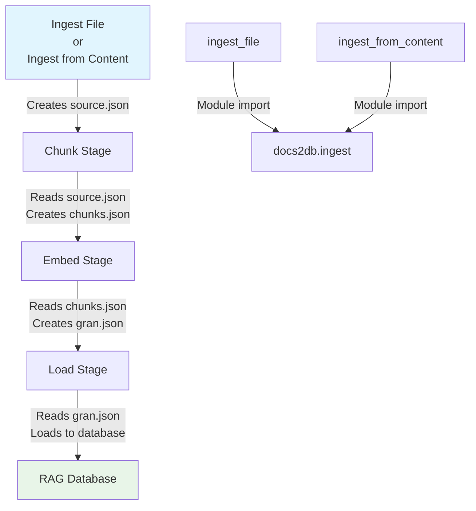
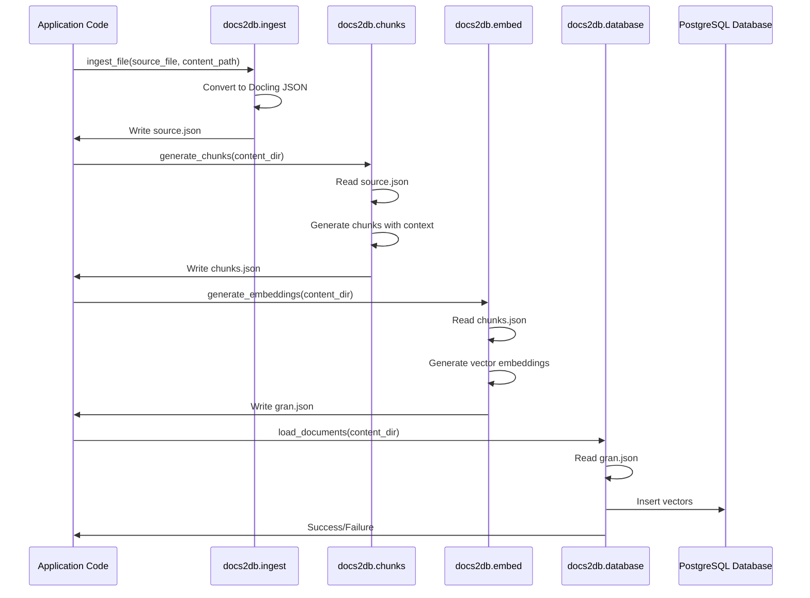
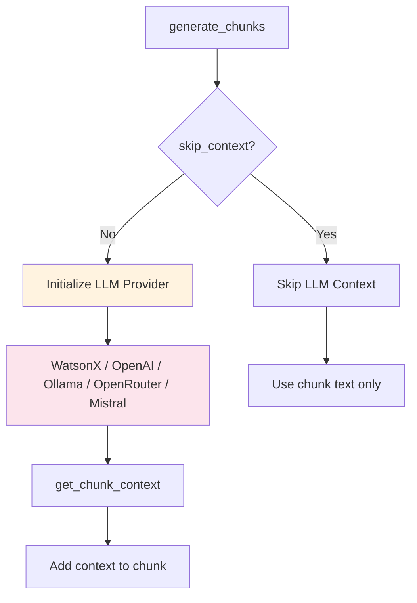
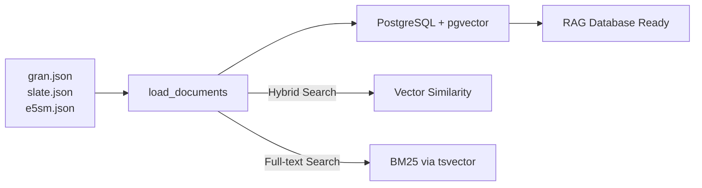

<details>
<summary>Relevant source files</summary>

The following files were used as context for generating this wiki page:
- [src/docs2db/ingest.py](https://github.com/b08x/docs2db/blob/main/src/docs2db/ingest.py)
- [README.md](https://github.com/b08x/docs2db/blob/main/README.md)
- [src/docs2db/chunks.py](https://github.com/b08x/docs2db/blob/main/src/docs2db/chunks.py)
- [src/docs2db/docs2db.py](https://github.com/b08x/docs2db/blob/main/src/docs2db/docs2db.py)
- [src/docs2db/multiproc.py](https://github.com/b08x/docs2db/blob/main/src/docs2db/multiproc.py)

</details>

# Using Docs2DB as a Library

## Introduction

Docs2DB operates primarily as a CLI tool for converting source documents into a RAG (Retrieval Augmented Generation) ready database. However, the underlying functionality is exposed as a Python library, enabling programmatic integration into custom workflows. The library provides functions for document ingestion, allowing developers to process files from disk or content from memory directly within Python applications. This approach bypasses the CLI interface while leveraging Docling for document conversion and creating intermediate processing files that can subsequently be handled by chunking, embedding, and loading pipelines.

The library interface centers on two primary functions: `ingest_file` for file-based ingestion and `ingest_from_content` for in-memory content processing. These functions transform input documents into Docling JSON format and persist them to the content directory structure expected by downstream processing stages.

## Core Library Functions

### Ingesting Files from Disk

The `ingest_file` function processes documents stored on the filesystem, converting them to Docling JSON format and writing the result to the specified content path.

```python
from pathlib import Path
from docs2db.ingest import ingest_file

# Ingest a file from disk

ingest_file(
    source_file=Path("document.pdf"),
    content_path=Path("docs2db_content/my_docs/document"),
    source_metadata={"source": "my_system", "retrieved_at": "2024-01-01"}  # optional
)
```

**Function signature and parameters:**

| Parameter | Type | Description |
|-----------|------|-------------|
| `source_file` | `Path` | Path to the source document (PDF, HTML, DOCX, etc.) |
| `content_path` | `Path` | Target directory where `source.json` will be written |
| `source_metadata` | `dict` (optional) | Additional metadata to attach to the document |

Sources: [README.md#L1-L20](https://github.com/b08x/docs2db/blob/main/README.md#L1-L20)

### Ingesting Content from Memory

The `ingest_from_content` function processes content directly from memory, supporting HTML, markdown, and other text-based formats without requiring file system access.

```python
from pathlib import Path
from docs2db.ingest import ingest_from_content

# Ingest content from memory (HTML, markdown, etc.)

ingest_from_content(
    content="<html>...</html>",
    content_path=Path("docs2db_content/my_docs/page"),
    stream_name="page.html",
    source_metadata={"url": "https://example.com"},  # optional
    content_encoding="utf-8"  # optional, defaults to "utf-8"
)
```

**Function signature and parameters:**

| Parameter | Type | Description |
|-----------|------|-------------|
| `content` | `str` | Raw content string (HTML, markdown, plain text) |
| `content_path` | `Path` | Target directory where `source.json` will be written |
| `stream_name` | `str` | Filename used to determine content type |
| `source_metadata` | `dict` (optional) | Additional metadata to attach to the document |
| `content_encoding` | `str` (optional) | Character encoding, defaults to "utf-8" |

Sources: [README.md#L21-L30](https://github.com/b08x/docs2db/blob/main/README.md#L21-L30)

## Pipeline Architecture

When using Docs2DB as a library, the ingestion functions create intermediate files that require subsequent processing through the chunk, embed, and load stages. This creates a two-phase workflow where library functions handle the initial document conversion, while CLI commands or direct module imports handle the remaining pipeline stages.



The content directory structure created by ingestion functions mirrors the source document hierarchy, with each source file receiving its own subdirectory containing the Docling JSON output.

Sources: [README.md#L50-L70](https://github.com/b08x/docs2db/blob/main/README.md#L50-L70)

## Content Directory Structure

Both ingestion functions produce files in a consistent directory structure that downstream pipeline stages expect.

```
docs2db_content/
├── path/
│   └── to/
│       └── your/
│           └── document/
│               ├── source.json      # Docling ingested document
│               ├── chunks.json      # Text chunks with context
│               ├── gran.json        # Granite embeddings
│               └── meta.json        # Processing metadata
└── README.md
```

Each document processed through the library receives a `source.json` file in Docling JSON format. This file serves as the input for subsequent chunking operations, which generate `chunks.json` containing text segments with optional LLM-generated contextual enrichment.

Sources: [README.md#L50-L70](https://github.com/b08x/docs2db/blob/main/README.md#L50-L70)

## Programmatic Pipeline Execution

While the primary library functions are `ingest_file` and `ingest_from_content`, the complete pipeline requires invoking chunking, embedding, and loading operations. These can be executed via CLI commands after ingestion completes, or potentially through direct module imports from `docs2db.chunks` and `docs2db.embed`.



The sequence above illustrates the complete flow when combining library ingestion with subsequent pipeline stages. The `source.json` file generated by ingestion functions serves as the foundational input for all subsequent processing.

Sources: [src/docs2db/ingest.py#L1-L100](https://github.com/b08x/docs2db/blob/main/src/docs2db/ingest.py#L1-L100), [src/docs2db/docs2db.py#L1-L50](https://github.com/b08x/docs2db/blob/main/src/docs2db/docs2db.py#L1-L50)

## Configuration and Environment

When using Docs2DB as a library, the configuration system remains active. Environment variables and `.env` file settings control behavior for document processing parameters such as the Docling pipeline selection, model choices, device allocation, and batch sizes.

| Environment Variable | Description | Default |
|---------------------|-------------|---------|
| `DOCLING_PIPELINE` | Processing pipeline (standard/vlm) | standard |
| `DOCLING_MODEL` | Specific model for the pipeline | auto-selected |
| `DOCLING_DEVICE` | Device for processing (auto/cpu/cuda/mps) | auto |
| `DOCLING_BATCH_SIZE` | Documents processed per worker | 1 |
| `DOCLING_WORKERS` | Number of parallel workers | 4 |

These settings apply when the library functions invoke Docling internally for document conversion. The configuration is loaded from settings module, which reads from environment variables or `.env` files at initialization time.

Sources: [src/docs2db/ingest.py#L50-L80](https://github.com/b08x/docs2db/blob/main/src/docs2db/ingest.py#L50-L80)

## LLM Provider Integration for Contextual Chunks

The chunking stage supports contextual enrichment through LLM providers. When using the library approach, the chunk generation functions (`generate_chunks`) accept provider configuration parameters that enable LLM-generated context for each chunk.

Supported providers include:
- **Ollama** - Local LLM inference
- **OpenAI** - OpenAI API endpoints
- **WatsonX** - IBM WatsonX service
- **OpenRouter** - Unified LLM gateway
- **Mistral** - Mistral AI API



The contextual chunking approach implements Anthropic's contextual retrieval methodology, where each chunk receives semantic context from an LLM before vector embedding generation. This improves retrieval accuracy by providing surrounding context that clarifies ambiguous content.

Sources: [src/docs2db/chunks.py#L1-L80](https://github.com/b08x/docs2db/blob/main/src/docs2db/chunks.py#L1-L80), [src/docs2db/chunks.py#L200-L280](https://github.com/b08x/docs2db/blob/main/src/docs2db/chunks.py#L200-L280)

## Embedding Model Selection

The embedding stage supports multiple embedding models. Configuration occurs through the `EMBEDDING_MODEL` environment variable or via CLI `--model` parameter when invoking the embed stage.

| Model | Description |
|-------|-------------|
| `ibm-granite/granite-embedding-30m-english` | Default model, 30M parameter English embeddings |
| `e5-small-v2` | Small E5 model for efficiency |
| `slate-125m` | Slate 125M parameter model |
| `noinstruct-small` | No-instruct small variant |

The embedding generation creates vector representations stored in model-specific filename conventions (e.g., `gran.json` for granite, `slate.json` for slate, `e5sm.json` for E5 small).

Sources: [README.md#L30-L50](https://github.com/b08x/docs2db/blob/main/README.md#L30-L50)

## Database Loading

The final pipeline stage loads embedded content into a PostgreSQL database with pgvector extensions. The load operation reads the embedding files created during the embed stage and inserts vector data along with text chunks and metadata.



The database supports both vector similarity search (using HNSW indexes) and full-text search (using GIN-indexed tsvector), enabling hybrid retrieval strategies that combine semantic and keyword-based approaches.

Sources: [src/docs2db/docs2db.py#L80-L120](https://github.com/b08x/docs2db/blob/main/src/docs2db/docs2db.py#L80-L120)

## Structural Limitations and Observations

The library interface provides ingestion capabilities but does not expose a unified programmatic API for the complete pipeline. Developers using Docs2DB as a library must either:

1. Call CLI commands subprocess-style after ingestion
2. Import and invoke individual module functions (`generate_chunks`, `generate_embeddings`, `load_documents`) directly

This creates a gap between the library experience (ingest functions) and the complete pipeline capability. The absence of a single `process_document()` function that handles the full ingest-chunk-embed-load sequence represents a structural incompleteness in the library interface design.

Additionally, the dependency on Docling for document conversion means the library cannot be used for pure chunking or embedding operations without first creating Docling JSON through the ingestion phase. This tight coupling between ingestion and Docling limits flexibility for scenarios where source documents already exist in intermediate formats.

Sources: [README.md#L1-L35](https://github.com/b08x/docs2db/blob/main/README.md#L1-L35), [src/docs2db/docs2db.py#L1-L100](https://github.com/b08x/docs2db/blob/main/src/docs2db/docs2db.py#L1-L100)

## Conclusion

Using Docs2DB as a library provides programmatic access to document ingestion through `ingest_file` and `ingest_from_content` functions. These functions convert source documents to Docling JSON format and establish the directory structure required by downstream pipeline stages. The library approach enables integration into custom Python applications while relying on CLI commands or direct module imports for chunking, embedding, and database loading operations.

The architectural design separates ingestion (library-accessible) from processing stages (primarily CLI-accessible), creating a hybrid usage model that requires understanding both the Python API and the pipeline mechanics. This structure serves scenarios where custom preprocessing or content来源 handling is needed before standard RAG pipeline execution, while maintaining the CLI as the primary interface for the complete workflow.