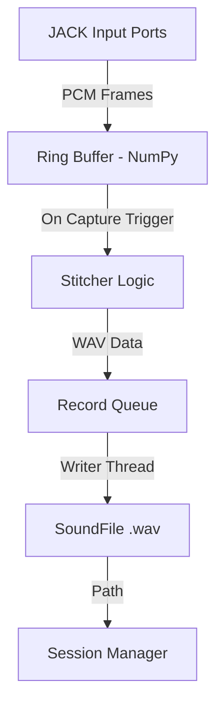
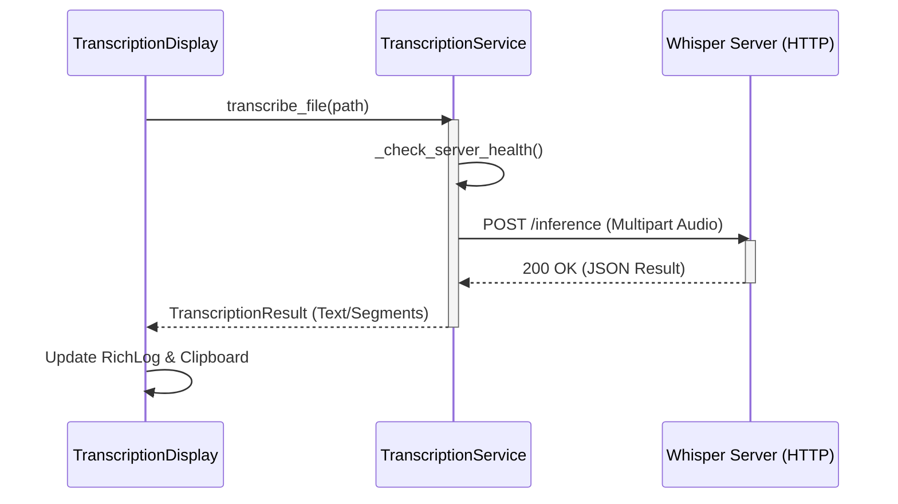

Relevant source files

The following files were used as context for generating this wiki page:
- [src/omega13/app.py](https://github.com/b08x/omega-13/blob/main/src/omega13/app.py)
- [src/omega13/audio.py](https://github.com/b08x/omega-13/blob/main/src/omega13/audio.py)
- [src/omega13/session.py](https://github.com/b08x/omega-13/blob/main/src/omega13/session.py)
- [src/omega13/config.py](https://github.com/b08x/omega-13/blob/main/src/omega13/config.py)
- [src/omega13/transcription.py](https://github.com/b08x/omega-13/blob/main/src/omega13/transcription.py)
- [src/omega13/ui.py](https://github.com/b08x/omega-13/blob/main/src/omega13/ui.py)

# Core Architecture Overview

## Introduction

Omega-13 is a retroactive audio recording system designed to capture audio from the past using a rolling ring buffer. The architecture is built around a central `Omega13App` that coordinates a real-time JACK-based audio engine, a session management system for data persistence, and an asynchronous transcription service. The system's primary mechanism is the continuous maintenance of a 13-second audio buffer that can be "captured" and persisted to disk upon user trigger, followed by automated transcription via an external HTTP API.

## System Components and Responsibilities

The system is partitioned into several distinct modules that handle specific domains of the recording and processing lifecycle.

| Component | Responsibility | Key Classes/Mechanisms |
| :--- | :--- | :--- |
| **Application Controller** | Orchestrates UI, hotkeys, and component lifecycles. | `Omega13App` |
| **Audio Engine** | Manages JACK client, ring buffer, and WAV writing. | `AudioEngine` |
| **Session Manager** | Handles temporary storage, metadata, and permanent saves. | `SessionManager`, `Session` |
| **Configuration** | Persistent JSON-based settings management. | `ConfigManager` |
| **Transcription** | Asynchronous HTTP interface to Whisper server. | `TranscriptionService` |
| **UI Layer** | TUI implementation using the Textual framework. | `VUMeter`, `TranscriptionDisplay` |

Sources: [src/omega13/app.py](https://github.com/b08x/omega-13/blob/main/src/omega13/app.py), [src/omega13/audio.py](https://github.com/b08x/omega-13/blob/main/src/omega13/audio.py), [src/omega13/session.py](https://github.com/b08x/omega-13/blob/main/src/omega13/session.py), [src/omega13/config.py](https://github.com/b08x/omega-13/blob/main/src/omega13/config.py)

## Audio Processing and Ring Buffer Mechanism

The `AudioEngine` maintains a constant connection to the JACK audio server. It utilizes a NumPy-backed ring buffer to store incoming audio samples.

### Buffer Dynamics

- **Duration**: Fixed at 13 seconds by default.
- **Data Structure**: A NumPy array of shape `(ring_size, channels)`.
- **Write Pointer**: A `write_ptr` that wraps around using modulo arithmetic to maintain the rolling window.

When a recording is triggered, the engine stitches the "past" (the current state of the ring buffer) with the "present" (incoming audio frames) until the user stops the capture. This creates a seamless transition from retroactive to proactive recording.

Sources: [src/omega13/audio.py:#L17-L45](https://github.com/b08x/omega-13/blob/main/src/omega13/audio.py#L17-L45)

### Data Flow: Capture to Disk

The following diagram illustrates the flow of audio data from the JACK ports into the ring buffer and eventually to a file.

Sources: [src/omega13/audio.py:#L47-L65](https://github.com/b08x/omega-13/blob/main/src/omega13/audio.py#L47-L65)

## Session Lifecycle and Persistence

The system uses a two-stage persistence model. Recordings are initially stored in a volatile temporary directory (typically `/tmp/omega13`) and are only moved to a permanent location if the user explicitly saves the session.

### Session Structure

A session consists of:
1. **Recordings**: Individual `.wav` files.
2. **Transcriptions**: Textual output from the transcription service.
3. **Metadata**: A `session.json` file tracking IDs, timestamps, and file relationships.

Sources: [src/omega13/session.py:#L66-L85](https://github.com/b08x/omega-13/blob/main/src/omega13/session.py#L66-L85)

### Inconsistency: The "Saved" State Paradox

A structural oddity exists in `session.py`: the `_sync_to_save_location` method is called every time a recording or transcription is added, but it only performs operations if `self.saved` is true. This means the system spends CPU cycles checking a state that is essentially a "no-op" for the majority of a session's early life. It's a fucking tedious way to handle incremental updates, ensuring the logic is always "ready" even when there's nowhere to go.

Sources: [src/omega13/session.py:#L45-L60](https://github.com/b08x/omega-13/blob/main/src/omega13/session.py#L45-L60)

## Transcription Integration

The `TranscriptionService` operates as a client to an external `whisper-server`. It manages a pool of threads to ensure UI responsiveness during long-running inference tasks.

### Transcription Sequence

The interaction between the UI, the service, and the external server follows a strict request-response pattern over HTTP.

Sources: [src/omega13/transcription.py:#L45-L85](https://github.com/b08x/omega-13/blob/main/src/omega13/transcription.py#L45-L85), [src/omega13/ui.py:#L55-L75](https://github.com/b08x/omega-13/blob/main/src/omega13/ui.py#L55-L75)

## Configuration and Environment

The `ConfigManager` centralizes system settings, including the global hotkey and transcription server URL.

| Field | Default Value | Purpose |
| :--- | :--- | :--- |
| `version` | 2 | Schema versioning. |
| `global_hotkey` | `<ctrl>+<alt>+space` | System-wide trigger for capture. |
| `save_path` | `Path.cwd()` | Default permanent storage. |
| `transcription.server_url` | `http://localhost:8080` | Endpoint for the inference server. |

Sources: [src/omega13/config.py:#L26-L40](https://github.com/b08x/omega-13/blob/main/src/omega13/config.py#L26-L40)

## Conclusion

The core architecture of Omega-13 is a specialized pipeline designed for low-latency audio capture and high-latency text processing. The structural dependence on external components (JACK for audio and a separate HTTP server for transcription) creates a modular but fragile ecosystem where the `Omega13App` acts as the primary glue. The session management's reliance on a manual "save" step provides a buffer against disk clutter but introduces a layer of state management complexity where data exists in a "limbo" state until explicitly promoted.