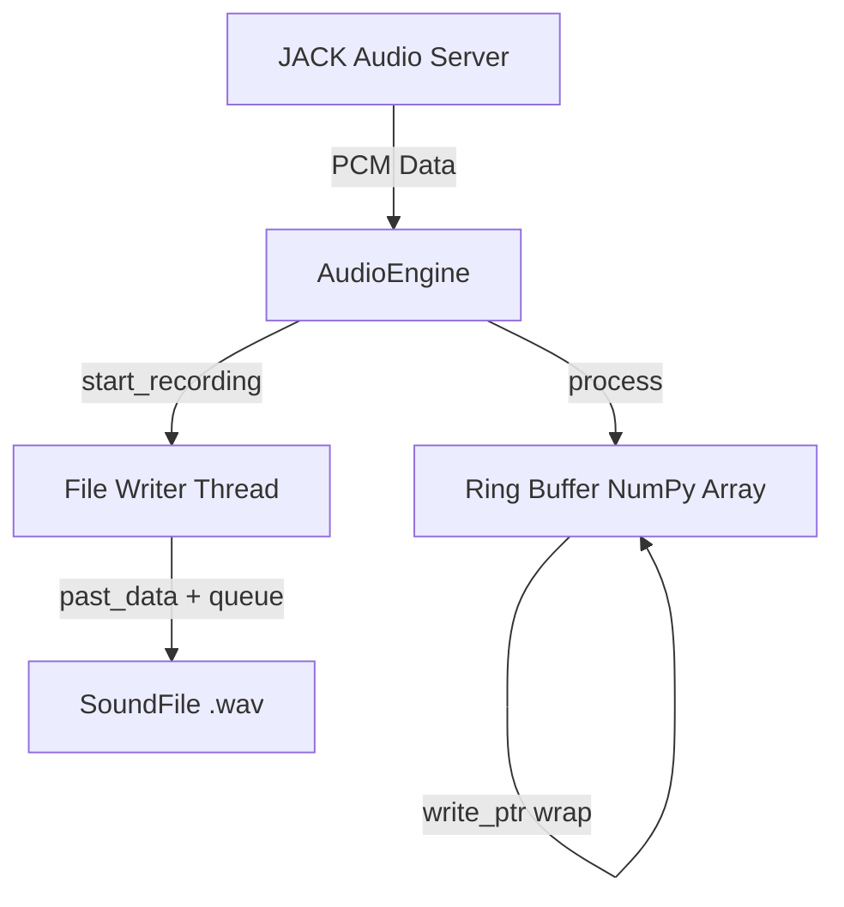
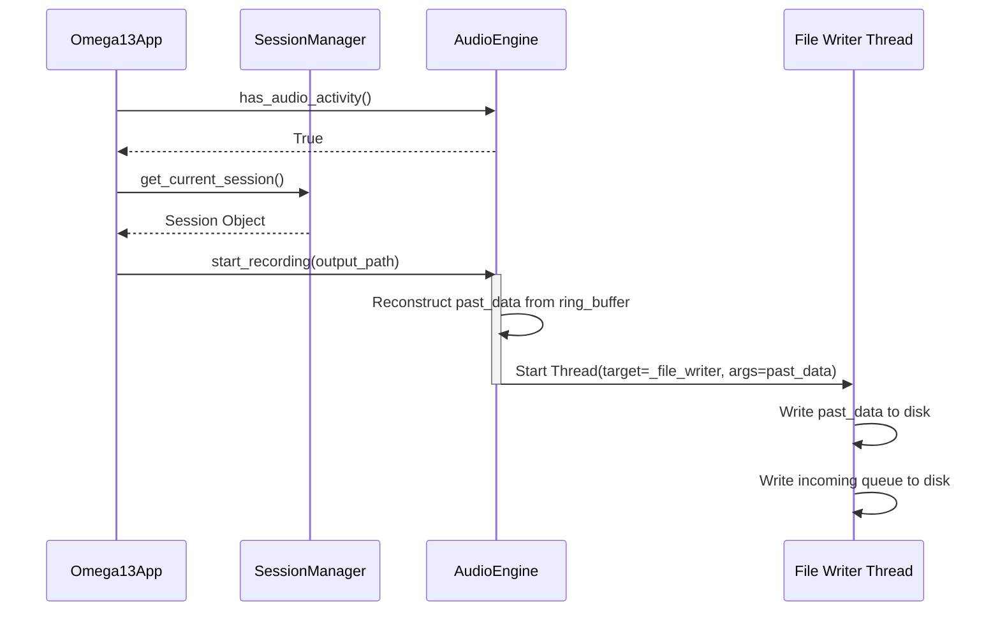

<details>
<summary>Relevant source files</summary>

The following files were used as context for generating this wiki page:
- [src/omega13/audio.py](https://github.com/b08x/omega-13/blob/main/src/omega13/audio.py)
- [src/omega13/app.py](https://github.com/b08x/omega-13/blob/main/src/omega13/app.py)
- [src/omega13/ui.py](https://github.com/b08x/omega-13/blob/main/src/omega13/ui.py)
- [src/omega13/session.py](https://github.com/b08x/omega-13/blob/main/src/omega13/session.py)
- [src/omega13/transcription.py](https://github.com/b08x/omega-13/blob/main/src/omega13/transcription.py)
- [README.md](https://github.com/b08x/omega-13/blob/main/README.md)
</details>

# Audio Engine & Ring Buffers

## Introduction

The Audio Engine and Ring Buffer system in Omega-13 functions as a retroactive capture mechanism. It maintains a continuous, rolling window of audio data in memory, allowing the system to "go back in time" and save audio that occurred before the user initiated a recording. This is achieved through a `jack` client integration that feeds a fixed-size NumPy array, serving as a circular buffer.

Sources: [src/omega13/audio.py:#L17-L45](https://github.com/b08x/omega-13/blob/main/src/omega13/audio.py#L17-L45), [README.md](https://github.com/b08x/omega-13/blob/main/README.md)

## Architecture and Data Flow

The system relies on the JACK (or PipeWire-JACK) audio server to provide low-latency audio streams. The `AudioEngine` class manages the lifecycle of the JACK client, port registration, and the internal state of the ring buffer.

### Ring Buffer Mechanism

The ring buffer is implemented as a 2D NumPy array of type `float32`. The size is determined by the `BUFFER_DURATION` (defaulting to 13 seconds) multiplied by the sample rate. A `write_ptr` tracks the current position, wrapping around to zero when the end of the array is reached.



The data flow ensures that even if the application is idle, the last 13 seconds of audio are always available in RAM. When a recording is triggered, the engine "stitches" the historical data from the ring buffer with incoming real-time data.

Sources: [src/omega13/audio.py:#L36-L45](https://github.com/b08x/omega-13/blob/main/src/omega13/audio.py#L36-L45), [src/omega13/audio.py:#L66-L81](https://github.com/b08x/omega-13/blob/main/src/omega13/audio.py#L66-L81)

### Recording and Threading

Recording is handled asynchronously to prevent blocking the audio processing callback. When `start_recording` is called, the engine reconstructs the buffer by concatenating the "old" part (from the pointer to the end) and the "new" part (from the start to the pointer).

Sources: [src/omega13/audio.py:#L109-L135](https://github.com/b08x/omega-13/blob/main/src/omega13/audio.py#L109-L135)

## Component Responsibilities

| Component | Responsibility | Key Attributes/Methods |
| :--- | :--- | :--- |
| `AudioEngine` | Manages JACK client, ring buffer state, and recording threads. | `buffer_duration`, `ring_buffer`, `process()` |
| `VUMeter` | Reactive UI component for displaying real-time peak and dB levels. | `level`, `db_level`, `watch_level()` |
| `SessionManager` | Manages temporary storage and metadata for recorded segments. | `create_session()`, `cleanup_old_sessions()` |
| `Session` | Represents a single recording event with audio and transcriptions. | `recordings_dir`, `add_transcription()` |

Sources: [src/omega13/audio.py:#L17-L45](https://github.com/b08x/omega-13/blob/main/src/omega13/audio.py#L17-L45), [src/omega13/ui.py:#L13-L33](https://github.com/b08x/omega-13/blob/main/src/omega13/ui.py#L13-L33), [src/omega13/session.py:#L28-L50](https://github.com/b08x/omega-13/blob/main/src/omega13/session.py#L28-L50)

## Implementation Details

### Buffer Reconstruction Logic

The logic for capturing the "past" depends on whether the buffer has been completely filled at least once (`buffer_filled`). If it has, the engine must perform a wrap-around slice.

```python
# src/omega13/audio.py:L117-L123

if self.buffer_filled:
    part_old = self.ring_buffer[self.write_ptr:]
    part_new = self.ring_buffer[:self.write_ptr]
    past_data = np.concatenate((part_old, part_new))
else:
    past_data = self.ring_buffer[:self.write_ptr].copy()
```

### Metering and Audio Activity

The system calculates peak levels and decibels during the `process` loop. Interestingly, the system includes a "Capture Blocked" check in the `Omega13App` that prevents recording if no audio activity is detected, effectively making the engine dependent on signal presence to function.

Sources: [src/omega13/audio.py:#L56-L57](https://github.com/b08x/omega-13/blob/main/src/omega13/audio.py#L56-L57), [src/omega13/app.py:#L190-L205](https://github.com/b08x/omega-13/blob/main/src/omega13/app.py#L190-L205)

## Interaction Sequence: Recording Trigger

The following sequence illustrates the interaction between the UI, the Session Manager, and the Audio Engine when a recording is initiated.



Sources: [src/omega13/app.py:#L190-L210](https://github.com/b08x/omega-13/blob/main/src/omega13/app.py#L190-L210), [src/omega13/audio.py:#L109-L135](https://github.com/b08x/omega-13/blob/main/src/omega13/audio.py#L109-L135)

## Structural Observations

The system exhibits a strict dependency on the JACK/PipeWire environment. While the `AudioEngine` is technically a standalone manager, it is initialized within the `Omega13App` with parameters derived from `ConfigManager`, tying the hardware interface directly to the application's configuration state. 

A notable architectural quirk is the `has_audio_activity` check. The application refuses to start a recording if the input signal is too low, which is a goddamn annoying way to prevent empty files but forces the user to verify their JACK routing before the "retroactive" feature can even be utilized. If you haven't routed your mic, the 13 seconds of "past" audio are effectively discarded because the engine won't commit them to disk.

Sources: [src/omega13/app.py:#L90-L105](https://github.com/b08x/omega-13/blob/main/src/omega13/app.py#L90-L105), [src/omega13/app.py:#L190-L195](https://github.com/b08x/omega-13/blob/main/src/omega13/app.py#L190-L195)

## Conclusion

The Audio Engine and Ring Buffer system provides the core "Time Machine" functionality of Omega-13. By leveraging NumPy for efficient circular buffering and JACK for low-latency input, the system maintains a constant 13-second memory of audio. Its structural significance lies in its ability to decouple audio capture from file I/O through threading, though it remains functionally tethered to real-time signal detection and specific session management protocols.