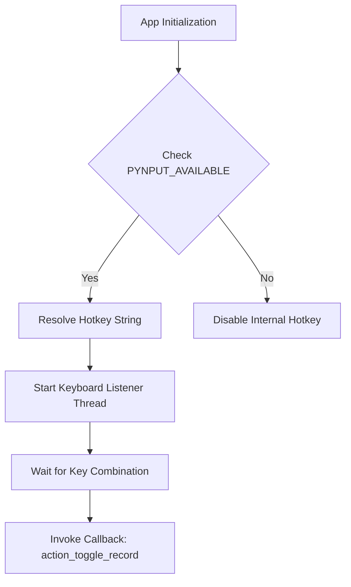
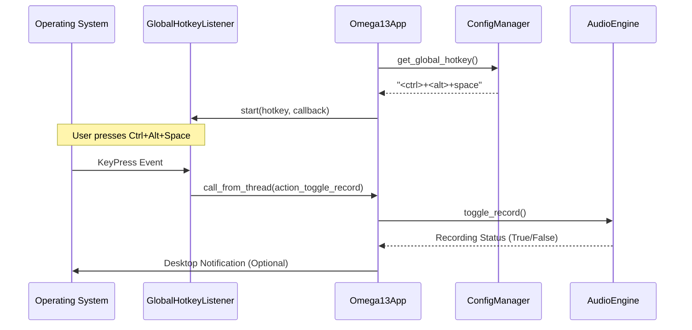

<details>
<summary>Relevant source files</summary>

The following files were used as context for generating this wiki page:
- [src/omega13/config.py](https://github.com/b08x/omega-13/blob/main/src/omega13/config.py)
- [src/omega13/hotkeys.py](https://github.com/b08x/omega-13/blob/main/src/omega13/hotkeys.py)
- [src/omega13/app.py](https://github.com/b08x/omega-13/blob/main/src/omega13/app.py)
- [README.md](https://github.com/b08x/omega-13/blob/main/README.md)
- [CHANGELOG.md](https://github.com/b08x/omega-13/blob/main/CHANGELOG.md)
</details>

# Configuration & Global Hotkeys

## Introduction

The configuration and global hotkey systems in Omega-13 serve as the operational backbone for retroactive audio capture. The `ConfigManager` handles persistent state and user preferences via a JSON-based schema, while the `GlobalHotkeyListener` provides a bridge between the system's input events and the application's recording logic. These components are tightly coupled with the `Omega13App` lifecycle, ensuring that user-defined shortcuts and environmental settings (like JACK/PipeWire ports) are synchronized with the hardware abstraction layer.

## Configuration Management

The `ConfigManager` class handles the serialization and deserialization of application settings stored at `~/.config/omega13/config.json`. It provides a centralized API for accessing audio paths, transcription server URLs, and hotkey strings.

### Key Configuration Schema

The configuration is structured into top-level keys and nested objects for specific services.

| Field | Type | Description | Default Value |
| :--- | :--- | :--- | :--- |
| `version` | Integer | Schema version for migration tracking. | `2` |
| `input_ports` | List[str] | Saved JACK/PipeWire input port names. | `None` |
| `save_path` | String | Permanent directory for saved sessions. | Current Working Directory |
| `global_hotkey` | String | Key combination to trigger recording. | `<ctrl>+<alt>+space` |
| `transcription` | Object | Settings for the Whisper server API. | `{"enabled": True, ...}` |

Sources: [src/omega13/config.py:#L24-L50](https://github.com/b08x/omega-13/blob/main/src/omega13/config.py#L24-L50)

### Operational Logic

The `ConfigManager` performs a shallow merge of defaults during initialization to ensure stability even if the JSON file is partially corrupted or outdated.

```python
# src/omega13/config.py:#L128-L135

if "transcription" not in config:
    config["transcription"] = default_config["transcription"]
if "sessions" not in config:
    config["sessions"] = default_config["sessions"]
if "global_hotkey" not in config:
    config["global_hotkey"] = default_config["global_hotkey"]
```

## Global Hotkey Mechanism

The system utilizes a dual-layered approach to hotkeys: an internal listener for X11/Windows environments and a CLI-based trigger for Wayland environments.

### Internal Listener Architecture

The `GlobalHotkeyListener` uses the `pynput` library to monitor keyboard events. It includes a normalization step to resolve various key aliases (e.g., "enter" to `<enter>`) into a format compatible with `pynput`'s `GlobalHotKeys`.


Sources: [src/omega13/hotkeys.py:#L24-L85](https://github.com/b08x/omega-13/blob/main/src/omega13/hotkeys.py#L24-L85), [src/omega13/app.py:#L145-L155](https://github.com/b08x/omega-13/blob/main/src/omega13/app.py#L145-L155)

### Wayland Support and the PID Mechanism

Because Wayland restricts global key sniffing, the application writes its process ID (PID) to `~/.local/share/omega13/omega13.pid`. This allows an external command, `omega13 --toggle`, to signal the running instance to start or stop recording. This is a functional workaround for the security constraints of modern display protocols.

Sources: [src/omega13/app.py:#L114-L122](https://github.com/b08x/omega-13/blob/main/src/omega13/app.py#L114-L122), [README.md:#L87-L100](https://github.com/b08x/omega-13/blob/main/README.md#L87-L100)

## System Interaction Flow

The following sequence illustrates how a hotkey event propagates from the hardware level through the configuration-defined logic to trigger the audio engine.


Sources: [src/omega13/app.py:#L145-L160](https://github.com/b08x/omega-13/blob/main/src/omega13/app.py#L145-L160), [src/omega13/config.py:#L91-L93](https://github.com/b08x/omega-13/blob/main/src/omega13/config.py#L91-L93)

## Structural Observations

The system exhibits a dependency pattern where the UI help text is dynamically generated based on the configuration. If the hotkey resolution fails in `hotkeys.py`, the UI might still display the raw string, creating a minor visual disconnect if the underlying `pynput` listener fails to initialize. Furthermore, the `ConfigManager` includes a duplicate key entry for `"save_to_file": True` in its default dictionary, which is a harmless but redundant structural artifact.

Sources: [src/omega13/config.py:#L40-L41](https://github.com/b08x/omega-13/blob/main/src/omega13/config.py#L40-L41), [src/omega13/app.py:#L210-L215](https://github.com/b08x/omega-13/blob/main/src/omega13/app.py#L210-L215)

## Conclusion

The configuration and hotkey systems provide the necessary flexibility for Omega-13 to operate across different Linux environments (X11 vs. Wayland). By decoupling the trigger mechanism (via `omega13 --toggle`) from the internal event listener, the architecture ensures that the core retroactive recording functionality remains accessible regardless of display server limitations. The `ConfigManager` acts as the single source of truth, synchronizing the audio engine's port requirements with the user's persistent preferences.