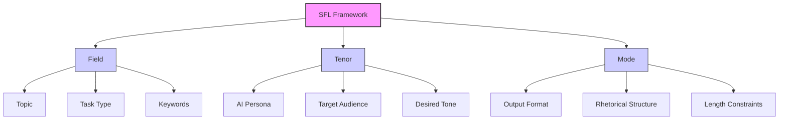
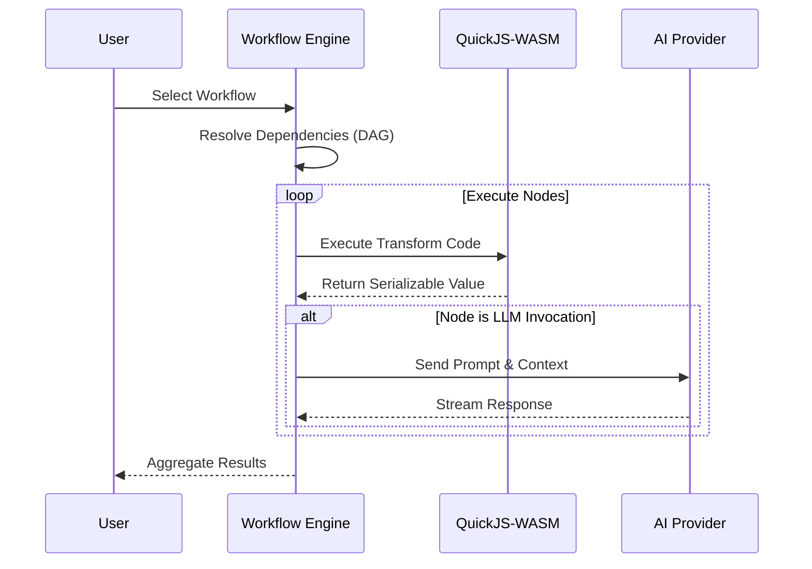

<details>
<summary>Relevant source files</summary>

The following files were used as context for generating this wiki page:
- [README.md](README.md)
- [src/services/sflService.ts](src/services/sflService.ts)
- [src/components/HelpModal.tsx](src/components/HelpModal.tsx)
- [package.json](package.json)
- [src/constants.ts](src/constants.ts)
- [src/utils/exportUtils.ts](src/utils/exportUtils.ts)
- [src/components/Documentation.tsx](src/components/Documentation.tsx)
- [src/components/PromptFormModal.tsx](src/components/PromptFormModal.tsx)
- [CHANGELOG.md](CHANGELOG.md)

</details>

# Introduction to SFL Prompt Studio

## Introduction

The system implements a zero-server Single Page Application (SPA) architecture designed for the structured engineering and management of AI prompts using Systemic Functional Linguistics (SFL). The primary function of this system is to decompose user objectives into linguistic dimensions—Field, Tenor, and Mode—and orchestrate the execution of these prompts across multiple AI providers. The application operates entirely within the client-side browser environment, relying on LocalStorage for persistence and Vite for module resolution. The system lacks a backend infrastructure, meaning all computation, credential management, and state storage occur client-side.

## SFL Framework Architecture

The core logic of the system is grounded in the Systemic Functional Linguistics (SFL) framework, which decomposes prompts into three distinct linguistic dimensions. This decomposition is enforced through schema validation and enforced by the `sflService.ts` layer.

### Field (Ideational Metafunction)

The Field component defines the subject matter of the interaction. It encompasses the domain topology, task taxonomy, and technical context. In the implementation, this maps to properties such as `topic`, `taskType`, `domainSpecifics`, and `keywords` [src/constants.ts#L1-L20].

### Tenor (Interpersonal Metafunction)

The Tenor component defines the interactional stance, specifying the roles and relationships between the AI and the user. This includes the persona adopted by the AI, the target audience, the desired tone, and the interpersonal stance. The system supports multiple target audiences, storing them as an array to allow for flexibility [src/constants.ts#L23-L38].

### Mode (Textual Metafunction)

The Mode component governs the discourse organization and output format. It dictates the rhetorical structure, length constraints, and textual directives applied to the generation process. This component controls how the AI structures its response, such as via JSON format, bullet points, or specific paragraph lengths [src/constants.ts#L41-L55].



## Multi-Provider Integration

The architecture abstracts AI provider interactions behind a unified interface, allowing for model selection across multiple vendors. The system supports Anthropic, Google (Gemini), OpenAI, and Mistral providers. This abstraction is implemented via the Vercel AI SDK, which provides a contract (`IProvider`) for unified model selection and streaming responses [README.md#L1-L50].

The dependency structure explicitly lists provider-specific SDKs:
- `@ai-sdk/anthropic`
- `@ai-sdk/google`
- `@ai-sdk/openai`
- `@ai-sdk/mistral` [package.json#L1-L20]

Provider configuration cascades through a hierarchy: global defaults in Settings, per-prompt overrides, and per-task overrides within workflows [README.md#L1-L50].

## Workflow Engine and Execution

The system implements a visual workflow engine based on dependency graphs. This engine allows for the composition of execution pipelines using nodes representing data ingestion, LLM invocation, and JavaScript transformations.

### Node Types

- **Data Ingestion**: Text, images, or file inputs.
- **LLM Invocation**: Execution of prompts via configured providers.
- **Transform**: JavaScript transformation functions.
- **Visualization**: Outputs rendered via Recharts.

### Execution Environment

Workflow execution relies on a sandboxed runtime environment. Transform nodes execute code within a QuickJS-WASM sandbox. This isolation mechanism prevents arbitrary code execution and Node.js module access, restricting execution to serializable values only [README.md#L1-L50].



## Data Management and Persistence

The system employs a state management approach using Zustand, coupled with LocalStorage for persistence. This architecture ensures that data—specifically prompt libraries and workflow configurations—remains accessible across browser sessions without a server-side database.

### Prompt Lifecycle

Prompts are managed through a structured object model defined in `src/types.ts`. The lifecycle includes creation, versioning, and history tracking. When a prompt is modified, a new version is created, preserving the full SFL metadata and history [README.md#L1-L50].

### Export Functionality

Data portability is achieved through serialization utilities. The `exportUtils.ts` module provides functions to convert prompt objects into Markdown format, including the embedding of source documents and SFL metadata [src/utils/exportUtils.ts#L1-L20].

## Security Model

The system enforces a strict security model predicated on client-side isolation. This model is divided into two distinct layers:

1.  **Credential Layer**: API keys are encrypted using the Web Crypto API and stored exclusively in `localStorage`. No transmission of credentials to a server occurs [README.md#L1-L50].
2.  **Execution Layer**: User-provided code in Transform nodes executes within a QuickJS-WASM sandbox. This environment does not expose Node.js globals or the `eval` function, restricting execution to a controlled subset of JavaScript [README.md#L1-L50].

## Technology Stack

The implementation relies on a specific set of dependencies to achieve the zero-server architecture and complex functionality.

| Category | Technology | Purpose |
| :--- | :--- | :--- |
| **Frontend** | React 19 | UI rendering and component lifecycle |
| **Build Tool** | Vite | Module bundling and development server |
| **State** | Zustand | Client-side state management |
| **Routing** | React Router v6 | Client-side navigation |
| **AI SDK** | Vercel AI SDK | Unified interface for provider abstraction |
| **Workflow** | @xyflow/react | Graph-based node visualization |
| **Sandbox** | quickjs-emscripten | Isolated JavaScript execution |
| **Validation** | Zod | Schema definition and runtime validation |
| **Styling** | Tailwind CSS | Utility-first CSS framework |

## SFL Generation Service

The business logic for prompt generation is centralized in the `sflService.ts` module. This service handles the interaction with AI providers to generate structured SFL decompositions from natural language goals.

### Generation Flow

The `generateSFLFromGoal` function accepts a user goal and an API key. It constructs a system instruction that defines the persona as an expert in SFL and prompt engineering. The function then calls the `geminiProvider.generateJSON` method, passing a schema (`sflPromptSchema`) to enforce the structure of the returned data [src/services/sflService.ts#L1-L50].

```typescript
export const generateSFLFromGoal = async (goal: string, apiKey: string, sourceDocContent?: string): Promise<Omit<PromptSFL, 'id' | 'createdAt' | 'updatedAt'>> => {
    const systemInstruction = `You are an expert in Systemic Functional Linguistics (SFL) and AI prompt engineering. Structure the user's goal into a detailed SFL-based prompt.
    If a source document is provided, analyze its style and incorporate it into the prompt parameters.
    `;

    const jsonData = await geminiProvider.generateJSON<any>(userContent, sflPromptSchema, { systemInstruction, apiKey });
    
    // Normalization
    if (jsonData.sflTenor && typeof jsonData.sflTenor.targetAudience === 'string') {
        jsonData.sflTenor.targetAudience = [jsonData.sflTenor.targetAudience];
    }
    return jsonData;
};
```

## Conclusion

The "Introduction to SFL Prompt Studio" represents the architectural core of the application, establishing the boundaries of client-side computation and the structural decomposition of linguistic input. It functions as the primary interface for defining prompt parameters, managing state, and orchestrating execution across external AI providers. The system's reliance on a zero-server model and a strict security sandbox indicates a design prioritizing data sovereignty and execution isolation over centralized control.