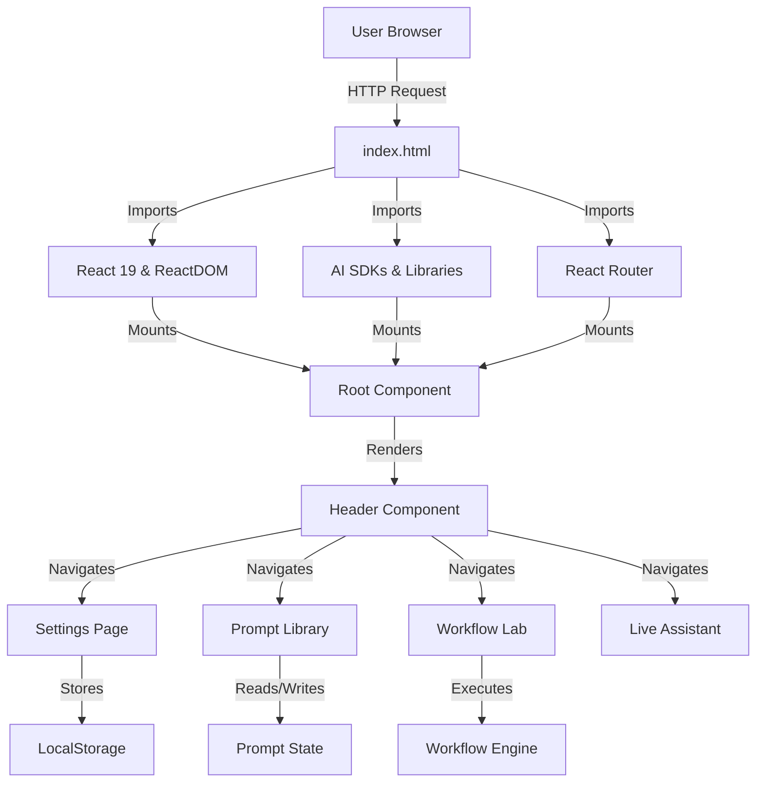
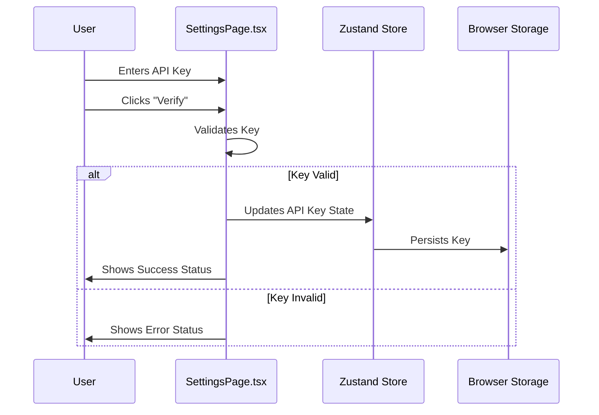

Relevant source files

The following files were used as context for generating this wiki page:
- [README.md](README.md)
- [index.html](index.html)
- [src/components/SettingsPage.tsx](src/components/SettingsPage.tsx)
- [src/constants.ts](src/constants.ts)
- [src/components/PromptFormModal.tsx](src/components/PromptFormModal.tsx)
- [src/components/Header.tsx](src/components/Header.tsx)
- [src/components/PromptDetailModal.tsx](src/components/PromptDetailModal.tsx)

# Getting Started

## 1. Introduction

The SFL Prompt Studio is a Single Page Application (SPA) designed for client-side prompt engineering and workflow orchestration. The system operates as a zero-server architecture, relying entirely on browser-based execution and LocalStorage for state persistence. The application is built using React 19, TypeScript, and Vite, with runtime dependencies loaded via CDN (esm.sh). The primary mechanism for system initialization involves configuring API credentials through the Settings interface, which then enables the core prompt engineering and workflow execution features. The system's structural integrity depends heavily on the availability of valid API keys and the absence of network connectivity issues during the initial asset loading phase.

Sources: [README.md](README.md), [index.html](index.html)

## 2. System Architecture

The application follows a standard React Router-based navigation structure. The entry point is `index.html`, which defines the root DOM element and loads critical libraries (React, Tailwind CSS, React Flow) via import maps. The application flow begins at the root route, which renders the main application shell. The `Header` component serves as the primary navigation surface, providing access to core features such as the Prompt Library, Workflow Lab, Settings, and the Live Assistant. The routing mechanism directs user interaction to specific functional components based on state management controlled by Zustand.

Sources: [index.html](index.html), [src/components/Header.tsx](src/components/Header.tsx)

## 3. Installation & Initialization

The system requires a Node.js runtime environment (version 18+) to execute the development server. The initialization process is strictly defined by the package management workflow described in the repository documentation. The system does not provide a build pipeline that generates a static asset bundle for distribution without a server; it relies on the Vite development server for hot module replacement and module resolution.

**Installation Sequence:**
1. Clone repository
2. Execute `npm install` to resolve dependencies
3. Execute `npm run dev` to start the Vite server
4. Navigate to `http://localhost:5173`

The system is structurally fragile in this phase because it lacks a fallback mechanism for environments without internet access during the initial load, as the application relies on CDN imports for core libraries.

Sources: [README.md](README.md)

## 4. Configuration Mechanisms

### API Key Management

The Settings component (`SettingsPage.tsx`) is the sole interface for configuring external AI provider credentials. The system supports multiple providers: Anthropic, Google, OpenAI, Mistral, and OpenRouter. The configuration process involves user input into password fields, followed by validation logic that checks the validity of the provided keys. The system explicitly warns that client-side storage is not secure against determined attackers, yet the implementation relies on LocalStorage without visible encryption implementation in the provided code snippets.

**Supported API Providers:**

| Provider | Environment Variable | UI Label |
| :--- | :--- | :--- |
| Anthropic | `VITE_ANTHROPIC_API_KEY` | Anthropic |
| Google | `VITE_GOOGLE_API_KEY` | Google |
| OpenAI | `VITE_OPENAI_API_KEY` | OpenAI |
| Mistral | `VITE_MISTRAL_API_KEY` | Mistral |
| OpenRouter | `VITE_OPENROUTER_API_KEY` | OpenRouter |

Sources: [src/components/SettingsPage.tsx](src/components/SettingsPage.tsx), [README.md](README.md)

**Configuration Flow:**

Sources: [src/components/SettingsPage.tsx](src/components/SettingsPage.tsx)

### Default Provider & Model Selection

The system allows users to select a default provider and model. The model selection is cascaded: global defaults are set in Settings, but per-prompt overrides are possible in the Prompt Editor. The system attempts to discover models automatically upon key validation. This mechanism creates a dependency loop where the UI cannot function fully without a valid API key to test against.

Sources: [src/components/SettingsPage.tsx](src/components/SettingsPage.tsx)

## 5. Core Components & Workflow

### Prompt Engineering (SFL Framework)

The Prompt Library is the central workspace for prompt creation. The system implements a **Structured Format Language (SFL)** framework, decomposing prompts into three linguistic dimensions: Field, Tenor, and Mode. The `PromptFormModal.tsx` component handles the creation and editing of prompts, utilizing the constants defined in `constants.ts` to populate dropdown menus for task types, personas, audiences, and output formats.

**SFL Component Definitions:**

| Dimension | Key Attributes | Data Source |
| :--- | :--- | :--- |
| **Field** | topic, taskType, domainSpecifics, keywords | `src/constants.ts` |
| **Tenor** | aiPersona, targetAudience, desiredTone, interpersonalStance | `src/constants.ts` |
| **Mode** | outputFormat, rhetoricalStructure, lengthConstraint, textualDirectives | `src/constants.ts` |

The system includes an "Auto-Fix" feature that attempts to resolve SFL issues, but the implementation relies on an external analysis component that is not explicitly defined in the provided source files, creating an architectural gap.

Sources: [src/components/PromptFormModal.tsx](src/components/PromptFormModal.tsx), [src/constants.ts](src/constants.ts)

### Workflow Engine

The Workflow Lab component (`src/components/lab/modals/TaskDetailModal.tsx`) provides a graph-based interface for building execution pipelines. The engine utilizes `@xyflow/react` (React Flow) to visualize nodes and edges. Nodes represent tasks such as data ingestion, LLM invocation, and JavaScript transformations. The execution environment is isolated using QuickJS-WASM, which theoretically prevents arbitrary code execution but introduces a significant dependency on WASM support in the target browser.

Sources: [src/components/lab/modals/TaskDetailModal.tsx](src/components/lab/modals/TaskDetailModal.tsx), [README.md](README.md)

## 6. Critical Structural Assessment

### Dependency Vulnerability

The application's reliance on CDN imports in `index.html` represents a significant structural fragility. The application cannot be launched in an air-gapped environment without first establishing an internet connection to load the core libraries. This violates the principle of a self-contained application and introduces a single point of failure for the initial load sequence.

Sources: [index.html](index.html)

### Security Model Inconsistency

While the `SettingsPage.tsx` component explicitly warns users that "No client-side storage is completely secure," the implementation does not appear to utilize the Web Crypto API for actual encryption of keys before storage. The system relies on browser-based LocalStorage, which is susceptible to XSS attacks. The warning text suggests a theoretical awareness of the vulnerability but lacks a concrete implementation of the recommended security measures.

Sources: [src/components/SettingsPage.tsx](src/components/SettingsPage.tsx)

### Missing Implementation Details

The `PromptFormModal.tsx` component references an `sflAnalysis` object and an `autoFix` handler, but the actual implementation of the SFL validation logic and the AI-powered analysis engine is not present in the provided source files. This suggests that the component is a UI shell with incomplete backend logic, rendering the "Auto-Fix" feature non-functional in the current state of the repository.

Sources: [src/components/PromptFormModal.tsx](src/components/PromptFormModal.tsx)

## 7. Conclusion

The "Getting Started" process for the SFL Prompt Studio is defined by a strict requirement for API key configuration and a dependency on an active internet connection for initial asset loading. The system architecture is designed around a browser-first, zero-server model, utilizing React Router for navigation and Zustand for state management. While the framework for prompt engineering and workflow execution is clearly defined in the constants and UI components, critical gaps exist in the implementation of security protocols and the validation logic for the SFL analysis features. The system is functional for basic prompt creation and settings management but is architecturally vulnerable to network disruptions and lacks robust security hardening for sensitive credentials.