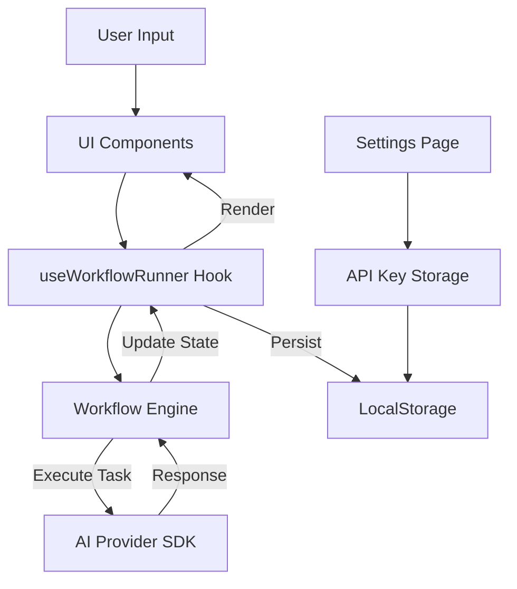
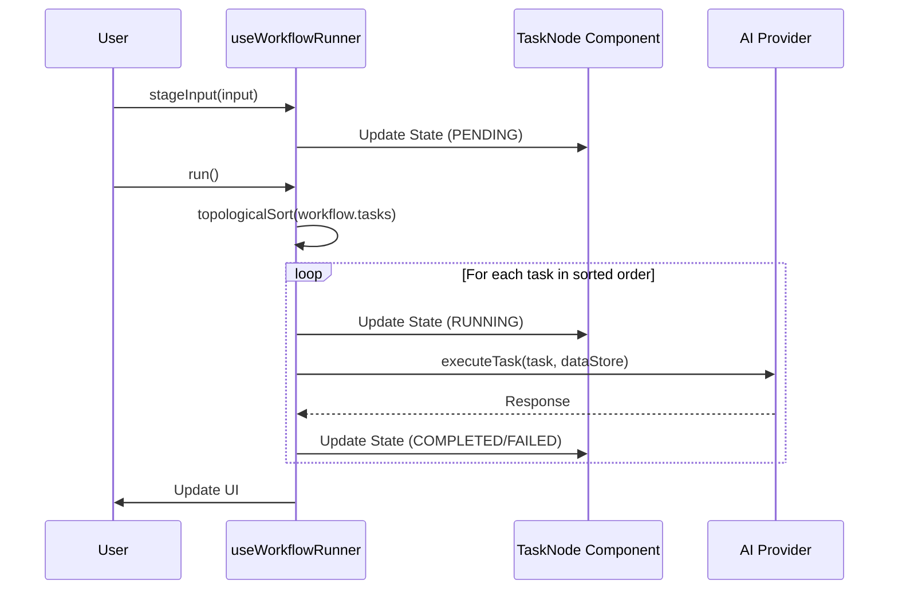

<details>
<summary>Relevant source files</summary>

The following files were used as context for generating this wiki page:
- [src/hooks/useWorkflowRunner.ts](src/hooks/useWorkflowRunner.ts)
- [src/components/lab/modals/WorkflowWizardModal.tsx](src/components/lab/modals/WorkflowWizardModal.tsx)
- [src/components/lab/TaskNode.tsx](src/components/lab/TaskNode.tsx)
- [src/components/SettingsPage.tsx](src/components/SettingsPage.tsx)
- [README.md](README.md)
</details>

# High-Level Architecture

## Introduction

The SFL Prompt Studio operates as a Zero-Server Single Page Application (SPA) where all computational logic, state management, and credential storage occur within the client's browser environment. The architecture is driven by a "Browser-First" principle, eliminating backend dependencies to ensure data privacy and reduce infrastructure overhead. The system integrates a Structured Format Language (SFL) framework for prompt decomposition, a Multi-Provider abstraction layer for AI model access, and a Directed Acyclic Graph (DAG)-based workflow engine for orchestrating complex task pipelines.

The system relies on a monolithic client bundle defined via an import map in `index.html`, which resolves dependencies for React, Vercel AI SDK, and specialized libraries like QuickJS-WASM at runtime. State is managed through a centralized store (Zustand) persisted to `localStorage`, creating a disconnected architecture where the UI, workflow engine, and AI providers interact solely through client-side state mutations and API calls.

## System Boundaries & Dependencies

The architectural boundary is strictly defined by the browser's DOM and the client-side JavaScript runtime. No network requests are made to a backend server for core functionality; all interactions are either local state updates or direct calls to external AI provider APIs.

### Dependency Injection Strategy

The system utilizes an ES Module Import Map to define the entire runtime dependency tree. This approach centralizes version control and eliminates the need for a bundler step for the initial load, although `npm run build` is required for production deployment.

```html
<script type="importmap">
{
  "imports": {
    "react-dom/": "https://esm.sh/react-dom@^19.1.0/",
    "react/": "https://esm.sh/react@^19.1.0/",
    "react": "https://esm.sh/react@^19.1.0",
    "react-router-dom": "https://esm.sh/react-router-dom@^6.22.3",
    "@google/genai": "https://esm.sh/@google/genai@^1.5.1",
    "openai": "https://esm.sh/openai@4.28.0",
    "recharts": "https://esm.sh/recharts@^2.12.7",
    "zustand": "https://esm.sh/zustand@5.0.3",
    "reactflow": "https://esm.sh/reactflow@11.10.4",
    "dagre": "https://esm.sh/dagre@0.8.5",
    "ai": "https://esm.sh/ai@3.4.33",
    "@ai-sdk/google": "https://esm.sh/@ai-sdk/google@0.0.55",
    "@ai-sdk/openai": "https://esm.sh/@ai-sdk/openai@0.0.66",
    "@ai-sdk/mistral": "https://esm.sh/@ai-sdk/mistral@0.0.43",
    "@ai-sdk/anthropic": "https://esm.sh/@ai-sdk/anthropic@0.0.51",
    "zod": "https://esm.sh/zod@3.23.8"
  }
}
</script>
```

### Data Flow Architecture

Data flows through a unidirectional state management pattern. The `useWorkflowRunner` hook acts as the orchestrator, consuming state from the global store (which persists to `localStorage`) and dispatching execution commands to the workflow engine.



## Workflow Execution Architecture

The system implements a DAG-based execution model where tasks are nodes in a graph. The `useWorkflowRunner` hook manages the lifecycle of workflow execution, handling staging, resetting, and the actual running of tasks.

### Orchestration Mechanism

The `run` function in `useWorkflowRunner.ts` is the primary entry point for workflow execution. It relies on `topologicalSort` and `executeTask` functions (referenced but not fully visible in the snippet) to manage task dependencies and execution order.

```typescript
const run = useCallback(async () => {
    if (!workflow) {
        setRunFeedback(['No workflow selected.']);
        return;
    }
    
    // Logic implies sequential execution of sorted tasks
    // ...
}, [workflow]);
```

### Task Visualization & Feedback

The `TaskNode` component renders the visual representation of a task in the workflow graph. It displays input/output keys, execution status (PENDING, COMPLETED, FAILED), and duration. The execution state is derived from `taskStates` managed by the workflow runner.



## Multi-Provider Abstraction

The architecture supports multiple AI providers (Anthropic, Google, OpenAI, Mistral, OpenRouter) through a unified abstraction layer. Configuration is managed via the Settings Page, where users input API keys and select default providers and models.

### Configuration Hierarchy

The system allows for a cascading selection model: Global defaults (Settings) can be overridden at the prompt level and task level. The Settings Page UI exposes inputs for specific provider keys, which are validated before use.

### Provider Integration

The `SettingsPage.tsx` component maps over `AIProvider` enum values to generate the configuration interface. It includes validation logic (`validateProviderKey`) and status indicators (`getStatusIcon`, `getStatusText`) to provide real-time feedback on credential validity.

## SFL Framework Integration

The system integrates Systemic Functional Linguistics (SFL) to decompose prompts into three components: Field (Ideational), Tenor (Interpersonal), and Mode (Textual). This decomposition is visualized in the Prompt Form Modal and analyzed for quality.

### Linguistic Dimensions

The `HelpModal.tsx` defines the algorithmic representation of these dimensions. The Field defines "What is happening," Tenor defines "Who is speaking to whom," and Mode defines "How the text is organized."

```typescript
const DetailBlock: React.FC<{ term: string; definition: string; algo: string }> = ({ term, definition, algo }) => (
    <div>
        <h4 className="font-semibold text-gray-50 text-base">{term}</h4>
        <p className="mb-1">{definition}</p>
        <div className="bg-gray-900 p-3 rounded-md border border-gray-700">
            <p className="font-mono text-xs text-gray-300"><span className="font-semibold text-blue-400">Algorithmic Representation:</span> {algo}</p>
        </div>
    </div>
);
```

## Security Model Analysis

The architecture claims a "Browser-Only Storage" security model, yet the implementation relies on `localStorage` for API keys. This creates a fundamental architectural contradiction.

### Credential Storage Vulnerability

While the `SettingsPage.tsx` warns that "No client-side storage is completely secure against determined attackers," the system persists credentials to `localStorage` without demonstrating a client-side encryption layer in the provided snippets. This makes API keys accessible to any script with access to the DOM (e.g., XSS attacks), rendering the "Zero-Server" architecture vulnerable to credential theft if the browser environment is compromised.

### Sandbox Isolation

The system utilizes QuickJS-WASM for sandboxed execution of user-defined JavaScript functions in the workflow engine. This isolates user code from the main application thread, preventing arbitrary code execution on the main thread, though it does not protect against malicious code exfiltrating data via the AI provider calls.

## Component Responsibilities

| Component | Primary Responsibility | Key Dependencies |
| :--- | :--- | :--- |
| **useWorkflowRunner** | Orchestrates workflow execution, manages state, handles input staging. | `Workflow`, `DataStore`, `TaskStateMap`, `executeTask` |
| **TaskNode** | Visualizes individual tasks in the workflow graph, displays execution status. | `Task`, `TaskStatus`, `TaskStateMap` |
| **WorkflowWizardModal** | Generates workflow graphs from natural language goals. | `generateWorkflowFromGoal`, `Workflow` |
| **SettingsPage** | Manages API keys, provider selection, and global model parameters. | `AIProvider`, `userApiKeys`, `apiKeyValidation` |
| **HelpModal** | Documents the SFL framework (Field, Tenor, Mode). | N/A |

## Conclusion

The High-Level Architecture of SFL Prompt Studio is a tightly coupled client-side application designed for local execution. It successfully decouples the UI from backend services but does so at the cost of security robustness regarding credential storage. The workflow engine provides a flexible DAG-based execution model, while the SFL framework offers a structured approach to prompt engineering. The reliance on `localStorage` for sensitive data represents a critical architectural flaw that contradicts the system's stated security model.