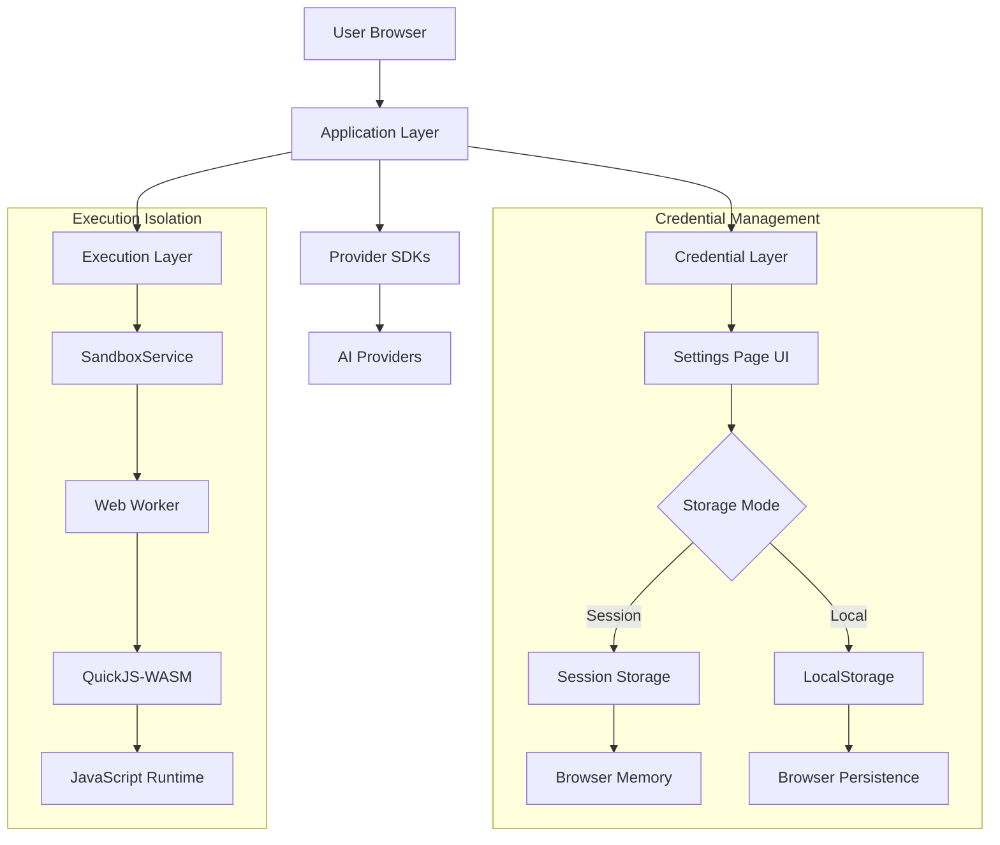

<details>
<summary>Relevant source files</summary>

The following files were used as context for generating this wiki page:
- [src/services/sandboxService.ts](src/services/sandboxService.ts)
- [src/components/SettingsPage.tsx](src/components/SettingsPage.tsx)
- [README.md](README.md)
- [src/utils/exportUtils.ts](src/utils/exportUtils.ts)
- [src/constants.ts](src/constants.ts)
</details>

# Security Model

## Introduction

The Security Model in this system is designed as a **two-tier isolation architecture** operating entirely within the browser environment. The system explicitly adopts a **Zero-Server** philosophy, positioning all computation, storage, and credential management as client-side operations. The model relies on a separation of concerns: a **Credential Layer** responsible for API key persistence and a **Execution Layer** responsible for sandboxed JavaScript runtime. The architecture attempts to mitigate risks associated with client-side execution through Web Workers and WebAssembly (WASM), yet it maintains a fundamental reliance on the integrity of the user's browser environment.

## Architecture Overview

The system's security posture is defined by its architectural constraints: browser-only execution, local storage mechanisms, and isolated runtime environments. The design prioritizes data locality and execution isolation over centralized management.



## Credential Management

### Storage Mechanisms

The system manages sensitive credentials—API keys for providers such as Anthropic, Google, OpenAI, and Mistral—through browser-native storage APIs. The implementation distinguishes between ephemeral and persistent storage strategies.

**Storage Configuration**:
- **Session Storage**: Keys are stored in memory and cleared upon browser session termination.
- **Local Storage**: Keys persist across browser sessions until explicitly cleared or manipulated.

The UI provides a security warning acknowledging the inherent vulnerability of client-side storage:

> "No client-side storage is completely secure against determined attackers. For maximum security, use environment variables or avoid storing keys in the browser." [src/components/SettingsPage.tsx#L1-L10]

### Alternative Configuration

The system supports environment variable configuration as an alternative to browser storage. This approach shifts the responsibility of credential management to the deployment environment rather than the client application itself. Supported variables include:
- `VITE_GOOGLE_API_KEY`
- `VITE_OPENAI_API_KEY`
- `VITE_OPENROUTER_API_KEY`
- `VITE_ANTHROPIC_API_KEY`
- `VITE_MISTRAL_API_KEY` [src/components/SettingsPage.tsx#L1-L10]

### Critical Vulnerability Assessment

The reliance on `localStorage` or `sessionStorage` represents a **fundamental architectural weakness**. The system provides no mechanism to detect or prevent cross-site scripting (XSS) attacks that could exfiltrate these keys. While the UI warns of security risks, the implementation does not employ encryption for stored keys beyond the browser's native storage mechanism, nor does it implement key rotation or access logging. The "Security Mode" selection is purely a UI affordance without corresponding cryptographic enforcement.

## Code Execution Sandbox

### Execution Environment

The Execution Layer utilizes a **Web Worker + QuickJS-WASM** architecture to isolate user-provided JavaScript code from the main application thread. This design prevents UI freezing and attempts to restrict access to browser APIs.

**Worker Lifecycle**:
1. **Initialization**: A Web Worker is instantiated via `new Worker()`.
2. **Message Handling**: The worker processes messages containing execution requests.
3. **Sandboxed Runtime**: QuickJS-WASM executes the provided JavaScript.
4. **Isolation**: The runtime is configured to restrict access to `window`, `document`, and other browser globals.

### Service Implementation

The `sandboxService.ts` manages the worker instance and request queue. It implements a timeout mechanism to prevent indefinite execution.

```typescript
const handleMessage = (event: MessageEvent) => {
  const data = event.data;

  if (data.type === 'ready') {
    isReady = true;
    // Flush queued requests
    queue.forEach((sendFn) => sendFn());
    queue.length = 0;
    return;
  }

  const { id, result, error, success } = data;

  if (!id || !pendingRequests[id]) return;

  const pending = pendingRequests[id];

  // Clear timeout
  clearTimeout(pending.timeoutId);

  // Resolve or reject
  if (success) {
    pending.resolve(result);
  } else {
    pending.reject(new Error(error || 'Unknown execution error'));
  }

  // Clean up
  delete pendingRequests[id];
};
```

### Timeout and Resource Control

The service implements a **timeout-based termination strategy**. Each execution request is assigned a unique ID and a timeout identifier. If execution exceeds the allotted time, the worker is terminated, and the pending request is rejected. This mechanism attempts to mitigate denial-of-service scenarios caused by infinite loops.

**Request Queue**:
The system maintains a queue of pending requests, suggesting that the worker may not be thread-safe or that multiple concurrent executions are not supported. This indicates a **single-threaded bottleneck** in the execution layer, which could limit scalability.

### Critical Vulnerability Assessment

While the use of QuickJS-WASM provides a more secure environment than raw `eval()`, the architecture remains vulnerable to:
1. **Worker Tainting**: If the main thread is compromised, the worker's integrity is not guaranteed.
2. **Memory Exhaustion**: The timeout mechanism relies on `clearTimeout`, which is client-side controlled and can be bypassed by highly privileged scripts.
3. **Module Access**: The system explicitly blocks Node.js modules, but the implementation does not provide a comprehensive list of forbidden APIs, potentially allowing access to unintended browser interfaces.

## Data Flow and Export

### Prompt Data Structure

The system serializes prompts into a structured format (`PromptSFL`) containing fields for Field, Tenor, Mode, and execution metadata. This data structure is utilized for both internal state management and external export.

**Export Mechanism**:
The `exportUtils.ts` provides a Markdown export function that serializes the prompt structure, including source document references. This functionality requires that the source document content be accessible within the client environment.

```typescript
export const promptToMarkdown = (prompt: PromptSFL): string => {
    const { 
        title, updatedAt, promptText, sflField, sflTenor, sflMode, exampleOutput, notes, sourceDocument
    } = prompt;
    // ... serialization logic
};
```

### Workflow Execution Context

The `constants.ts` file defines workflow templates and task configurations. These templates include dependencies and input/output key mappings that define the execution graph. The system does not enforce schema validation on these workflow definitions at runtime, which could lead to execution errors if configuration mismatches occur.

## Critical Structural Analysis

### Contradictions in Design

The system claims a **"Zero-Server" architecture** while simultaneously providing mechanisms for **local persistence** of credentials. This creates a hybrid model where the system is serverless in terms of computation but relies on client-side storage for state management. This architecture shifts the security burden entirely to the client, which is inconsistent with the principle of defense-in-depth.

### Missing Security Controls

The implementation lacks several standard security controls:
1. **No Key Encryption**: Stored API keys are stored in plaintext (or base64-encoded strings) within `localStorage`.
2. **No Audit Logging**: There is no mechanism to track when keys are accessed or used.
3. **No Input Sanitization**: The workflow execution accepts arbitrary JavaScript code without pre-execution validation.
4. **No CSP (Content Security Policy)**: The application does not appear to implement a Content Security Policy to restrict script sources.

### Conclusion

The Security Model is a **client-centric isolation strategy** that relies on browser-native storage and WASM-based execution to mitigate risks. While it addresses execution isolation through Web Workers and QuickJS-WASM, it fails to address credential security adequately. The architecture is fundamentally vulnerable to XSS attacks and relies on the user's browser security posture to protect sensitive data. The implementation is technically functional but architecturally fragile, prioritizing convenience and client-side execution over robust security guarantees.