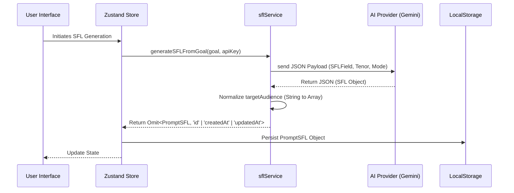
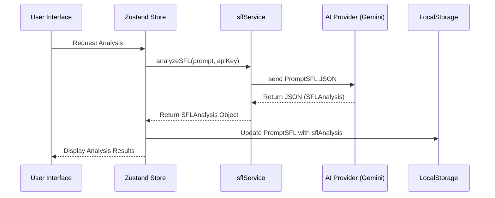

<details>
<summary>Relevant source files</summary>

The following files were used as context for generating this wiki page:
- [src/types.ts](src/types.ts)
- [src/services/sflService.ts](src/services/sflService.ts)
- [src/components/forms/SFLModeSection.tsx](src/components/forms/SFLModeSection.tsx)
- [src/components/Documentation.tsx](src/components/Documentation.tsx)
- [src/components/HelpModal.tsx](src/components/HelpModal.tsx)
- [src/components/lab/PromptRefinementStudio.tsx](src/components/lab/PromptRefinementStudio.tsx)
</details>

# The SFL Framework

The SFL (Systemic Functional Linguistics) Framework is a structural decomposition mechanism implemented within the prompt engineering platform to standardize prompt configuration. It functions as a three-part architectural constraint that isolates the subject matter, interactional stance, and discourse organization of a prompt into distinct data objects. This separation enforces a rigid schema on user input, requiring explicit definition of `SFLField`, `SFLTenor`, and `SFLMode` components before prompt execution.

## Architectural Components

The framework is defined by three primary interfaces: `SFLField`, `SFLTenor`, and `SFLMode`. These interfaces aggregate into a `PromptSFL` object, which serves as the core data structure for prompt storage and processing.

### 1. SFLField (Ideational Metafunction)

The `SFLField` component defines the subject matter and context of the communication. It isolates the "what" of the prompt, separating domain-specific details from the interactional dynamics.

**Data Structure:**
```typescript
export interface SFLField {
  topic: string;
  taskType: string;
  domainSpecifics: string;
  keywords: string; // comma-separated
}
```
*Sources: [src/types.ts#L1-L7]()

**Functional Behavior:**
- The `generateSFLFromGoal` service utilizes this structure to instruct the AI model on the subject matter.
- The `keywords` field is defined as a comma-separated string, implying a lack of native array type support in this specific data model, which requires string parsing at the consuming layer.
*Sources: [src/services/sflService.ts#L60-L80]()

### 2. SFLTenor (Interpersonal Metafunction)

The `SFLTenor` component defines the roles and relationships between the AI and the user. It isolates the "who" and "how" of the interaction.

**Data Structure:**
```typescript
export interface SFLTenor {
  aiPersona: string;
  targetAudience: string[];
  desiredTone: string;
  interpersonalStance: string;
}
```
*Sources: [src/types.ts#L9-L14]()

**Functional Behavior:**
- The `targetAudience` field is typed as an array (`string[]`), creating a structural contradiction with the `keywords` field in `SFLField` (which is a string).
- The `generateSFLFromGoal` function contains a normalization step that converts the `targetAudience` from a string to an array. This indicates a reactive patch to the generation logic to match the storage schema, suggesting a potential design inconsistency between the prompt generation phase and the storage phase.
*Sources: [src/services/sflService.ts#L95-L100]()

### 3. SFLMode (Textual Metafunction)

The `SFLMode` component defines the organization and format of the output. It isolates the "how" the text is structured.

**Data Structure:**
```typescript
export interface SFLMode {
  outputFormat: string;
  rhetoricalStructure: string;
  lengthConstraint: string;
  textualDirectives: string;
}
```
*Sources: [src/types.ts#L16-L21]()

**Functional Behavior:**
- The UI component `SFLModeSection` renders inputs for these fields, including a mechanism to add custom options to the dropdown lists (`outputFormats`, `lengthConstraints`).
- This component enforces a strict mapping between UI inputs and the `SFLMode` object properties, requiring the `onChange` handler to update specific keys individually.
*Sources: [src/components/forms/SFLModeSection.tsx#L1-L30]()

## Analysis Mechanism

The framework includes an analysis layer designed to validate the structural integrity of the SFL prompt components. This layer is implemented via the `analyzeSFL` function.

**Data Structure:**
```typescript
export interface SFLAnalysis {
  score: number;
  assessment: string;
  issues: SFLIssue[];
}
```
*Sources: [src/types.ts#L23-L28]()

**Functional Behavior:**
- The `analyzeSFL` service constructs a system instruction instructing the AI to check for clarity, coherence, and conflicts.
- It utilizes the `analysisSchema` to enforce a JSON response structure containing a score, an assessment text, and an array of issues.
- This analysis is persisted within the `PromptSFL` object (`sflAnalysis` field), allowing the UI to display warnings and suggestions based on the LLM's evaluation.
*Sources: [src/services/sflService.ts#L120-L150]()

## Data Flow and Dependencies

The framework relies on external AI providers (specifically the Gemini provider in the observed code) for the core generation and analysis logic. The system does not perform these operations locally; it merely serializes the SFL structure and delegates to the API.





## Component Interaction

The `PromptRefinementStudio` component demonstrates the interaction between the SFL framework and the UI layer. It handles the modification of `targetAudience` specifically, confirming that this field is treated as a mutable array state.

**Observed Logic:**
- The `handleTargetAudienceChange` function toggles the presence of an audience string in the array.
- This interaction pattern suggests that `targetAudience` is treated as a set of tags rather than a single value, reinforcing the array type requirement established in the `generateSFLFromGoal` normalization step.
*Sources: [src/components/lab/PromptRefinementStudio.tsx#L1-L50]()

## Critical Assessment

The implementation of the SFL Framework exhibits structural rigidity but also reveals architectural inconsistencies.

1.  **Type Inconsistency:** The `keywords` field in `SFLField` is defined as a string, while `targetAudience` in `SFLTenor` is defined as an array. This bifurcation suggests either a historical design divergence or a lack of a unified type system for list-like data. The normalization logic in `generateSFLFromGoal` attempts to reconcile this by converting the string audience to an array, but this fix is localized to the generation service, leaving the storage schema vulnerable to mismatched types if the generation service is bypassed.
2.  **External Dependency:** The framework's core functionality—generating and analyzing the SFL structure—is entirely dependent on the external AI provider. The system lacks a fallback mechanism or a local validation layer that could verify the structural integrity of the SFL components before sending them to the API. This creates a single point of failure where network latency or API errors prevent prompt creation.
3.  **UI-Data Mismatch:** The `SFLModeSection` component allows users to add new constants to the `outputFormats` and `lengthConstraints` lists. However, the `PromptSFL` type definition does not include a mechanism to persist these custom constants globally. This implies that custom modes added by one user will not be available to another user, creating a fragmented configuration state.

## Summary

The SFL Framework serves as a rigid schema enforcer for prompt engineering, decomposing prompts into three linguistic dimensions: Field, Tenor, and Mode. While it provides a structured approach to prompt configuration, the implementation is heavily reliant on external AI services for generation and validation, and it contains type inconsistencies between its components that necessitate reactive normalization logic. The system treats the SFL structure as a transient configuration object that is immediately serialized and sent to an external API, with no local validation layer to ensure data integrity before transmission.