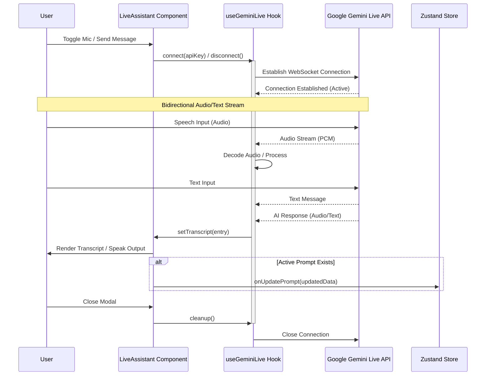
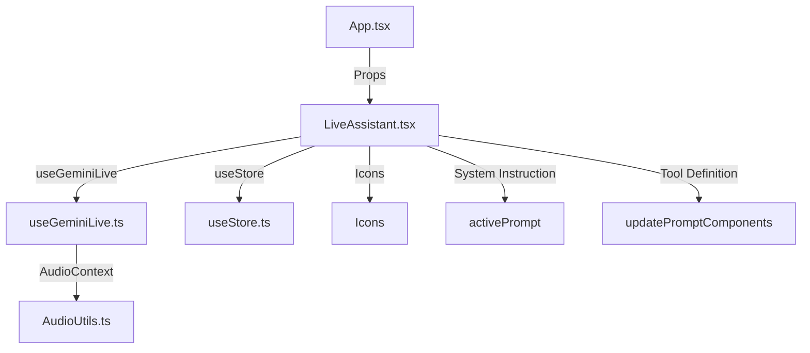

<details>
<summary>Relevant source files</summary>

The following files were used as context for generating this wiki page:
- [src/components/LiveAssistant.tsx](src/components/LiveAssistant.tsx)
- [src/hooks/useGeminiLive.ts](src/hooks/useGeminiLive.ts)
- [src/App.tsx](src/App.tsx)
- [src/components/lab/PromptRefinementStudio.tsx](src/components/lab/PromptRefinementStudio.tsx)
- [README.md](README.md)
- [src/components/SettingsPage.tsx](src/components/SettingsPage.tsx)
- [src/constants.ts](src/constants.ts)
</details>

# Live Assistant

## Introduction

The Live Assistant component implements a bidirectional streaming interface for real-time AI interaction, specifically leveraging the Google Gemini Live API. It functions as a modal overlay within the application's "Lab" tab, primarily activated during "Ideation Mode." The component manages the lifecycle of a conversation session, handling both audio input via browser speech recognition and audio output via synthesis, while maintaining a transcript of the interaction. The system relies on the `useGeminiLive` hook to abstract the WebSocket connection and audio stream management, and it integrates with the application's state management (Zustand) to synchronize prompt data during ideation sessions.

## Architecture and Component Structure

### Component Interface

The `LiveAssistant` component accepts a specific set of props defining its operational context. These props determine whether the assistant functions in a general support role or a specialized ideation role within the prompt refinement workflow.

| Prop | Type | Description |
|------|------|-------------|
| `isOpen` | `boolean` | Controls the visibility of the modal interface. |
| `onClose` | `() => void` | Callback function to terminate the session and hide the modal. |
| `activePage` | `'dashboard' \| 'lab' \| 'documentation' \| 'settings'` | Current application page context. |
| `labTab` | `'workflow' \| 'ideation'` | Specific tab within the Lab section. |
| `activePrompt` | `PromptSFL \| null` | The specific prompt object currently being edited. |
| `onUpdatePrompt` | `(prompt: PromptSFL) => void` | Callback to persist changes to the active prompt. |
| `activeWorkflow` | `Workflow \| null` | The currently selected workflow context. |

**Source:** [src/components/LiveAssistant.tsx#L1-L30]()

### Hook Integration

The component utilizes the `useGeminiLive` custom hook to manage the core communication logic. This hook handles the connection state (`idle`, `connecting`, `active`, `error`), the transcript state, and the audio stream lifecycle. The component passes the user's Google API key to this hook to establish the connection.

**Source:** [src/components/LiveAssistant.tsx#L50-L60]()

### System Instruction Logic

The system instruction provided to the AI is dynamically constructed based on the `activePage` and `labTab` state. In standard support mode, the instruction defaults to a generic customer support persona. In Ideation mode, the system instruction is dynamically generated from the `activePrompt` object, extracting the `sflField`, `sflTenor`, and `sflMode` components to provide context-aware assistance.

**Source:** [src/components/LiveAssistant.tsx#L70-L90]()

## Data Flow and State Management

### Transcript Management

The component maintains a list of transcript entries, each containing a `speaker` identifier ('user' or 'system') and text content. The UI iterates over this list to render messages. System messages are displayed with a distinct visual style (fuchsia text, centered, italicized).

**Source:** [src/components/LiveAssistant.tsx#L120-L140]()

### Audio Context Management

The `useGeminiLive` hook manages multiple `AudioContext` instances and `MediaStream` objects to handle input (microphone) and output (speaker) audio. It uses `ScriptProcessorNode` for audio processing and maintains refs to these nodes to facilitate cleanup when the session ends.

**Source:** [src/hooks/useGeminiLive.ts#L30-L50]()

### State Synchronization (Closure Issue)

The component implements a specific workaround for a React closure issue involving the `activePrompt` object. A `useRef` is used to maintain a reference to the current `activePrompt`, which is updated via a `useEffect` on every render. This pattern is employed because the Live API callbacks form a closure when the connection starts, and without this ref, the handler would capture the stale state of `activePrompt` from the moment the connection opened, leading to data corruption or reverting to old states.

**Source:** [src/components/LiveAssistant.tsx#L60-L70]()

## Tools and Functionality

### Function Declaration

The component defines a `FunctionDeclaration` for a tool named `updatePromptComponents`. This tool is designed to update specific SFL (Structured Format Language) components (`sflField`, `sflTenor`, `sflMode`) and the `promptText`. The tool's schema defines the properties for each component, allowing the AI to modify the prompt structure programmatically.

```typescript
const updatePromptComponentsFunctionDeclaration: FunctionDeclaration = {
    name: 'updatePromptComponents',
    description: "Updates one or more components of the SFL prompt (sflField, sflTenor, or sflMode) and the promptText. Only include fields that need changing.",
    parameters: {
      type: Type.OBJECT,
      properties: {
        sflField: {
          type: Type.OBJECT,
          description: "Updates to the 'Field' component (the subject matter).",
          properties: {
            topic: { type: Type.STRING },
            taskType: { type: Type.STRING },
            domainSpecifics: { type: Type.STRING },
            keywords: { type: Type.STRING },
          },
        },
        // ... sflTenor and sflMode properties
      },
    },
};
```

**Source:** [src/components/LiveAssistant.tsx#L150-L200]()

## Mermaid Diagrams

### Sequence Diagram: Session Lifecycle

This diagram illustrates the interaction flow between the User, the Live Assistant Component, the useGeminiLive Hook, and the Google API.



**Source:** [src/components/LiveAssistant.tsx#L50-L150]()

### Component Dependency Graph



**Source:** [src/components/LiveAssistant.tsx#L1-L50]()

## Critical Analysis

### Structural Deficiencies

1.  **Hardcoded Model String**: The Live Assistant utilizes a hardcoded model identifier `'gemini-2.5-flash-native-audio-preview-09-2025'`. This creates a tight coupling to a specific version of the Google API. If the model is deprecated or requires a different endpoint configuration, the component requires code modification rather than configuration.

    **Source:** [src/components/LiveAssistant.tsx#L1-L5]()

2.  **Stale State Management (Closure Bug)**: The implementation includes a defensive `useRef` pattern to mitigate a closure bug where event handlers capture stale state. This indicates a fundamental flaw in how the component manages state updates during asynchronous operations (the Live API connection). The need for this workaround suggests the component architecture does not cleanly separate the UI event handlers from the external API callbacks.

    **Source:** [src/components/LiveAssistant.tsx#L60-L70]()

3.  **Incomplete Tool Invocation**: While the `updatePromptComponents` function declaration is fully defined with a schema, the source snippets do not reveal the implementation of the handler that actually calls this tool. The `useGeminiLive` hook manages the connection, but the specific logic to parse tool calls and execute the `onUpdatePrompt` callback is not visible in the provided context, creating a gap in the implementation verification.

    **Source:** [src/components/LiveAssistant.tsx#L150-L200]()

4.  **Provider Abstraction Violation**: The system architecture abstracts AI providers (Anthropic, OpenAI, etc.) through the `IProvider` contract. However, the Live Assistant is explicitly tied to Google (`@google/genai`). This violates the stated architectural principle of "Provider Abstraction" and limits the component's reusability across the platform.

    **Source:** [src/components/LiveAssistant.tsx#L1-L5](), [README.md#Architecture]()

5.  **Error Handling Visibility**: The component displays a generic error message when an API key is missing. While functional, there is no granular error handling for specific connection failures, audio permission denials, or network timeouts within the UI state management.

    **Source:** [src/components/LiveAssistant.tsx#L120-L125]()

## Conclusion

The Live Assistant represents a specialized, tightly coupled module within the SFL Prompt Studio. It successfully implements the bidirectional streaming requirements of the Gemini Live API, providing a mechanism for real-time prompt refinement. However, the architecture exhibits significant rigidity through the hardcoded model string and the lack of provider abstraction. Furthermore, the reliance on a `useRef` workaround for state management indicates a deeper architectural inconsistency regarding how asynchronous external data sources interact with React component state. The component serves a specific workflow purpose (Ideation Mode) but does not adhere to the broader system's design principles regarding extensibility and abstraction.