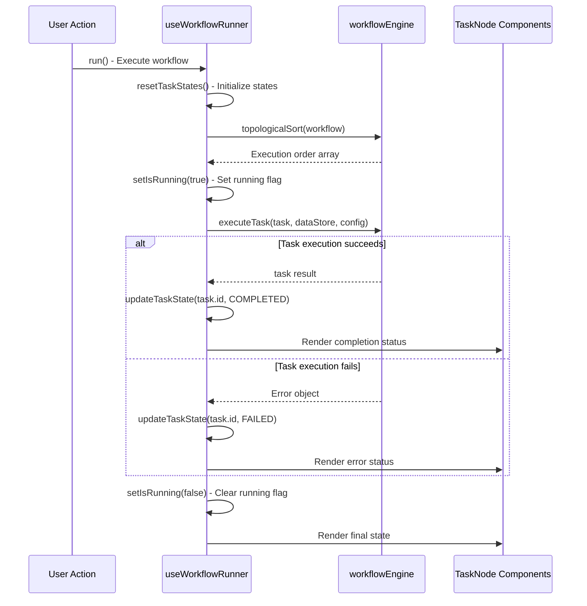
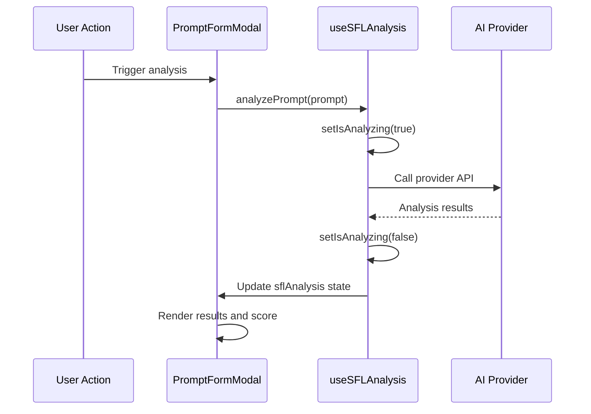
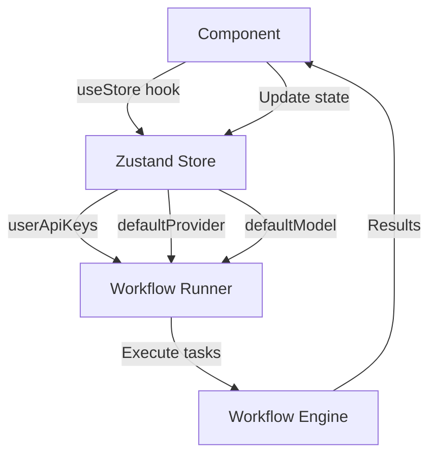
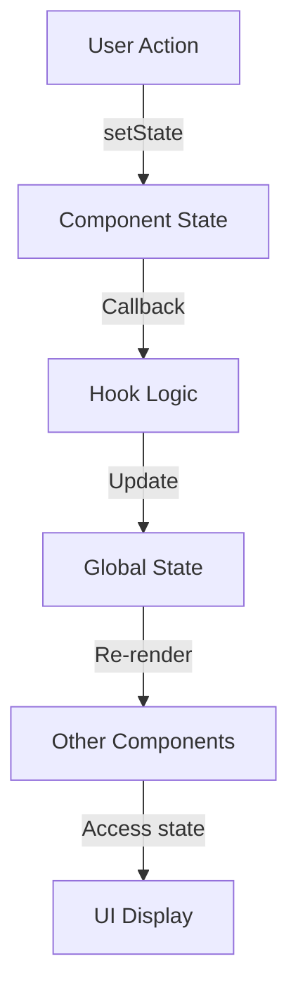

<details>
<summary>Relevant source files</summary>

The following files were used as context for generating this wiki page:

- [src/hooks/useWorkflowRunner.ts](src/hooks/useWorkflowRunner.ts)
- [src/components/lab/TaskNode.tsx](src/components/lab/TaskNode.tsx)
- [src/components/lab/modals/TaskDetailModal.tsx](src/components/lab/modals/TaskDetailModal.tsx)
- [src/components/SettingsPage.tsx](src/components/SettingsPage.tsx)
- [src/components/PromptFormModal.tsx](src/components/PromptFormModal.tsx)
- [src/components/PromptDetailModal.tsx](src/components/PromptDetailModal.tsx)
- [index.html](index.html)
- [README.md](README.md)

</details>

# State Management

## Introduction

State management in this system operates through a multi-layered architecture comprising global persistence via Zustand, component-level React hooks, and localized state within individual components. The system maintains state across three primary domains: workflow execution (dataStore, taskStates, isRunning, runFeedback), user configuration (userApiKeys, defaultProvider, defaultModel), and prompt engineering (prompt variables, SFL analysis results). State transitions are triggered through explicit callback functions and React state setters, with persistence mechanisms selectively applied to sensitive credentials and user preferences. The architecture exhibits a decoupled design where global state is accessed via composition hooks, while component-specific state remains encapsulated within respective components and their associated hooks.

## Architecture Overview

### State Domains and Responsibilities

The system partitions state into distinct domains with clear separation of concerns:

**Workflow State** (useWorkflowRunner.ts):

- `dataStore`: Immutable data store containing workflow inputs and outputs
- `taskStates`: Map tracking execution status for each task (PENDING, COMPLETED, FAILED)
- `isRunning`: Boolean flag indicating active workflow execution
- `runFeedback`: Array of string messages providing execution feedback

**User Configuration State** (SettingsPage.tsx):

- `userApiKeys`: Object mapping AI providers to their respective API key values
- `defaultProvider`: Enum value representing the default AI provider (Anthropic, Google, OpenAI, Mistral, OpenRouter)
- `defaultModel`: String value representing the default model identifier
- `apiKeyValidation`: Object tracking validation status for each provider key

**Prompt Engineering State** (PromptFormModal.tsx, PromptDetailModal.tsx):

- `sflAnalysis`: Object containing prompt analysis results with score, assessment, and issues array
- `promptVariables`: Object mapping variable names to their input values
- `isAnalyzing`: Boolean flag indicating active SFL analysis in progress
- `isFixing`: Boolean flag indicating active auto-fix operation

### State Initialization Patterns

State initialization follows two primary patterns: reactive initialization via React useState hooks and explicit initialization via callback functions.

```typescript
// Reactive initialization
const [dataStore, setDataStore] = useState<DataStore>({});
const [taskStates, setTaskStates] = useState<TaskStateMap>({});
const [isRunning, setIsRunning] = useState(false);
const [runFeedback, setRunFeedback] = useState<string[]>([]);

// Explicit initialization via callback
const resetTaskStates = useCallback(() => {
    if (!workflow) {
        setTaskStates({});
        return;
    }
    const initialStates: TaskStateMap = {};
    for (const task of workflow.tasks) {
        initialStates[task.id] = { status: TaskStatus.PENDING };
    }
    setTaskStates(initialStates);
    setRunFeedback([]);
}, [workflow]);
```

## State Flow and Transitions

### Workflow Execution State Machine

The workflow execution state follows a linear progression with error handling at each stage:



### Prompt Analysis State Flow

SFL analysis state transitions occur through a three-stage process:



## Component State Encapsulation

### Task Node State Management

TaskNode components maintain localized state for rendering execution status and displaying results:

```typescript
// Task status display logic
{state.status === TaskStatus.FAILED && state.error && (
    <div className="mt-2 pt-2 border-t border-gray-700 text-xs">
        <p className="font-medium text-red-300">Error:</p>
        <p className="text-red-400 break-words h-6 overflow-hidden" title={state.error}>{state.error}</p>
    </div>
)}

{state.status === TaskStatus.COMPLETED && (
    <div className="mt-2 pt-2 border-t border-gray-700 text-xs">
        <p className="font-medium text-teal-300">Result:</p>
        <p className="text-gray-200 break-words h-6 overflow-hidden">{getResultSummary()}</p>
    </div>
)}
```

### Prompt Variable State Management

PromptDetailModal manages variable state through reactive input handling:

```typescript
{variables.map((varName) => (
    <div key={varName}>
        <label htmlFor={`var-$varName`} className="block text-sm font-medium text-gray-300 mb-1">{`{{$varName}}`}</label>
        <textarea
            id={`var-$varName`}
            value={variableValues[varName] || ''}
            onChange={(e) => handleVariableChange(varName, e.target.value)}
            placeholder={`Enter value for $varName...`}
            rows={2}
            className="w-full px-3 py-2 bg-gray-800 border border-gray-600 rounded-md shadow-sm focus:outline-none focus:ring-2 focus:ring-blue-500 text-gray-50"
        />
    </div>
))}
```

## State Persistence and Security

### API Key Storage Mechanism

API keys are stored in browser-local storage with explicit security considerations:

```typescript
// Storage mode selection
<div className="space-y-3">
    <label className="flex items-start space-x-3 cursor-pointer p-3 bg-gray-800/50 rounded-lg hover:bg-gray-800 transition-colors border border-gray-700">
        <input
            type="radio"
            name="storageMode"
            value="session"
        />
        <span className="text-gray-300">Session Only (cleared on browser close)</span>
    </label>
    <label className="flex items-start space-x-3 cursor-pointer p-3 bg-gray-800/50 rounded-lg hover:bg-gray-800 transition-colors border border-gray-700">
        <input
            type="radio"
            name="storageMode"
            value="persistent"
        />
        <span className="text-gray-300">Persistent (localStorage)</span>
    </label>
</div>
```

### Validation State Tracking

Provider API keys maintain validation state throughout their lifecycle:

```typescript
// Validation status tracking
{Object.values(AIProvider).map((provider) => (
    <div key={provider} className="bg-gray-900 rounded-lg p-4 border border-gray-700">
        <div className="flex items-center justify-between mb-3">
            <label className="text-gray-200 font-medium">
                {providerDisplayNames[provider]}
            </label>
            {getStatusIcon(apiKeyValidation[provider])}
        </div>
        
        <button
            onClick={() => validateProviderKey(provider)}
            disabled={!userApiKeys[provider] || apiKeyValidation[provider] === 'checking'}
            className="px-4 py-2 bg-blue-600 text-white rounded-lg hover:bg-blue-700 disabled:bg-gray-600 disabled:cursor-not-allowed transition-colors font-medium"
        >
            Verify
        </button>
    </div>
))}
```

## State Dependencies and Interactions

### Workflow-Settings State Coupling

Workflow execution depends on user configuration state through the useStore:

```typescript
// Workflow runner dependency on global store
export const useWorkflowRunner = (workflow: Workflow | null, prompts: PromptSFL[]) => {
    const { userApiKeys, defaultProvider, defaultModel } = useStore();
    const [dataStore, setDataStore] = useState<DataStore>({});
    const [taskStates, setTaskStates] = useState<TaskStateMap>({});
    const [isRunning, setIsRunning] = useState(false);
    const [runFeedback, setRunFeedback] = useState<string[]>([]);
    
    const run = useCallback(async () => {
        if (!workflow) {
            setRunFeedback(['No workflow selected.']);
            return;
        }
        // Execution uses userApiKeys, defaultProvider, defaultModel from store
    }, [workflow]);
};
```

### SFL Analysis State Dependencies

Prompt analysis state depends on prompt structure and user configuration:

```typescript
// Analysis triggers based on prompt state
{prompt.isTesting && (
    <div className="my-4 p-4 border border-blue-500/50 rounded-md bg-blue-500/10 flex items-center justify-center">
        <div className="spinner"></div>
        <p className="ml-3 text-blue-300">Testing with Gemini...</p>
    </div>
)}

{viewedVersion === 'latest' && prompt.geminiResponse && (
    <div className="my-4">
        <h3 className="text-md font-semibold text-teal-300 mb-2">Gemini Response:</h3>
        <pre className="bg-teal-500/10 p-4 rounded-md text-sm text-teal-200 whitespace-pre-wrap break-all border border-teal-500/50">{prompt.geminiResponse}</pre>
    </div>
)}
```

## State Reset and Cleanup Patterns

### Workflow State Reset

Workflow state is reset through a two-step process: clearing task states and resetting the data store:

```typescript
const reset = useCallback(() => {
    resetTaskStates();
    setDataStore({});
    setIsRunning(false);
}, [resetTaskStates]);

const stageInput = useCallback((input: StagedUserInput) => {
    resetTaskStates();
    setDataStore({ userInput: input });
}, [resetTaskStates]);
```

### Prompt State Reset

Prompt state is reset during input staging to ensure clean execution environment:

```typescript
const stageInput = useCallback((input: StagedUserInput) => {
    resetTaskStates();
    setDataStore({ userInput: input });
}, [resetTaskStates]);
```

## State Error Handling

### Execution Error State

Task execution errors are captured and displayed in dedicated error state containers:

```typescript
{state.status === TaskStatus.FAILED && state.error && (
    <div className="mt-2 pt-2 border-t border-gray-700 text-xs">
        <p className="font-medium text-red-300">Error:</p>
        <p className="text-red-400 break-words h-6 overflow-hidden" title={state.error}>{state.error}</p>
    </div>
)}
```

### Validation Error State

API key validation errors are displayed with contextual information:

```typescript
{apiKeyValidation[provider] === 'invalid' && (
    <div className="mt-2 text-xs text-red-400">
        Invalid API key format
    </div>
)}
```

## Data Flow Diagrams

### Global State Access Pattern



### State Update Propagation



## Component State Responsibilities

| Component | State Domain | Primary State | Secondary State | Persistence |
|-----------|--------------|---------------|-----------------|-------------|
| TaskNode | Workflow | taskStates, state | duration, error | None |
| useWorkflowRunner | Workflow | dataStore, taskStates, isRunning, runFeedback | - | None |
| TaskDetailModal | Workflow | taskState, task | - | None |
| SettingsPage | Configuration | userApiKeys, defaultProvider, defaultModel, apiKeyValidation | storageMode | localStorage |
| PromptFormModal | Prompt | sflAnalysis, promptVariables, isAnalyzing, isFixing | - | None |
| PromptDetailModal | Prompt | viewedVersion, prompt, variableValues | - | None |

## Structural Analysis

### State Management Deficiencies

The current state management architecture exhibits several structural limitations:

1. **Global State Coupling**: The useWorkflowRunner hook directly accesses global store state (userApiKeys, defaultProvider, defaultModel) without encapsulation, creating tight coupling between workflow execution logic and user configuration state.

2. **State Reset Inconsistency**: The resetTaskStates callback function only resets task states when a workflow is present, creating conditional behavior that may lead to unexpected state retention when workflows are dynamically removed or nullified.

3. **Error State Propagation**: Error states are maintained in multiple locations (taskStates map, individual component state, runFeedback array) without a unified error handling strategy, potentially leading to inconsistent error reporting across the UI.

4. **Validation State Isolation**: API key validation state exists in isolation within the SettingsPage component without cross-component validation state sharing, requiring redundant validation checks when workflows attempt to execute with unvalidated credentials.

5. **State Initialization Blindness**: State initialization patterns vary across components (reactive useState vs. explicit callback functions), creating inconsistent initialization behavior that may lead to race conditions during rapid state updates.

6. **Memory Leak Risk**: The useWorkflowRunner hook maintains multiple state variables (dataStore, taskStates, isRunning, runFeedback) without explicit cleanup mechanisms when the workflow prop changes or the component unmounts, potentially leading to memory leaks in long-running sessions.

### State Management Recommendations

1. **Encapsulate Store Access**: Create a dedicated workflow configuration hook that abstracts store access and provides a clean interface for workflow execution logic.

2. **Unified Error Handling**: Implement a centralized error handling service that aggregates errors from multiple sources and provides consistent error state management across the application.

3. **State Lifecycle Management**: Add explicit cleanup functions to all custom hooks that manage component lifecycle events (unmount, prop changes) to prevent memory leaks.

4. **Validation State Sharing**: Create a shared validation service that maintains validation state across components and provides validation status checks for workflow execution.

5. **Standardized Initialization**: Establish a consistent state initialization pattern across all components and hooks to reduce initialization variability and potential race conditions.

6. **State Separation**: Separate read-only configuration state from mutable execution state to reduce coupling and improve state management clarity.

## Conclusion

State management in this system operates through a distributed architecture where global state (Zustand store) provides configuration data, custom hooks manage workflow execution state, and component-level state handles UI-specific data. The system exhibits a decoupled design pattern where components access global state through composition hooks, while maintaining localized state for UI-specific interactions. However, the architecture demonstrates several structural deficiencies including inconsistent state initialization patterns, tight coupling between workflow execution and user configuration, and lack of unified error handling across state domains. The state management approach prioritizes immediate functionality over long-term maintainability, with state reset mechanisms and cleanup logic showing incomplete implementation.
