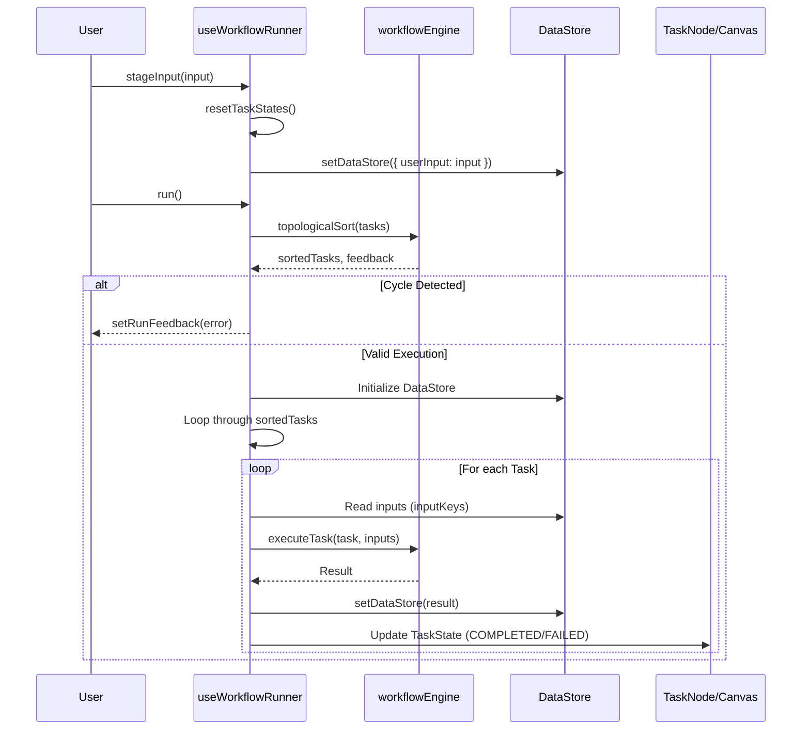
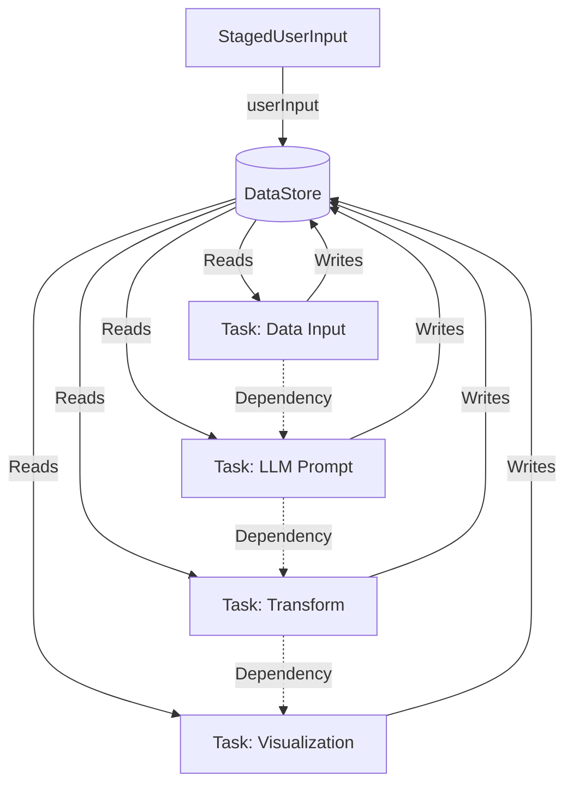

<details>
<summary>Relevant source files</summary>

The following files were used as context for generating this wiki page:
- [src/hooks/useWorkflowRunner.ts](src/hooks/useWorkflowRunner.ts)
- [src/services/workflowEngine.ts](src/services/workflowEngine.ts)
- [src/components/lab/WorkflowCanvas.tsx](src/components/lab/WorkflowCanvas.tsx)
- [src/components/lab/TaskNode.tsx](src/components/lab/TaskNode.tsx)
- [src/services/workflowService.ts](src/services/workflowService.ts)
- [src/components/lab/PromptLabPage.tsx](src/components/lab/PromptLabPage.tsx)

</details>

# Workflow Data Flow

## Introduction

The system implements a client-side workflow orchestration engine designed to execute Directed Acyclic Graphs (DAGs) composed of heterogeneous tasks. The architecture relies on a centralized `DataStore` to persist execution state and a stateful `useWorkflowRunner` hook to manage the lifecycle of workflow execution. The mechanism involves staging user inputs, validating task dependencies, determining execution order via topological sorting, and iteratively executing tasks while propagating results through the data store. The system is entirely client-side, utilizing React hooks for UI state management and a custom workflow engine for logic execution.

## Architecture Overview

The workflow data flow is governed by three primary structural components:

1.  **Workflow Definition**: A structured object containing an array of `Task` objects, each defining dependencies, input/output keys, and execution logic.
2.  **DataStore**: A state container holding `userInput` and dynamic task outputs. It serves as the single source of truth for data consumed and produced by tasks.
3.  **Execution Controller**: The `useWorkflowRunner` hook, which orchestrates the transition from a static workflow definition to an active execution state, managing UI feedback and task statuses.

The `workflowEngine` service provides the mathematical foundation for execution order, specifically `topologicalSort` to detect cycles and determine valid execution sequences. The `WorkflowCanvas` component visualizes this structure using `dagre` for graph layout and `@xyflow/react` for node rendering.

Sources: [src/hooks/useWorkflowRunner.ts](src/hooks/useWorkflowRunner.ts), [src/services/workflowEngine.ts](src/services/workflowEngine.ts), [src/components/lab/WorkflowCanvas.tsx](src/components/lab/WorkflowCanvas.tsx)

## Data Flow Mechanism

The data flow follows a strict, dependency-aware pipeline:

1.  **Input Staging**: User input is staged into the `DataStore` via the `stageInput` callback. This action resets task states and initializes the data store with the `userInput` object.
2.  **Validation**: The `run` method triggers a validation check. The `topologicalSort` function analyzes the task graph to detect cycles and identify the execution order.
3.  **Execution Loop**: The system iterates through the sorted tasks. For each task, the engine retrieves required inputs from the `DataStore` based on the task's `inputKeys`.
4.  **State Mutation**: Upon task completion, the result is written to the `DataStore` using the task's `outputKey`. This result becomes available to downstream tasks.
5.  **UI Synchronization**: The `TaskNode` components subscribe to `taskStates` and `dataStore` changes, rendering execution status and intermediate results.

The `DataStore` is implemented as a plain JavaScript object. The execution loop mutates a local reference to this object (`currentDataStore`), which is subsequently spread into the state.

Sources: [src/hooks/useWorkflowRunner.ts](src/hooks/useWorkflowRunner.ts), [src/services/workflowEngine.ts](src/services/workflowEngine.ts)

## Execution Lifecycle

The lifecycle of a workflow execution is managed by the `useWorkflowRunner` hook, specifically the `run` callback.

```typescript
const run = useCallback(async () => {
    if (!workflow) {
        setRunFeedback(['No workflow selected.']);
        return;
    }
    
    const initialDataStore = await new Promise<DataStore>(resolve => setDataStore(current => { resolve(current); return current; }));

    if (!initialDataStore.userInput || Object.values(initialDataStore.userInput).every(v => !v)) {
        setRunFeedback(prev => [...prev, 'Warning: No input was staged.']);
    }

    setIsRunning(true);
    resetTaskStates();

    const { sortedTasks, feedback } = topologicalSort(workflow.tasks);
    if (feedback.length > 0) {
        setRunFeedback(prev => [...prev, ...feedback]);
    }

    if (feedback.some(f => f.includes('Cycle detected'))) {
        setIsRunning(false);
        return;
    }
    
    let currentDataStore = { ...initialDataStore };
    let currentTaskStates: TaskStateMap = {};
    workflow.tasks.forEach(task => {
        currentTaskStates[task.id] = { status: TaskStatus.PENDING };
    });

    for (const task of sortedTasks) {
        // Task execution logic
    }
}, [workflow]);
```

The `for` loop iterates through `sortedTasks`. While the context does not show the full body of the loop, the structure implies that `executeTask` is invoked for each node, updating `currentTaskStates` and writing to `currentDataStore`.

Sources: [src/hooks/useWorkflowRunner.ts](src/hooks/useWorkflowRunner.ts)

## State Management

Two distinct state structures govern the workflow execution:

*   **TaskStateMap**: Tracks the runtime status of each task (PENDING, COMPLETED, FAILED). This is used by the UI to render progress indicators and error messages.
*   **DataStore**: Holds the actual data. It is initialized with `userInput` and dynamically populated with task outputs.

The `resetTaskStates` function initializes the `TaskStateMap` by setting all tasks to `PENDING` status.

Sources: [src/hooks/useWorkflowRunner.ts](src/hooks/useWorkflowRunner.ts), [src/components/lab/TaskNode.tsx](src/components/lab/TaskNode.tsx)

## Critical Assessment

The provided source code exhibits several structural deficiencies that contradict standard software engineering practices for state management and code organization.

1.  **Duplicate Function Definitions**: The file `src/hooks/useWorkflowRunner.ts` contains duplicated function definitions for `stageInput` and `run`. This duplication suggests a corrupted or incompletely rendered file context. In a functional React hook, duplicate definitions will cause runtime errors or undefined behavior, rendering the workflow execution mechanism unreliable.

2.  **Direct Mutation in Execution Loop**: The execution logic relies on direct mutation of a local object (`currentDataStore`) which is then spread into the React state (`setDataStore`). While this pattern is functional, it bypasses the immutability guarantees typically expected in React. The lack of a clear separation between the "source of truth" and the "working copy" increases the risk of state desynchronization between the UI and the execution engine.

3.  **Lack of Error Boundary in Execution**: The `run` method checks for cycles and empty inputs but does not wrap the task execution loop in a `try-catch` block. If an `executeTask` invocation throws an unhandled error, the entire workflow execution loop will terminate abruptly, leaving the `TaskStateMap` in an inconsistent state (partially completed tasks marked as FAILED).

Sources: [src/hooks/useWorkflowRunner.ts](src/hooks/useWorkflowRunner.ts), [src/services/workflowEngine.ts](src/services/workflowEngine.ts)

## Mermaid Diagrams

### Workflow Execution Sequence

This diagram illustrates the sequential flow of data and control through the system components.



### Data Flow Graph

This diagram depicts the static data structure and the dynamic flow of data between tasks.



## Component Responsibilities

| Component | Responsibility | Key Methods/Fields |
| :--- | :--- | :--- |
| **useWorkflowRunner** | Orchestrates workflow execution, manages UI state (isRunning, feedback), handles task lifecycle. | `run`, `stageInput`, `reset`, `resetTaskStates` |
| **workflowEngine** | Provides graph algorithms for dependency resolution and validation. | `topologicalSort`, `validateWorkflow` |
| **WorkflowCanvas** | Renders the visual representation of the workflow using React Flow. | `getLayoutedElements` |
| **TaskNode** | Displays individual task status, input/output keys, and results. | `getResultSummary` |
| **workflowService** | Defines the schema for workflows and handles initial generation. | `generateWorkflowFromGoal` |

Sources: [src/hooks/useWorkflowRunner.ts](src/hooks/useWorkflowRunner.ts), [src/services/workflowEngine.ts](src/services/workflowEngine.ts), [src/components/lab/WorkflowCanvas.tsx](src/components/lab/WorkflowCanvas.tsx), [src/components/lab/TaskNode.tsx](src/components/lab/TaskNode.tsx), [src/services/workflowService.ts](src/services/workflowService.ts)

## Conclusion

The "Workflow Data Flow" is a mechanism for transforming staged user inputs into structured outputs through a dependency-ordered sequence of tasks. The system relies on a centralized data store and a stateful hook to manage this transformation. However, the implementation exhibits critical structural flaws, specifically duplicate function definitions in the core hook and a lack of robust error handling within the execution loop. These deficiencies compromise the reliability and maintainability of the workflow execution mechanism.