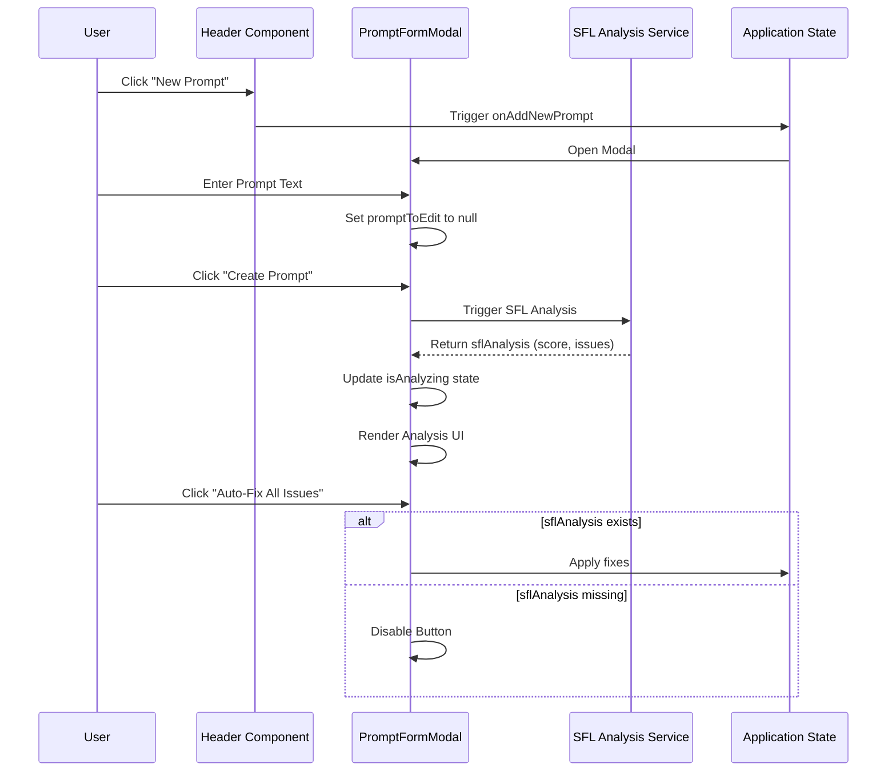

Relevant source files

The following files were used as context for generating this wiki page:
- [src/components/Header.tsx](src/components/Header.tsx)
- [src/components/SettingsPage.tsx](src/components/SettingsPage.tsx)
- [src/components/PromptFormModal.tsx](src/components/PromptFormModal.tsx)
- [src/components/PromptDetailModal.tsx](src/components/PromptDetailModal.tsx)
- [src/components/HelpModal.tsx](src/components/HelpModal.tsx)
- [src/components/PromptCard.tsx](src/components/PromptCard.tsx)
- [src/components/Documentation.tsx](src/components/Documentation.tsx)
- [src/components/lab/TaskNode.tsx](src/components/lab/TaskNode.tsx)
- [src/components/lab/UserInputArea.tsx](src/components/lab/UserInputArea.tsx)
- [src/components/lab/modals/WorkflowEditorModal.tsx](src/components/lab/modals/WorkflowEditorModal.tsx)

# UI Components Overview

## Introduction

The "UI Components Overview" delineates the structural architecture of the Prompt Studio application's user interface. The system is built as a collection of modular React components that handle distinct functional domains: navigation, prompt management, configuration, laboratory workflows, and educational guidance. The architecture relies heavily on state management passed via props to facilitate interaction between the view layer and the underlying logic. The UI presents a complex interface for AI prompt engineering, integrating Systemic Functional Linguistics (SFL) parameters, API key management, and workflow visualization. A notable structural tension exists between the UI's granular control options (e.g., security modes, SFL analysis) and the inherent limitations of client-side browser environments, particularly regarding persistent storage and API key security.

## Component Architecture

### Core Navigation and Layout

The `Header.tsx` component serves as the primary control center for application-wide actions. It exposes a set of callback functions (`onExportAllPromptsMarkdown`, `onOpenWizard`, `onAddNewPrompt`) that trigger state changes in the parent component. This decoupling pattern suggests a separation of concerns where the UI layer handles presentation and event propagation, while the business logic resides elsewhere. The component provides visual feedback through hover states and focus rings, adhering to accessibility standards (ARIA labels).

### Prompt Management Ecosystem

The prompt management functionality is distributed across three primary components: `PromptCard.tsx`, `PromptFormModal.tsx`, and `PromptDetailModal.tsx`.

- **PromptCard.tsx**: This component acts as a list item container. It manages its own local state (`menuOpen`, `copied`) to handle user interactions such as viewing, editing, and copying prompts to the clipboard. The copy functionality triggers a visual feedback loop (`copied` state) that alters the button's appearance and text.

- **PromptFormModal.tsx**: This component handles the creation and editing of prompts. It integrates an asynchronous analysis feature (`sflAnalysis`) that appears to run a background process to assess prompt quality. The UI reflects this with an "Analyzing..." spinner and a score display. A critical dependency exists here: the "Auto-Fix All Issues" button is disabled unless `sflAnalysis` is populated, creating a potential failure point if the analysis service is unreachable or returns invalid data.

- **PromptDetailModal.tsx**: This component focuses on read-only operations and testing. It allows the user to configure a test provider and view the prompt's metadata. The "Test Configuration" section suggests a separation between the prompt's definition and its execution environment.

### Configuration and Security

The `SettingsPage.tsx` component manages the application's global configuration, specifically API keys and model parameters. It implements a validation mechanism (`apiKeyValidation`) that attempts to verify keys against the configured providers. The component offers a "Security Mode" selector, allowing users to choose between session and local storage. However, the UI explicitly contradicts the utility of this feature by displaying a warning: "No client-side storage is completely secure against determined attackers." This creates a structural irony where the system offers a security feature that is fundamentally compromised by the browser environment, effectively rendering the feature a cosmetic choice rather than a genuine security enhancement.

### Laboratory and Workflow Components

The `lab` subdirectory contains specialized components for visualizing and editing workflows.

- **UserInputArea.tsx**: This component manages input types (text, image, file) through a tabbed interface. It separates the input mechanism from the logic, suggesting a flexible architecture for handling different media types.

- **TaskNode.tsx**: This component visualizes tasks within a workflow. It displays task metadata (input keys, output keys, status) and handles error states. The component includes a "Result" summary for completed tasks, indicating a state-driven rendering approach.

- **WorkflowEditorModal.tsx**: This component facilitates the assembly of workflows. It allows users to edit task properties (name, type, description, dependencies) and view available dependencies. The dependency selection grid suggests a relational data structure where tasks can depend on the output of other tasks.

### Educational and Utility Components

The `HelpModal.tsx` and `Documentation.tsx` components serve as educational tools. `HelpModal.tsx` defines SFL concepts (Field, Tenor, Mode) using a structured format with definitions and algorithmic representations. `Documentation.tsx` provides an interactive overview of features using icon-based modules. These components rely on external icon libraries (e.g., `BookOpenIcon`, `MagicWandIcon`), indicating a dependency on a shared icon system.

## Data Flow and Interactions

The following sequence diagram illustrates the interaction between the prompt creation flow and the SFL analysis system.

## Component Responsibilities

| Component | Primary Responsibility | Key State | Key Events |
| :--- | :--- | :--- | :--- |
| **Header.tsx** | Navigation and global actions | N/A | `onExportAllPromptsMarkdown`, `onOpenWizard`, `onAddNewPrompt` |
| **SettingsPage.tsx** | Configuration and API Key Management | `defaultProvider`, `userApiKeys`, `apiKeyValidation` | `setDefaultProvider`, `validateProviderKey` |
| **PromptFormModal.tsx** | Prompt Creation/Editing | `promptToEdit`, `sflAnalysis`, `isAnalyzing`, `isFixing` | `handleAutoFix`, `handleSubmit` |
| **PromptDetailModal.tsx** | Prompt Inspection and Testing | `testProvider`, `displayedData` | `setTestProvider` |
| **TaskNode.tsx** | Workflow Task Visualization | `state` (status, error, duration) | N/A |
| **WorkflowEditorModal.tsx** | Workflow Assembly | `task` (name, type, dependencies) | `handleChange` |

## Critical Assessment

The UI architecture demonstrates a clear separation of concerns, particularly in the delegation of event handling from the `Header` to parent components. However, the implementation of the "Security Mode" in `SettingsPage.tsx` reveals a significant design flaw. The feature attempts to provide security control over API key storage, yet the UI explicitly warns that client-side storage is insecure. This creates a user experience where the system offers a choice that has no meaningful impact on the actual security posture of the application. The feature is effectively a placebo, serving only to satisfy the illusion of control without addressing the fundamental vulnerability of client-side key storage.

Furthermore, the `PromptFormModal.tsx` relies on an external analysis service (`sflAnalysis`). The UI logic disables the "Auto-Fix" button when this analysis is missing, which is a defensive programming practice. However, it does not handle the case where the analysis service fails to return a valid response, potentially leaving the user in a state where the critical "Fix" functionality is permanently inaccessible due to a transient network error or service outage.

## Conclusion

The UI Components Overview reveals a system designed for complex prompt engineering workflows. The architecture effectively isolates concerns, allowing for modular development and maintenance. However, the implementation of security features is superficial, failing to address the inherent risks of client-side API key storage. The dependency on external analysis services creates a brittle user experience where core functionality is contingent on the availability of third-party infrastructure. The system functions as intended within a controlled environment but lacks the robustness required for high-security applications.