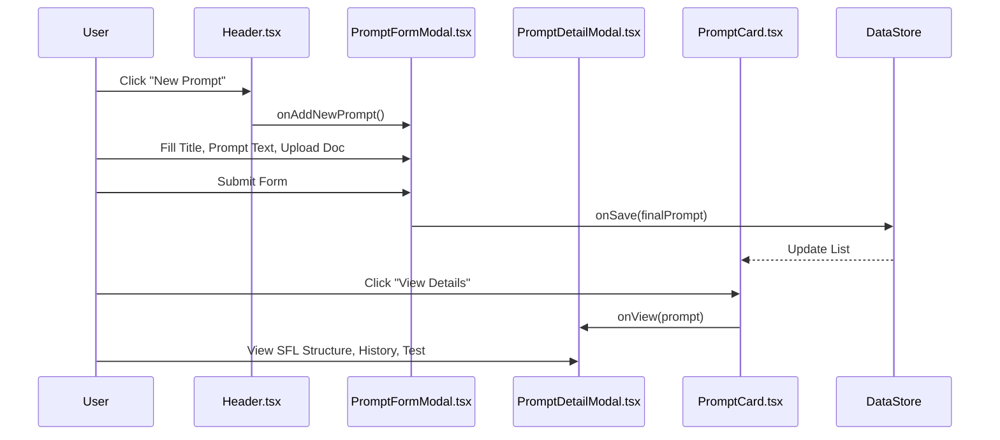

<details>
<summary>Relevant source files</summary>

The following files were used as context for generating this wiki page:
- [src/components/PromptFormModal.tsx](src/components/PromptFormModal.tsx)
- [src/components/Header.tsx](src/components/Header.tsx)
- [src/components/PromptCard.tsx](src/components/PromptCard.tsx)
- [src/components/PromptDetailModal.tsx](src/components/PromptDetailModal.tsx)
- [src/components/PromptWizardModal.tsx](src/components/PromptWizardModal.tsx)
- [src/components/PromptRefinementStudio.tsx](src/components/lab/PromptRefinementStudio.tsx)
- [src/components/lab/PromptLabPage.tsx](src/components/lab/PromptLabPage.tsx)
- [src/App.tsx](src/App.tsx)

</details>

# Prompt Library UI

## Introduction

The Prompt Library UI serves as the primary interface for the lifecycle management of prompt objects defined by the `PromptSFL` type. This interface facilitates the CRUD (Create, Read, Update, Delete) operations, version tracking, and SFL (Structured Format Language) analysis visualization. The system architecture separates the static management of prompts (Library) from the dynamic execution environment (Lab), with the Library UI providing the entry point for prompt configuration and testing. The UI is structured as a Single Page Application (SPA) component hierarchy, utilizing React state management to synchronize user interactions with the underlying data store.

## Detailed Sections

### Core Component Architecture

The Prompt Library UI is composed of a hierarchy of components that handle distinct functional responsibilities. The architecture relies on a separation of concerns where the `Header` component manages global navigation and actions, while specific modal components handle focused interactions.

**Header Component**
The `Header` component (`src/components/Header.tsx`) provides top-level navigation and action triggers. It exposes callbacks for global operations such as importing prompts, exporting prompts as JSON or Markdown, opening the help guide, launching the prompt wizard, and creating new prompts. This component acts as a control surface for the entire library management context.

**Prompt Card Component**
The `PromptCard` component (`src/components/PromptCard.tsx`) represents the atomic unit of display within the library list. It renders individual prompt objects, displaying metadata fields such as task type, persona, and output format. The component includes a context menu for actions including viewing details, editing, copying as Markdown, and deleting. The iconography for the task type is dynamically mapped using a switch statement, with fallback defaults.

**Prompt Form Modal**
The `PromptFormModal` component (`src/components/PromptFormModal.tsx`) handles the creation and editing workflows. It presents a form interface with fields for title, prompt text, and an optional source document attachment. The component integrates SFL analysis functionality, displaying a score and assessment text, along with a list of identified issues. It includes an "Auto-Fix All Issues" mechanism and a "Regenerate Prompt with AI" option.

**Prompt Detail Modal**
The `PromptDetailModal` component (`src/components/PromptDetailModal.tsx`) provides a comprehensive read-only view of a prompt's structure and history. It displays the SFL components (Field, Tenor, Mode), version history, and testing results. This modal supports variable input for testing and allows for reverting to previous versions.

### Data Flow and Interaction Patterns

The interaction flow between the user and the prompt management system follows a distinct sequence involving global state, modal state, and data persistence.

**Prompt Creation Sequence**
1. The user triggers the creation action via the Header component.
2. The `PromptFormModal` is instantiated with empty or default state.
3. The user inputs data, including the SFL fields and raw prompt text.
4. Upon submission, the form handler invokes the `onSave` callback with the finalized prompt object.
5. The parent component (inferred from `App.tsx`) updates the data store, triggering a re-render of the list view.

**SFL Analysis Integration**
The `PromptFormModal` component renders SFL analysis results derived from the `sflAnalysis` prop. The score is color-coded based on thresholds (<50, <80, >=80). The component exposes an `handleAutoFix` function that attempts to resolve identified issues, though the implementation of the fix logic is not detailed in the provided source snippets.

### Prompt Lifecycle Management

The system implements a versioning mechanism for prompts, allowing users to revert to previous states. The `PromptDetailModal` displays version history, and the `PromptFormModal` implicitly handles version incrementation when editing existing prompts, as evidenced by the title format "Edit Prompt (Version X+1)".



### Configuration and Styling

The UI utilizes Tailwind CSS for styling, employing a dark theme with specific color palettes for semantic meaning (e.g., blue for primary actions, teal for success, red for errors). The `PromptCard` component uses a mapping object to assign background colors and icons based on the `taskType` field.

**PromptCard Icon Mapping**
The `getTaskIcon` function in `PromptCard.tsx` maps string task types to specific icon components.
```typescript
const getTaskIcon = (taskType: string) => {
    const iconProps = { className: "w-5 h-5" };
    switch (taskType) {
        case 'Explanation': return <ChatBubbleLeftRightIcon {...iconProps} />;
        case 'Code Generation': return <CodeBracketIcon {...iconProps} />;
        // ... other cases
    }
}
```

## Tables

### PromptCard Display Fields

| Field | Data Source | Display Logic |
| :--- | :--- | :--- |
| **Task** | `prompt.sflField.taskType` | Rendered as text, truncated if too long |
| **Persona** | `prompt.sflTenor.aiPersona` | Rendered as text, truncated |
| **Format** | `prompt.sflMode.outputFormat` | Rendered as text, truncated |
| **Keywords** | `keywords` (derived) | Split by comma, displayed as tags |

### PromptFormModal Fields

| Field | Type | Constraints | Description |
| :--- | :--- | :--- | :--- |
| **Title** | String | Required | Concise identifier for the prompt |
| **Prompt Text** | Textarea | Required | The full prompt content |
| **Source Document** | File | Optional | Text file for stylistic reference |

## Critical Analysis

### Separation of Concerns

The architecture demonstrates a clear separation between the **Library** (management) and the **Lab** (execution). The `PromptLabPage` component (`src/components/lab/PromptLabPage.tsx`) handles workflows and ideation, distinct from the prompt list management. While the `PromptRefinementStudio` is included in the Lab section, it suggests that refinement is a workflow activity rather than a primary library management feature.

### UI Inconsistencies

The `PromptFormModal` includes a "Regenerate Prompt with AI" button that triggers a modal (`regenState.shown`), but the implementation of the regeneration logic is not present in the provided snippets. This indicates a dependency on an external service or hook that is not visible in the component code provided.

### Data Persistence

The `PromptFormModal` handles file uploads via a hidden file input (`ref={fileInputRef}`) and stores the file object in `formData.sourceDocument`. However, the mechanism for persisting this file or its content to the data store is not explicitly detailed in the provided source code, suggesting a potential gap in the persistence logic.

## Conclusion

The Prompt Library UI provides a structured mechanism for managing prompt objects within the SFL framework. It leverages a component-based architecture to handle the display, editing, and analysis of prompts. The system integrates SFL analysis directly into the editing workflow, providing immediate feedback on prompt quality. While the architecture effectively separates management from execution, the reliance on external hooks for AI regeneration and the lack of explicit file persistence logic in the visible code represent structural gaps that require further investigation.