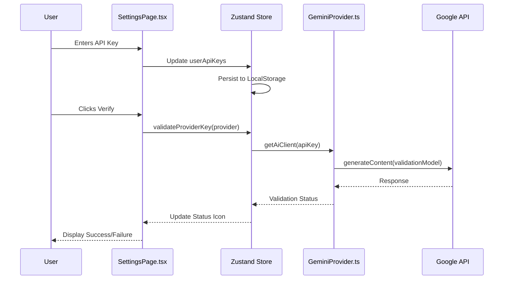
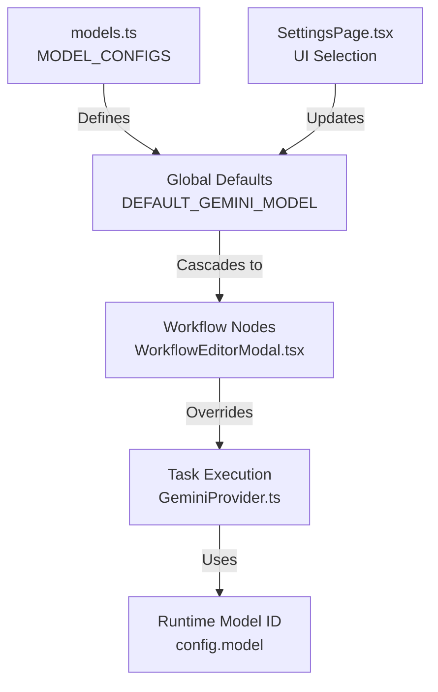

<details>
<summary>Relevant source files</summary>

The following files were used as context for generating this wiki page:
- [src/config/models.ts](src/config/models.ts)
- [src/components/SettingsPage.tsx](src/components/SettingsPage.tsx)
- [src/services/providers/GeminiProvider.ts](src/services/providers/GeminiProvider.ts)
- [src/services/sflService.ts](src/services/sflService.ts)
- [README.md](README.md)
- [src/components/lab/modals/WorkflowEditorModal.tsx](src/components/lab/modals/WorkflowEditorModal.tsx)
- [src/components/PromptDetailModal.tsx](src/components/PromptDetailModal.tsx)
- [src/constants.ts](src/constants.ts)

</details>

# Provider Configuration

## Introduction

Provider Configuration constitutes the architectural subsystem responsible for managing the instantiation of AI service providers, the association of cryptographic credentials with those providers, and the selection of model identifiers. The system operates under a "Browser-First" architecture, where all credential storage and computation occur client-side within the LocalStorage environment. The mechanism relies on a centralized configuration schema defined in `src/config/models.ts` to enforce a single source of truth for model identifiers, while the runtime execution layer relies on provider-specific implementations that inherit from a common interface contract.

The configuration flow is divided into three structural layers: the Presentation Layer (Settings UI), the Configuration Layer (Model constants), and the Implementation Layer (Provider classes). The Presentation Layer (`SettingsPage.tsx`) facilitates the ingestion of API keys and the selection of default providers and models. The Configuration Layer (`models.ts`) defines the available models and their metadata. The Implementation Layer (`GeminiProvider.ts`) translates these configurations into runtime API calls using the `@google/genai` SDK.

## Architecture

### Centralized Model Configuration

The system enforces a centralized definition of AI models to prevent the proliferation of hardcoded model strings across the codebase. The `MODEL_CONFIGS` object in `src/config/models.ts` maps `AIProvider` enums to arrays of `AIModelConfig` objects. This structure dictates the available models for each provider, including their identifiers, context window sizes, and vision capabilities.

```typescript
export const MODEL_CONFIGS: Record<AIProvider, AIModelConfig[]> = {
  [AIProvider.Google]: [
    {
      id: 'gemini-2.5-flash',
      name: 'Gemini 2.5 Flash',
      provider: AIProvider.Google,
      contextWindow: 1000000,
      supportsVision: true,
    },
    // ... additional models
  ],
  // ... other providers
};
```

### Provider Abstraction Pattern

The system implements a factory pattern through the `AIProvider` interface. This abstraction allows for the substitution of different AI service implementations without modifying the calling code. The `GeminiProvider` class serves as the concrete implementation of this interface, utilizing the `GoogleGenAI` SDK to interact with Google's API endpoints.

### Security Model

The architecture explicitly excludes server-side transmission of credentials. As stated in the README, "Keys never leave the browser." The Settings UI provides inputs for API keys which are persisted to LocalStorage. The implementation layer (`GeminiProvider`) requires an API key to instantiate the client object, implying that the application cannot function without valid client-side credentials.

## API Key Management

### Storage and Ingestion

API keys are managed through the Settings UI component (`SettingsPage.tsx`). The component renders input fields for each configured provider, utilizing password input types to obscure the data visually. The state management system (`Zustand`) is responsible for persisting these keys to LocalStorage.

```typescript
<input
  type="password"
  value={userApiKeys[provider]}
  onChange={(e) => {
    const value = e.target.value;
    setUserApiKeys({ ...userApiKeys, [provider]: value });
  }}
/>
```

### Validation Mechanism

The system includes a validation workflow triggered by the "Verify" button in the Settings UI. This process attempts to validate the provided API key against the configured provider. The `validateProviderKey` function is called with the provider identifier and the corresponding API key. The UI provides visual feedback via status icons (`getStatusIcon`) to indicate the result of the validation attempt.

```typescript
<button
  onClick={() => validateProviderKey(provider)}
  disabled={!userApiKeys[provider] || apiKeyValidation[provider] === 'checking'}
>
  Verify
</button>
```

## Model Selection and Defaults

### Default Model Constants

The system defines specific constants for model selection to distinguish between general-purpose models, validation models, and task-specific models. The `DEFAULT_GEMINI_MODEL` constant is defined as `'gemini-2.5-flash'` and is used as the fallback model for general text generation and workflows.

```typescript
export const DEFAULT_GEMINI_MODEL = 'gemini-2.5-flash';
export const VALIDATION_MODEL_GEMINI = 'gemini-2.5-flash';
export const IMAGE_ANALYSIS_MODEL = 'gemini-2.5-flash';
```

### Workflow and Prompt Configuration

Model selection is hierarchical. The Settings page allows the user to define a global default provider and model. This global configuration cascades to workflow nodes and prompt definitions. In the Workflow Editor Modal (`WorkflowEditorModal.tsx`), nodes can override the global default provider and model for specific tasks.

```typescript
<select
  value={taskProvider}
  onChange={e => handleAgentConfigChange('provider', e.target.value)}
  className={commonInputClasses}
>
  {Object.values(AIProvider).map((provider) => (
    <option key={provider} value={provider}>
      {providerDisplayNames[provider]}
    </option>
  ))}
</select>
```

## Provider Implementation Details

### GeminiProvider Class

The `GeminiProvider` class implements the logic for interacting with Google's Gemini API. The `getAiClient` method acts as a factory method, requiring an API key to instantiate the `GoogleGenAI` client. If an API key is not provided, the method throws an error.

```typescript
private getAiClient(config?: AIConfig): GoogleGenAI {
  const apiKey = config?.apiKey;
  if (!apiKey) {
    throw new Error("API key is required. Please configure your API key in Settings.");
  }
  return new GoogleGenAI({ apiKey });
}
```

### Execution Methods

The provider exposes methods for text generation and JSON generation. These methods utilize the `GoogleGenAI` SDK's `generateContent` method, passing the model identifier, contents, and configuration parameters (temperature, topK, topP).

```typescript
async generateText(prompt: string, config?: AIConfig): Promise<string> {
  try {
    const ai = this.getAiClient(config);
    const response = await ai.models.generateContent({
      model: config?.model || DEFAULT_GEMINI_MODEL,
      contents: prompt,
      config: {
        systemInstruction: config?.systemInstruction,
        temperature: config?.temperature,
        topK: config?.topK,
        topP: config?.topP,
      }
    });
    return response.text || "";
  } catch (error: any) {
    // Error handling logic
  }
}
```

## Data Flow Diagrams

### Configuration and Validation Flow

This diagram illustrates the sequence of interactions involved in configuring a provider and validating its credentials.



### Model Selection and Execution Flow

This diagram demonstrates how model configuration flows from global settings to specific task execution.



## Critical Analysis

### Structural Inconsistency: Hardcoded Model References

The system establishes a centralized configuration pattern in `src/config/models.ts` to prevent the scattering of model strings. However, a direct violation of this architectural principle is observed in `src/services/sflService.ts`. The `analyzeSFL` function explicitly hardcodes the model identifier as `'gemini-2.5-pro'` within the function call, rather than utilizing the `DEFAULT_GEMINI_MODEL` constant.

```typescript
// src/services/sflService.ts
return await geminiProvider.generateJSON<SFLAnalysis>(
    `Analyze components:\n${JSON.stringify(promptData, null, 2)}`,
    analysisSchema,
    { model: 'gemini-2.5-pro', systemInstruction, apiKey } // Hardcoded string
);
```

This inconsistency introduces a maintenance burden where model updates in the central configuration file will not automatically propagate to this specific analytical function. The system fails to enforce a strict single source of truth for model selection in this specific execution path.

### Dependency on External SDKs

The implementation relies on the `@google/genai` SDK for the Gemini provider. The `GeminiProvider` class does not implement a fallback mechanism or a mock implementation for testing purposes. This tight coupling to the external SDK creates a dependency that is not abstracted away by the `AIProvider` interface in the provided code snippets. Any changes to the SDK's API surface would necessitate direct modifications to the provider implementation.

### UI Feedback Limitations

The Settings UI provides a "Verify" button and status icons. However, the implementation of `validateProviderKey` is not visible in the provided code snippets. The UI component displays a spinner during validation (`isTesting` state in `PromptDetailModal.tsx`), suggesting an asynchronous operation, but the specific error handling logic for network failures or invalid keys is not exposed in the context provided.

## Conclusion

Provider Configuration is the foundational subsystem that bridges user input, centralized metadata, and runtime AI execution. The architecture successfully implements a browser-first security model and a centralized model registry. However, the system exhibits a critical structural inconsistency through the hardcoding of the `'gemini-2.5-pro'` model string in the SFL analysis service, which bypasses the centralized configuration constants. The reliance on a specific external SDK without abstraction for testing or fallback further limits the robustness of the provider layer.