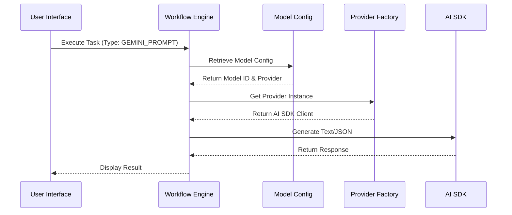

<details>
<summary>Relevant source files</summary>

The following files were used as context for generating this wiki page:
- [src/types.ts](src/types.ts)
- [src/config/models.ts](src/config/models.ts)
- [src/services/sflService.ts](src/services/sflService.ts)
- [package.json](package.json)
- [README.md](README.md)
- [src/components/SettingsPage.tsx](src/components/SettingsPage.tsx)

</details>

# AI SDK Integration

## Introduction

The "AI SDK Integration" represents the architectural mechanism by which the SFL Prompt Studio interfaces with Large Language Model (LLM) providers. The system employs a dual-layer abstraction strategy: a high-level Vercel AI SDK wrapper for unified prompt execution and a provider-specific adapter layer for model negotiation. The integration is designed to support multiple providers (Anthropic, Google, OpenAI, Mistral, OpenRouter) through a centralized configuration model, allowing dynamic selection of models and parameters based on task requirements. The architecture relies on a strict separation between credential management (environment variables or local storage) and execution logic (schema validation, workflow orchestration).

## Provider Abstraction Architecture

The system implements a factory-based abstraction pattern to normalize interactions across disparate AI providers. This is defined primarily by the `AIProvider` enum in the type definitions, which serves as the contract for all provider interactions.

### Supported Providers

The integration supports five distinct provider entities, each mapped to specific SDK adapters:

| Provider | SDK Adapter | Context Window (Typical) | Vision Support |
| :--- | :--- | :--- | :--- |
| Anthropic | `@ai-sdk/anthropic` | 200,000 tokens | Yes |
| Google | `@ai-sdk/google` | 2,000,000 tokens | Yes |
| OpenAI | `@ai-sdk/openai` | 128,000 tokens | Yes |
| Mistral | `@ai-sdk/mistral` | 128,000 tokens | No |
| OpenRouter | `@ai-sdk/openrouter` | Variable | Variable |

**Sources:** [src/types.ts#L10-L15](), [src/config/models.ts#L1-L80](), [package.json#L12-L16]()

### Provider Configuration Flow

The selection of a provider is not a runtime decision but a configuration-driven event. The system derives provider configurations from the `src/config/models.ts` file, which maps provider enums to specific model identifiers, context windows, and vision capabilities.

```typescript
[AIProvider.Google]: [
  {
    id: 'gemini-1.5-pro',
    name: 'Gemini 1.5 Pro',
    provider: AIProvider.Google,
    contextWindow: 2000000,
    supportsVision: true,
  },
  // ... other models
]
```

**Sources:** [src/config/models.ts#L10-L40]()

## Execution Service and Schema Validation

The integration handles prompt execution and validation through the `sflService.ts` file. This service is responsible for transforming raw prompt data into structured schemas that the AI providers can understand, specifically utilizing Google's `Type` definitions for structured output validation.

### Schema Definitions

The system defines strict JSON schemas for prompt analysis and prompt generation. These schemas are used to enforce data integrity before execution.

```typescript
const analysisSchema = {
  type: Type.OBJECT,
  properties: {
    score: { type: Type.INTEGER, description: "Score from 0 to 100." },
    assessment: { type: Type.STRING, description: "Brief summary." },
    issues: {
      type: Type.ARRAY,
      items: {
        type: Type.OBJECT,
        properties: {
          severity: { type: Type.STRING, enum: ['error', 'warning', 'info'] },
          component: { type: Type.STRING },
          message: { type: Type.STRING },
          suggestion: { type: Type.STRING }
        },
        required: ['severity', 'component', 'message', 'suggestion']
      }
    }
  },
  required: ['score', 'assessment', 'issues']
};
```

**Sources:** [src/services/sflService.ts#L8-L35]()

### Prompt Data Structure

The execution layer relies on the `PromptSFL` type, which decomposes a prompt into three linguistic dimensions: Field, Tenor, and Mode. This structure is critical for the system's analysis capabilities.

**Sources:** [src/types.ts#L80-L120]()

## Workflow Integration and Task Execution

The AI SDK integration is deeply embedded within the workflow engine. Tasks within a workflow can invoke AI providers using an `AgentConfig` interface.

### Task Configuration

Each task that requires AI generation specifies an `AgentConfig`, which includes the provider, model, temperature, and top-k/top-p parameters. This allows granular control over generation behavior per task.

```typescript
export interface AgentConfig {
  provider?: string; // AIProvider enum value
  model?: string;
  temperature?: number;
  topK?: number;
  topP?: number;
  systemInstruction?: string;
}
```

**Sources:** [src/types.ts#L40-L50]()

### Execution Sequence

The workflow engine resolves dependencies and executes tasks sequentially. When a task of type `GEMINI_PROMPT` or similar is triggered, the system retrieves the configuration from the `AgentConfig` and maps it to the appropriate provider instance defined in the factory.



**Sources:** [src/types.ts#L40-L50](), [README.md#Architecture]()

## Configuration Management

The system exposes configuration through two primary vectors: environment variables and UI settings. This dual approach creates a potential synchronization risk where the state of API keys may exist in memory (UI) and in the build environment (VITE variables) simultaneously.

### API Key Management

API keys are managed via `VITE_*` environment variables, as seen in the Settings page UI. The UI provides a form to input these keys, which are then used to initialize the provider instances.

**Sources:** [src/components/SettingsPage.tsx#L40-L60](), [README.md#Configuration]()

## Critical Assessment

The architecture demonstrates a robust separation of concerns through the Provider Abstraction pattern. However, the reliance on both environment variables (`VITE_*`) and UI-based key storage creates a structural inconsistency. The `VITE_*` variables are compiled into the build at runtime, while UI storage is ephemeral to the browser session. If the UI updates a key but the `VITE` environment variable remains stale, the system will execute using an invalid or outdated credential until the application is rebuilt or the environment is reloaded, creating a state divergence that is not immediately visible to the user.

## Conclusion

The AI SDK Integration serves as the functional core of the application, bridging the gap between the SFL prompt structure and the execution capabilities of multiple LLM providers. Through the use of the Vercel AI SDK and provider-specific adapters, the system achieves a unified interface for diverse model backends. The integration is tightly coupled with the workflow engine, allowing for dynamic, task-level configuration of AI parameters. The primary architectural strength lies in the centralized model configuration, while the primary structural weakness lies in the dual-source configuration management for API keys.